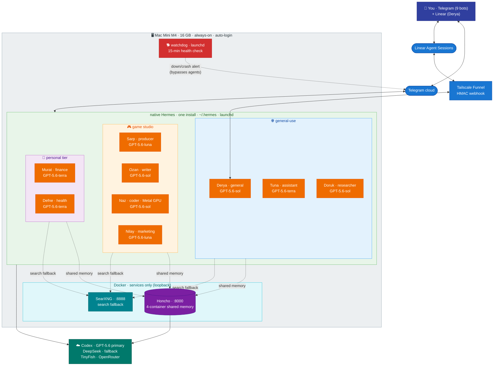
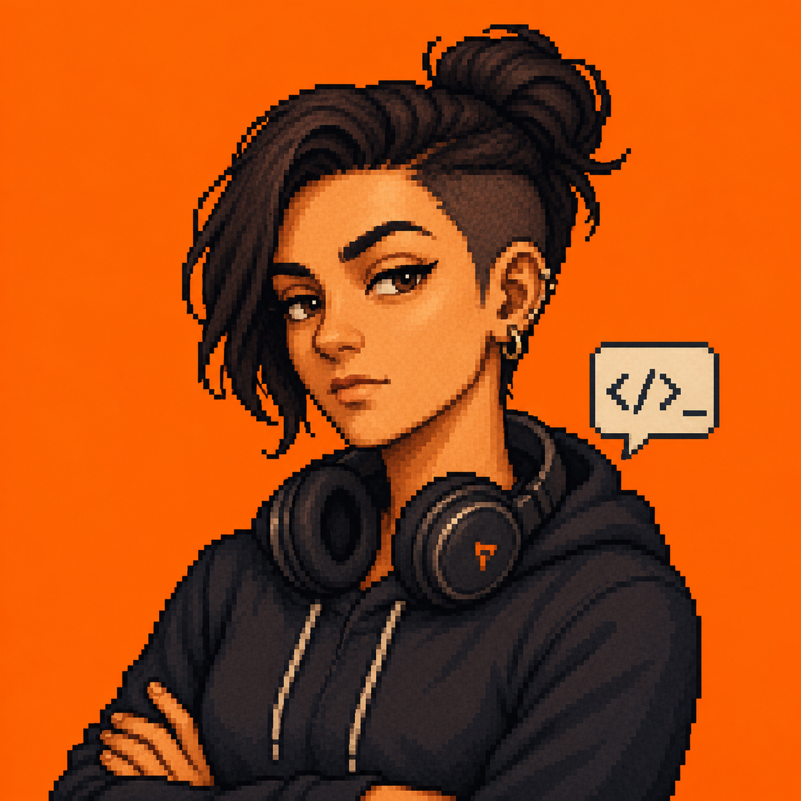
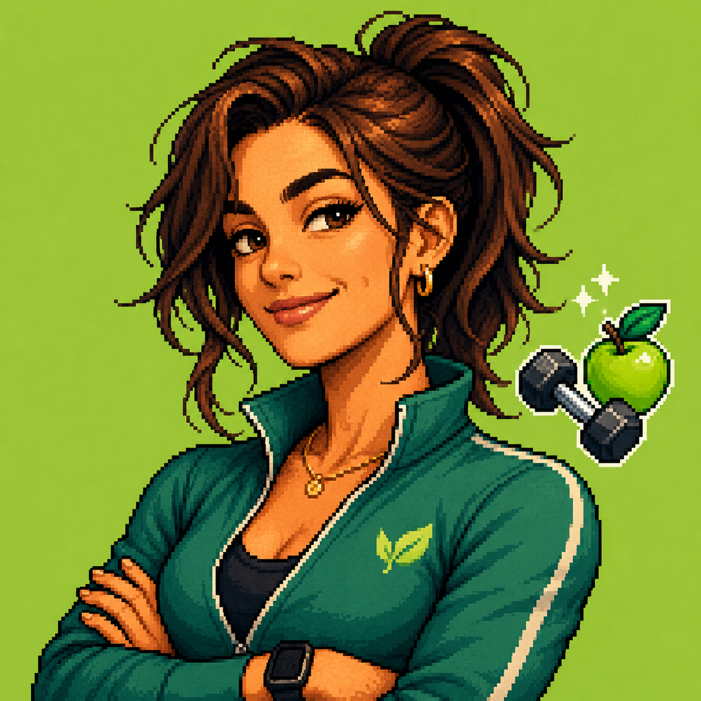
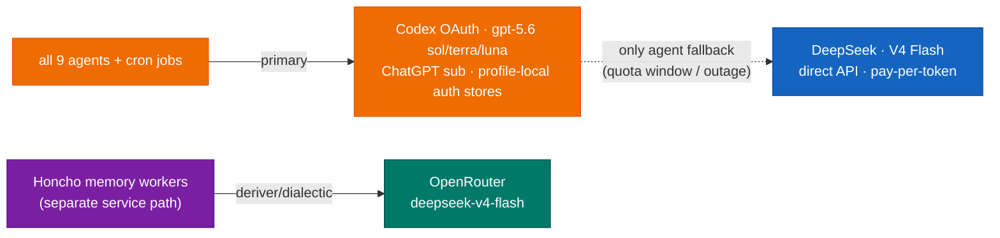
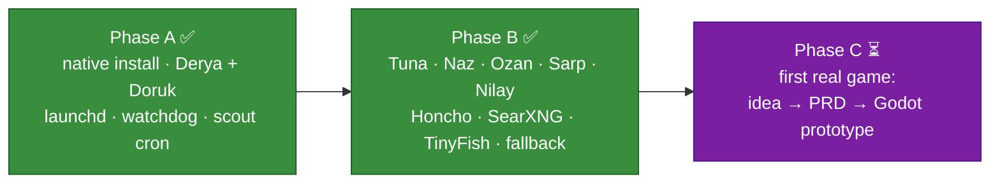
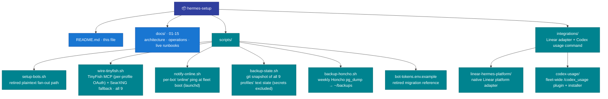

# Hermes Setup

A personal fleet of **nine [Hermes Agent](https://hermes-agent.nousresearch.com/) instances** running **native on a single Mac Mini M4** — one Hermes install, one profile per agent, Telegram bots as the interface, self-hosted Honcho as shared memory. No containers for the agents; Docker is kept only for the Honcho and SearXNG services. Host monitoring needs no agent — a dumb launchd **watchdog** covers it ([docs/10 §14.5](docs/10-operations.md)).

**Status: fully deployed — 9/9 agents live** under launchd on the Mini, all answering from Telegram, all on shared Honcho memory.

The fleet is **not** game-studio-only. It's a **general-purpose personal assistant layer** (works for your whole life) **plus** a **game-studio pipeline** layered on top. The studio names are flavor; the capabilities underneath are general.

---

## 1 · System architecture



**Colours:** orange = GPT-5.6/Codex agents · purple = Honcho · teal = services · red = watchdog · indigo = you · blue = network · dark-teal = external APIs. All nine agents use **GPT-5.6 via Codex as primary**; DeepSeek V4 Flash is the profile-level fallback.

---

## 2 · The fleet — meet the crew

Nine native profiles in one Hermes install. **Slug** = the functional name (constant, ASCII, what the directory/peer/bot-username use). **Display** = the persona shown in Telegram (flavor only — titles don't fence capability). Profile art is pixel-art, one cohesive crew.

**🌐 General-use** — your whole life, not just games

<table>
  <tr>
    <td align="center"><br><b>Derya</b><br><sub><code>general</code></sub></td>
    <td align="center"><br><b>Tuna</b><br><sub><code>assistant</code></sub></td>
    <td align="center"><br><b>Doruk</b><br><sub><code>researcher</code></sub></td>
  </tr>
</table>

**🎮 Game-studio pipeline** — specialists

<table>
  <tr>
    <td align="center"><br><b>Nilay</b><br><sub><code>marketing</code></sub></td>
    <td align="center"><br><b>Sarp</b><br><sub><code>producer</code></sub></td>
    <td align="center"><br><b>Ozan</b><br><sub><code>writer</code></sub></td>
    <td align="center"><br><b>Naz</b><br><sub><code>coder</code></sub></td>
  </tr>
</table>

**🧑 Personal tier** — separate life domains

<table>
  <tr>
    <td align="center"><br><b>Murat</b><br><sub><code>finance</code></sub></td>
    <td align="center"><br><b>Defne</b><br><sub><code>health</code></sub></td>
  </tr>
</table>

### 🌐 General-use — your whole life, not just games

| Display | Slug | Mode | What it actually does | Model |
|---|---|---|---|---|
| **Derya** | `general` | always-on | Your **main line for anything** — work *and* life: questions, planning, brainstorming, hand-offs. (Themed as founder/creative director.) | GPT-5.6-sol (Codex) → ds-flash fb |
| **Tuna** | `assistant` | always-on | **Studio + personal** day: calendar, reminders, errands, morning digest covering both | GPT-5.6-terra (Codex) → ds-flash fb |
| **Doruk** | `researcher` | always-on | Research **any** domain, cites sources; also runs the weekly game-scout cron | GPT-5.6-sol (Codex) → ds-flash fb |

These three you'd want even with no game studio. Start here for day-to-day use.

### 🎮 Game-studio pipeline — specialists

| Display | Slug | Mode | What it actually does | Model |
|---|---|---|---|---|
| **Sarp** | `producer` | on-demand | Scores raw game ideas on a rubric (buildable / loop / discovery / monetization); kills hype | GPT-5.6-luna (Codex) → ds-flash fb |
| **Ozan** | `writer` | on-demand | Drafts & edits — game PRDs, store copy, prose (general writing too) | GPT-5.6-sol (Codex) → ds-flash fb |
| **Naz** | `coder` | on-demand | Godot/GDScript game code — **the studio's code-runner** (native for Metal GPU + the editor; fenced) | GPT-5.6-sol (Codex) → ds-flash fb |
| **Nilay** | `marketing` | always-on | Go-to-market: Steam page, wishlists, devlog/social cadence, ASO, outreach (briefs Ozan for copy) | GPT-5.6-luna (Codex) → ds-flash fb |

Names are a (mildly sarcastic) Turkish game-studio crew; each comic persona reinforces its role rather than fighting it. ("On-demand" = usage pattern; all 9 gateways run 24/7 under launchd.)

### 🧑 Personal tier — separate life domains

Beyond the studio, each life domain gets its own profile (own SOUL/memory/bot; Honcho means it already knows who you are). Built so far:

| Display | Slug | Does | Model |
|---|---|---|---|
| **Murat** | `finance` | Markets & finance analyst — analyzes read-only Google-Sheet/CSV/statement data, scans news/Reddit/finance sites (BIST + global), crunches numbers with fenced `code_execution`. *Not* investment advice. | GPT-5.6-terra (Codex) → ds-flash fb |
| **Defne** | `health` | Health & fitness coach — workout/nutrition logging, calorie/macro estimate from food photos (ballpark), trend tracking. *Not* medical advice. | GPT-5.6-terra (Codex) → ds-flash fb |

> **All nine profiles are host-code-capable by design (accepted 2026-07-19).** Hermes v0.18.2 resolves both `terminal` and `execute_code` on every profile; approvals are `off` fleet-wide. The old “only general/coder/finance can run code” design was superseded — the fleet is uniformly tooled, and security relies on persona guardrails, credential stripping, Tirith on `general` and `researcher`, and the website blocklist on `coder` and `finance` ([docs/09 §13](docs/09-security.md)).

**🔍 Web stack — all 9 agents:** every agent searches via **TinyFish** (MCP, OAuth 2.1 PKCE — *no API key*) with **SearXNG** as automatic fallback. None is walled off from the web and search never hard-fails; an outage on either side degrades to the other. Wired uniformly by `scripts/wire-tinyfish.sh` — [docs/08](docs/08-web-search.md).

### Linear control plane — Derya

Linear is the human-visible command and discussion surface for Derya; Hermes remains the conversation and execution engine. A profile-local native platform plugin receives signed Agent Session webhooks on `127.0.0.1:8787`, converts them to Hermes `MessageEvent`s, and writes thought/response/error activities back through Linear GraphQL. Tailscale Funnel is the only public transport and proxies to loopback through an isolated userspace sidecar, leaving the App Store Tailscale session used by Remote Desktop untouched.

The adapter verifies raw-body HMAC signatures, replay age, OAuth-pinned organization identity, rotating current/previous secrets, body limits, and separate pre-auth rate limits. SQLite semantic dedup keys use session/activity identity rather than Linear's subscription-level `webhookId`. Delegation, typed follow-up prompts, responses, and Stop hard-cancel are live-tested. Source, deployment, security, rollback, and test instructions: [`integrations/linear-hermes-platform/README.md`](integrations/linear-hermes-platform/README.md).

---

## 3 · How the studio agents chain — the game-dev pipeline

Discovery-first: you don't commit to a game, you let the fleet surface and score opportunities, *then* prototype the one you pick.


> Only the discovery end (Doruk's scout) runs today; the rest of the chain has work once you start a real game (Phase C). `kanban` can auto-promote cards across this pipeline, but it's **off** until recurring hand-offs are real ([docs/12](docs/12-agent-comms.md)).

---

## 4 · Model routing & fallback

The agent routing is deliberately simple: GPT-5.6 is primary on all nine profiles and DeepSeek is the only profile-level fallback. OpenRouter is used separately for vision fallback and Honcho workers.



- **GPT-5.6 via Codex OAuth** — **primary for all nine agents and their crons**. Live tiers: `gpt-5.6-sol` for general/coder/researcher/writer · `gpt-5.6-terra` for assistant/finance/health · `gpt-5.6-luna` for marketing/producer. Each profile has its own writable `0600 auth.json` OAuth store; refresh/writeback is profile-local.
- **Reasoning effort** — `medium` for general/assistant/coder/finance/health/researcher/writer · `low` for marketing/producer. The GPT-5.6 Sol profiles stay at `medium` to control quota and cost.
- **DeepSeek V4 Flash** (direct API key, pay-per-token, ~$0.14/$0.28 per M) — **the fallback on every profile**: quota-window exhaustion or a Codex outage degrades the fleet to Flash instead of stalling it.
- **Auxiliary routing** — all text auxiliary tasks use `auto`, inheriting the profile's main GPT-5.6 model with DeepSeek as fallback. Vision also uses GPT-5.6 (`terra` for Derya; otherwise the profile's own tier) with `openrouter:google/gemini-2.5-flash` as fallback. Honcho workers use OpenRouter on their separate service path.

Full routing + the per-agent fallback chains: [docs/04](docs/04-models.md).

---

## 5 · Why native single-install (not containers)

The earlier draft ran one Docker container per agent across two Macs. Dropped — full reasoning in [docs/01](docs/01-architecture.md). In short: this is **single-tenant, one person, one machine**, so the container isolation tax buys little; and **`coder` needs the Mac's Metal GPU + the Godot editor**, which a macOS container can't provide (no GPU passthrough). One native install also makes agent-to-agent coordination **local** (no HTTP/Tailscale) and the `kanban` board **natively available** if ever wanted. The trade — no kernel boundary between profiles — is managed by uniform tooling (all nine profiles host-code-capable, gated by persona guardrails), credential stripping, Tirith pre-exec scanning on `general` and `researcher`, and the website blocklist on `coder` and `finance` ([docs/09](docs/09-security.md)).

---

## 6 · Documentation

The plan is split by concern. Original section numbers (`## 1` … `## 17`) are preserved, so inline cross-references like "Section 13.7" resolve across files.

1. [Architecture & Isolation](docs/01-architecture.md) — native single-install multi-profile; what isolation we keep and give up
2. [Agents — Roster, Specs & SOULs](docs/02-agents.md) — the nine agents, dual-use vs studio + personal tier, comic SOULs
3. [Telegram Bots](docs/03-telegram-bots.md) — bots, names, and 1Password-backed token wiring
4. [Model Providers](docs/04-models.md) — GPT-5.6/Codex primary, DeepSeek-only fallback, auxiliary routing
5. [Deployment](docs/05-deployment.md) — directories, profiles, phases, toolset hygiene, launchd
6. [Networking](docs/06-networking.md) — Telegram needs no ports; Tailscale optional for the dashboard
7. [Memory — Honcho](docs/07-memory.md) — three layers, shared user model, backups
8. [Web Search — TinyFish & SearXNG](docs/08-web-search.md) — TinyFish MCP (OAuth) primary + SearXNG fallback, all 9 agents
9. [Security & Sandboxing](docs/09-security.md) — native guardrails; all nine profiles are host-code-capable
10. [Operations](docs/10-operations.md) — evaluation, native upgrade, watchdog, startup ping, open questions
11. [Game Development Workstream](docs/11-game-dev.md) — discovery-first pipeline
12. [Agent-to-Agent Communication](docs/12-agent-comms.md) — local coordination, Honcho, backlog.md, kanban-when-earned
13. [Deployment Runbook](docs/13-deployment-runbook.md) — the *what, in order*, with a live build log of what's done
14. [Upgrade & Maintenance](docs/14-upgrade-and-maintenance.md) — the brew-upgrade checklist (plist/FDA traps), hardened backups, watchdog v2, session-store hygiene, config-git rollback, skill-consolidation blast radius
15. [Linear native platform adapter](integrations/linear-hermes-platform/README.md) — Agent Sessions, OAuth, signed webhook ingress, semantic dedup, Stop lifecycle, tests and rollback
16. [Codex usage Telegram command](integrations/codex-usage/README.md) — canonical `/codex_usage` plugin, official rate-limit RPC, nine-profile restore installer and tests
17. [Credential Management](docs/15-credential-management.md) — 1Password canonical architecture, exceptions, rotation and incident response

---

## 7 · Quick start

```bash
# 1. Telegram: @BotFather → /newbot ×9   (general_<you>_bot … health_<you>_bot; slug-based, rename-safe)
# 2. store each bot/provider credential in the correct 1Password item and map it by ID:
hermes -p <profile> secrets onepassword set TELEGRAM_BOT_TOKEN 'op://<vault-id>/<item-id>/<field-id>'
hermes -p <profile> secrets onepassword status
#    repeat only for credentials that profile needs; see docs/15-credential-management.md
# 3. install Hermes natively + bring up one profile, then the rest:
#    follow docs/13-deployment-runbook.md  (keys → install → bots → Phase A/B/C)
# 4. web stack — TinyFish (primary, OAuth) + SearXNG (fallback), all agents:
./scripts/wire-tinyfish.sh     # per-profile OAuth (own browser consent each — tokens are NOT shared) + SearXNG fallback + restart
# 5. fleet-wide Telegram /codex_usage command (dry-run, then apply; no restart performed):
python3 integrations/codex-usage/install.py
python3 integrations/codex-usage/install.py --apply
```

**1Password is the single source of truth for static credentials.** Profile configs contain only ID-based `op://` references. Bootstrap identity and writable OAuth stores are the documented local `0600` exceptions; see [Credential Management](docs/15-credential-management.md).

---

## 8 · Rollout status — ✅ complete



- **Phase A ✅** — native install, Derya + Doruk under launchd, per-profile state proven, watchdog live-tested, weekly game-scout cron delivering.
- **Phase B ✅** — all nine agents live; self-hosted Honcho shared memory (cross-agent recall proven); **all 9 agents on TinyFish (OAuth) primary + SearXNG fallback** — ⚠️ **OAuth tokens are per-profile, never copied**. Agent model fallback is DeepSeek V4 Flash; OpenRouter remains the vision-fallback and Honcho-worker route.
- **Phase C ⏳** — when you start a real game: a picked idea → lean PRD (Ozan) → Godot prototype (Naz) on the Mini's GPU → go-to-market (Nilay).

**Pending follow-ups (all pull, none blocking):** Sarp weekly score-cron once digests accumulate.

---

## 9 · Repo layout



State that lives **outside** the repo: 1Password vault items (canonical static credentials), `~/.hermes/profiles/<slug>/` (each agent's config with `op://` references, SOUL, sessions, memory, bootstrap `.op.env` where required, and writable OAuth stores), Derya's deployed Linear plugin + native OAuth store + SQLite ledger, the deployed `~/.hermes/plugins/codex-usage` copy and profile symlinks (canonical credential-free source is in this repo), `~/.hermes/honcho.json`, `~/.hermes/scripts/`, `~/honcho-stack/` + `~/hermes-services/` (Docker), the **local backup repo `~/hermes-state-backup/`** (all 9 profiles' text state, secrets excluded, local-only) + Honcho dumps in `~/backups/`, and the launchd plists in `~/Library/LaunchAgents/ai.hermes.*`.

---

## 10 · Security notes

- **1Password is canonical.** Never put real credentials in the repository, chat, clipboard, Notion, Linear, `config.yaml`, `bot-tokens.env`, or profile `.env` files. Hermes resolves ID-based `op://` references at startup. Only the 1Password bootstrap identity and refresh/writeback OAuth stores remain local `0600` exceptions ([details](docs/15-credential-management.md)).
- **Native = no container boundary, 9/9 shell-capable by design.** A `terminal`/`execute_code` command runs on your real Mac. All nine profiles resolve both tools; approvals are `off`. The live compensating controls are persona guardrails + credential stripping, Tirith on `general` and `researcher`, and the website blocklist on `coder` and `finance` — not a shell-restriction policy ([details](docs/09-security.md)).
- **Telegram is the default front door** and needs no open ports (gateways connect outbound). Derya additionally accepts Linear Agent Session webhooks through a dedicated Tailscale Funnel route; the native adapter still binds only `127.0.0.1:8787` and validates HMAC, replay age, organization identity and rate limits. Don't expose the optional Hermes HTTP API/dashboard publicly ([details](docs/06-networking.md)).
- **Services bind loopback only** — Honcho `127.0.0.1:8000`, SearXNG `127.0.0.1:8888`, Linear adapter `127.0.0.1:8787`; Funnel is the narrow authenticated exception, not a LAN listener.
- **When something breaks:** gateway-down alerting is a dumb launchd watchdog, no agent involved ([docs/10 §14.5](docs/10-operations.md)); the fleet-wide stop + key-rotation drill is [docs/09 §13.8](docs/09-security.md).
