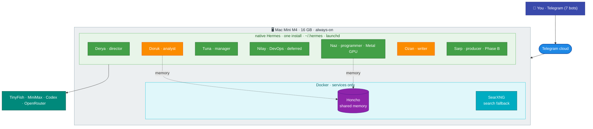
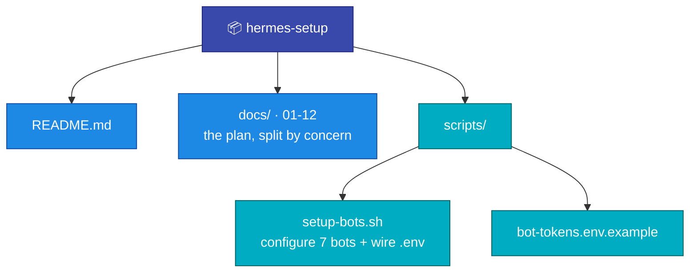

# Hermes Setup

A personal fleet of **seven [Hermes Agent](https://hermes-agent.nousresearch.com/) instances** running **native on a single Mac Mini M4** — one Hermes install, one profile per agent, Telegram bots as the interface, self-hosted Honcho as shared memory. No containers for the agents; Docker is kept only for the Honcho and SearXNG services.



**Colours:** green = MiniMax agents · orange = Codex agents · purple = Honcho · teal = services · indigo = you · blue = network.

## The fleet

All seven are native profiles in one Hermes install on the Mini. **Mode** = always-on (under launchd) vs on-demand (started when used).

| Bot | Slug | Mode | Role | Model |
|---|---|---|---|---|
| **Derya** | `general` | always-on | Founder / creative director — your main line | MiniMax |
| **Doruk** | `research` | always-on | Market analyst — research any topic + game scout | Codex |
| **Tuna** | `concierge` | always-on | Studio manager — reminders, morning digest | MiniMax |
| **Nilay** | `ops` | always-on | DevOps — watches the host (**deferred** — Phase B) | MiniMax (standard) |
| **Naz** | `coder` | on-demand | Lead programmer — the only agent that runs code; native for Metal GPU + the editor | MiniMax |
| **Ozan** | `writer` | on-demand | Narrative designer — drafts, game PRDs | Codex |
| **Sarp** | `producer` | on-demand | Producer — game-idea backlog + scoring (**Phase B, deferred**) | MiniMax |

Names are a (mildly sarcastic) Turkish game-studio crew — short first names in the chat list, distinct comic personas in each bot's SOUL. Each persona reinforces its role (a skeptical producer, a blunt programmer) rather than fighting it. Slugs are functional and constant.

## Why native single-install (not containers)

The earlier draft ran one Docker container per agent across two Macs. We dropped it — see [docs/01](docs/01-architecture.md) for the full reasoning. In short: this is **single-tenant, one person, one machine**, so the container isolation tax buys little; and **`coder` needs the Mac's Metal GPU + the Godot editor**, which a macOS container can't provide (no GPU passthrough). One native install also makes agent-to-agent coordination **local** (no HTTP/Tailscale) and the `kanban` board **natively available** if ever wanted. The trade — no kernel boundary between profiles — is managed by toolset hygiene (only `coder`/`ops` get a shell) and focused guardrails on `coder` ([docs/09](docs/09-security.md)).

## Documentation

The plan is split by concern. Original section numbers (`## 1` … `## 17`) are preserved, so inline cross-references like "Section 13.7" resolve across files.

1. [Architecture & Isolation](docs/01-architecture.md) — native single-install multi-profile; what isolation we keep and give up
2. [Agents — Roster, Specs & SOULs](docs/02-agents.md) — the seven agents, Derya spec, comic studio SOULs
3. [Telegram Bots](docs/03-telegram-bots.md) — bots, names, the `setup-bots.sh` shortcut
4. [Model Providers](docs/04-models.md) — MiniMax + Codex routing, fallback chains
5. [Deployment](docs/05-deployment.md) — directories, profiles, phases, toolset hygiene, launchd
6. [Networking](docs/06-networking.md) — Telegram needs no ports; Tailscale optional for the dashboard
7. [Memory — Honcho](docs/07-memory.md) — three layers, shared user model, backups
8. [Web Search — TinyFish & SearXNG](docs/08-web-search.md) — MCP integration, fallback
9. [Security & Sandboxing](docs/09-security.md) — native guardrails; fencing the one code-running agent
10. [Operations](docs/10-operations.md) — evaluation, native upgrade, open questions
11. [Game Development Workstream](docs/11-game-dev.md) — discovery-first pipeline
12. [Agent-to-Agent Communication](docs/12-agent-comms.md) — local coordination, Honcho, backlog.md, kanban-when-earned

## Quick start

```bash
# 1. Telegram: @BotFather → /newbot ×7   (general_<you>_bot … producer_<you>_bot; slug-based, rename-safe)
# 2. wire the bots (creation is the only manual step):
cp scripts/bot-tokens.env.example scripts/bot-tokens.env && chmod 600 scripts/bot-tokens.env
#    fill ALLOWED_USERS (from @userinfobot) + the 7 tokens, then:
./scripts/setup-bots.sh        # sets bot profiles + writes ~/.hermes/<slug>/.env
# 3. install Hermes natively + deploy research first:
#    follow docs/05-deployment.md  (Phase 1 → Doruk/research end-to-end, under launchd)
```

## Rollout status

- **Phase A (now)** — research (**Doruk**) + **Derya** only. Native install, prove two profiles coexist, run the weekly game-scout cron. ~7 GB, loose.
- **Phase B** — add Tuna, Naz, Ozan + self-hosted Honcho memory. Add **Nilay** (ops) once there's a fleet to watch; add **Sarp** (producer) once the game-idea backlog outpaces hand-curation.
- **Phase C** — game-dev: a picked idea graduates to a lean PRD (Ozan) → Godot prototype (Naz), native on the Mini's GPU.

## Repo layout



## Security notes

- **Never commit real tokens.** `*.env` is gitignored; only `*.env.example` ships. `scripts/bot-tokens.env` and every `~/.hermes/<slug>/.env` stay local.
- **Native = no container boundary.** A `terminal`/`code_execution` command runs on your real Mac. Only `coder` and `ops` get a shell; `coder` (the one arbitrary-code agent) is fenced with `approvals: smart`, credential redaction, and a website blocklist ([details](docs/09-security.md)).
- **Telegram is the front door** and needs no open ports (gateways connect outbound). Don't expose the optional HTTP API / dashboard publicly — put it behind Tailscale ([details](docs/06-networking.md)).
