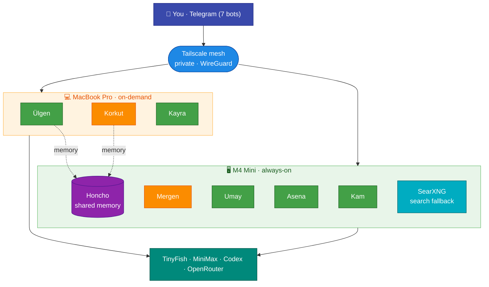
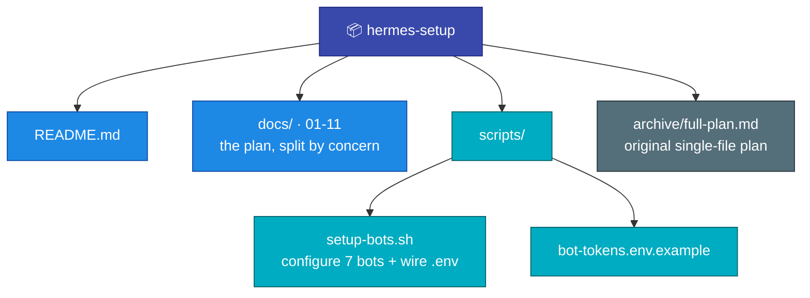

# Hermes Setup

A personal fleet of **seven [Hermes Agent](https://hermes-agent.nousresearch.com/) instances** running across a Mac M4 Mini + MacBook Pro M2 — one container per agent, Telegram bots as the interface, Tailscale as the only network boundary, self-hosted Honcho as shared memory.



**Colours:** green = MiniMax agents · orange = Codex agents · purple = Honcho · blue = network · indigo = you · teal = external/services · red = blocked.

## The fleet

| Bot | Slug | Machine | Role | Model |
|---|---|---|---|---|
| **Kam** | `general` | Mini | Talk about anything — your main line | MiniMax |
| **Mergen** | `research` | Mini | Research any topic (game / history / academic) + game scout | Codex |
| **Umay** | `concierge` | Mini | Daily life: reminders, morning digest | MiniMax |
| **Asena** | `ops` | Mini | Watches the fleet/system | MiniMax-highspeed |
| **Ülgen** | `coder` | MacBook | Godot-first dev — the only agent that runs code | MiniMax |
| **Korkut** | `writer` | MacBook | Drafts, edits, game PRDs | Codex |
| **Kayra** | `producer` | MacBook | Game-idea backlog + scoring (**Phase B, deferred**) | MiniMax |

Names are Turkic mythology (short in the chat list; full forms — Kam Ata, Mergen Han, Umay Ana, Asena Ana, Bay Ülgen, Dede Korkut, Kayra Han — live in each bot's profile). Slugs are functional and constant.

## Documentation

The plan is split by concern. Original section numbers (`## 1` … `## 16`) are preserved, so inline cross-references like "Section 13.7" resolve across files.

1. [Architecture & Isolation](docs/01-architecture.md) — why one container per agent; OrbStack notes
2. [Agents — Roster, Specs & SOULs](docs/02-agents.md) — the seven agents, Kam spec, Turkic SOULs
3. [Telegram Bots](docs/03-telegram-bots.md) — bots, names, the `setup-bots.sh` shortcut
4. [Model Providers](docs/04-models.md) — MiniMax + Codex routing, fallback chains
5. [Deployment](docs/05-deployment.md) — directories, ports, phases, toolset hygiene, Docker Compose
6. [Networking — Tailscale](docs/06-networking.md) — bind-to-tailnet, verification
7. [Memory — Honcho](docs/07-memory.md) — three layers, shared user model, backups
8. [Web Search — TinyFish & SearXNG](docs/08-web-search.md) — MCP integration, fallback
9. [Security & Sandboxing](docs/09-security.md) — guardrails, the container as boundary
10. [Operations](docs/10-operations.md) — evaluation, maintenance, open questions
11. [Game Development Workstream](docs/11-game-dev.md) — discovery-first pipeline

## Quick start

```bash
# 1. Telegram: @BotFather → /newbot ×7   (kam_<you>_bot … kayra_<you>_bot)
# 2. wire the bots (creation is the only manual step):
cp scripts/bot-tokens.env.example scripts/bot-tokens.env && chmod 600 scripts/bot-tokens.env
#    fill ALLOWED_USERS (from @userinfobot) + the 7 tokens, then:
./scripts/setup-bots.sh        # sets bot profiles + writes ~/.hermes-<slug>/.env
# 3. deploy, research first:
#    follow docs/05-deployment.md  (Phase 1 → Mergen end-to-end)
```

## Rollout status

- **Phase A (now)** — research (**Mergen**) + **Kam** only. Stand up, prove isolation, run the weekly game-scout cron. Light on RAM.
- **Phase B** — add Umay, Asena, Ülgen, Korkut + self-hosted Honcho memory. Add **Kayra** (producer) only once the game-idea backlog outpaces hand-curation.
- **Phase C** — game-dev: a picked idea graduates to a lean PRD (Korkut) → Godot prototype (Ülgen).

## Repo layout



## Security notes

- **Never commit real tokens.** `*.env` is gitignored; only `*.env.example` ships. `scripts/bot-tokens.env` and every `~/.hermes-*/.env` stay local.
- All agent ports bind to the **Tailscale interface only** — nothing is reachable from the LAN or public internet ([details](docs/06-networking.md)).
- `terminal` / `code_execution` are disabled on every agent except `coder` and `ops`; the container is the execution sandbox ([details](docs/09-security.md)).
