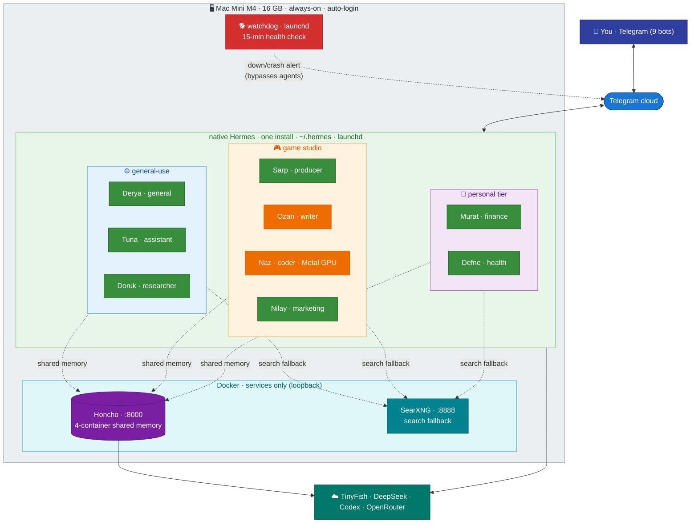
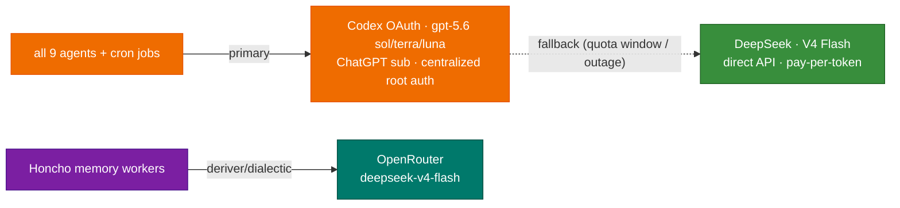
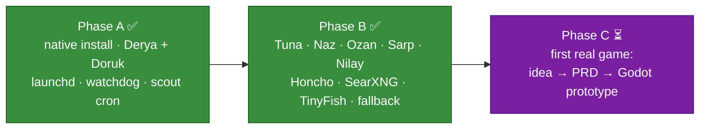
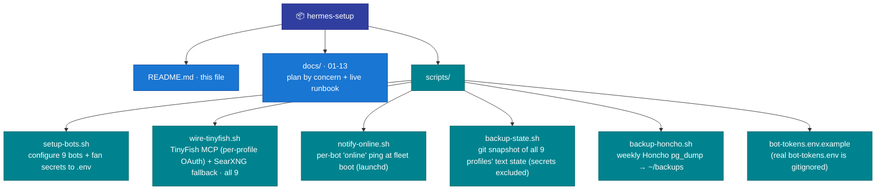

# Hermes Setup

A personal fleet of **nine [Hermes Agent](https://hermes-agent.nousresearch.com/) instances** running **native on a single Mac Mini M4** — one Hermes install, one profile per agent, Telegram bots as the interface, self-hosted Honcho as shared memory. No containers for the agents; Docker is kept only for the Honcho and SearXNG services. Host monitoring needs no agent — a dumb launchd **watchdog** covers it ([docs/10 §14.5](docs/10-operations.md)).

**Status: fully deployed — 9/9 agents live** under launchd on the Mini, all answering from Telegram, all on shared Honcho memory.

The fleet is **not** game-studio-only. It's a **general-purpose personal assistant layer** (works for your whole life) **plus** a **game-studio pipeline** layered on top. The studio names are flavor; the capabilities underneath are general.

---

## 1 · System architecture



**Colours:** green/orange = agents (all nine run **GPT-5.6 via Codex** primary — sol/terra/luna tiers since 2026-07-12 — DeepSeek Flash fallback) · purple = Honcho · teal = services · red = watchdog · indigo = you · blue = network · dark-teal = external APIs.

---

## 2 · The fleet — meet the crew

Nine native profiles in one Hermes install. **Slug** = the functional name (constant, ASCII, what the directory/peer/bot-username use). **Display** = the persona shown in Telegram (flavor only — titles don't fence capability). Profile art is pixel-art, one cohesive crew.

**🌐 General-use** — your whole life, not just games

<table>
  <tr>
    <td align="center"><br><b>Derya</b><br><sub><code>general</code></sub></td>
    <td align="center"><br><b>Tuna</b><br><sub><code>assistant</code></sub></td>
    <td align="center"><br><b>Doruk</b><br><sub><code>researcher</code></sub></td>
  </tr>
</table>

**🎮 Game-studio pipeline** — specialists

<table>
  <tr>
    <td align="center"><br><b>Nilay</b><br><sub><code>marketing</code></sub></td>
    <td align="center"><br><b>Sarp</b><br><sub><code>producer</code></sub></td>
    <td align="center"><br><b>Ozan</b><br><sub><code>writer</code></sub></td>
    <td align="center"><br><b>Naz</b><br><sub><code>coder</code></sub></td>
  </tr>
</table>

**🧑 Personal tier** — separate life domains

<table>
  <tr>
    <td align="center"><br><b>Murat</b><br><sub><code>finance</code></sub></td>
    <td align="center"><br><b>Defne</b><br><sub><code>health</code></sub></td>
  </tr>
</table>

### 🌐 General-use — your whole life, not just games

| Display | Slug | Mode | What it actually does | Model |
|---|---|---|---|---|
| **Derya** | `general` | always-on | Your **main line for anything** — work *and* life: questions, planning, brainstorming, hand-offs. (Themed as founder/creative director.) | GPT-5.6-terra (Codex) → ds-flash fb |
| **Tuna** | `assistant` | always-on | **Studio + personal** day: calendar, reminders, errands, morning digest covering both | GPT-5.6-terra (Codex) → ds-flash fb |
| **Doruk** | `researcher` | always-on | Research **any** domain, cites sources; also runs the weekly game-scout cron | GPT-5.6-sol (Codex) → ds-flash fb |

These three you'd want even with no game studio. Start here for day-to-day use.

### 🎮 Game-studio pipeline — specialists

| Display | Slug | Mode | What it actually does | Model |
|---|---|---|---|---|
| **Sarp** | `producer` | on-demand | Scores raw game ideas on a rubric (buildable / loop / discovery / monetization); kills hype | GPT-5.6-luna (Codex) → ds-flash fb |
| **Ozan** | `writer` | on-demand | Drafts & edits — game PRDs, store copy, prose (general writing too) | GPT-5.6-sol (Codex) → ds-flash fb |
| **Naz** | `coder` | on-demand | Godot/GDScript game code — **the studio's code-runner** (native for Metal GPU + the editor; fenced) | GPT-5.6-sol (Codex) → ds-flash fb |
| **Nilay** | `marketing` | always-on | Go-to-market: Steam page, wishlists, devlog/social cadence, ASO, outreach (briefs Ozan for copy) | GPT-5.6-luna (Codex) → ds-flash fb |

Names are a (mildly sarcastic) Turkish game-studio crew; each comic persona reinforces its role rather than fighting it. ("On-demand" = usage pattern; all 9 gateways run 24/7 under launchd.)

### 🧑 Personal tier — separate life domains

Beyond the studio, each life domain gets its own profile (own SOUL/memory/bot; Honcho means it already knows who you are). Built so far:

| Display | Slug | Does | Model |
|---|---|---|---|
| **Murat** | `finance` | Markets & finance analyst — analyzes read-only Google-Sheet/CSV/statement data, scans news/Reddit/finance sites (BIST + global), crunches numbers with fenced `code_execution`. *Not* investment advice. | GPT-5.6-terra (Codex) → ds-flash fb |
| **Defne** | `health` | Health & fitness coach — workout/nutrition logging, calorie/macro estimate from food photos (ballpark), trend tracking. *Not* medical advice. | GPT-5.6-terra (Codex) → ds-flash fb |

`finance` is a fenced shell-capable agent (`code_execution` only, `approvals: manual`, blocklist) — alongside `coder` (game-dev shell) and `general`/Derya (admin shell). See [docs/02 §2.2](docs/02-agents.md). Add more domains (language tutor, home-automation, …) the same way.

**🔍 Web stack — all 9 agents:** every agent searches via **TinyFish** (MCP, OAuth 2.1 PKCE — *no API key*) with **SearXNG** as automatic fallback. None is walled off from the web and search never hard-fails; an outage on either side degrades to the other. Wired uniformly by `scripts/wire-tinyfish.sh` — [docs/08](docs/08-web-search.md).

---

## 3 · How the studio agents chain — the game-dev pipeline

Discovery-first: you don't commit to a game, you let the fleet surface and score opportunities, *then* prototype the one you pick.


> Only the discovery end (Doruk's scout) runs today; the rest of the chain has work once you start a real game (Phase C). `kanban` can auto-promote cards across this pipeline, but it's **off** until recurring hand-offs are real ([docs/12](docs/12-agent-comms.md)).

---

## 4 · Model routing & fallback

Two paid providers do the work; OpenRouter is the cheap aux + the resilience valve.



- **GPT-5.6 via Codex OAuth** (ChatGPT sub — accepted gray-area, patron decision 2026-07-05; 5.6 tiers since 2026-07-12) — **primary for all nine agents and their crons**. Capability tier follows effort tier: `gpt-5.6-sol` + `xhigh` coder/researcher/writer · `gpt-5.6-terra` + `medium` general/assistant/finance/health · `gpt-5.6-luna` + `low` marketing/producer. One credential, centralized in the root `~/.hermes/auth.json`, serves the whole fleet.
- **DeepSeek V4 Flash** (direct API key, pay-per-token, ~$0.14/$0.28 per M) — **the fallback on every profile**: quota-window exhaustion or a Codex outage degrades the fleet to Flash instead of stalling it.
- **OpenRouter** (~$10 credit) — aux tasks and Honcho's cheap memory-extraction model (`deepseek-v4-flash`, ~$1/mo).

Full routing + the per-agent fallback chains: [docs/04](docs/04-models.md).

---

## 5 · Why native single-install (not containers)

The earlier draft ran one Docker container per agent across two Macs. Dropped — full reasoning in [docs/01](docs/01-architecture.md). In short: this is **single-tenant, one person, one machine**, so the container isolation tax buys little; and **`coder` needs the Mac's Metal GPU + the Godot editor**, which a macOS container can't provide (no GPU passthrough). One native install also makes agent-to-agent coordination **local** (no HTTP/Tailscale) and the `kanban` board **natively available** if ever wanted. The trade — no kernel boundary between profiles — is managed by toolset hygiene (shells limited to `coder` (game dev), `finance` (fenced Python), and `general`/Derya (fleet admin)) and focused guardrails on each ([docs/09](docs/09-security.md)).

---

## 6 · Documentation

The plan is split by concern. Original section numbers (`## 1` … `## 17`) are preserved, so inline cross-references like "Section 13.7" resolve across files.

1. [Architecture & Isolation](docs/01-architecture.md) — native single-install multi-profile; what isolation we keep and give up
2. [Agents — Roster, Specs & SOULs](docs/02-agents.md) — the nine agents, dual-use vs studio + personal tier, comic SOULs
3. [Telegram Bots](docs/03-telegram-bots.md) — bots, names, the `setup-bots.sh` shortcut
4. [Model Providers](docs/04-models.md) — DeepSeek + Codex routing, fallback chains
5. [Deployment](docs/05-deployment.md) — directories, profiles, phases, toolset hygiene, launchd
6. [Networking](docs/06-networking.md) — Telegram needs no ports; Tailscale optional for the dashboard
7. [Memory — Honcho](docs/07-memory.md) — three layers, shared user model, backups
8. [Web Search — TinyFish & SearXNG](docs/08-web-search.md) — TinyFish MCP (OAuth) primary + SearXNG fallback, all 9 agents
9. [Security & Sandboxing](docs/09-security.md) — native guardrails; fencing the one code-running agent
10. [Operations](docs/10-operations.md) — evaluation, native upgrade, watchdog, startup ping, open questions
11. [Game Development Workstream](docs/11-game-dev.md) — discovery-first pipeline
12. [Agent-to-Agent Communication](docs/12-agent-comms.md) — local coordination, Honcho, backlog.md, kanban-when-earned
13. [Deployment Runbook](docs/13-deployment-runbook.md) — the *what, in order*, with a live build log of what's done
14. [Upgrade & Maintenance](docs/14-upgrade-and-maintenance.md) — the brew-upgrade checklist (plist/FDA traps), hardened backups, watchdog v2, session-store hygiene, config-git rollback, skill-consolidation blast radius

---

## 7 · Quick start

```bash
# 1. Telegram: @BotFather → /newbot ×9   (general_<you>_bot … health_<you>_bot; slug-based, rename-safe)
# 2. wire the bots + keys (creation is the only manual Telegram step):
cp scripts/bot-tokens.env.example scripts/bot-tokens.env && chmod 600 scripts/bot-tokens.env
#    fill ALLOWED_USERS (from @userinfobot) + the 9 tokens + DEEPSEEK/OPENROUTER keys, then:
#    (TinyFish needs no key — it authenticates via OAuth in step 4)
./scripts/setup-bots.sh        # sets bot profiles + fans tokens & keys into ~/.hermes/profiles/<slug>/.env
# 3. install Hermes natively + bring up one profile, then the rest:
#    follow docs/13-deployment-runbook.md  (keys → install → bots → Phase A/B/C)
# 4. web stack — TinyFish (primary, OAuth) + SearXNG (fallback), all agents:
./scripts/wire-tinyfish.sh     # per-profile OAuth (own browser consent each — tokens are NOT shared) + SearXNG fallback + restart
```

`bot-tokens.env` is the **single entry point for all secrets** — the script fans them out per profile. It's gitignored; keep it `chmod 600` and don't edit it in a stale GUI buffer.

---

## 8 · Rollout status — ✅ complete



- **Phase A ✅** — native install, Derya + Doruk under launchd, per-profile state proven, watchdog live-tested, weekly game-scout cron delivering.
- **Phase B ✅** — all nine agents live; self-hosted Honcho shared memory (cross-agent recall proven); **all 9 agents on TinyFish (OAuth) primary + SearXNG fallback** (`mcp test` → Connected, 17 tools each) — ⚠️ **OAuth tokens are per-profile, never copied**: each profile runs its own `mcp add` consent (shared tokens get revoked by refresh-token rotation, [docs/08 §10.2 Step 4](docs/08-web-search.md)); OpenRouter fallback chains live-tested; `coder` fenced.
- **Phase C ⏳** — when you start a real game: a picked idea → lean PRD (Ozan) → Godot prototype (Naz) on the Mini's GPU → go-to-market (Nilay).

**Pending follow-ups (all pull, none blocking):** Naz `approvals: manual`→`smart` after a week · Sarp weekly score-cron once digests accumulate.

---

## 9 · Repo layout



State that lives **outside** the repo: `~/.hermes/profiles/<slug>/` (each agent's config, SOUL, sessions, memory, `.env`), `~/.hermes/honcho.json`, `~/.hermes/scripts/` (deployed `watchdog.sh` + `notify-online.sh` + `backup-state.sh`), `~/honcho-stack/` + `~/hermes-services/` (Docker), the **local backup repo `~/hermes-state-backup/`** (all 9 profiles' text state, secrets excluded, local-only) + Honcho dumps in `~/backups/`, and the launchd plists in `~/Library/LaunchAgents/ai.hermes.*` (incl. `ai.hermes.fleet-online`, `ai.hermes.backup-state`, `ai.hermes.backup-honcho`).

---

## 10 · Security notes

- **Never commit real tokens.** `*.env` is gitignored; only `*.env.example` ships. `scripts/bot-tokens.env` and every `~/.hermes/profiles/<slug>/.env` stay local, `chmod 600`.
- **Native = no container boundary.** A `terminal`/`code_execution` command runs on your real Mac. **Three agents can run code:** `coder` (game-dev shell), `general`/Derya (terminal + Python + `file` — the **fleet admin**, highest-privilege: always-on, web-facing, shell), and `finance` (fenced Python). Each is fenced with `approvals: manual`, credential stripping, Tirith ([details](docs/09-security.md)). ⚠️ Derya's approval on routine `hermes`/`launchctl` commands is **behavioral (her SOUL), not enforced** — see docs/09 §13.7a.
- **Telegram is the front door** and needs no open ports (gateways connect outbound). Don't expose the optional HTTP API / dashboard publicly — put it behind Tailscale ([details](docs/06-networking.md)).
- **Services bind loopback only** — Honcho `127.0.0.1:8000`, SearXNG `127.0.0.1:8888`; nothing off-box.
- **When something breaks:** gateway-down alerting is a dumb launchd watchdog, no agent involved ([docs/10 §14.5](docs/10-operations.md)); the fleet-wide stop + key-rotation drill is [docs/09 §13.8](docs/09-security.md).
