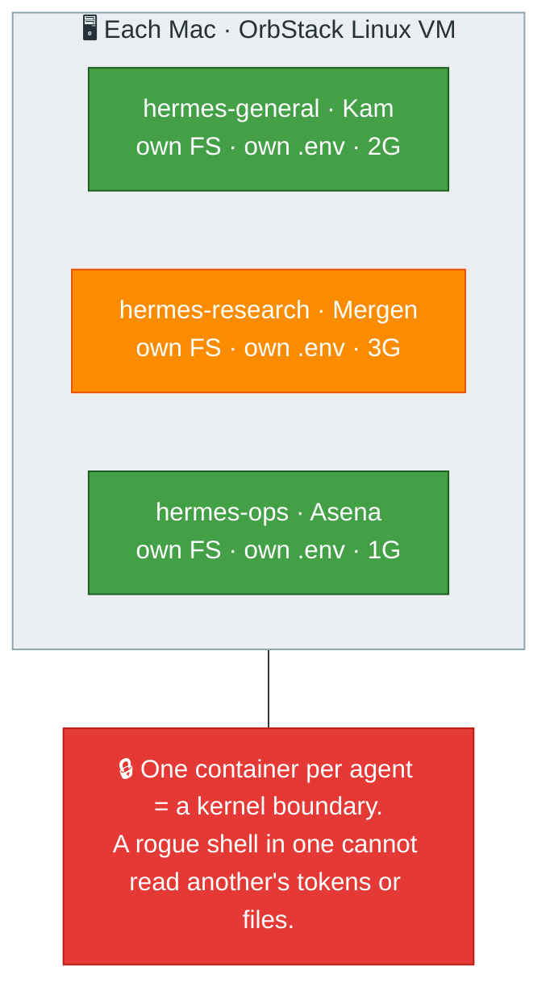

# Architecture & Isolation

[← All docs](../README.md)

---

## 1. Architectural decision: one container per agent

**The official default changed — and we deliberately diverge from it.** Since the s6-supervision migration, Hermes' own Docker guide recommends the *opposite* of what older write-ups (including an earlier draft of this plan) claimed: *"the s6 supervision tree treats each profile as a first-class supervised service, so the recommended deployment is one container hosting all profiles."* That single-container, multi-profile path is now the simple default — `hermes profile create <name>` inside one shared container, with s6 supervising each gateway.

We don't take it. The same guide lists exactly when one-container-per-profile is the right call: *"resource isolation, independent image pinning, network segmentation, or compliance."* Our setup hits three of those four, so we run **one container per agent** — each a fully independent container with its own host directory (`~/.hermes-<name>/`), its own bot token, its own personality, and its own lifecycle. The container itself *is* the isolation boundary.

This is a conscious trade-off. We give up the single-container conveniences (s6 auto-restart per profile, a shared interpreter cache, the `hermes profile` UX) in exchange for hard kernel-level boundaries between agents. `docker compose` (Section 7) recovers most of the management simplicity. The reasons the trade is worth it for seven agents:

- **True isolation.** Each container has its own filesystem, process table, and resource limits. A crash or runaway session in one agent cannot affect the others.
- **Independent lifecycle.** Restart, upgrade, pause, or roll back each agent on its own. `docker restart hermes-research` leaves the other five untouched.
- **Clean port separation.** Each gateway binds its own host port. No risk of cross-talk between chat platforms or API servers.
- **No concurrent-write risk.** The docs warn that two gateways must never run against the same data directory. Container-per-agent makes this structurally impossible.
- **One directory per agent.** Backups, migrations, and permissions all follow the bind-mounted directory — no shared state to disentangle, no `--profile` flags to remember.
- **Credential isolation.** Hermes profiles are explicitly *not* filesystem sandboxes — a shell in one profile can read another profile's `.env`, i.e. its bot token and API keys. Separate containers close that gap: `coder` (the only agent running arbitrary code, with your projects mounted) cannot reach the other agents' credentials. See Section 13's execution-sandboxing notes.

---

## 11. OrbStack-specific notes

- **Verify default context.** Run `docker context ls` and confirm OrbStack is the default. If Docker Desktop was ever installed, the context may need switching with `docker context use orbstack`.
- **Memory ceiling.** OrbStack auto-scales its VM, but you can set a hard cap in OrbStack settings if you want to prevent it from eating the whole machine. With seven agents totaling 6 GB across two machines, OrbStack itself should stay around 1–2 GB.
- **Service auto-start.** OrbStack starts on login by default. Verify in OrbStack settings → General. If disabled, your agents won't come back after a reboot.
- **launchd vs container restart.** `--restart unless-stopped` handles container crashes, but if the Mac reboots and OrbStack doesn't auto-start, nothing runs. Two redundant safeguards: enable OrbStack auto-start + use `--restart unless-stopped` on every container.

---
