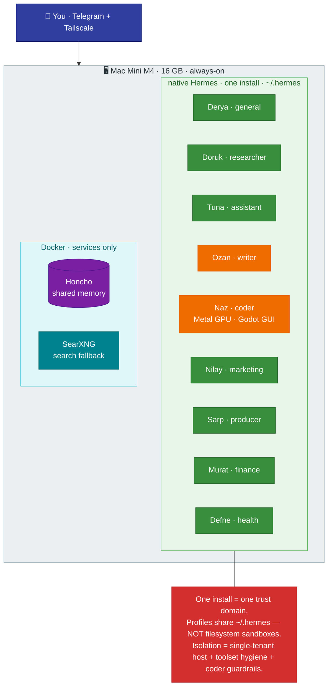

# Architecture & Isolation

[← All docs](../README.md)

---

## 1. Architectural decision: one native install, many profiles, one machine

**We run the official default.** Since the s6-supervision migration, Hermes' own guide says: *"the s6 supervision tree treats each profile as a first-class supervised service, so the recommended deployment is one container hosting all profiles."* We take the same shape **without the container** — a single **native** Hermes install on the Mac Mini M4, with one **profile per agent** (`hermes profile create <name>`), all sharing `~/.hermes`. macOS **launchd** plays the supervision role s6 plays inside the image.

An earlier draft of this plan did the opposite — one Docker container per agent, split across a Mac Mini and a MacBook Pro, for hard kernel-level isolation. We dropped it. The reasons that justified container-per-agent (*"resource isolation, independent image pinning, network segmentation, compliance"*) are **multi-tenant** concerns. This is a **single-tenant, single-user, single-machine** setup: every agent is yours, every token is yours, everything runs on one Mac you own. Paying the container tax to isolate yourself from yourself is the wrong trade.

What dropping containers buys us:

- **`coder` gets a real game engine.** Containers on macOS get **no GPU** — Hypervisor.framework exposes no virtual GPU, and there is no Metal passthrough. So a containerized Godot has no GPU-accelerated editor or rendered play-test; you're limited to headless use. Native, `coder` runs on the Mini's Metal GPU with the full Godot GUI. This alone settles the container question for a game-dev fleet.
- **One machine, no cross-host plumbing.** The MacBook Pro M2 is shelved for now. All agents share one host, so agent-to-agent work is **local** — no HTTP-over-Tailscale, no per-gateway API keys, no "the laptop is asleep" dead ends (see [Section 17](12-agent-comms.md)).
- **Native `kanban`.** Hermes' multi-agent board is deliberately single-host: a dispatcher claims tasks from `~/.hermes/kanban.db` and spawns the assigned profile as a **local child process**. A native single install is exactly that environment — the whole pipeline (`researcher → producer → writer → coder`) is now reachable by one board. We keep it **off** at first (a flat `backlog.md` is the right altitude for a solo, weekly-cadence pipeline), but the option is free and clean. See [Section 16](11-game-dev.md) and [Section 17](12-agent-comms.md).
- **Less overhead.** No per-agent containers — the one OrbStack VM that remains is for support services only and is capped at **4 GB** (`orb config set memory_mib 4096`). No image machinery or port juggling for the agents themselves.

## 1.1 What isolation we keep, and what we give up

Be honest about the trade. Profiles are **not filesystem sandboxes** — a shell-capable profile can read sibling profile state. Static provider, Telegram, webhook and integration credentials no longer live in profile `.env` files: 1Password is canonical and each config contains only ID-based `op://` references. The residual on-disk credential surface is limited to the unavoidable 1Password bootstrap identity and writable OAuth stores, all mode `0600` ([Section 15](15-credential-management.md)).

| Layer | Native single-install reality |
|---|---|
| **Per-profile data** | Each agent still gets its own `~/.hermes/profiles/<profile>/` — sessions, memories, skills, config are separate. Built-in session search never crosses profiles. |
| **Filesystem sandbox** | **None between profiles.** A shell-capable profile can read sibling config references, bootstrap identity and writable OAuth stores; static service credentials remain canonical in scoped 1Password vaults. |
| **Process isolation** | None — all gateways run under your macOS user. launchd supervises each; one crash doesn't take the others, but there is no resource cap per profile. |
| **Host sandbox** | **None.** A shell or code-exec on the `local` backend runs directly on macOS with your user's access. The container that used to be the boundary is gone. |

So isolation is no longer *structural*. It comes from three things instead:

1. **Single tenant.** Every agent, token, and file is yours. The real threat is **prompt-injection-driven exfiltration**, not one agent spying on another. 1Password reduces persistent plaintext sprawl but does not make a credential invisible after Hermes resolves it into a running process.
2. **Toolset hygiene.** Three agents can run code: `coder` (`terminal` + `code_execution`, game dev), `general`/Derya (same + `file` — the **fleet admin**), and `finance` (fenced Python). The other six have no shell to escape with; their surface is the scoped `file` tool plus web. Pruning toolsets per agent ([Section 6.6](05-deployment.md)) is now a primary security control, not just a token-cost lever — and Derya, the always-on web-facing admin, is the highest-privilege agent ([docs/09 §13.7a](09-security.md)).
3. **Code-runner guardrails.** `coder` is a primary arbitrary-code agent sharing the install (the always-on `general`/Derya admin shell is the other — §13.7a), so they carry the residual risk. Each is fenced with `approvals: manual`/`smart`, default credential redaction, a website blocklist, and — optionally — a `docker` code-execution backend for untrusted code. Full treatment in [Section 13](09-security.md).

The payoff of the old container choice (a kernel boundary) is replaced by **a much smaller attack surface** (six no-shell agents) plus **focused guardrails on the agents that can do damage** (`coder`, `finance`, and the Derya admin shell). For a solo operator that is the right altitude.

---

## 11. Native-install notes (macOS)

- **Install path.** Native Hermes via the official installer / Homebrew formula (see [Section 14](10-operations.md) for the exact upgrade story). All state lives under `~/.hermes/`.
- **Supervision is launchd's job.** The s6 tree only exists inside the Docker image. Native, Hermes' **built-in installer** wires one launchd LaunchAgent per profile — `hermes -p <profile> gateway install` writes + bootstraps `~/Library/LaunchAgents/ai.hermes.gateway-<profile>.plist` (verified v0.16.0) — so each gateway auto-starts at login and restarts on crash. This is the native equivalent of `--restart unless-stopped` + s6.
- **Start-at-login.** LaunchAgents load at user login. The Mini must therefore **auto-login** after a reboot (System Settings → Users & Groups → Automatic login) or the agents won't come back unattended.
- **Docker stays — for services only.** Honcho (4 containers: api, deriver, pgvector Postgres, Redis) and SearXNG are infrastructure, not agents. Keep a minimal Docker/OrbStack install for **those five containers only** (VM capped at 4 GB); no agent runs in a container. Resist adding heavy service stacks to the VM — a self-hosted Firecrawl proved the point by OOM-ing it ([docs/08 §10.6a](08-web-search.md)).
- **Resource pressure has no hard cap.** Native gives no per-agent `--memory` ceiling. A runaway profile can swap the whole Mini. Mitigations: Hermes `max_turns` iteration budgets ([Section 13](09-security.md)) bound loops, the on-demand agents (`coder`, `writer`, `producer`) are light while idle (in practice all 9 gateways run 24/7 — an idle gateway is ~0.3–0.5 GB since inference is remote), and the **watchdog** ([Section 14.5](10-operations.md)) catches a down or crash-looping gateway within 15 minutes.

---
