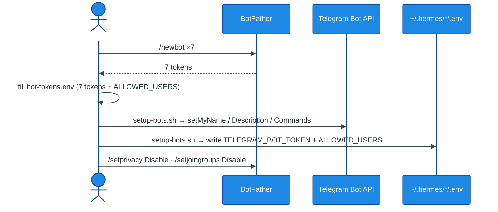

# Telegram Bots

[← All docs](../README.md)

---



## 4. Telegram bot prerequisites

Each agent connects to a separate Telegram bot. Seven agents = seven bots. Bots have to exist on Telegram's side *before* you bring up the agents, so this is pre-work for Phase 1 of the deployment plan.

Total time: ~20 minutes for all seven bots. Do it in one sitting. (Bot *creation* is manual; everything after is automated — see 4.12.)

### 4.1 What you're creating

For each agent, you need:

- A Telegram **bot** created via @BotFather (one per agent).
- A Telegram **bot token** — a string like `7123456789:AAH1bGciOiJSUzI1NiIsInR5cCI6Ikp...`. Treat this like a password. Anyone with the token controls the bot.
- Your numeric Telegram **user ID** (not your @username) — used to lock each bot down to only you. Single value, reused for all seven bots.
- Optional: a friendly **display name** and **description** for each bot, since you'll see them in your Telegram chat list.

### 4.2 Get your Telegram user ID (one-time, do this first)

Open Telegram, search for `@userinfobot`, send it any message. It replies instantly with your numeric ID (e.g. `123456789`). Save this number — you'll paste it into every agent's config.

Alternative bots if `@userinfobot` is unreachable: `@get_id_bot`, `@RawDataBot`.

**Important:** your @username is not your user ID. The ID is a stable number that never changes even if you rename yourself.

### 4.3 Create seven bots via BotFather

Open Telegram, search for `@BotFather`, start a conversation. Then for each of your seven agents, repeat this flow (or do the minimum here — just `/newbot` to get tokens — and let 4.12's script set names, descriptions, and commands in bulk):

```
/newbot
→ Bot's display name: Research Assistant (or whatever you want users to see)
→ Bot's username: research_<yourname>_bot   (must end in "bot" and be unique on Telegram)

BotFather replies with the token. Copy it immediately into a notes app — you'll
need it in step 4.4. Then for the same bot, run these to harden settings:

/mybots → pick the bot → Bot Settings
→ /setprivacy → Disable (lets the bot see all messages in groups if you ever add it to one)
→ /setjoingroups → Disable (you only want one-on-one chat with each agent)
→ /setdescription → "Methodical research assistant" (shows on the bot's profile)
→ /setabouttext → "Hermes Agent — research personality" (shows in bot info)
```

Suggested username pattern: `<role>_<yourname>_bot`. So `research_alice_bot`, `assistant_alice_bot`, `ops_alice_bot`, `coder_alice_bot`, `writer_alice_bot`. The bot's username must be globally unique on Telegram, so simple names like `research_bot` are almost certainly taken. Suffix with your own handle to avoid collisions.

By the end, you have seven tokens (six if you skip the deferred `producer`/Sarp bot for now). Save them somewhere temporary (a notes file you'll delete) — you're about to put them into each agent's `.env`.

### 4.4 Distribute tokens into each agent's `.env`

This is the bridge between Telegram's side and Hermes's side. Each agent needs two env vars in its host-side `.env` file:

```bash
# On the Mini, for the research agent:
cat >> ~/.hermes/research/.env <<EOF
TELEGRAM_BOT_TOKEN=7123456789:AAH1bGciOiJSUzI1NiIsInR5cCI6Ikp...
TELEGRAM_ALLOWED_USERS=123456789
EOF

# Repeat for each agent — each gets its own bot token, same user ID
```

Important formatting rules:

- **No quotes around the token value.** Telegram tokens contain a colon, which some env parsers misinterpret under quoting. Plain `TOKEN=value` form only.
- **`TELEGRAM_ALLOWED_USERS` is comma-separated.** Single value for a personal setup. If you want a friend to also be able to talk to a specific bot, add their user ID separated by a comma (no spaces).
- **Permissions on the `.env` file.** `chmod 600 ~/.hermes/*/.env` so only your user can read them. The tokens are bearer credentials.

### 4.5 Per-agent config

In each agent's `~/.hermes/<name>/config.yaml`, enable the Telegram gateway:

```yaml
gateway:
  enabled: true
  platforms:
    telegram:
      enabled: true
      extra:
        disable_link_previews: true   # cleaner output for agents that share links
```

The token and allowed-users values are read from `.env` automatically — they don't need to be repeated here.

### 4.6 Token collision protection (Hermes-side)

Hermes detects if two agents accidentally use the same bot token and refuses to start the second one. *"If two profiles accidentally use the same bot token, the second gateway will be blocked with a clear error naming the conflicting profile."* Same protection applies across profiles — first-write wins on a shared token, second one gets an explicit failure rather than silently competing.

If you ever see `Token already in use by hermes-<other>` in logs, two of your agents have the same token. Most common cause: copy-paste error in step 4.4. Re-issue a fresh token for one bot via `/revoke` in BotFather and update the right `.env`.

### 4.7 Verify each bot before starting the agent

Before starting the gateway, sanity-check the bot exists on Telegram's side:

```bash
TOKEN="7123456789:AAH..."
curl -s "https://api.telegram.org/bot${TOKEN}/getMe" | jq
```

Expected output includes `"ok": true` and the bot's username. If you get `"ok": false` or 401, the token is wrong — re-copy from BotFather.

Do this for each token. Takes 30 seconds total and catches typos before they cause weird gateway startup failures.

### 4.8 First contact after bringing the agent up

After starting the research gateway (`launchctl load ~/Library/LaunchAgents/com.hermes.research.plist`), open Telegram, find your bot (search for its username, or use the t.me/<username> link BotFather gave you), and send `/start` or any message. It should reply within a few seconds.

If it doesn't reply:

```bash
tail -n 100 ~/.hermes/logs/gateways/research/current | grep -i telegram
```

Common issues and fixes:

- **`401 Unauthorized`** — token wrong or revoked. Re-issue via BotFather.
- **`Conflict: terminated by other getUpdates request`** — another process is polling the same bot. Find it (`launchctl list | grep com.hermes` or check Activity Monitor) and stop the duplicate.
- **No log line about Telegram at all** — gateway not enabled in `config.yaml`. Recheck step 4.5.
- **`TELEGRAM_ALLOWED_USERS not configured, denying`** — user ID missing or wrong. Check `.env`, verify with @userinfobot.

### 4.9 Optional: set bot commands and home channel

**Bot commands** show a `/` menu in the Telegram client. From BotFather:

```
/mybots → pick the bot → Edit Bot → Edit Commands
```

Paste this for each agent (or tailor per agent):

```
new - Start a fresh conversation
status - Show session info
stop - Stop the current task
help - Show available commands
```

**Home channel for cron output.** Hermes can schedule jobs (via the `cron/` directory) that deliver output to a Telegram chat. The default is wherever you last set with `/sethome`. In each bot's DM, type:

```
/sethome
```

That marks the current chat as where the agent should send scheduled outputs. Useful for `assistant` (morning digest), `ops` (status reports), and `research` (cron'd briefings).

### 4.10 Bot-to-agent mapping reference

Seven bots, seven agents. The **@username uses the slug** (constant, ASCII, rename-safe — like the Honcho peer); the **display name** in the chat list is the persona, set via `/setname` (Section 4.9). So `@general_<you>_bot` shows as "Derya". Fill the token column as you create each bot. Replace `<you>` with your Telegram handle; usernames must be globally unique, so suffix with your handle.

| Slug | Display (chat) | Username | Token (first 10) | Role at a glance |
|---|---|---|---|---|
| `general` | Derya | `general_<you>_bot` | `…` | Founder / creative director — your main line |
| `research` | Doruk | `research_<you>_bot` | `…` | Market analyst — research + game scout |
| `assistant` | Tuna | `assistant_<you>_bot` | `…` | Studio manager — reminders, digest |
| `ops` | Nilay | `ops_<you>_bot` | `…` | DevOps — watches the host |
| `coder` | Naz | `coder_<you>_bot` | `…` | Lead programmer — writes & runs code |
| `writer` | Ozan | `writer_<you>_bot` | `…` | Narrative designer — drafts & PRDs |
| `producer` | Sarp | `producer_<you>_bot` | `…` | Producer — scores game ideas (Phase B) |

Save this. Seven similar bots in a chat list blur together without notes.

**Telegram profile text — paste per bot in BotFather.** `/setabouttext` is the short line in the bot's info card; `/setdescription` is the longer blurb shown on the empty-chat screen. These double as your "which agent does what" reference.

```
Derya     (general)
  about:       Derya — studio founder & creative director. Ask anything.
  description: Founder and creative director. Your main line: open conversation,
               brainstorming, quick answers, hand-offs to the crew. Dry, has seen every pitch.

Doruk    (research)
  about:       Doruk — market analyst. Research, any topic.
  description: The studio's market analyst and scout. Researches any domain — game
               markets, history, academic. Cites every source, quietly smug. Runs the weekly scout.

Tuna     (assistant)
  about:       Tuna — studio manager. Keeps your day running.
  description: Studio manager and the actual adult. Calendar, reminders, your morning
               digest. Warm, brief, herds the cats so things ship on time.

Nilay    (ops)
  about:       Nilay — DevOps. Watches the host.
  description: DevOps and sysadmin. Monitors the host and the agent fleet, status
               reports, scheduled checks. Terse. Certain it's never the server.

Naz      (coder)
  about:       Naz — lead programmer. Writes & runs code.
  description: Lead programmer. Godot-first game code, refactors, debugging. Blunt,
               shows diffs, tests her own work. "Works on my machine" is not a status update.

Ozan     (writer)
  about:       Ozan — narrative designer. Drafts & edits.
  description: Narrative designer. Drafts, edits, brainstorms — prose, store copy,
               game PRDs. Everything's a metaphor, but he delivers. Lean PRDs, brilliant briefly.

Sarp     (producer)
  about:       Sarp — producer. Scores game ideas.
  description: Producer and product lead. Holds the budget; scores ideas against the
               rubric and kills the hype. Skeptical, anti-inflation. (Activates in Phase B.)
```

### 4.11 Things to know about Telegram + Hermes specifically

A few details that matter for our setup:

**Voice memos auto-transcribe.** If you record a voice message in Telegram, Hermes transcribes it via the configured STT provider and processes it as a normal message. For local-only transcription with no API key, `stt.provider: local` uses `faster-whisper` on the machine running Hermes. Install with `pip install faster-whisper` on the Mini — or just leave it at the default and accept that the first voice message in each session takes longer while the model downloads.

**TTS replies are native voice bubbles.** If an agent uses `text_to_speech`, the result is delivered as Telegram's inline-playable voice format, not a file attachment. Configure per-agent in `config.yaml` under `tts:` — Edge TTS is free and decent quality.

**Markdown tables get auto-flattened.** Telegram's MarkdownV2 doesn't support tables. Hermes detects them and either flattens small tables into bulleted lists or wraps larger ones in code blocks. You don't need to configure anything — the adapter handles it.

**File attachments use any path your user can read.** When the agent sends a file via `MEDIA:/...`, the path just needs to be readable by your user. Since the gateway runs natively on the Mini as you, any such path works directly — no mounts involved. For `writer`, point its output at `~/Documents/writer-output/` directly in config; files written there are immediately readable by the gateway.

**Group chats are off by default.** With `/setjoingroups Disable` from step 4.3, the bots can't be added to groups at all. If you ever want a bot in a group (probably `assistant` for a family group), re-enable `/setjoingroups` and also set the per-platform `group_allow_from` allowlist in `config.yaml` to restrict who can invoke the bot.

**Single Telegram account, seven bots, no conflict.** Telegram supports unlimited bots per account. Bots are independent of the account that created them — each has its own identity, its own token, and shows up as a separate chat. Your seven bots will appear as seven separate conversations in your chat list.

### 4.12 Shortcut — automate everything after bot creation

Bot *creation* (4.3) is the only manual part; Telegram has no API for it. Once the seven bots exist and you have their tokens, `scripts/setup-bots.sh` does the rest in one command — it replaces the hand-work in **4.4** (token → `.env`) and **4.9** (commands, description, about text).

```bash
# from the repo root
cp scripts/bot-tokens.env.example scripts/bot-tokens.env && chmod 600 scripts/bot-tokens.env
# edit scripts/bot-tokens.env: paste ALLOWED_USERS (your @userinfobot ID) + the 7 tokens
./scripts/setup-bots.sh
```

For each bot it calls the Bot API (`setMyName`, `setMyShortDescription`, `setMyDescription`, `setMyCommands`) with the names and profile text from 4.10, then writes `TELEGRAM_BOT_TOKEN` + `TELEGRAM_ALLOWED_USERS` into `~/.hermes/<slug>/.env` — **non-destructive** (preserves any model-provider keys already in the file), `chmod 600` — and verifies each token with `getMe`. Idempotent: rerun anytime to update the profile text.

Still manual afterward (BotFather-only, ~10 s per bot): `/setprivacy` → Disable and `/setjoingroups` → Disable (the hardening from 4.3).

The token you paste into `scripts/bot-tokens.env` is the same value each agent's `.env` needs — the script wires both Telegram's side and the agents' side from that one entry, so you never paste a token twice.

---
