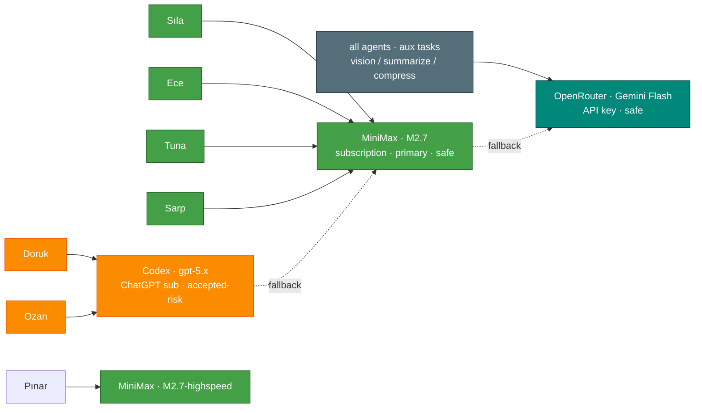

# Model Providers

[← All docs](../README.md)

---



## 5. Model providers per agent

The subscriptions actually on hand: **MiniMax**, **Codex** (ChatGPT), **Claude Code**, and **Gemini Antigravity**. Not all of them are *safe* to wire into a third-party agent like Hermes — "works technically" and "won't get your account flagged" are different questions. This doc maps them to a safe, sustainable stack:

- **MiniMax = primary** (5 of 7 agents). Zero risk.
- **Codex = accepted-risk extra** on the two low-volume agents (`research`, `writer`).
- **OpenRouter API key** for cheap aux + cross-provider fallback. Safe.
- **Claude** via a plain Anthropic API key *only if you want it* — not the Claude Code subscription.
- **Gemini Antigravity = not usable.** Read 5.0.

### 5.0 Provider safety & ToS — read first

The distinction that governs everything below: **an API key (you pay per token) is always safe. A consumer *subscription* OAuth token piped into a third-party agent is a gray area — and in one case, a banned one.**

| Subscription | Hermes provider | Works? | Safe? |
|---|---|---|---|
| **MiniMax** | `minimax` (API key) / `minimax-oauth` | ✅ | ✅ **Safe** — built for programmatic use |
| **Codex** (ChatGPT) | `openai-codex` (OAuth) | ✅ | ⚠️ **Gray** — reuses ChatGPT sub auth in a non-OpenAI agent |
| **Claude Code** | `anthropic` (OAuth, reads Claude Code's cred store) | ✅ | ⚠️ **Gray + high-stakes** — risks the sub you code with |
| **Gemini Antigravity** | — (no API) | ❌ | 🚫 **Banned pattern** — use an AI Studio API key instead |

- **MiniMax** — API key or its own browser OAuth. Designed for this. Make it your primary.
- **Codex** — works via device-code OAuth, but it reuses your ChatGPT subscription outside OpenAI's own clients. Not officially blessed; heavy *automated* volume is what gets throttled or flagged. Keep it on **low-volume** agents only and isolate it so a flag can't take down the fleet.
- **Claude Code subscription** — Hermes can read Claude Code's credential store (`anthropic` OAuth), but that points your *coding* subscription at a different agent. If flagged, you risk the tool you actually develop with. **Keep Claude Code for Claude Code.** Want Claude inside Hermes? Use a separate **Anthropic API key** (pay-per-token, unambiguously fine) — see 5.4.
- **Gemini Antigravity** — **do not attempt.** Antigravity is an IDE with no API to extract auth from. The closest pattern, `google-gemini-cli` OAuth, is exactly what Google **enforced against in early 2026** — paid subscribers using Gemini-CLI-style OAuth in third-party apps lost access during the crackdown. The only safe way to use Gemini in Hermes is an **AI Studio API key** (free tier or pay-per-token) or **Gemini via OpenRouter** — both separate from your Antigravity subscription. The OpenRouter→Gemini-Flash aux route in 5.5 is safe precisely because it's an API key, not subscription OAuth.

**The rule:** never put gray-area subscription-OAuth on an always-on agent that hammers it. Automated volume is the enforcement trigger — that's exactly what the Google ban hit. The assignment in 5.1 follows this rule: everything high-volume runs on pay-per-token MiniMax.

### 5.1 Per-agent model assignment

| Slug | Bot | Main model | Provider | Safety | Why |
|---|---|---|---|---|---|
| `general` | Sıla | `MiniMax-M2.7` | `minimax` | ✅ | Highest-volume daily driver → pay-per-token, no cap to blow |
| `research` | Doruk | `gpt-5.x` | `openai-codex` | ⚠️ | Long-context web research; *bounded* weekly volume |
| `concierge` | Tuna | `MiniMax-M2.7` | `minimax` | ✅ | Daily logistics |
| `ops` | Pınar | `MiniMax-M2.7-highspeed` | `minimax` | ✅ | Fast, cheap, deterministic |
| `coder` | Ece | `MiniMax-M2.7` | `minimax` | ✅ | Heaviest/most variable volume → off the ChatGPT cap |
| `writer` | Ozan | `gpt-5.x` | `openai-codex` | ⚠️ | Voice, long-form; *occasional* |
| `producer` | Sarp | `MiniMax-M2.7` | `minimax` | ✅ | Idea scoring (Phase B) |

For all seven, the **auxiliary model** (vision, web summarization, context compression, session search) is `google/gemini-2.5-flash` via OpenRouter (5.5) — short, frequent calls routed to the cheapest fast model.

Why Codex lands on `research` + `writer` specifically: those are the two **bounded-volume** agents, and gpt-5.x is genuinely strong at web research and long-form drafting. That's where the gray-area trade is worth it. Everything that runs hot — Sıla (your main line), coder, the always-on Mini agents — stays on MiniMax so volume never triggers ChatGPT-side enforcement. If `coder`'s GDScript quality ever disappoints, flip it to Codex (`gpt-5.x`) per-session with `/model` and judge.

### 5.2 MiniMax setup — your primary (Sıla, concierge, ops, coder, producer)

Get an API key at platform.minimax.io. Two regional endpoints:

- **Global** (`minimax`, `api.minimax.io`) — use this unless you're in mainland China.
- **China** (`minimax-cn`, `api.minimaxi.com`) — for China-region accounts.

One key works across every MiniMax agent (billed per token, no per-key restriction):

```bash
for agent in general concierge ops coder producer; do
  echo "MINIMAX_API_KEY=mn_..." >> ~/.hermes/${agent}/.env
done
```

`config.yaml` — most MiniMax agents use `MiniMax-M2.7`:

```yaml
model:
  provider: minimax
  default: MiniMax-M2.7
```

`ops` (Pınar) uses the faster/cheaper variant — quick deterministic responses, not deep reasoning:

```yaml
model:
  provider: minimax
  default: MiniMax-M2.7-highspeed
```

**MiniMax OAuth alternative.** `minimax-oauth` logs in via browser (free tier, no API billing). It's also *relatively* safe — it's MiniMax's own product — but the free tier rate-caps harder and adds per-profile OAuth bootstrap. For always-on agents an API key is more reliable. Flip with `provider: minimax-oauth` if cost ever bites.

### 5.3 Codex OAuth setup — accepted-risk (research + writer only)

> ⚠️ Gray area (5.0). Keep it to these two low-volume agents and don't let either run hot. If you'd rather avoid the risk entirely, put `research`/`writer` on MiniMax too and skip this section.

Codex uses OAuth against your ChatGPT account — no API billing, your subscription pays. The token saves to `~/.hermes/<slug>/auth.json` per profile and survives restarts (persisted under `~/.hermes/<slug>/`). Two ways to bootstrap.

**Path A — import existing Codex credentials** (if you use ChatGPT Desktop or the Codex CLI). Your creds live at `~/.codex/auth.json`; Hermes auto-imports on first start:

```bash
# after: hermes profile create research
cp ~/.codex/auth.json ~/.hermes/research/auth.json
chmod 600 ~/.hermes/research/auth.json
# repeat for ~/.hermes/writer
```

**Path B — fresh device-code login** (if you don't have Codex creds yet):

```bash
hermes setup --profile research
# at the model step pick "OpenAI Codex"; open the printed URL, paste the code, approve
```

Either way, `config.yaml`:

```yaml
model:
  provider: openai-codex
  default: gpt-5.3
```

**Shared quota.** Both Codex agents draw on the same ChatGPT account cap (Plus vs Pro differ). Two *low-volume* agents won't strain it — which is the whole reason only `research` + `writer` are here. `invalid_grant` in logs = the refresh token was revoked (password change / remote signout); redo Path A or B.

### 5.4 Anthropic — optional, API key only (never the Claude Code sub)

Not in the default stack. Add it only if you specifically want Claude for an agent (most likely `coder` on a hard refactor day). **Use an API key, not your Claude Code subscription** (5.0).

```bash
echo "ANTHROPIC_API_KEY=sk-ant-..." >> ~/.hermes/coder/.env
```

```yaml
model:
  provider: anthropic
  default: claude-sonnet-4-6
```

Pay-per-token via console.anthropic.com. Switch to Opus for hard work with `/model claude-opus-4-6` in-session (same provider). **Do not** use `hermes model → Anthropic OAuth` with your Claude Code/Max login — that's the gray-area path that risks your coding subscription.

### 5.5 OpenRouter for auxiliary tasks (one key, all seven agents)

Aux tasks fire constantly — vision, page summaries, session titles, context compression. Hermes defaults them to the main chat model unless overridden. Routing them to a cheap fast model via OpenRouter saves real money, and — importantly — it's an **API key**, so this is the *safe* way to use Gemini (not the banned subscription-OAuth route from 5.0).

Get a key at openrouter.ai → Keys, add $5–10 of credit (lasts months). Add it to **every** agent's `.env`:

```bash
for agent in general research concierge ops coder writer producer; do
  echo "OPENROUTER_API_KEY=sk-or-..." >> ~/.hermes/${agent}/.env
done
```

Then in **every** `config.yaml`:

```yaml
auxiliary:
  vision:
    provider: openrouter
    model: google/gemini-2.5-flash
  web_extract:
    provider: openrouter
    model: google/gemini-2.5-flash
  session_search:
    provider: openrouter
    model: google/gemini-2.5-flash
  compression:
    provider: openrouter
    model: google/gemini-2.5-flash
  approval:
    provider: openrouter
    model: google/gemini-2.5-flash
```

Main chat stays on MiniMax/Codex; everything else routes through cheap Gemini Flash. Gemini Flash wins here on cost, sub-second latency, multimodal vision, and generous OpenRouter rate limits.

**One-provider alternative:** to drop OpenRouter entirely, point aux at `provider: minimax` / `model: MiniMax-M2.7-highspeed` (same key as your MiniMax agents). Slightly pricier than Gemini Flash but consolidates to a single provider and removes even the OpenRouter dependency. Either is safe.

### 5.6 Cost ballpark (per month, personal use)

Moderate daily use of all seven. Real numbers vary; the big swing is `coder`.

| Agent | Provider | Estimate |
|---|---|---|
| `general` (Sıla) | MiniMax | $3–10 — highest volume |
| `research` (Doruk) | Codex (ChatGPT sub) | $0 — included |
| `concierge` (Tuna) | MiniMax | $2–8 |
| `ops` (Pınar) | MiniMax-highspeed | $1–3 |
| `coder` (Ece) | MiniMax | $5–25 — scales with active dev |
| `writer` (Ozan) | Codex (ChatGPT sub) | $0 — included |
| `producer` (Sarp) | MiniMax | $0–3 — Phase B |
| *Aux (all seven)* | OpenRouter (Gemini Flash) | $1–5 |
| **Total** | | **~$12–55/mo** on top of your existing MiniMax + ChatGPT subscriptions |

No Anthropic line by default — Claude is opt-in (5.4). If MiniMax spend climbs, the `minimax-oauth` free tier (5.2) or cheaper OpenRouter models (5.11) are the levers.

### 5.7 Fallback chains per agent

Hermes retries a failed primary (rate limit, 5xx, auth) against the next provider in the chain without losing the conversation. Each agent falls back to a *different* provider so one outage can't take it down. The OpenRouter key from 5.5 covers all of these — **MiniMax agents fall back via OpenRouter so they never need Codex credentials.**

MiniMax-primary agents (`general`, `concierge`, `coder`, `producer`):
```yaml
fallback_providers:
  - provider: openrouter
    model: minimaxai/minimax-m2.7
  - provider: openrouter
    model: google/gemini-2.5-flash
```

`ops` (MiniMax-highspeed — keep it light):
```yaml
fallback_providers:
  - provider: openrouter
    model: google/gemini-2.5-flash
```

Codex-primary agents (`research`, `writer`) — fall back to MiniMax (needs `MINIMAX_API_KEY` in their `.env` too), then OpenRouter:
```yaml
fallback_providers:
  - provider: minimax
    model: MiniMax-M2.7
  - provider: openrouter
    model: openai/gpt-5
```

So if a Codex call 503s or rate-limits, the session silently continues on MiniMax. If MiniMax hiccups, agents ride OpenRouter. No single provider is a single point of failure.

### 5.8 Putting it together: per-agent `.env` summary

`TELEGRAM_BOT_TOKEN` + `TELEGRAM_ALLOWED_USERS` are written by `setup-bots.sh` (see [Telegram Bots](03-telegram-bots.md)); the model keys below you add yourself.

`~/.hermes/general/.env` (Sıla):
```bash
TELEGRAM_BOT_TOKEN=...
TELEGRAM_ALLOWED_USERS=...
MINIMAX_API_KEY=mn_...
OPENROUTER_API_KEY=sk-or-...
```

`~/.hermes/research/.env` (Doruk):
```bash
TELEGRAM_BOT_TOKEN=...
TELEGRAM_ALLOWED_USERS=...
MINIMAX_API_KEY=mn_...        # for fallback
OPENROUTER_API_KEY=sk-or-...
# Codex credentials live in auth.json, not .env
```

`~/.hermes/concierge/.env` (Tuna), `~/.hermes/ops/.env` (Pınar), `~/.hermes/producer/.env` (Sarp):
```bash
TELEGRAM_BOT_TOKEN=...
TELEGRAM_ALLOWED_USERS=...
MINIMAX_API_KEY=mn_...
OPENROUTER_API_KEY=sk-or-...
```

`~/.hermes/coder/.env` (Ece):
```bash
TELEGRAM_BOT_TOKEN=...
TELEGRAM_ALLOWED_USERS=...
MINIMAX_API_KEY=mn_...
OPENROUTER_API_KEY=sk-or-...
# ANTHROPIC_API_KEY=sk-ant-...   # optional, only if you want Claude (5.4)
```

`~/.hermes/writer/.env` (Ozan):
```bash
TELEGRAM_BOT_TOKEN=...
TELEGRAM_ALLOWED_USERS=...
MINIMAX_API_KEY=mn_...        # for fallback
OPENROUTER_API_KEY=sk-or-...
# Codex credentials live in auth.json
```

`chmod 600` on every `.env`. Bearer credentials — treat them like passwords. (`setup-bots.sh` already chmods the ones it writes.)

### 5.9 Verification

Sanity-check each provider from the host before starting agents:

```bash
# OpenRouter (covers aux + all fallbacks)
curl -s https://openrouter.ai/api/v1/models \
  -H "Authorization: Bearer $OPENROUTER_API_KEY" | jq '.data | length'
# Expect a number > 300

# MiniMax
curl -s https://api.minimax.io/v1/text/chatcompletion_v2 \
  -H "Authorization: Bearer $MINIMAX_API_KEY" \
  -H "Content-Type: application/json" \
  -d '{"model":"MiniMax-M2.7-highspeed","messages":[{"role":"user","content":"hi"}],"max_tokens":10}'
# Expect JSON with "choices"

# Anthropic — only if you opted into 5.4
curl -s https://api.anthropic.com/v1/messages \
  -H "x-api-key: $ANTHROPIC_API_KEY" \
  -H "anthropic-version: 2023-06-01" -H "content-type: application/json" \
  -d '{"model":"claude-haiku-4-5","max_tokens":10,"messages":[{"role":"user","content":"hi"}]}'
# Expect JSON with "content"
```

Codex can't be verified outside Hermes — its auth is bound to Hermes's credential store. It fails loudly on first startup (`invalid_grant` / `auth required` in logs) if broken.

### 5.10 Changing providers later

Each agent's `config.yaml` is the source of truth:

```bash
nano ~/.hermes/general/config.yaml   # change model.provider / model.default
launchctl kickstart -k gui/$(id -u)/com.hermes.general
```

History, memory, and skills are provider-agnostic and survive the switch. Use `/model <name>` inside a session to switch *temporarily* without editing the file; persistent changes need the config edit + restart.

### 5.11 Future — expanding via OpenRouter (Nemotron, DeepSeek V4, …)

OpenRouter is already wired for aux + fallback, so adding more models is a **one-line config change, no new account**. When you want to experiment — NVIDIA Nemotron, DeepSeek V4, Qwen, GLM, etc. — just point an agent or an aux task at the OpenRouter slug:

```yaml
model:
  provider: openrouter
  default: deepseek/deepseek-v4        # example — use the exact slug from openrouter.ai/models
```

Good candidates to try as they mature:
- **DeepSeek V4** — cheap strong reasoning; a possible MiniMax alternative for `concierge`/`producer`.
- **NVIDIA Nemotron** — strong open models; worth testing on `coder` against MiniMax.
- **Qwen / GLM / Kimi** — also first-class on OpenRouter (and Hermes has native `qwen-oauth`, `zai`, `kimi-coding` providers if you prefer direct).

Workflow: try a candidate with `/model openrouter/<slug>` in a live session, judge it on your actual tasks, and only persist to `config.yaml` if it clearly beats the incumbent. **Keep MiniMax as primary until something demonstrably wins** — novelty isn't a reason to switch a working agent. All OpenRouter usage is API-key billing, so it's always on the safe side of 5.0.

---
