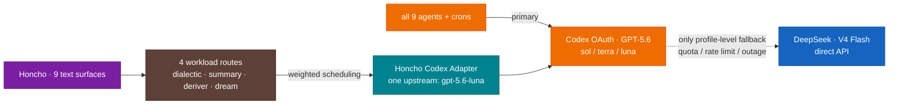

# Model Providers

[← All docs](../README.md)

---

## ⚡ LIVE — GPT-5.6 primary, DeepSeek fallback only

Live fleet config was re-read profile by profile on **2026-07-19**. All nine profiles use `openai-codex` with a GPT-5.6 tier as the main model. Every profile has one top-level fallback: `deepseek:deepseek-v4-flash`. No cron job pins a separate model, so crons inherit their profile's GPT-5.6 primary and DeepSeek fallback chain.



- **Reasoning efforts:** `medium` general/assistant/coder/finance/health/researcher/writer · `low` marketing/producer. GPT-5.6 Sol stays at `medium` to control quota and cost.
- **Codex OAuth is profile-local.** Each profile has its own writable `0600 auth.json`; the nine stores are distinct and refresh/writeback remains local to the selected profile. Never copy OAuth JSON between profiles or paste tokens into chat or documentation.
- **Watch items:** the Codex quota window is shared across nine agents. Verify the billed provider in session statistics rather than inferring it from response text.
- **Credential policy:** static DeepSeek/OpenRouter keys resolve from ID-based 1Password references. Codex OAuth and its refresh writeback remain the documented local `0600` exception ([docs/15](15-credential-management.md)).

## 5. Model providers per agent

Current provider roles:

- **Codex GPT-5.6 (sol/terra/luna) = primary, fleet-wide** (all 9 agents + crons; Codex-primary since 2026-07-05, 5.6 tiers since 2026-07-12 — see the LIVE banner above; §5.0's caution stands as the analysis that was overridden).
- **DeepSeek V4 Flash = the fallback** on every profile. Direct API key, pay-per-token, zero ToS risk.
- **OpenRouter API key** for the vision fallback chain and Honcho workers. It is not a profile-level agent fallback.
- **MiniMax** — dormant credential only; not part of active routing.
- **Claude** via a plain Anthropic API key *only if you want it* — not the Claude Code subscription.
- **Gemini Antigravity = not usable.** Read 5.0.

### 5.0 Provider safety & ToS — read first

The distinction that governs everything below: **an API key (you pay per token) is always safe. A consumer *subscription* OAuth token piped into a third-party agent is a gray area — and in one case, a banned one.**

| Subscription | Hermes provider | Works? | Safe? |
|---|---|---|---|
| **DeepSeek** (fallback) | `deepseek` (API key) | ✅ | ✅ **Safe** — plain platform API key, pay-per-token |
| **MiniMax** (spare) | `minimax` (API key) / `minimax-oauth` | ✅ | ✅ **Safe** — built for programmatic use |
| **Codex** (ChatGPT) — **current primary** | `openai-codex` (OAuth) | ✅ | ⚠️ **Against consumer ToS** — sub-OAuth in a non-OpenAI app; *unenforced today*, but Anthropic + Google killed the equivalent Apr 2026 |
| **Claude Code** | `anthropic` (OAuth, reads Claude Code's cred store) | ✅ | ⚠️ **Gray + high-stakes** — risks the sub you code with |
| **Gemini Antigravity** | — (no API) | ❌ | 🚫 **Banned pattern** — use an AI Studio API key instead |

- **DeepSeek** — plain API key from platform.deepseek.com (`DEEPSEEK_API_KEY`), pay-per-token, zero ToS ambiguity. Fleet-wide fallback (was primary for 7 of 9 until 2026-07-05).
- **MiniMax** — API key or its own browser OAuth. Also safe; the static key stays in 1Password and is not fanned out as a dormant plaintext fallback.
- **Codex** — works via device-code OAuth and is the accepted-risk primary on all nine profiles and inherited cron runs. The operational risk is centralized-account quota/auth failure, which is why the clean DeepSeek API fallback remains wired everywhere.
- **Claude Code subscription** — Hermes can read Claude Code's credential store (`anthropic` OAuth), but that points your *coding* subscription at a different agent. If flagged, you risk the tool you actually develop with. **Keep Claude Code for Claude Code.** Want Claude inside Hermes? Use a separate **Anthropic API key** (pay-per-token, unambiguously fine) — see 5.4.
- **Gemini Antigravity** — **do not attempt.** Antigravity is an IDE with no API to extract auth from. The closest pattern, `google-gemini-cli` OAuth, is exactly what Google **enforced against in early 2026** — paid subscribers using Gemini-CLI-style OAuth in third-party apps lost access during the crackdown. The only safe way to use Gemini in Hermes is an **AI Studio API key** (free tier or pay-per-token) or **Gemini via OpenRouter** — both separate from your Antigravity subscription. The OpenRouter→Gemini-Flash aux route in 5.5 is safe precisely because it's an API key, not subscription OAuth.

The earlier “Codex only on coder/writer; crons stay on DeepSeek” design is retired. It remains in git history rather than being repeated as current guidance.

### 5.1 Per-agent model assignment (live since 2026-07-12)

All nine: **GPT-5.6 primary via `openai-codex` OAuth (⚠️ accepted-risk), `deepseek-v4-flash` fallback via `deepseek` API key (✅).** The 5.6 capability tier follows the reasoning-effort tier:

| Slug | Bot | Main model | Effort | Fallback | Why this tier |
|---|---|---|---|---|---|
| `coder` | Naz | `gpt-5.6-sol` | `medium` | `deepseek-v4-flash` | Strong code quality with controlled Sol quota use |
| `researcher` | Doruk | `gpt-5.6-sol` | `medium` | `deepseek-v4-flash` | Multi-source research with controlled Sol quota use |
| `writer` | Ozan | `gpt-5.6-sol` | `medium` | `deepseek-v4-flash` | Voice and long-form drafting with controlled Sol cost |
| `general` | Derya | `gpt-5.6-sol` | `medium` | `deepseek-v4-flash` | Main line and fleet administration; live config differs from the old Terra assignment |
| `assistant` | Tuna | `gpt-5.6-terra` | `medium` | `deepseek-v4-flash` | Daily logistics |
| `finance` | Murat | `gpt-5.6-terra` | `medium` | `deepseek-v4-flash` | Personal markets analyst (personal tier, docs/02 §2.2) |
| `health` | Defne | `gpt-5.6-terra` | `medium` | `deepseek-v4-flash` | Fitness/nutrition coach (personal tier) |
| `marketing` | Nilay | `gpt-5.6-luna` | `low` | `deepseek-v4-flash` | Frequent light tasks — Luna built for fast high-volume work |
| `producer` | Sarp | `gpt-5.6-luna` | `low` | `deepseek-v4-flash` | Idea scoring — light reasoning |

For all nine, the **vision auxiliary** uses GPT-5.6 (`terra` for Derya; otherwise the profile's own tier) and falls back to `openrouter:google/gemini-2.5-flash`. All text auxiliary tasks use `provider: auto`, inheriting the profile's main GPT-5.6 model and top-level DeepSeek fallback chain.

### 5.2 DeepSeek setup — the fleet-wide fallback (was primary until 2026-07-05)

Get an API key at platform.deepseek.com and store it once in `Hermes Agent - Shared` / `Shared - Secrets`. Each profile that uses DeepSeek maps `DEEPSEEK_API_KEY` to the same ID-based `op://` field reference:

```bash
hermes -p <profile> secrets onepassword set DEEPSEEK_API_KEY \
  'op://<shared-vault-id>/<shared-item-id>/<deepseek-field-id>'
```

`config.yaml` — DeepSeek belongs under `fallback_providers`, never as the active `model.provider`:

```yaml
fallback_providers:
  - provider: deepseek
    model: deepseek-v4-flash
```

V4 Flash is cheap, API-key based, and independent of the Codex quota/auth path. It has no multimodal role; vision uses GPT-5.6 with the OpenRouter/Gemini fallback chain.

**MiniMax spare.** If retained, `MINIMAX_API_KEY` exists once in the shared 1Password item and is mapped only when a profile actually needs it. Do not keep dormant copies in every profile.

### 5.3 Codex OAuth setup — accepted-risk, profile-local stores

> ⚠️ **Accepted risk:** the fleet uses Codex OAuth for all nine profiles and inherited cron runs. DeepSeek is the clean API-key fallback if Codex quota, auth, or policy risk becomes unacceptable.

Codex uses OAuth against the ChatGPT account. The live fleet keeps a separate writable store at `~/.hermes/profiles/<slug>/auth.json` for each profile; the files are not symlinks and do not share refresh/writeback state.

Run Hermes's OAuth flow once per profile. Do not copy OAuth JSON between profiles and never paste tokens into chat or documentation:

```bash
hermes -p <profile> auth add openai-codex --type oauth
```

Each profile then selects its GPT-5.6 tier in `config.yaml`:

```yaml
model:
  provider: openai-codex
  default: gpt-5.6-sol   # terra/luna on the lighter profiles
```

**Shared quota — watch this.** All nine profiles and their inherited cron runs draw on one Codex account window. `invalid_grant` means re-authentication is required; persistent fallback on only one profile usually indicates a local auth shadow or profile-specific config drift.

**Escape hatch — keep an OpenAI API key ready.** Codex-via-sub is the *last* of the big-three sub-OAuth paths still working (Anthropic + Google enforced theirs in April 2026); OpenAI is the likely next. Treat it as **temporary.** The clean swap is **one line per agent** — drop the OAuth, point at an OpenAI API key:

```yaml
# ~/.hermes/profiles/coder/config.yaml — the day Codex-OAuth stops or the risk isn't worth it
model:
  provider: openai          # API key (platform.openai.com), NOT openai-codex OAuth
  default: gpt-5.6-sol
```

Store `OPENAI_API_KEY` in the shared 1Password item and map it only to profiles that need the clean API path. Same GPT-5.x models, pay-per-token, **zero ToS risk**.

### 5.4 Anthropic — optional, API key only (never the Claude Code sub)

Not in the default stack. Add it only if you specifically want Claude for an agent (most likely `coder` on a hard refactor day). **Use an API key, not your Claude Code subscription** (5.0).

Map `ANTHROPIC_API_KEY` from its 1Password field only on profiles that use it; never put the literal key in `.env` or a shell command.

```yaml
model:
  provider: anthropic
  default: claude-sonnet-4-6
```

Pay-per-token via console.anthropic.com. Switch to Opus for hard work with `/model claude-opus-4-6` in-session (same provider). **Do not** use `hermes model → Anthropic OAuth` with your Claude Code/Max login — that's the gray-area path that risks your coding subscription.

### 5.5 Auxiliary routing

Hermes's `auto` auxiliary provider inherits the main provider and top-level fallback chain. The live fleet policy is:

- all nine profiles' text auxiliary tasks: `auto`/default → GPT-5.6 primary, DeepSeek fallback;
- vision: GPT-5.6 primary (`terra` for Derya; otherwise the profile tier), OpenRouter/Gemini Flash fallback;
- Honcho workers: OpenRouter/DeepSeek on their separate service path.

Representative vision config:

```yaml
auxiliary:
  vision:
    provider: openai-codex
    model: gpt-5.6-sol
    fallback_providers:
      - provider: openrouter
        model: google/gemini-2.5-flash
```

Static OpenRouter credentials resolve from the shared 1Password item; never fan them out through profile `.env` files.

### 5.6 Billing surfaces

| Path | Billing surface |
|---|---|
| Primary agent + cron turns | Shared Codex/ChatGPT account quota |
| Agent fallback | DeepSeek API usage |
| Vision fallback | OpenRouter API usage |
| Honcho workers | OpenRouter API usage |

Use provider dashboards for remaining quota and spend; local token counts are diagnostic, not authoritative billing data.

### 5.7 Fallback chains per agent

Hermes retries a failed primary (rate limit, 5xx, auth) against the next provider in the chain without losing the conversation.

Live config — same shape on all nine profiles (Codex-primary since 2026-07-05, DeepSeek fallback; `DEEPSEEK_API_KEY` resolves from the shared 1Password item). `default` is the profile's 5.6 tier — `gpt-5.6-sol` / `-terra` / `-luna` per the 5.1 table:
```yaml
model:
  provider: openai-codex
  default: gpt-5.6-sol   # or gpt-5.6-terra / gpt-5.6-luna per profile
fallback_providers:
  - provider: deepseek
    model: deepseek-v4-flash
```

So a Codex provider failure can continue on DeepSeek. If a third provider is approved later, add its 1Password mapping only to affected profiles rather than pre-distributing a dormant key.

### 5.8 Putting it together: per-agent credential map

Profile configs contain only the `ENV_VAR → op://<vault-id>/<item-id>/<field-id>` mappings needed by that profile. Shared provider keys and the Telegram allowed-user ID point to `Hermes Agent - Shared`; each bot token points to its persona item. Codex `auth.json` and MCP OAuth token files remain local `0600` writeback stores. See [Credential Management](15-credential-management.md).

### 5.9 Verification

Before starting an affected profile, run `hermes -p <profile> secrets onepassword status` and `sync`; neither should print resolved values. After the approved restart, verify the actual profile/provider path with a real minimal request and check only identity/status, never the secret itself.

Codex can't be verified outside Hermes — its auth is bound to Hermes's credential store. It fails loudly on first startup (`invalid_grant` / `auth required` in logs) if broken.

### 5.10 Changing providers later

Each agent's `config.yaml` is the source of truth. Persistent changes require an exact config diff, explicit approval, the edit, an approved gateway restart, and a real smoke test. Use `/model <name>` only for a temporary in-session comparison. History, memory, and skills are provider-agnostic and survive the switch.

### 5.11 Model experiments

OpenRouter is already wired for vision fallback and Honcho; it is not in the agent fallback chain. The canonical agent policy remains **GPT-5.6 primary + DeepSeek V4 Flash fallback only**. Any future provider experiment starts as a temporary `/model` comparison and becomes persistent only after an exact, approved config diff, restart and smoke test.

---
