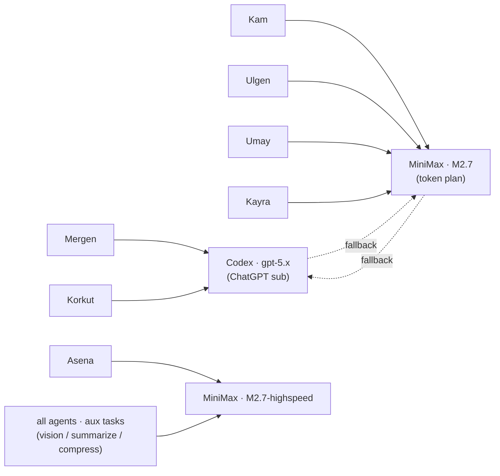

# Model Providers

[← All docs](../README.md)

---



## 5. Model providers per agent

Six agents, three providers. Codex OAuth for the conversational agents (`research`, `concierge`'s text generation, `writer`), Anthropic API key for the coders (`coder`), MiniMax API key for the workhorses where MiniMax-M2.7 is competitive at lower cost (`concierge` reasoning, `ops`). One cheap auxiliary model across all seven for vision and summarization to keep token costs in check.

### 5.1 Per-agent model assignment

| Agent | Main model | Provider | Why |
|---|---|---|---|
| `research` | `gpt-5.3` (Codex) | `openai-codex` | Long-context reasoning, web research depth, citation discipline |
| `concierge` | `MiniMax-M2.7` | `minimax` | Strong reasoning at lower cost than GPT-5; daily-use volume |
| `ops` | `MiniMax-M2.7-highspeed` | `minimax` | Fast, cheap, deterministic — `ops` doesn't need depth |
| `coder` | `claude-sonnet-4-6` | `anthropic` | Best coding model with full agent tool support |
| `writer` | `gpt-5.3` (Codex) | `openai-codex` | Voice, editorial nuance, long-form drafting |
| *(spare)* | TBD | TBD | Pick when role is decided |

For all seven, the **auxiliary model** (vision, web summarization, context compression, session search) is `google/gemini-2.5-flash` via OpenRouter. Reasoning on this is in 5.6 below — short version: aux tasks fire often, are short, and don't need the main model's depth, so routing them to the cheapest fast model saves real money.

### 5.2 Codex OAuth setup — the two paths

Codex uses OAuth against your ChatGPT account. No API billing — your existing ChatGPT subscription pays for it. The token gets saved to `~/.hermes-<name>/auth.json` per agent and persists across container restarts via the bind mount.

The friction is bootstrapping the OAuth for three separate containers (`research`, `concierge`'s text gen if you want it on Codex, and `writer`). Two paths.

#### Path A — Import existing Codex credentials (recommended if you already use ChatGPT Desktop or Codex CLI)

If you have the Codex CLI installed on your Mac or are signed into ChatGPT Desktop, your credentials live at `~/.codex/auth.json`. Hermes auto-imports these on first container startup.

For each Codex-using agent, copy the host's Codex auth file into the agent's data directory **before** first container start:

```bash
# On the M4 Mini, for research agent
mkdir -p ~/.hermes-research
cp ~/.codex/auth.json ~/.hermes-research/auth.json
chmod 600 ~/.hermes-research/auth.json
```

Repeat for the MacBook's `writer` agent. The credentials are now scoped to each agent's data directory; refresh works automatically.

Update each agent's `config.yaml`:

```yaml
model:
  provider: openai-codex
  default: gpt-5.3
```

That's it. Container starts, Hermes finds `/opt/data/auth.json`, uses it.

#### Path B — Fresh OAuth inside each container (if you don't have Codex credentials yet)

For each Codex-using agent, run the setup wizard interactively before background mode:

```bash
docker run -it --rm \
  -v ~/.hermes-research:/opt/data \
  nousresearch/hermes-agent setup
```

When the wizard reaches the model step, pick **"OpenAI Codex"**. The container prints a URL and a device code. Open the URL on your Mac, paste the code, approve in browser. Hermes writes the token to `/opt/data/auth.json` (= `~/.hermes-research/auth.json` on the host).

Repeat for each Codex-using agent. Three separate device-code flows. Annoying but one-time.

#### Refresh and credential expiry

Codex OAuth tokens refresh automatically — Hermes deduplicates concurrent refreshes and writes atomically. If you ever see `invalid_grant` errors in agent logs, that means the refresh token itself was revoked (likely a password change or remote signout on the ChatGPT side). Fix: redo Path A or B for that agent.

#### One Codex account, three agents

Important: all three Codex-using agents share the same underlying ChatGPT account quota. ChatGPT Plus ($20/mo) and Pro ($200/mo) have different daily message caps. Three active agents hammering at Codex simultaneously can chew through Plus's daily limit. If you find yourself rate-limited, options are: switch some agents to a different provider, queue heavy tasks via cron, or upgrade to Pro.

### 5.3 Anthropic API key setup for `coder`

Simplest of the three. Get an API key at console.anthropic.com → Settings → API Keys.

Add to `coder`'s `.env`:

```bash
echo "ANTHROPIC_API_KEY=sk-ant-..." >> ~/.hermes-coder/.env
```

In `~/.hermes-coder/config.yaml`:

```yaml
model:
  provider: anthropic
  default: claude-sonnet-4-6
```

That's it. No OAuth, no device codes. The API key is pay-per-token via your Anthropic console — track usage at console.anthropic.com.

#### Sonnet vs Opus

Default is Sonnet 4.6 — fast, capable, ~70% the cost of Opus for most coding work. Switch to Opus for hard refactors or architecture work via `/model claude-opus-4-6` inside a session. The model lives in the same provider, so no separate setup needed.

#### Why not Codex for coding too?

Codex is genuinely good at code generation, but Claude has stronger agent-tool discipline — better at calling tools correctly, handling multi-step refactors, and staying focused across long sessions. For an agent that needs to run terminal commands, edit files, and verify its own work, Claude's edge matters. Spend the API tokens for the agent that needs them most.

#### If you decide later to switch to Claude Max + credits

The path exists: `hermes model` → Anthropic OAuth, requires Claude Max ($100/mo) plus separately purchased "extra usage" credits (not Pro). Worth considering if your Anthropic API bill exceeds $100/mo. For now, API key is the right call.

### 5.4 MiniMax API key setup for `concierge` and `ops`

Get an API key at platform.minimax.io. Two regional endpoints exist:

- **Global** (`minimax`, `api.minimax.io`) — what to use unless you're in mainland China.
- **China** (`minimax-cn`, `api.minimaxi.com`) — alternative for China-region accounts.

Add to each MiniMax-using agent's `.env`:

```bash
echo "MINIMAX_API_KEY=mn_..." >> ~/.hermes-concierge/.env
echo "MINIMAX_API_KEY=mn_..." >> ~/.hermes-ops/.env
```

You can use the same API key across both agents — MiniMax bills per token, no per-key restrictions.

In `~/.hermes-concierge/config.yaml`:

```yaml
model:
  provider: minimax
  default: MiniMax-M2.7
```

In `~/.hermes-ops/config.yaml`:

```yaml
model:
  provider: minimax
  default: MiniMax-M2.7-highspeed
```

`-highspeed` is MiniMax's faster, cheaper variant — ideal for `ops` where you want quick deterministic responses, not deep reasoning.

#### Why not MiniMax OAuth?

MiniMax also offers a browser-OAuth path (`minimax-oauth`) with a free tier — same model, no API billing. The trade-off is per-container OAuth complexity (same as Codex) and a more limited rate cap on the free tier. For two persistent gateway agents (`concierge` runs cron jobs, `ops` runs monitoring), an API key is more reliable than OAuth tokens that can rate-limit during heavy use.

If cost becomes a concern, flip to `minimax-oauth` — change `provider: minimax` to `provider: minimax-oauth` in the config and run the OAuth flow inside the container.

### 5.5 OpenRouter for auxiliary tasks (one key, all seven agents)

Auxiliary tasks fire constantly: every time an agent uses vision, summarizes a web page, generates a session title, or compresses old context. Hermes defaults these to the main chat model unless you override. For agents on expensive main models (Claude Opus, GPT-5), this adds up fast.

The fix: route aux tasks to a cheap fast model via OpenRouter. Gemini Flash 2.5 at ~$0.075/M input tokens is roughly **100x cheaper** than Claude Sonnet for the same call. Same key works for all seven agents.

Get an OpenRouter key at openrouter.ai → Keys. Add $5–10 of credit; for personal multi-agent use this lasts months.

Add the key to **every** agent's `.env` (Mini and MacBook):

```bash
for agent in research concierge ops; do
  echo "OPENROUTER_API_KEY=sk-or-..." >> ~/.hermes-${agent}/.env
done

# On the MacBook
for agent in coder writer; do
  echo "OPENROUTER_API_KEY=sk-or-..." >> ~/.hermes-${agent}/.env
done
```

Then in **every** agent's `config.yaml`, override auxiliary tasks:

```yaml
auxiliary:
  vision:
    provider: openrouter
    model: google/gemini-2.5-flash
  web_extract:
    provider: openrouter
    model: google/gemini-2.5-flash
  session_search:
    provider: openrouter
    model: google/gemini-2.5-flash
  compression:
    provider: openrouter
    model: google/gemini-2.5-flash
  approval:
    provider: openrouter
    model: google/gemini-2.5-flash
```

That's the entire override. Main chat stays on Codex/Claude/MiniMax; everything else routes through cheap Gemini Flash.

#### Why Gemini Flash, not something else?

- **Cost** — among the cheapest models with usable agent-tool reliability.
- **Speed** — sub-second latency on aux tasks keeps the agent feeling responsive.
- **Multimodal** — handles vision for image analysis, where many cheap models can't.
- **Generous OpenRouter rate limits** — won't bottleneck seven agents calling concurrently.
- **Doesn't add a new account** — you already need OpenRouter for fallback (5.7), so this is a free addition.

Alternative if you want to use MiniMax-highspeed for aux (one fewer provider): change every `provider: openrouter` / `model: google/gemini-2.5-flash` pair above to `provider: minimax` / `model: MiniMax-M2.7-highspeed`. Same key as `concierge`/`ops`. Slightly more expensive than Gemini Flash but consolidates providers. Either works.

### 5.6 Cost ballpark (per month, personal use)

Rough sketch assuming moderate daily use of all seven agents. Real numbers will vary.

| Agent | Main provider | Estimate |
|---|---|---|
| `research` | Codex (ChatGPT Plus) | $0 — included in subscription |
| `concierge` | MiniMax API | $2–8/mo at moderate daily use |
| `ops` | MiniMax API (highspeed) | $1–3/mo |
| `coder` | Anthropic API (Sonnet) | $5–30/mo depending on active dev hours |
| `writer` | Codex (ChatGPT Plus) | $0 — included |
| *Auxiliary (all seven)* | OpenRouter (Gemini Flash) | $1–4/mo |
| **Total** | | **~$9–45/mo** plus your existing ChatGPT Plus ($20) |

The variability is mostly `coder` — heavy refactoring days can spike. If you find Anthropic API bills regularly above $50/mo, that's the signal to consider Claude Max + credits.

If you don't have ChatGPT Plus and don't want to pay $20/mo for it, replace Codex with OpenAI API key (provider: `openai`, set `OPENAI_API_KEY`) — pay-per-token via openai.com. Estimate $5–15/mo for `research` + `writer` combined at moderate use.

### 5.7 Fallback chains per agent

Hermes supports a fallback provider chain — if the main model fails (rate limit, server error, auth failure), it tries the next entry without losing the conversation. Configure once, gain resilience.

Pattern per agent — pick a fallback that's a different provider so a single-provider outage doesn't take everything down.

`research` (`config.yaml`):
```yaml
fallback_providers:
  - provider: openrouter
    model: openai/gpt-5
  - provider: openrouter
    model: anthropic/claude-sonnet-4-6
```

`writer` (`config.yaml`):
```yaml
fallback_providers:
  - provider: openrouter
    model: openai/gpt-5
  - provider: openrouter
    model: google/gemini-2.5-pro
```

`coder` (`config.yaml`):
```yaml
fallback_providers:
  - provider: openrouter
    model: anthropic/claude-sonnet-4-6
  - provider: openrouter
    model: openai/gpt-5
```

`concierge` (`config.yaml`):
```yaml
fallback_providers:
  - provider: openrouter
    model: minimaxai/minimax-m2.7
  - provider: openrouter
    model: google/gemini-2.5-flash
```

`ops` (`config.yaml`):
```yaml
fallback_providers:
  - provider: openrouter
    model: google/gemini-2.5-flash
```

The OpenRouter key you set up in 5.5 covers all of these — no extra credentials.

#### What a fallback actually does

If `coder`'s primary Anthropic call returns 503 or hits a rate limit, Hermes immediately retries the same request against `openrouter` with Claude Sonnet (a separate provider that proxies to Anthropic with its own routing pool). If that also fails, it falls to OpenAI GPT-5 via OpenRouter. The session continues without the user knowing anything happened. This is one of the most underrated features of Hermes — your agents don't break when one provider has a bad day.

### 5.8 Putting it together: per-agent `.env` summary

For reference when wiring up each agent.

`~/.hermes-research/.env`:
```bash
TELEGRAM_BOT_TOKEN=...
TELEGRAM_ALLOWED_USERS=...
OPENROUTER_API_KEY=sk-or-...        # aux + fallback
# Codex credentials in auth.json (not .env)
```

`~/.hermes-concierge/.env`:
```bash
TELEGRAM_BOT_TOKEN=...
TELEGRAM_ALLOWED_USERS=...
MINIMAX_API_KEY=mn_...
OPENROUTER_API_KEY=sk-or-...
```

`~/.hermes-ops/.env`:
```bash
TELEGRAM_BOT_TOKEN=...
TELEGRAM_ALLOWED_USERS=...
MINIMAX_API_KEY=mn_...
OPENROUTER_API_KEY=sk-or-...
```

`~/.hermes-coder/.env`:
```bash
TELEGRAM_BOT_TOKEN=...
TELEGRAM_ALLOWED_USERS=...
ANTHROPIC_API_KEY=sk-ant-...
OPENROUTER_API_KEY=sk-or-...
```

`~/.hermes-writer/.env`:
```bash
TELEGRAM_BOT_TOKEN=...
TELEGRAM_ALLOWED_USERS=...
OPENROUTER_API_KEY=sk-or-...
# Codex credentials in auth.json
```

`chmod 600` on every `.env` after writing. Bearer credentials, treat them like passwords.

### 5.9 Verification

Before starting an agent, sanity-check each provider is reachable. From the host:

```bash
# OpenRouter (works for all aux + fallback)
curl -s https://openrouter.ai/api/v1/models \
  -H "Authorization: Bearer $OPENROUTER_API_KEY" | jq '.data | length'
# Expect a number > 200

# Anthropic API
curl -s https://api.anthropic.com/v1/messages \
  -H "x-api-key: $ANTHROPIC_API_KEY" \
  -H "anthropic-version: 2023-06-01" \
  -H "content-type: application/json" \
  -d '{"model":"claude-haiku-4-5","max_tokens":10,"messages":[{"role":"user","content":"hi"}]}'
# Expect a JSON response with "content"

# MiniMax
curl -s https://api.minimax.io/v1/text/chatcompletion_v2 \
  -H "Authorization: Bearer $MINIMAX_API_KEY" \
  -H "Content-Type: application/json" \
  -d '{"model":"MiniMax-M2.7-highspeed","messages":[{"role":"user","content":"hi"}],"max_tokens":10}'
# Expect a JSON response with "choices"
```

Codex is harder to verify outside a Hermes container because the auth flow is bound to Hermes's credential store. The verification happens on first agent startup — if Codex auth is broken, the container will fail loudly with "invalid_grant" or "auth required" in logs.

### 5.10 Changing providers later

Every agent's `config.yaml` is the source of truth. Switch a provider at any time:

```bash
# Edit the file
nano ~/.hermes-research/config.yaml
# Change model.provider and model.default

# Restart that agent
docker compose restart hermes-research
```

The agent picks up the new provider on next session. Conversation history, memory, skills all survive — those are provider-agnostic.

Use `/model <new-model>` inside an active chat session to switch *temporarily* without editing the file. Persistent changes need the config edit.

---
