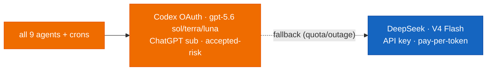

# Model Providers

[← All docs](../README.md)

---

## ⚡ LIVE since 2026-07-12 — fleet on GPT-5.6 (Sol/Terra/Luna), policy override

**Fleet migrated to the GPT-5.6 family on 2026-07-12** (released 2026-07-09; the old flat `gpt-5.5` default is retired). GPT-5.6 splits into three capability tiers — **Sol** (flagship, deepest reasoning), **Terra** (mid, ≈5.5 quality at ~half the API price), **Luna** (fast/light) — and the fleet maps its existing effort tiers onto them: `gpt-5.6-sol` for coder/researcher/writer, `gpt-5.6-terra` for general/assistant/finance/health, `gpt-5.6-luna` for marketing/producer. The `-pro` variants are **not** available through Codex ChatGPT OAuth (HTTP 400), only the base three. The underlying patron decision of 2026-07-05 stands: **all 9 agents AND cron jobs run Codex OAuth as primary, `deepseek-v4-flash` as fallback**, deliberately overriding §5.0's rule ("no automated cron on Codex") — quality > risk, accepted with eyes open. §5.0 remains below as the risk analysis that was overridden, not as current policy.



- **Reasoning efforts tiered** (`agent.reasoning_effort`): `xhigh` coder/researcher/writer · `medium` general/assistant/finance/health · `low` marketing/producer. (Docs previously listed finance/health as `low`; live configs have been `medium` — synced 2026-07-12.)
- **Codex OAuth is centralized** in the root `~/.hermes/auth.json` — hermes's global-store fallback (`_global_auth_file_path`) serves all profiles, and token refreshes write back to the root store (`_save_provider_state_to_source`), so ONE credential serves the fleet with no per-profile drift. Per-profile `auth.json` must stay free of `openai-codex` entries (local shadows root).
- **Root re-auth recipe** (the naive `HERMES_HOME=~/.hermes hermes auth add` gets redirected to the sticky active profile — issue #22502): `echo default > ~/.hermes/active_profile` → `HERMES_HOME=~/.hermes hermes auth add openai-codex --type oauth` → `echo researcher > ~/.hermes/active_profile`. Never remove pool credentials by display label (labels regenerate by index) — use the raw entry id and verify `last_refresh`.
- **Watch items:** shared 5h/weekly quota window across 9 agents (fallback engages silently — check `billing_provider` in `hermes sessions stats`); open bug [#47781](https://github.com/NousResearch/hermes-agent/issues/47781) (cron fallback may send primary model name); token rotation (persistent fallback on one profile → strip its local codex entries, re-auth root).
- **Rollback:** the fleet config surface is a git repo at `~/.hermes` — `git revert 63e7f60` + gateway kickstart returns to DeepSeek-primary in one move.

## 5. Model providers per agent

The credentials actually on hand: a **DeepSeek platform API key** (primary), **Codex** (ChatGPT sub), **OpenRouter**, and a dormant **MiniMax** key. Not every subscription is *safe* to wire into a third-party agent like Hermes — "works technically" and "won't get your account flagged" are different questions. The stack:

- **Codex GPT-5.6 (sol/terra/luna) = primary, fleet-wide** (all 9 agents + crons; Codex-primary since 2026-07-05, 5.6 tiers since 2026-07-12 — see the LIVE banner above; §5.0's caution stands as the analysis that was overridden).
- **DeepSeek V4 Flash = the fallback** on every profile. Direct API key, pay-per-token, zero ToS risk.
- **OpenRouter API key** for cheap aux + cross-provider fallback. Safe.
- **MiniMax** — spare API key kept in the `.env`s as an extra fallback option (5.2).
- **Claude** via a plain Anthropic API key *only if you want it* — not the Claude Code subscription.
- **Gemini Antigravity = not usable.** Read 5.0.

### 5.0 Provider safety & ToS — read first

The distinction that governs everything below: **an API key (you pay per token) is always safe. A consumer *subscription* OAuth token piped into a third-party agent is a gray area — and in one case, a banned one.**

| Subscription | Hermes provider | Works? | Safe? |
|---|---|---|---|
| **DeepSeek** (fallback) | `deepseek` (API key) | ✅ | ✅ **Safe** — plain platform API key, pay-per-token |
| **MiniMax** (spare) | `minimax` (API key) / `minimax-oauth` | ✅ | ✅ **Safe** — built for programmatic use |
| **Codex** (ChatGPT) — **current primary** | `openai-codex` (OAuth) | ✅ | ⚠️ **Against consumer ToS** — sub-OAuth in a non-OpenAI app; *unenforced today*, but Anthropic + Google killed the equivalent Apr 2026 |
| **Claude Code** | `anthropic` (OAuth, reads Claude Code's cred store) | ✅ | ⚠️ **Gray + high-stakes** — risks the sub you code with |
| **Gemini Antigravity** | — (no API) | ❌ | 🚫 **Banned pattern** — use an AI Studio API key instead |

- **DeepSeek** — plain API key from platform.deepseek.com (`DEEPSEEK_API_KEY`), pay-per-token, zero ToS ambiguity. Fleet-wide fallback (was primary for 7 of 9 until 2026-07-05).
- **MiniMax** — API key or its own browser OAuth. Also safe; the key stays in every `.env` as a spare fallback provider.
- **Codex** — works via device-code OAuth, but it reuses your ChatGPT subscription **outside OpenAI's own clients.** Be clear-eyed: this is **against OpenAI's consumer terms** — they prohibit automated/programmatic access and "using ChatGPT to power third-party services," and OpenAI has **declined to bless** sub-OAuth in third-party apps (the feature ships in official Codex tooling only). It is *not currently enforced* at personal scale — which is exactly why the OpenClaw/OpenCode community moved **to** Codex after **Anthropic and Google clamped down on theirs in April 2026.** That also makes OpenAI the **likely next** to follow. No-warning account bans of Codex+sub users are documented though rare. **So: accepted-risk, not permitted.** Run it on the two **quality-critical** agents — `writer` (occasional, low-volume) and `coder` (higher-volume, but **interactive/human-paced** — you drive it on-demand, *not* a 24/7 cron, and automated cadence is what the flag targets). Keep **no automated cron on Codex** (the weekly scout lives on DeepSeek), isolate it, and keep the API-key escape hatch ready (5.3). **`coder`'s volume makes it the one to watch** — A/B it against DeepSeek V4 Pro first (5.12). The tail risk is your ChatGPT account.
- **Claude Code subscription** — Hermes can read Claude Code's credential store (`anthropic` OAuth), but that points your *coding* subscription at a different agent. If flagged, you risk the tool you actually develop with. **Keep Claude Code for Claude Code.** Want Claude inside Hermes? Use a separate **Anthropic API key** (pay-per-token, unambiguously fine) — see 5.4.
- **Gemini Antigravity** — **do not attempt.** Antigravity is an IDE with no API to extract auth from. The closest pattern, `google-gemini-cli` OAuth, is exactly what Google **enforced against in early 2026** — paid subscribers using Gemini-CLI-style OAuth in third-party apps lost access during the crackdown. The only safe way to use Gemini in Hermes is an **AI Studio API key** (free tier or pay-per-token) or **Gemini via OpenRouter** — both separate from your Antigravity subscription. The OpenRouter→Gemini-Flash aux route in 5.5 is safe precisely because it's an API key, not subscription OAuth.

**The rule (as originally designed):** never put gray-area subscription-OAuth on an **always-on, automated** agent that hammers it — automated cadence is the enforcement trigger (that's what the Google/Anthropic clampdowns targeted). Under that rule, crons stayed on DeepSeek and Codex carried only the two human-paced quality agents. **⚠️ Overridden 2026-07-05 by patron decision** (see the LIVE banner at top): the entire fleet including crons now rides Codex GPT-5.x (5.5 from 07-05, the 5.6 tiers from 07-12), quality over risk, with DeepSeek as the escape hatch already wired. This paragraph stays as the argument that was consciously outvoted — and as the playbook to return to (`git revert`) if OpenAI starts enforcing.

### 5.1 Per-agent model assignment (live since 2026-07-12)

All nine: **GPT-5.6 primary via `openai-codex` OAuth (⚠️ accepted-risk), `deepseek-v4-flash` fallback via `deepseek` API key (✅).** The 5.6 capability tier follows the reasoning-effort tier:

| Slug | Bot | Main model | Effort | Fallback | Why this tier |
|---|---|---|---|---|---|
| `coder` | Naz | `gpt-5.6-sol` | `xhigh` | `deepseek-v4-flash` | Code quality ceiling; **heaviest agent → first to feel the shared quota window** |
| `researcher` | Doruk | `gpt-5.6-sol` | `xhigh` | `deepseek-v4-flash` | Deep multi-source research + weekly scout cron |
| `writer` | Ozan | `gpt-5.6-sol` | `xhigh` | `deepseek-v4-flash` | Voice, long-form drafting |
| `general` | Derya | `gpt-5.6-terra` | `medium` | `deepseek-v4-flash` | Highest-volume daily driver — Terra ≈ 5.5 quality, lighter on the window |
| `assistant` | Tuna | `gpt-5.6-terra` | `medium` | `deepseek-v4-flash` | Daily logistics |
| `finance` | Murat | `gpt-5.6-terra` | `medium` | `deepseek-v4-flash` | Personal markets analyst (personal tier, docs/02 §2.2) |
| `health` | Defne | `gpt-5.6-terra` | `medium` | `deepseek-v4-flash` | Fitness/nutrition coach (personal tier) |
| `marketing` | Nilay | `gpt-5.6-luna` | `low` | `deepseek-v4-flash` | Frequent light tasks — Luna built for fast high-volume work |
| `producer` | Sarp | `gpt-5.6-luna` | `low` | `deepseek-v4-flash` | Idea scoring — light reasoning |

For all nine, the **vision auxiliary** rides the same Codex model as the profile's primary (`auxiliary.vision.model` = the profile's 5.6 tier) with `google/gemini-2.5-flash` via OpenRouter as its fallback chain; the other aux calls (web summarization, context compression, session search) stay on the cheap OpenRouter Gemini route (5.5).

Why Codex lands on `coder` + `writer`: those are the two **quality-critical creative** agents — gpt-5.x is strong at code and long-form prose, and that's where you most want the frontier model. The safety guard is that **neither runs as an automated cron**: `writer` is occasional, `coder` is interactive (you drive it at the keyboard). The one cron — `researcher`'s weekly scout — lives on **DeepSeek**, so no *automated* volume ever hits Codex. The honest caveat: `coder` is the **heaviest** agent, so it's the real ToS/quota exposure here — watch the shared ChatGPT quota (it's shared with `writer`), and A/B `coder` against **DeepSeek V4 Pro** (the strongest clean coder — 5.12). If gpt-5.4 isn't clearly better for GDScript, move `coder` there (`/model` per session, or the config) — zero ToS risk.

### 5.2 DeepSeek setup — the fleet-wide fallback (was primary until 2026-07-05)

Get an API key at platform.deepseek.com. One key serves the whole fleet — `setup-bots.sh` fans `DEEPSEEK_API_KEY` from `bot-tokens.env` into every profile's `.env`:

```bash
for agent in general researcher assistant marketing producer finance health; do
  echo "DEEPSEEK_API_KEY=sk-..." >> ~/.hermes/profiles/${agent}/.env
done
```

`config.yaml` — all seven use **V4 Flash**:

```yaml
model:
  provider: deepseek
  default: deepseek-v4-flash
```

**Why V4 Flash:** true pay-per-token (~$0.14 in / $0.28 out per M) — no rolling request quota to share, no flat sub to outgrow, and cheap enough that the whole conversational fleet runs for a few dollars a month. No multimodal — vision rides the OpenRouter aux route (5.5). **V4 Pro** (~$1.74/$3.48 per M) is the step-up for hard coding work — it stays documented as `coder`'s clean swap in 5.12, not as the fleet default.

**MiniMax spare.** A `MINIMAX_API_KEY` (M3, $20 Token Plan era) still sits in every `.env`. No profile points at it, but `provider: minimax` / `default: MiniMax-M3` is a one-line flip per agent if DeepSeek has an outage or a price shock. Rotate or drop the key if you'd rather not carry it (docs/09 key-rotation table).

### 5.3 Codex OAuth setup — accepted-risk (coder + writer only)

> ⚠️ **Against OpenAI's consumer ToS, accepted (5.0).** Keep it to these two agents, **human-paced** (no automated cron on Codex). `writer` is occasional; `coder` is interactive (you drive it) but **high-volume** — it's the real exposure here. Decision on record: we run it for gpt-5.x's code + prose quality, knowing it's unenforced-today, *not* permitted. If you'd rather carry zero ToS risk, put `coder`/`writer` on an API key (escape hatch below) or DeepSeek and skip the OAuth.

Codex uses OAuth against your ChatGPT account — no API billing, your subscription pays. The token saves to `~/.hermes/profiles/<slug>/auth.json` per profile and survives restarts (persisted under `~/.hermes/profiles/<slug>/`). Two ways to bootstrap.

**Path A — import existing Codex credentials** (if you use ChatGPT Desktop or the Codex CLI). Your creds live at `~/.codex/auth.json`; Hermes auto-imports on first start:

```bash
# after: hermes profile create coder
cp ~/.codex/auth.json ~/.hermes/profiles/coder/auth.json
chmod 600 ~/.hermes/profiles/coder/auth.json
# repeat for ~/.hermes/profiles/writer
```

**Path B — fresh device-code login** (if you don't have Codex creds yet):

```bash
hermes -p coder setup
# at the model step pick "OpenAI Codex"; open the printed URL, paste the code, approve
```

Either way, `config.yaml`:

```yaml
model:
  provider: openai-codex
  default: gpt-5.4
```

**Shared quota — watch this.** Both Codex agents draw on the **same ChatGPT account cap** (Plus vs Pro differ). `writer` is light, but **`coder` is your heaviest agent** — a long coding day can strain the shared cap and starve `writer`, or hit the ChatGPT limit. If that bites, fall `coder` back to DeepSeek (`/model deepseek-v4-flash` per session, or V4 Pro for quality — 5.12). `invalid_grant` in logs = the refresh token was revoked (password change / remote signout); redo Path A or B.

**Escape hatch — keep an OpenAI API key ready.** Codex-via-sub is the *last* of the big-three sub-OAuth paths still working (Anthropic + Google enforced theirs in April 2026); OpenAI is the likely next. Treat it as **temporary.** The clean swap is **one line per agent** — drop the OAuth, point at an OpenAI API key:

```yaml
# ~/.hermes/profiles/coder/config.yaml — the day Codex-OAuth stops or the risk isn't worth it
model:
  provider: openai          # API key (platform.openai.com), NOT openai-codex OAuth
  default: gpt-5.4
```

Add `OPENAI_API_KEY=sk-...` to that agent's `.env`. Same GPT-5.x models, pay-per-token, **zero ToS risk**. `writer` is cheap (occasional); `coder` is heavier, so an API key there costs real per-token money on active dev days — which is the trade-off vs the $0 sub. Keep a key on hand so a clampdown is a config flip, not an outage. (Clean swaps: for `coder` — **DeepSeek V4 Pro** (strongest clean coding, 5.12); for `writer` — **Gemini 3.1 Pro** or DeepSeek.)

### 5.4 Anthropic — optional, API key only (never the Claude Code sub)

Not in the default stack. Add it only if you specifically want Claude for an agent (most likely `coder` on a hard refactor day). **Use an API key, not your Claude Code subscription** (5.0).

```bash
echo "ANTHROPIC_API_KEY=sk-ant-..." >> ~/.hermes/profiles/coder/.env
```

```yaml
model:
  provider: anthropic
  default: claude-sonnet-4-6
```

Pay-per-token via console.anthropic.com. Switch to Opus for hard work with `/model claude-opus-4-6` in-session (same provider). **Do not** use `hermes model → Anthropic OAuth` with your Claude Code/Max login — that's the gray-area path that risks your coding subscription.

### 5.5 OpenRouter for auxiliary tasks (one key, all nine agents)

Aux tasks fire constantly — vision, page summaries, session titles, context compression. Hermes defaults them to the main chat model unless overridden. Routing them to a cheap fast model via OpenRouter saves real money, and — importantly — it's an **API key**, so this is the *safe* way to use Gemini (not the banned subscription-OAuth route from 5.0).

Get a key at openrouter.ai → Keys, add $5–10 of credit (lasts months). Add it to **every** agent's `.env`:

```bash
for agent in general researcher assistant marketing coder writer producer finance health; do
  echo "OPENROUTER_API_KEY=sk-or-..." >> ~/.hermes/profiles/${agent}/.env
done
```

Then in **every** `config.yaml`:

```yaml
auxiliary:
  vision:
    provider: openrouter
    model: google/gemini-2.5-flash
  web_extract:
    provider: openrouter
    model: google/gemini-2.5-flash
  session_search:
    provider: openrouter
    model: google/gemini-2.5-flash
  compression:
    provider: openrouter
    model: google/gemini-2.5-flash
  approval:
    provider: openrouter
    model: google/gemini-2.5-flash
```

Main chat stays on DeepSeek/Codex; everything else routes through cheap Gemini Flash. Gemini Flash wins here on cost, sub-second latency, multimodal vision, and generous OpenRouter rate limits.

**Why not put aux on DeepSeek to save a provider?** Two reasons: V4 Flash has **no vision** (aux vision needs a multimodal model), and keeping aux on a *different* provider means an aux outage and a chat outage can't share a cause. OpenRouter's Gemini Flash is cheap, fast, multimodal, and keeps the chains cross-provider.

### 5.6 Cost ballpark (per month, personal use)

One subscription you already pay for, plus pay-per-token that rounds to coffee money.

| Line | Provider | Cost |
|---|---|---|
| DeepSeek agents (Derya, Doruk, Tuna, Nilay, Sarp, Murat, Defne) | DeepSeek V4 Flash (pay-per-token) | **~$2–8/mo** at solo volume |
| Codex agents (Naz, Ozan) | ChatGPT sub | **$0 extra** — included; but `coder` (Naz) is heavy → watch the ChatGPT cap |
| Aux (all nine) + overflow/fallback | OpenRouter · Gemini Flash (pay-per-token) | **~$1–5/mo** |
| Honcho memory workers | OpenRouter · deepseek-v4-flash | **~$2–5/mo** (docs/07) |
| **Total new spend** | | **~$5–18/mo** on top of the ChatGPT sub you already have |

Pay-per-token means the bill tracks usage — watch the DeepSeek dashboard the first month; a runaway cron or a huge-context habit shows up as dollars, not as a quota wall. Claude stays opt-in (5.4).

### 5.7 Fallback chains per agent

Hermes retries a failed primary (rate limit, 5xx, auth) against the next provider in the chain without losing the conversation.

Live config — same shape on all nine profiles (Codex-primary since 2026-07-05, DeepSeek fallback; `DEEPSEEK_API_KEY` is in every `.env`). `default` is the profile's 5.6 tier — `gpt-5.6-sol` / `-terra` / `-luna` per the 5.1 table:
```yaml
model:
  provider: openai-codex
  default: gpt-5.6-sol   # or gpt-5.6-terra / gpt-5.6-luna per profile
fallback_providers:
  - provider: deepseek
    model: deepseek-v4-flash
```

So a Codex 503/rate-limit/**quota-window exhaustion** silently continues on DeepSeek — the fleet degrades to Flash instead of stalling. This is now cross-provider by construction (sub-OAuth primary, API-key fallback), so a Codex outage can't take an agent down. Residual gap: if **DeepSeek** is also down there's no third entry — the hedge to add if that ever bites is an OpenRouter entry (`provider: openrouter`, `model: google/gemini-2.5-flash`) after the DeepSeek one; the key is already in every `.env` (5.5). The spare MiniMax key is a fourth option (5.2). ⚠️ Known bug for **cron** runs: [#47781](https://github.com/NousResearch/hermes-agent/issues/47781) — the cron fallback path may send the primary's model name to the fallback provider.

### 5.8 Putting it together: per-agent `.env` summary

`TELEGRAM_BOT_TOKEN` + `TELEGRAM_ALLOWED_USERS` are written by `setup-bots.sh` (see [Telegram Bots](03-telegram-bots.md)); the model keys below you add yourself.

`~/.hermes/profiles/general/.env` (Derya) — same shape for `researcher`, `assistant`, `marketing`, `producer`, `finance`, `health`:
```bash
TELEGRAM_BOT_TOKEN=...
TELEGRAM_ALLOWED_USERS=...
DEEPSEEK_API_KEY=sk-...       # fallback
OPENROUTER_API_KEY=sk-or-...  # aux
MINIMAX_API_KEY=...           # dormant spare (5.2)
TINYFISH_API_KEY=...          # REST-only; MCP uses OAuth (docs/08)
SEARXNG_URL=http://127.0.0.1:8888
```

`~/.hermes/profiles/coder/.env` (Naz) and `~/.hermes/profiles/writer/.env` (Ozan) — **Codex-primary**:
```bash
TELEGRAM_BOT_TOKEN=...
TELEGRAM_ALLOWED_USERS=...
DEEPSEEK_API_KEY=sk-...       # fallback chain
OPENROUTER_API_KEY=sk-or-...
# Codex credentials live in auth.json, not .env
# ANTHROPIC_API_KEY=sk-ant-...   # optional, only if you want Claude (5.4)
```

`chmod 600` on every `.env`. Bearer credentials — treat them like passwords. (`setup-bots.sh` already chmods the ones it writes.)

### 5.9 Verification

Sanity-check each provider from the host before starting agents:

```bash
# OpenRouter (covers aux + all fallbacks)
curl -s https://openrouter.ai/api/v1/models \
  -H "Authorization: Bearer $OPENROUTER_API_KEY" | jq '.data | length'
# Expect a number > 300

# DeepSeek
curl -s https://api.deepseek.com/chat/completions \
  -H "Authorization: Bearer $DEEPSEEK_API_KEY" \
  -H "Content-Type: application/json" \
  -d '{"model":"deepseek-v4-flash","messages":[{"role":"user","content":"hi"}],"max_tokens":10}'
# Expect JSON with "choices"

# Anthropic — only if you opted into 5.4
curl -s https://api.anthropic.com/v1/messages \
  -H "x-api-key: $ANTHROPIC_API_KEY" \
  -H "anthropic-version: 2023-06-01" -H "content-type: application/json" \
  -d '{"model":"claude-haiku-4-5","max_tokens":10,"messages":[{"role":"user","content":"hi"}]}'
# Expect JSON with "content"
```

Codex can't be verified outside Hermes — its auth is bound to Hermes's credential store. It fails loudly on first startup (`invalid_grant` / `auth required` in logs) if broken.

### 5.10 Changing providers later

Each agent's `config.yaml` is the source of truth:

```bash
nano ~/.hermes/profiles/general/config.yaml   # change model.provider / model.default
launchctl kickstart -k gui/$(id -u)/ai.hermes.gateway-general
```

History, memory, and skills are provider-agnostic and survive the switch. Use `/model <name>` inside a session to switch *temporarily* without editing the file; persistent changes need the config edit + restart.

### 5.11 Future — expanding via OpenRouter (Nemotron, DeepSeek V4, …)

OpenRouter is already wired for aux + fallback, so adding more models is a **one-line config change, no new account**. When you want to experiment — NVIDIA Nemotron, DeepSeek V4, Qwen, GLM, etc. — just point an agent or an aux task at the OpenRouter slug:

```yaml
model:
  provider: openrouter
  default: deepseek/deepseek-v4        # example — use the exact slug from openrouter.ai/models
```

Good candidates to try as they mature:
- **DeepSeek V4 Pro** — the strongest raw coder in this class (SWE-bench Verified 80.5); the step-up from the fleet's V4 Flash default and `coder`'s clean swap: see **5.12**. (Direct `provider: deepseek` also works — no OpenRouter needed.)
- **NVIDIA Nemotron** — strong open models; worth testing on `coder`.
- **Qwen / GLM / Kimi** — also first-class on OpenRouter (and Hermes has native `qwen-oauth`, `zai`, `kimi-coding` providers if you prefer direct).

Workflow: try a candidate with `/model openrouter/<slug>` in a live session, judge it on your actual tasks, and only persist to `config.yaml` if it clearly beats the incumbent. **Keep the current default until something demonstrably wins** — novelty isn't a reason to switch a working agent. All OpenRouter usage is API-key billing, so it's always on the safe side of 5.0.

### 5.12 Off by default — DeepSeek V4 Pro as the clean `coder` swap

> **Not enabled now.** `coder` runs on Codex (5.1). This documents the **de-risk path** for the one agent where the Codex ToS exposure actually bites (5.0) — `coder` is your heaviest agent and it's on the gray-area sub.

**DeepSeek V4 Pro** is the compelling clean alternative for `coder`:
- **Stronger raw coding** than arguably gpt-5.4 (SWE-bench Verified 80.5; top open-weight Codeforces / LiveCodeBench).
- **Clean API key** — MIT open weights, pay-per-token, **zero ToS risk** (unlike Codex). Your ChatGPT account is off the line — and it's the same `DEEPSEEK_API_KEY` the rest of the fleet already uses.
- Cost ~$1.74/$3.48 per M — real money on active dev days, but cheaper than Claude Opus.

```yaml
# ~/.hermes/profiles/coder/config.yaml — the clean strong-coder swap (when you want off Codex)
model:
  provider: deepseek
  default: deepseek-v4-pro               # direct key already in .env; openrouter slug also works
fallback_providers:
  - provider: deepseek
    model: deepseek-v4-flash
```
The DeepSeek key is already in every `.env` (5.2), so flipping it on is a config edit + restart — nothing new to provision.

**The three-way for `coder`** — A/B on real GDScript, let the work decide:

| Option | Coding | ToS | Cost |
|---|---|---|---|
| **gpt-5.6-sol (Codex)** — *current default* | ★ strong | ⚠️ gray-area | $0 (sub, shared quota window) |
| DeepSeek V4 Flash — *fleet fallback* | good | ✅ safe | ~$0.14/$0.28 per M |
| **DeepSeek V4 Pro** | ★ strongest | ✅ safe | ~$1.74/$3.48 per M |

**Flip it on when:** the Codex tail-risk on `coder` starts to bother you, *or* OpenAI clamps down (5.3), *or* you want stronger pure coding than gpt-5.x. Until then, leave `coder` on Codex.

---
