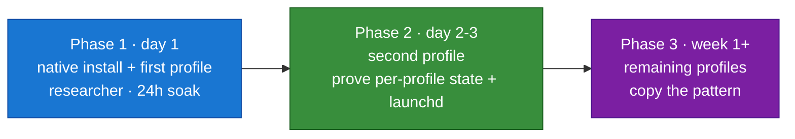

# Deployment — Dirs, Profiles, Phases, Toolsets, Supervision

[← All docs](../README.md)

---



Everything runs **native** on one Mac Mini M4 — one Hermes install, one profile per agent under `~/.hermes/`. No agent runs in a container. Docker is used **only** for Honcho and SearXNG (Section 7).

## 3. Directory, profile, and port conventions

A single install keeps all profiles under `~/.hermes/`. Each agent is a profile; its slug is the profile name.

```
~/.hermes/                 ← default profile (unused by the fleet)
├── kanban.db              ← shared board (created only if/when kanban is enabled — Section 17)
└── profiles/
    ├── researcher/    ← Doruk
    ├── general/       ← Derya
    ├── assistant/     ← Tuna
    ├── marketing/     ← Nilay
    ├── coder/         ← Naz
    ├── writer/        ← Ozan
    ├── producer/      ← Sarp
    ├── finance/       ← Murat
    └── health/        ← Defne
```

*(Re-verified on Hermes v0.18.2 / 2026.7.7.2: named profiles live under `~/.hermes/profiles/<slug>/`; per-profile gateway logs live under that profile. `profile create` also drops a wrapper at `~/.local/bin/<slug>`.)*

Each profile directory holds the full state for that agent:

| Path | Contents |
|---|---|
| `config.yaml` | Hermes configuration plus ID-based `op://` secret references |
| `.op.env` | Optional `0600` 1Password bootstrap token only; no service credentials |
| `auth.json`, `mcp-tokens/` | Writable OAuth state only; mode `0600` |
| `SOUL.md` | Agent personality and instructions |
| `sessions/` | Conversation history |
| `memories/` | Persistent memory store (USER.md, MEMORY.md) |
| `skills/` | Agent-created and bundled skills |
| `cron/` | Scheduled job definitions |

**Ports.** Each gateway reaches Telegram **outbound** (long-poll), so it needs **no inbound port** to function. A host port is required only if you turn on a per-profile feature that listens:

- the **HTTP API server** (`api_server`) — not needed for Telegram or for agent-to-agent, which is local now ([Section 17](12-agent-comms.md)); enable only for the dashboard or external HTTP clients
- the **dashboard** — one port per profile if you enable it (`9119+`)

If you do expose any port, bind it to the Tailscale interface only and key it — see [Section 8](06-networking.md). Most profiles expose nothing.

---

## 6. Deployment plan — phased

Do not stand up all agents at once. Build in three phases so problems get isolated as they arise.

**Prerequisites:** Section 4 done (bots exist, tokens stored in the correct 1Password items, your Telegram user ID known) and Section 5 done (provider credentials stored in 1Password; native OAuth completed where required). No credential is pasted into chat, clipboard, `config.yaml`, or profile `.env` files.

### Phase 1 — native install + first profile (day 1)

Pick one agent (recommend `researcher` — single platform, no project mounts) and get it fully working before touching anything else.

**Step 1.1: Install Hermes natively**

Install via the official installer / Homebrew formula (exact command in [Section 14](10-operations.md)). Confirm:

```bash
hermes --version
```

All state will live under `~/.hermes/`.

**Step 1.2: Create the profile and run setup**

```bash
hermes profile create researcher
hermes -p researcher setup        # re-verified v0.18.2: global -p/--profile flag
                                # (or use the wrapper: `researcher setup`)
```

Configure the model provider, then map only the required credentials with `hermes -p researcher secrets onepassword set …` using ID-based `op://` references. Verify with `status` and `sync` before starting the gateway ([Section 15](15-credential-management.md)).

**Step 1.3: Edit the SOUL.md**

```bash
nano ~/.hermes/profiles/researcher/SOUL.md
```

Write the personality (the full SOUL is in Section 6.7; an example early draft):

```
You are a methodical research assistant. Find primary sources, synthesize them
faithfully, and surface what you don't know. Cite every non-trivial claim with
its URL. Prefer two reliable sources over one. When evidence is mixed, say so —
do not flatten disagreement. Concise by default; expand only when asked.
```

**Step 1.4: Run the gateway**

```bash
hermes -p researcher gateway run   # foreground; re-verified v0.18.2
```

Confirm it connects and responds to a Telegram message. Once it works in the foreground, install the built-in launchd service so it survives logout/reboot: `hermes -p researcher gateway install` (Section 7).

**Step 1.5: Verify**

```bash
hermes profile list                                    # researcher is present
tail -f ~/.hermes/profiles/researcher/logs/gateway.log       # no errors at startup
```

Send the bot a message; confirm a new session file appears under `~/.hermes/profiles/researcher/sessions/`. Leave it running overnight via launchd and check it's healthy in the morning.

**Acceptance criteria for Phase 1:**
- Gateway stays up for 24+ hours (under launchd) without crashing
- A skill gets created and persists across a gateway restart
- A new session picks up context from a memory file written in an earlier session

### Phase 2 — second profile, validate coexistence (day 2–3)

Stand up `general` (Derya). The point of this phase is to prove **two profiles run side-by-side with separate state**, supervised independently.

**Step 2.1: Replicate the pattern**

```bash
hermes profile create general
hermes -p general setup          # different bot token, different SOUL.md
```

**Step 2.2: Supervise it too**

`hermes -p general gateway install` (Section 7). Both gateways now run.

**Step 2.3: Per-profile state test** *(replaces the old container marker test)*

From a chat with `researcher`, have it write a memory note. From a chat with `general`, ask it to recall that note — it **must not** have it. Built-in session/memory search never crosses profiles (`general` cannot see `researcher`'s sessions). Confirm each profile has its own `~/.hermes/profiles/<profile>/sessions/` and `memories/`.

> **Note:** This is *state* separation, not a *filesystem* sandbox. A shell-capable profile can read another profile's files on disk — all nine profiles are shell-capable by design (accepted 2026-07-19). Cross-profile *sharing* of the things that should be shared (your user model) is Honcho's job ([Section 9](07-memory.md)). Each profile's persona guardrails reduce the risk of a shell-capable profile targeting sibling state ([Section 13](09-security.md)).

**Step 2.4: Independent-lifecycle test**

`launchctl kickstart -k` the `researcher` agent (force-restart). Confirm `general` keeps running and responding throughout. launchd supervises each profile independently — one bouncing doesn't disturb the other.

**Acceptance criteria for Phase 2:**
- Both gateways run simultaneously under launchd without conflict
- Per-profile state separation confirmed (recall test)
- Independent lifecycle confirmed (restart test)
- Different bot tokens, different personalities, both reachable

### Phase 3 — remaining profiles (week 1+)

Once Phase 2 passes, the rest are mechanical. Copy the pattern, change names, SOUL.md, toolsets.

For each new agent:
1. `hermes profile create <name>`
2. `hermes -p <name> setup` (unique bot token, model, keys)
3. Write the SOUL.md
4. Prune toolsets in `config.yaml` (Section 6.6)
5. `hermes -p <name> gateway install`

**Special considerations per agent:**

- **`coder`** — the heaviest code-driver, native for Metal GPU + the Godot GUI. Approvals are `off` fleet-wide; all profiles share host-code capability by design, so the fence is persona guardrails + credential stripping + website blocklist.
- **`marketing`** — web/TinyFish/cron is the expected persona, but the uniform tool surface makes it host-code-capable too. Guardrails across the fleet manage this; see Section 13.
- **`writer`** — if you want finished drafts in a tidy spot, set its file output to `~/Documents/writer-output/` in config.

### 6.6 Toolset hygiene — disable what each agent doesn't need

Hermes loads **~17 toolsets by default**, and each enabled toolset injects its schemas into *every* prompt that agent sends. Pruning is the single cheapest lever on three things at once: **token cost** (fewer schemas per prompt), **risk surface** (`terminal`, `code_execution`, `browser` = shell, arbitrary code, full browser automation), and **focus** (fewer tempting wrong tools). Even though all nine profiles are host-code-capable by design (accepted 2026-07-19), pruning still cuts token cost and risk surface per agent.

First, separate three things people conflate:

| Thing | What it is | Token cost | What to do |
|---|---|---|---|
| **Toolsets** | Capabilities injected into the system prompt | **High** — schemas sit in every prompt | **Prune per agent (this section)** |
| **Skills** | On-demand knowledge docs (progressive disclosure) | ~0 until the agent opens one | Don't prune; only *add* useful ones (e.g. the TinyFish skill) |
| **Plugins** | Memory / context / model / platform providers | Pick one of each | You pick **Honcho** as the memory provider (Section 9); the rest auto-load |

**The high-value disables** (all default-on, rarely needed):

- **`browser`** — heavy (≈10 tools, needs Chromium). We use **TinyFish via MCP** (Section 10) for web. Disable everywhere; re-enable only on an agent that genuinely needs interactive page automation (none do, at first).
- **`terminal`** — shell access to the real Mac. Resolved on all nine profiles by design (accepted 2026-07-19).
- **`code_execution` / `execute_code`** — host Python/code execution. Resolved on all nine profiles by design (accepted 2026-07-19).
- **`image_gen`** — requires a FAL.ai key you don't have; dead schema weight. Disable everywhere.
- **`delegation`** — spawns in-process subagents = surprise token spend. Disable until you deliberately want fan-out.

**Per-agent tool surface** (core toolsets — `memory`, `session_search`, `skills`, `clarify`, `safe` — always kept and omitted):

| Profile | `terminal` | `execute_code` | Approvals |
|---|:---:|:---:|:---:|
| general | ✓ | ✓ | off |
| researcher | ✓ | ✓ | off |
| assistant | ✓ | ✓ | off |
| marketing | ✓ | ✓ | off |
| coder | ✓ | ✓ | off |
| writer | ✓ | ✓ | off |
| producer | ✓ | ✓ | off |
| finance | ✓ | ✓ | off |
| health | ✓ | ✓ | off |

This is the **accepted current design** (decided 2026-07-19). The old intended three-agent shell boundary was superseded; the live compensating controls are persona guardrails + credential stripping, Tirith on `general` and `researcher`, and the website blocklist on `coder` and `finance`.

Opt-in toolsets (`search`, `video`, `video_gen`, `moa`, `debugging`, `computer_use`, `homeassistant`, `spotify`, `discord`, `feishu_doc`, `feishu_drive`, `yuanbao`, `x_search`) are **already off**. Verify the live result per agent:

```bash
hermes -p <name> tools list   # active vs available-but-disabled
```

**One flag worth remembering:** native, `terminal` is the real host. All nine profiles have it; treat every agent as a potential shell surface.

---

## 7. Supervision — launchd, via the built-in installer (one service per profile)

The s6 supervision tree only exists inside the Docker image. Native, **launchd** is the supervisor: it starts each gateway at login and restarts it on crash — the native equivalent of `--restart unless-stopped`.

**Re-verified on v0.18.2: do NOT hand-roll plists.** Hermes ships a per-profile launchd installer. It generates a plist labeled `ai.hermes.gateway-<profile>` with `RunAtLoad` + `KeepAlive`, a sane `PATH`, `HERMES_HOME` pinned to the profile dir, and profile-local logs:

```bash
hermes -p researcher gateway install    # write + bootstrap the launchd service
hermes -p researcher gateway status     # service installed/running?
hermes -p researcher gateway restart    # bounce one profile
hermes gateway list                   # whole fleet at a glance
```

For surgical control (the watchdog, the independent-lifecycle test) the launchd label is `ai.hermes.gateway-<profile>`:

```bash
launchctl kickstart -k gui/$(id -u)/ai.hermes.gateway-researcher   # force-restart one agent
launchctl bootout   gui/$(id -u)/ai.hermes.gateway-researcher      # stop + disable
launchctl bootstrap gui/$(id -u) ~/Library/LaunchAgents/ai.hermes.gateway-researcher.plist  # re-enable
```

**Two redundant safeguards** so the fleet survives a reboot:
- LaunchAgents load at **login** — so enable **automatic login** on the Mini (System Settings → Users & Groups), or nothing starts after an unattended reboot.
- `KeepAlive` handles process crashes; auto-login handles machine reboots. Run both.

### Docker — services only

The two stateful **services** stay containerized (far easier than native Postgres/SearXNG). Nothing else uses Docker.

- **Honcho** is a **five-container stack** (API, Postgres+pgvector, Redis, deriver, dream workers) — use the compose from [Section 9.3](07-memory.md), bound to `127.0.0.1:8000`. Do not hand-roll a single-container `honcho` here; follow docs/07.
- **SearXNG** is one container — see [Section 10.4](08-web-search.md). Bind it to `127.0.0.1:8888:8080` (the `8888` host port the agents are configured against in docs/08).

Both bind to `127.0.0.1` — the native agents reach them over loopback; nothing is exposed off-box. Start them with `docker compose up -d` from their compose directory; upgrade with `docker compose pull && docker compose up -d`. Agent upgrades are native (Section 14), not Docker.

```bash
docker compose up -d            # start Honcho + SearXNG
docker compose pull && docker compose up -d   # upgrade the services
```

Agent upgrades are native, not Docker — see [Section 14](10-operations.md).

---
