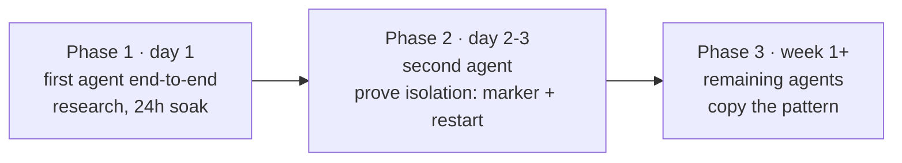

# Deployment — Dirs, Ports, Phases, Toolsets, Compose

[← All docs](../README.md)

---



## 3. Directory and naming conventions

Each agent gets a dedicated host directory and a predictable container name.

```
~/.hermes-general/     ← bind-mounts to /opt/data inside hermes-general container   (Kam)
~/.hermes-research/    ← bind-mounts to /opt/data inside hermes-research container  (Mergen)
~/.hermes-concierge/   ← bind-mounts to /opt/data inside hermes-concierge container (Umay)
~/.hermes-ops/         ← bind-mounts to /opt/data inside hermes-ops container       (Asena)
~/.hermes-coder/       ← bind-mounts to /opt/data inside hermes-coder container     (Ülgen)
~/.hermes-writer/      ← bind-mounts to /opt/data inside hermes-writer container    (Korkut)
~/.hermes-producer/    ← bind-mounts to /opt/data inside hermes-producer container  (Kayra, Phase B)
```

Each directory contains the full state for that agent:

| Path | Contents |
|---|---|
| `.env` | API keys and bot tokens |
| `config.yaml` | Hermes configuration |
| `SOUL.md` | Agent personality and instructions |
| `sessions/` | Conversation history |
| `memories/` | Persistent memory store (USER.md, MEMORY.md) |
| `skills/` | Agent-created and bundled skills |
| `cron/` | Scheduled job definitions |
| `logs/` | Runtime logs |

**Port allocation** (each gateway needs a unique host port; container-internal stays at 8642):

- `8642` → research (Mergen)
- `8643` → concierge (Umay)
- `8644` → ops (Asena)
- `8645` → coder (Ülgen)
- `8646` → writer (Korkut)
- `8647` → producer (Kayra, Phase B)
- `8648` → general (Kam)
- `9119–9126` → dashboards if enabled (one per agent)

**Important:** Ports are bound to the Tailscale interface only, never `0.0.0.0`. See Section 8 (Tailscale networking) for the exact bind syntax. This means each port is reachable from your other tailnet devices but invisible to your LAN and the public internet.

---


## 6. Deployment plan — phased

Do not stand up all seven at once. Build in three phases so problems get isolated as they arise.

**Prerequisites:** Section 4 done (seven bots exist, six tokens saved, your user ID in hand) and Section 5 done (API keys obtained from Anthropic, MiniMax, OpenRouter, and Codex credentials available either via existing `~/.codex/auth.json` or you're ready to do device-code OAuth inside containers). Deployment assumes both are complete — keys and tokens get pasted during the per-agent setup wizard.

### Phase 1 — first agent end-to-end (day 1)

Pick one agent (recommend `research` — gateway-mode, single platform, no project mounts) and get it fully working before touching anything else.

**Step 1.1: Create the host directory**

```bash
mkdir -p ~/.hermes-research
```

**Step 1.2: Run the setup wizard interactively**

```bash
docker run -it --rm \
  -v ~/.hermes-research:/opt/data \
  nousresearch/hermes-agent setup
```

Configure: the model provider for this agent (per Section 5.1 — `research` uses Codex OAuth), the relevant API keys from Section 5, and the Telegram bot token from Section 4. The wizard writes everything to `~/.hermes-research/.env`. If you already populated `.env` and `auth.json` manually per Section 5's per-agent summary, the wizard will detect existing values and let you skip those prompts.

**Step 1.3: Edit the SOUL.md**

```bash
nano ~/.hermes-research/SOUL.md
```

Write the personality. Example for research:

```
You are a methodical research assistant. Your job is to find primary sources,
synthesize them faithfully, and surface what you don't know. Cite every
non-trivial claim with the source URL. Prefer two reliable sources over one.
When the evidence is mixed, say so explicitly — do not flatten disagreement.
Default to concise output; expand only when asked.
```

**Step 1.4: Start in gateway mode**

```bash
docker run -d \
  --name hermes-research \
  --restart unless-stopped \
  --memory=3g --cpus=1 \
  --shm-size=1g \
  -v ~/.hermes-research:/opt/data \
  -p ${TAILSCALE_IP}:8642:8642 \
  nousresearch/hermes-agent gateway run
```

The `-p ${TAILSCALE_IP}:8642:8642` syntax binds the port to the Mac's Tailscale interface only — not `0.0.0.0`, not the LAN. The port is reachable from your tailnet devices and from nowhere else. Find your Tailscale IP with `tailscale ip -4` (it'll be `100.x.y.z`). See Section 8 for full Tailscale setup.

The `--shm-size=1g` flag is required if you want browser tools to work (Playwright/Chromium needs shared memory).

**Step 1.5: Verify**

```bash
docker ps                                  # container is running
docker logs --tail 50 hermes-research      # no errors at startup
docker stats hermes-research               # memory and CPU within limits
```

Then send a Telegram message to the bot. Confirm it responds. Confirm `~/.hermes-research/sessions/` has a new session file. Leave it running overnight and check it's still healthy in the morning.

**Acceptance criteria for Phase 1:**
- Gateway stays up for 24+ hours without crashing
- Memory stays within the 3 GB cap (`docker stats` confirms)
- A skill gets created and persists across container restarts
- A new session can pick up context from a memory file written in an earlier session

### Phase 2 — second agent, validate isolation (day 2–3)

Stand up `concierge`. The point of this phase is to **prove isolation works** before scaling further.

**Step 2.1: Replicate the pattern**

```bash
mkdir -p ~/.hermes-concierge

docker run -it --rm \
  -v ~/.hermes-concierge:/opt/data \
  nousresearch/hermes-agent setup
```

Use a **different Telegram bot token** for concierge. Edit its SOUL.md with a different personality.

**Step 2.2: Start with a different port**

```bash
docker run -d \
  --name hermes-concierge \
  --restart unless-stopped \
  --memory=2g --cpus=1 \
  --shm-size=1g \
  -v ~/.hermes-concierge:/opt/data \
  -p ${TAILSCALE_IP}:8643:8642 \
  nousresearch/hermes-agent gateway run
```

**Step 2.3: Run the isolation test**

This is the non-negotiable check. From a chat with `research`, ask the agent to create a file at `/opt/data/marker-research.txt`. From a chat with `concierge`, ask it to list files in `/opt/data/`. The marker file should not appear — concierge sees its own `/opt/data`, which is a different host directory.

If `concierge` can see `research`'s files, something is wrong with the bind mounts and the entire isolation story collapses. Fix before continuing.

**Step 2.4: Cross-restart test**

`docker restart hermes-research`. Confirm `concierge` keeps running and responding normally throughout. This validates the independent-lifecycle claim.

**Acceptance criteria for Phase 2:**
- Both gateways run simultaneously without conflict
- Filesystem isolation confirmed (marker test passes)
- Lifecycle isolation confirmed (restart test passes)
- Different bot tokens, different personalities, both reachable

### Phase 3 — remaining agents (week 1+)

Once Phase 2 passes, the remaining four are mechanical. Copy the pattern, change names, ports, RAM caps, SOUL.md.

For each new agent:
1. Create `~/.hermes-<name>/` directory
2. Run interactive setup with that directory as the data mount
3. Write the SOUL.md
4. Configure a unique bot token
5. `docker run -d` with the right name, port, and resource caps

**Special considerations per agent:**

- **`coder` (MacBook Pro):** Add a volume mount for your projects directory. Set `docker_run_as_host_user: true` equivalent by passing `--user $(id -u):$(id -g)` so created files are owned by you, not root. Example:

  ```bash
  docker run -d \
    --name hermes-coder \
    --restart unless-stopped \
    --memory=4g --cpus=2 \
    --shm-size=1g \
    --user $(id -u):$(id -g) \
    -v ~/.hermes-coder:/opt/data \
    -v ~/projects:/workspace/projects \
    -p ${TAILSCALE_IP}:8645:8642 \
    nousresearch/hermes-agent gateway run
  ```

- **`ops`:** Tightest resource caps. Probably doesn't need browser tools, so `--shm-size` can be smaller or omitted. Consider disabling browser toolset entirely in its `config.yaml`:

  ```yaml
  agent:
    disabled_toolsets:
      - browser
      - web
  ```

- **`writer`:** Add a `/output` volume mount for finished drafts you want to retrieve from the host:

  ```bash
  -v ~/Documents/writer-output:/output
  ```

### 6.6 Toolset hygiene — disable what each agent doesn't need

Hermes loads **~17 toolsets by default**, and each enabled toolset injects its tool schemas into *every* prompt that agent sends. Pruning them is the single cheapest lever you have on three things at once: **token cost** (fewer schemas per prompt), **risk surface** (`terminal`, `code_execution`, `browser` = shell, arbitrary code, full browser automation), and **focus** (fewer tempting wrong tools, which matters most for `ops`).

First, separate three things people conflate:

| Thing | What it is | Token cost | What to do |
|---|---|---|---|
| **Toolsets** | Capabilities injected into the system prompt | **High** — schemas sit in every prompt | **Prune per agent (this section)** |
| **Skills** | On-demand knowledge docs (progressive disclosure) | ~0 until the agent opens one | Don't prune; only *add* useful ones (e.g. the TinyFish skill, 10.7) |
| **Plugins** | Memory providers / context engines / model providers / platform adapters | Pick one of each | Almost nothing to disable — you pick **Honcho** as the memory provider (Section 9); the rest auto-load |

So nearly all the "disable unneeded" effort is **toolsets**. Skills are lazy-loaded and effectively free; plugins are a one-pick decision already made.

**The high-value disables** (all default-on, rarely needed):

- **`browser`** — heavy (≈10 tools, needs Chromium + `--shm-size=1g`). We use **TinyFish via MCP** (Section 10) for web. Disable browser on every agent → this also lets you **drop `--shm-size=1g`** from those containers and reclaim the RAM. Re-enable browser (and shm) only on an agent that genuinely needs interactive page automation (none do, at first).
- **`terminal`** — shell access. Only `coder` and `ops` need it.
- **`code_execution`** — runs Python. Only `coder`.
- **`image_gen`** — default-on but requires a FAL.ai key you don't have, so it's dead schema weight. Disable everywhere.
- **`delegation`** — default-on, spawns subagents = surprise token spend. Disable until you deliberately want multi-agent fan-out.

**Per-agent matrix** (core toolsets always kept — `memory`, `session_search`, `skills`, `clarify`, `safe` — are omitted; `ops` keeps `memory` tight per 9.4):

| Toolset | research | concierge | ops | coder | writer |
|---|:--:|:--:|:--:|:--:|:--:|
| `terminal` | ✗ | ✗ | ✓ | ✓ | ✗ |
| `code_execution` | ✗ | ✗ | ✗ | ✓ | ✗ |
| `browser` | ✗ | ✗ | ✗ | ✗ | ✗ |
| `web` (built-in) | ✓ fallback | ✓ fallback | ✗ | ✗ | ✗ |
| `file` | ✓ | ✓ | ✓ | ✓ | ✓ |
| `vision` | ✓ | ✓ | ✗ | ✓ | ✓ |
| `image_gen` | ✗ | ✗ | ✗ | ✗ | ✗ |
| `tts` | ✗ | ✓ | ✗ | ✗ | ✗ |
| `cronjob` | ✓ | ✓ | ✓ | ✗ | ✗ |
| `messaging` | ✗ | ✗ | ✗ | ✗ | ✗ |
| `delegation` | ✗ | ✗ | ✗ | opt | ✗ |
| `todo` | ✗ | ✗ | ✗ | ✓ | ✗ |

The `web` row matches the decisions already made elsewhere: `ops` kills web (Section 6 special-considerations), `coder`/`writer` are TinyFish-only (Section 10.6, Layer 1), `research`/`concierge` keep built-in web as the SearXNG fallback (Section 10.6, Layer 2).

**Per-agent `disabled_toolsets`** (paste into each `config.yaml`):

```yaml
# general (Kam)  — keeps web/vision/tts/cronjob; it's a conversational agent
agent:
  disabled_toolsets: [terminal, code_execution, browser, image_gen, delegation, messaging, todo]

# research
agent:
  disabled_toolsets: [terminal, code_execution, browser, image_gen, tts, delegation, messaging, todo]

# concierge
agent:
  disabled_toolsets: [terminal, code_execution, browser, image_gen, delegation, messaging, todo]

# ops  (determinism — keep it lean; terminal + cronjob are its job)
agent:
  disabled_toolsets: [browser, web, image_gen, vision, tts, code_execution, delegation, messaging, todo, session_search]

# coder  (the only agent with shell + code execution)
agent:
  disabled_toolsets: [browser, web, image_gen, tts, cronjob, messaging, delegation]

# writer
agent:
  disabled_toolsets: [terminal, code_execution, browser, web, image_gen, cronjob, messaging, delegation, todo]
```

Opt-in toolsets (`search`, `video`, `video_gen`, `moa`, `kanban`, `debugging`, `computer_use`, `homeassistant`, `spotify`, `discord`, `feishu_doc`, `feishu_drive`, `yuanbao`, `x_search`) are **already off** — do not list them. Enable an integration only when you specifically want it (e.g. `homeassistant` on `concierge` later if you run a smart home; needs `HASS_TOKEN`).

Verify the live result per agent with:

```bash
hermes tools --list   # shows active toolsets vs available-but-disabled
```

**`producer` (Phase B, deferred):** when you build it, disable `[terminal, code_execution, browser, web, image_gen, vision, tts, delegation]`. It keeps `file` (writes `backlog.md`), `cronjob` (weekly scoring), plus the core memory/skills/clarify set. Nothing heavier.

**Two flags worth remembering:**

- **Drop `--shm-size=1g` once browser is disabled.** Sections 6 and 7 set `shm_size: 1gb` on agents for browser support. With `browser` disabled everywhere, that shared-memory allocation is wasted — remove it from each container's `docker run`/compose entry to reclaim RAM. Add it back only on an agent where you later re-enable `browser`.
- **`ops` `terminal` sees the container, not the host.** A containerized `ops` agent's shell operates inside its own container — it cannot see host disk usage, the Docker daemon, or other containers without explicit host access (a mounted Docker socket or a host-metrics path). Before relying on `ops` for real infrastructure monitoring, decide how it reaches the host; the `terminal` toolset alone only gives it visibility into its own sandbox.

**Phase A relevance:** only `research` is live at first, so its disable list is the only one you need on day one. The rest apply as each agent comes online.


## 7. Docker Compose — recommended for managing seven containers

Once Phase 3 is underway, six `docker run` commands become annoying to maintain. Consolidate into one `docker-compose.yaml` per machine.

### M4 Mini `~/hermes/docker-compose.yaml`

Set `TAILSCALE_IP` once in a `.env` file alongside the compose file (`echo "TAILSCALE_IP=$(tailscale ip -4)" > ~/hermes/.env`), then Compose substitutes it into every port binding.

```yaml
services:
  hermes-research:
    image: nousresearch/hermes-agent:latest
    container_name: hermes-research
    restart: unless-stopped
    command: gateway run
    ports:
      - "${TAILSCALE_IP}:8642:8642"
    volumes:
      - ~/.hermes-research:/opt/data
    shm_size: 1gb
    deploy:
      resources:
        limits:
          memory: 3G
          cpus: "1.0"

  hermes-concierge:
    image: nousresearch/hermes-agent:latest
    container_name: hermes-concierge
    restart: unless-stopped
    command: gateway run
    ports:
      - "${TAILSCALE_IP}:8643:8642"
    volumes:
      - ~/.hermes-concierge:/opt/data
    shm_size: 1gb
    deploy:
      resources:
        limits:
          memory: 2G
          cpus: "1.0"

  hermes-ops:
    image: nousresearch/hermes-agent:latest
    container_name: hermes-ops
    restart: unless-stopped
    command: gateway run
    ports:
      - "${TAILSCALE_IP}:8644:8642"
    volumes:
      - ~/.hermes-ops:/opt/data
    deploy:
      resources:
        limits:
          memory: 1G
          cpus: "0.5"
```

### MacBook Pro `~/hermes/docker-compose.yaml`

Same pattern — create a `.env` file with `TAILSCALE_IP` set to the MacBook's tailnet IP.

```yaml
services:
  hermes-coder:
    image: nousresearch/hermes-agent:latest
    container_name: hermes-coder
    restart: unless-stopped
    command: gateway run
    user: "501:20"  # adjust to your host UID:GID — check with `id`
    ports:
      - "${TAILSCALE_IP}:8645:8642"
    volumes:
      - ~/.hermes-coder:/opt/data
      - ~/projects:/workspace/projects
    shm_size: 1gb
    deploy:
      resources:
        limits:
          memory: 4G
          cpus: "2.0"

  hermes-writer:
    image: nousresearch/hermes-agent:latest
    container_name: hermes-writer
    restart: unless-stopped
    command: gateway run
    ports:
      - "${TAILSCALE_IP}:8646:8642"
    volumes:
      - ~/.hermes-writer:/opt/data
      - ~/Documents/writer-output:/output
    shm_size: 1gb
    deploy:
      resources:
        limits:
          memory: 2G
          cpus: "1.0"
```

Operations become simple:

```bash
docker compose up -d              # start all agents on this machine
docker compose logs -f hermes-research   # follow research logs
docker compose restart hermes-coder      # restart just coder
docker compose pull && docker compose up -d   # upgrade all agents
```

---
