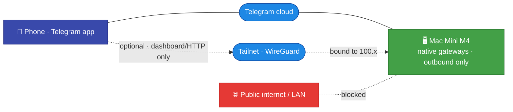

# Networking — Telegram & (optional) Tailscale

[← All docs](../README.md)

---



## 8. Networking

Everything runs on **one machine** (the Mac Mini M4), and the primary interface is **Telegram**. That changes the networking story completely from the old two-machine, container-per-agent draft.

### 8.1 Telegram needs no inbound ports and no Tailscale

Each native gateway connects **outbound** to Telegram via **long polling**. Telegram's own infrastructure relays your messages, so the agents are reachable **from anywhere** — home, mobile data, traveling — **without exposing a single port** on the Mini and **without Tailscale**. This is the default and it covers ~100% of normal use. (Telegram's *webhook* mode would require an inbound HTTPS endpoint — we don't use it; long polling is what keeps the no-inbound-ports guarantee.)

Because agent-to-agent communication is now **local** (same install — see [Section 17](12-agent-comms.md)), there is also **no inbound network path between agents** to secure. The old per-gateway HTTP API + Tailscale mesh existed to let containers on two machines talk; that requirement is gone.

### 8.2 Tailscale is optional — only for the dashboard or raw HTTP API

You only need Tailscale if you turn on a feature that **listens** and you want to reach it from your phone/laptop:

- the **Hermes web dashboard** (a browser UI per profile)
- the **HTTP API server** for an external (non-Telegram) client

Hermes has no auth on these by default, so any port reachable from the public internet is a complete-access port. If you enable one, **do not expose it publicly** — put it behind Tailscale. Nous Research's own guidance: *"Do not expose application ports publicly; use SSH tunnels, Caddy with HTTPS, or Tailscale."*

If you never enable the dashboard or HTTP API, **skip this whole section** — Telegram is enough.

### 8.3 If you do enable a listener — bind it to Tailscale

Install Tailscale on the Mini and your phone (`brew install --cask tailscale`), sign in to the same tailnet, give the Mini a stable hostname (`hermes-mini`), enable MagicDNS.

```bash
tailscale status
tailscale ip -4          # the Mini's tailnet IP, 100.x.y.z
```

Native, there is **no Docker `-p` to bind a host IP** — you bind inside Hermes config. For a profile that exposes the API server or dashboard, in its `config.yaml`:

```yaml
api_server:
  enabled: true
  host: "100.x.y.z"          # the Mini's Tailscale IP — NOT 0.0.0.0, NOT the LAN IP
  port: 8642
  key: "<openssl rand -hex 32>"   # always set a key, even behind Tailscale
```

Binding `host` to the tailnet IP makes the listener reachable from your tailnet devices and **invisible to the LAN and the public internet**. Set a `key` regardless — Tailscale is the network boundary, the key is the application boundary; if a tailnet device is compromised the attacker still needs the key. Generate one per profile (`openssl rand -hex 32`).

For HTTPS (needed to PWA-install a dashboard on your phone), bind the **dashboard** to loopback (`host: "127.0.0.1"`, port `9119`) and let `tailscale serve` terminate TLS in front of it:

```bash
tailscale serve --bg --https=443 http://127.0.0.1:9119
```

(Use this loopback-plus-`tailscale serve` pattern for the dashboard; the direct tailnet-IP bind above is for the API server when you don't want a TLS front. Don't bind a service to the tailnet IP *and* point `tailscale serve` at `localhost` — pick one.)

### 8.4 Verifying the bind (only if you exposed something)

After enabling a listener, confirm it is **not** on `0.0.0.0`:

```bash
# Should show the Tailscale IP, NOT 0.0.0.0 or *
sudo lsof -iTCP -sTCP:LISTEN -P -n | grep -E '8642|9119'
```

External smoke test from a device **not** on the tailnet (cellular, Tailscale off):

```bash
curl http://<mini-public-ip>:8642/health   # must fail / time out
```

If that succeeds, you have a public-facing agent — stop and fix the `host` binding before continuing.

### 8.5 Risks worth knowing

- **The default (Telegram only) exposes nothing** — the safest posture. Prefer it; enable listeners only when you actually want the dashboard.
- **Tailscale ACLs are off by default** ("all tailnet members reach all ports"). Fine for a personal tailnet; tighten in the admin console for a shared one (work/family).
- **Tailscale IP can change** if you remove/rejoin the tailnet. MagicDNS hostnames are more stable than raw IPs; re-bind config if it changes.
- **Telegram bot tokens are the real perimeter.** Since Telegram is the front door, a leaked bot token = a path to that agent. Keep `.env` files locked down (Section 9) and restrict each bot to your user ID (Section 4).

---
