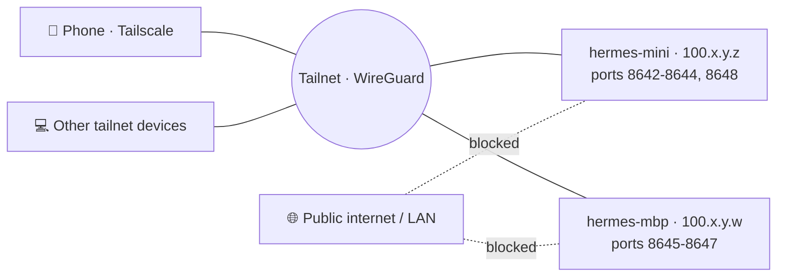

# Networking — Tailscale

[← All docs](../README.md)

---



## 8. Tailscale networking

The whole point of using Tailscale here is the same one Nous Research recommends on their AWS marketplace listing: *"Do not expose application ports publicly; use SSH tunnels, Caddy with HTTPS, or Tailscale."* Hermes has no auth on its gateway API by default, so any port reachable from the public internet is a complete-access port. Tailscale gives you a private mesh — only devices you've explicitly added to your tailnet can reach the agents, and traffic is end-to-end encrypted over WireGuard.

There's an open feature request (issue #9269) for first-class `tailscale serve` integration in Hermes itself, but it isn't shipped yet. Until then, the integration happens at the OS layer: bind ports to the Tailscale interface, done.

### 8.1 Tailscale setup on each Mac

Install Tailscale on both machines via the App Store or `brew install --cask tailscale`. Sign in to the same tailnet on both. Pick stable, readable hostnames in the Tailscale admin console — `hermes-mini` and `hermes-mbp` are more useful than the autogenerated names. Enable MagicDNS in Tailscale admin so you can reach the machines by name (`hermes-mini.your-tailnet.ts.net`) instead of by raw IP.

Verify on each Mac:

```bash
tailscale status                 # confirm node is up, see peers
tailscale ip -4                  # your tailnet IP (100.x.y.z) — save this
```

### 8.2 The bind-to-Tailscale pattern

Docker's `-p` flag accepts a host IP prefix. `-p 100.x.y.z:8642:8642` binds the port to that interface only. Traffic from `localhost`, the LAN, or the internet cannot reach it; only traffic arriving on the Tailscale interface can.

Set the IP once in each machine's `~/hermes/.env` file:

```bash
echo "TAILSCALE_IP=$(tailscale ip -4)" > ~/hermes/.env
```

Compose substitutes `${TAILSCALE_IP}` into every port mapping. All the compose snippets in Section 7 already use this pattern.

### 8.3 Reaching the agents from your phone or other devices

Install Tailscale on your phone (iOS/Android), sign in to the same tailnet, and the agents are immediately reachable from anywhere — home wifi, mobile data, traveling internationally. The mesh handles NAT traversal and routing automatically.

If you want HTTPS for browser-based dashboards (instead of plain HTTP over Tailscale), use `tailscale cert` to issue a real cert for your machine's tailnet name, or use `tailscale serve` to proxy HTTPS in front of the local HTTP port:

```bash
tailscale serve --bg --https=443 http://localhost:9119
```

This is useful if you enable the Hermes dashboard and want to PWA-install it on your phone (which requires HTTPS).

### 8.4 Verifying the bind is correct

After bringing up containers, this check is non-negotiable. From the host:

```bash
# Should show Tailscale IP, NOT 0.0.0.0
sudo lsof -iTCP -sTCP:LISTEN -P -n | grep 864

# Or:
netstat -an -p tcp | grep LISTEN | grep 864
```

You want to see entries like `100.x.y.z.8642` listening, not `*.8642` or `0.0.0.0.8642`. If you see the latter, the port is exposed to your LAN — fix immediately by recreating the container with the correct `-p` syntax.

External smoke test from a phone or laptop on the same tailnet:

```bash
curl http://hermes-mini.your-tailnet.ts.net:8642/health   # should respond
```

External smoke test from a device **not** on the tailnet (use cellular data with Tailscale off):

```bash
curl http://<public-ip>:8642/health   # should fail / time out
```

If the second test succeeds, the binding is wrong and you have a public-facing agent. Stop everything until it's fixed.

### 8.5 Tailscale-specific Hermes config

For agents that expose the gateway HTTP API (needed only if you use the dashboard or external HTTP clients), set in their `config.yaml`:

```yaml
# Inside the container, listen on all interfaces — Docker's port binding
# restricts external visibility to the Tailscale IP. Inside the container
# 0.0.0.0 is correct; that's container-internal, not host-internal.
api_server:
  enabled: true
  host: "0.0.0.0"
  port: 8642
  key: "<openssl rand -hex 32>"     # 8+ char shared secret for the API
```

The `host: "0.0.0.0"` here is correct and not a security issue — it's the address inside the container, and the container only has its private network plus whatever the host port-binding exposes. The host binding to `${TAILSCALE_IP}` is what keeps it private.

Even with Tailscale handling network access, **always set an `api_server.key`**. Tailscale is the network boundary; the API key is the application boundary. Defense in depth: if a tailnet device is compromised, the attacker still needs the key. Generate one per agent (`openssl rand -hex 32`) and store it in each agent's `.env`.

### 8.6 Tailscale-specific risks worth knowing

- **Tailscale IP can change.** It's stable per device unless you remove/rejoin the tailnet, but if it does change, your bindings break. MagicDNS hostnames are more stable than IPs. Worst case, regenerate `~/hermes/.env` and `docker compose up -d` to recreate.
- **Subnet routing exposes more than you might think.** If you ever enable `tailscale up --advertise-routes=...` on one of these Macs, you're exposing the local subnet to the tailnet. Keep route advertising off unless you specifically need it.
- **ACLs are off by default.** Tailscale's default ACL is "all tailnet members can reach all tailnet ports." For a personal tailnet that's fine; for a shared tailnet (work, family), tighten ACLs in the admin console so only specific devices can reach the agents.
- **Exit nodes affect outbound traffic.** If either Mac is set as an exit node and you route phone traffic through it, that's fine for browsing but unrelated to agent access. Worth being aware of.

---
