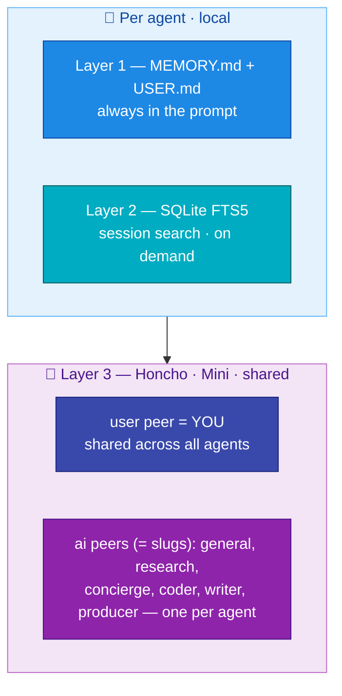
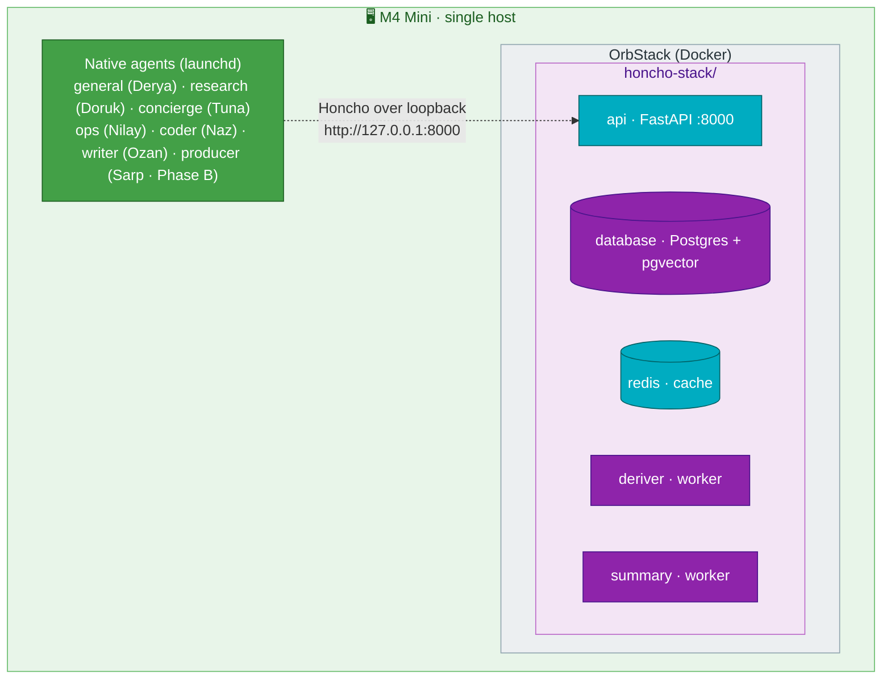

# Memory — Honcho

[← All docs](../README.md)

---



## 9. Memory architecture

Memory is the *defining* feature of Hermes — the whole reason for this setup rather than seven chatbot wrappers. It's worth treating as a first-class part of the design, not an afterthought.

### 9.1 The three layers

Hermes memory has three layers that complement each other. Knowing which layer does what is the key to using them well.

**Layer 1 — Built-in memory (always on, per-agent).**

Two agent-curated markdown files under each agent's `~/.hermes/<name>/memories/`:

- `MEMORY.md` — facts about the world, projects, environment. Hard cap ~2,200 chars by default.
- `USER.md` — facts about you from this agent's perspective. Hard cap ~1,375 chars by default.

Injected into the system prompt as a frozen snapshot at session start. The agent manages them via a `memory` tool — it adds, replaces, and consolidates entries on its own. When a file fills up, the agent merges overlapping entries to make room. Strict character limits keep the system prompt bounded.

**Layer 2 — Session search (always on, per-agent, local).**

Every CLI and messaging session is stored in SQLite at `~/.hermes/<name>/state.db` with FTS5 full-text search. The agent has a `session_search` tool — when you ask "did we discuss X last week?" it queries past sessions and uses an auxiliary LLM (Gemini Flash by default) to summarize matches.

The distinction that matters: **Layer 1 is for facts that should *always* be in the prompt. Layer 2 is for facts that *might* be relevant if you ask.** Different jobs.

This layer is local to each profile and never crosses agent boundaries. `coder` cannot search `writer`'s sessions. That's correct behavior — you don't want them blending — but it means cross-agent recall requires Layer 3.

**Layer 3 — External memory provider (optional, additive).**

Hermes ships with 8 plugins — Honcho, OpenViking, Mem0, Hindsight, Holographic, RetainDB, ByteRover, Supermemory. Only one can be active at a time. They run alongside Layers 1 and 2, never replacing them. They add capabilities the built-in layer doesn't have: automatic fact extraction (no agent intervention needed), semantic search across long history, knowledge-graph reasoning, or — in Honcho's case — running user models with dialectic reasoning.

For a seven-agent setup with shared user identity, **Honcho is the right choice**. The reason is its data model.

### 9.2 Why Honcho fits a seven-agent setup specifically

Honcho models conversations as **peers exchanging messages**. There's one **user peer** (you) that is **global across all agents in the same workspace**, and one **AI peer per agent**, each with its own identity.

Concretely: all seven agents share a single understanding of who you are — your preferences, your timezone, your projects, your communication style. But each agent develops its own independent observations and identity. `coder` builds a model of you as a developer; `writer` builds a model of your editorial voice; `concierge` builds a model of your daily rhythms. They don't bleed into each other.

This solves a problem that built-in memory alone cannot: cross-agent continuity for the parts that should be shared, separation for the parts that should be distinct.

Honcho also runs four background processes that do work the built-in layer cannot:

- **Deriver** reads every message and extracts observations about you ("prefers Python", "deadline-driven on weekdays").
- **Dialectic** answers questions about you on demand at one of five reasoning levels.
- **Summary** compresses long sessions into short and long summaries.
- **Dream** runs every ~8 hours, merges redundant observations, deletes outdated ones, and infers higher-level patterns. This is the key consolidation step that makes long-running memory not turn into noise.

### 9.3 Self-host Honcho on the M4 Mini

Honcho's open-source license is **AGPL-3.0** — fine for personal self-hosting. Honcho Cloud is the alternative, but for a system that learns about you over months, you want the data on your own hardware. The Mini is always on, has spare resources, and is already the natural always-on node in your topology.

The Honcho stack is **five containers**: API, Postgres+pgvector, Redis, deriver worker, and summary/dream workers. The community-maintained quick-start at `elkimek/honcho-self-hosted` packages all of this into a single compose file with sensible defaults and Hermes integration. The upstream `plastic-labs/honcho` repo has a similar example compose.

#### Architecture



Honcho itself needs an LLM provider for its background work. The cheapest sensible choice is OpenRouter pointed at Gemini Flash or Claude Haiku — Honcho's reasoning calls are short, frequent, and don't need a top-tier model.

#### Bring it up

On the M4 Mini:

```bash
# Create a directory for the Honcho stack
mkdir -p ~/honcho-stack && cd ~/honcho-stack

# Clone the community quick-start (gives you tuned configs for Hermes)
git clone https://github.com/elkimek/honcho-self-hosted.git config
git clone --depth 1 https://github.com/plastic-labs/honcho.git server

# Copy configs into the server repo
cp config/docker-compose.yml server/
cp config/config.toml server/
cp config/env.example server/.env

# Edit .env — set your LLM provider keys (OpenRouter recommended)
nano server/.env
```

Then bring it up:

```bash
cd ~/honcho-stack/server
docker compose up -d
docker compose logs -f api deriver   # confirm clean startup
```

Verify the API is responding:

```bash
curl -s http://localhost:8000/openapi.json | head -1
```

The compose file binds port 8000 to `127.0.0.1` by default — which is correct, because the agents now run natively on the same Mini and reach Honcho over loopback, not the LAN or the internet. Leave the binding as-is and verify with `lsof`:

```bash
sudo lsof -iTCP -sTCP:LISTEN -P -n | grep 8000
# Should show 127.0.0.1.8000, not *.8000
```

#### Resource impact on the Mini

The Honcho stack adds roughly 1.5–2 GB to the Mini's memory footprint:

- API: ~300 MB
- Postgres + pgvector: ~500 MB (grows with data)
- Redis: ~100 MB
- Deriver worker: ~300 MB
- Summary worker: ~300 MB

Combined with the native agents (~7–9 GB across the always-on set) + macOS (~2 GB), the Mini sits at ~11–13 GB out of 16 GB. Watch Activity Monitor during the first week; if pressure shows, run fewer on-demand agents concurrently.

### 9.4 Per-agent memory configuration

Not every agent needs the full memory stack. Match the configuration to what the agent is for.

| Agent | Built-in memory | Session search | Honcho | Notes |
|---|---|---|---|---|
| `general` (Derya) | Yes | Yes | Yes (peer: `general`) | Your main line — builds the richest user model |
| `research` | Yes | Yes | Yes (peer: `research`) | Tracks topic interests, source preferences, depth |
| `concierge` | Yes | Yes | Yes (peer: `concierge`) | Models daily rhythms, what reminders land |
| `ops` | Yes (tight) | Optional | **No** | Wants determinism, not personalization (deferred) |
| `coder` | Yes | Yes | Yes (peer: `coder`) | Language preferences, project conventions |
| `writer` | Yes | Yes | Yes (peer: `writer`) | Voice, edits accepted, tone calibration |
| `producer` (Phase B) | Yes | Yes | Yes (peer: `producer`) | Your taste profile across game ideas; backlog via Honcho workspace |

`ops` is the deliberate exception. The more personalized it gets, the more it drifts from doing exactly what you asked. Keep it lean. In its `config.yaml`:

```yaml
memory:
  memory_enabled: true
  user_profile_enabled: false   # don't build a USER.md
  memory_char_limit: 1500       # tighter than default
  provider: none                # no external provider
```

For all the other agents that *do* use Honcho, each needs a config file telling Hermes where the Honcho server is and what AI peer name to use. Hermes looks for it at `~/.hermes/<name>/honcho.json`.

Create one per agent. Example for `coder`:

```json
{
  "baseUrl": "http://127.0.0.1:8000",
  "hosts": {
    "hermes": {
      "enabled": true,
      "aiPeer": "coder",
      "peerName": "your-name",
      "workspace": "hermes",
      "recallMode": "hybrid",
      "writeFrequency": "every_turn",
      "dialecticReasoningLevel": "medium"
    }
  }
}
```

Key fields:

- `baseUrl` — Honcho server on the Mini, reached over loopback (`127.0.0.1`).
- `aiPeer` — **unique per agent** (`coder`, `writer`, `research`, `concierge`). This is the identity Honcho uses to build per-agent observations.
- `peerName` — your name. **Same value across all agent configs.** This is what makes the user peer shared.
- `workspace` — keep as `hermes` for all seven. The workspace is what binds them into one shared environment.
- `recallMode` — `hybrid` is the sensible default: context is auto-injected into the system prompt *and* tools are available so the model can also query on demand. Other options: `context` (auto-inject only), `tools` (tools only).
- `dialecticReasoningLevel` — `minimal`/`low`/`medium`/`high`/`max`. Higher = better reasoning, more tokens, more cost. Start at `medium` and adjust.

Then in each agent's `config.yaml`:

```yaml
memory:
  provider: honcho
```

Restart the gateway (`launchctl kickstart -k gui/$(id -u)/com.hermes.<name>`) for changes to take effect.

### 9.5 Initial seed: don't make the agent discover everything

Don't make the agent learn everything from scratch over conversation. Seed each agent's `USER.md` and `MEMORY.md` with 10–20 lines of stable, important facts before first use. This prevents the first weeks from being padded with "wait, what was your name again?" patterns.

**USER.md template (adapt per agent):**

```markdown
# User profile

- Name: <your name>
- Timezone: Europe/Istanbul
- Location: Istanbul
- Languages: <primary>, <secondary>
- OS: macOS — Mac Mini M4 (single host, always-on)
- Working hours: <typical hours>
- Communication preference: <concise vs detailed>, <when to ask vs when to act>
- Decision style: <how you want trade-offs presented>
```

Per-agent additions:

- **`coder` USER.md:** preferred languages, code style preferences, projects you work on most, "always show diffs", build tools you use, what error patterns you've seen before.
- **`writer` USER.md:** voice references, audience defaults, kinds of pieces you write, what edits you typically accept vs. reject, your preferred draft → revise rhythm.
- **`research` USER.md:** topics of standing interest, source-quality preferences, depth defaults, citation style.
- **`concierge` USER.md:** schedule patterns, reminder preferences, what's worth pinging you about vs. queuing for digest.
- **`ops` USER.md:** *(leave minimal — `ops` shouldn't develop a user model)*.

**MEMORY.md** is for facts about the world and your environment rather than about you. Things that are stable, agent-useful, and don't change daily. The `coder` agent's MEMORY.md might note "primary repo is ~/projects/foo, uses pnpm, deploys via Vercel." The `research` agent's might note "default web search backend is Firecrawl, prefer primary sources over aggregators."

Write these by hand once. The agent will refine and consolidate them over time, and you should review them periodically (see hygiene below).

### 9.6 Memory hygiene — week 1, week 4, month 3

Memory is not set-and-forget. The agent can write noise to its files, lock in early misunderstandings as permanent facts, or accumulate redundant entries. Plan to review.

**Week 1, per agent (15 min each):**

- Open `~/.hermes/<name>/memories/MEMORY.md` and `USER.md` — read every line.
- Delete anything wrong, outdated, or weirdly phrased. Edits stick.
- If memory is near the character limit and the agent is consolidating poorly, raise the limit in `config.yaml`:
  ```yaml
  memory:
    memory_char_limit: 4000
    user_char_limit: 2000
  ```
- Confirm sessions are being persisted: `ls ~/.hermes/<name>/sessions/` should show files.

**Week 4 (30 min total):**

- Cross-agent check: do `coder` and `writer` have an aligned model of who you are at the user-peer level? Ask each, in separate sessions, *"summarize what you know about me."* Honcho-backed responses should overlap substantially on identity, differ on domain-specific observations. If they don't overlap, Honcho's user peer isn't actually shared — most likely cause is inconsistent `peerName` across agent configs.
- Verify Honcho's dream cycle is consolidating. From the Honcho server: `docker compose logs --tail 200 deriver` should show observations being added and (after dream cycles) consolidated.
- For agents with rich session histories, try `session_search` in a fresh conversation: *"what did we decide about X two weeks ago?"* The agent should pull relevant snippets. If it doesn't, FTS5 may not be indexing — check the `state.db` exists and is growing.

**Month 3 (1 hour):**

- Pruning pass: each agent's MEMORY.md and USER.md will have grown things you didn't expect. Read through and remove genuinely stale facts. The agent may have written `User is working on Project Y` and Project Y ended a month ago.
- Skills review: `ls ~/.hermes/<name>/skills/` for each agent. Useful skills get reused; dead skills accumulate. Delete dead ones.
- Honcho representation export: from any agent, ask *"export your user representation"* — the agent can use `honcho_profile` or read the peer card directly. Save these; they're useful to compare across months and to back up.

### 9.7 Backups

Memory is the asset that compounds. Plan backups now, not after six months.

**What to back up:**

- `~/.hermes/*/memories/` on the Mini — agent-curated MEMORY.md and USER.md.
- `~/.hermes/*/skills/` on the Mini — agent-created skills.
- `~/.hermes/*/sessions/` on the Mini — conversation history (FTS5 index lives in `state.db`).
- `~/.hermes/*/honcho.json` configs — provider settings per agent.
- The Honcho Postgres database on the Mini — this holds Honcho's accumulated observations, conclusions, user peer card, AI peer cards.

**Hermes side (on the Mini):**

Trivial — these are just directories. Add them to whatever you already use (Time Machine, Restic, rsync to external). Daily for `memories/`, weekly for `sessions/`.

**Honcho side (Mini only):**

Postgres needs a logical dump, not just a file copy. Weekly cron:

```bash
# ~/honcho-stack/backup.sh
cd ~/honcho-stack/server
docker compose exec -T database pg_dump -U honcho honcho \
  > ~/backups/honcho-$(date +%Y%m%d).sql
# Keep last 8 weekly backups
ls -t ~/backups/honcho-*.sql | tail -n +9 | xargs -r rm
```

Schedule it via `crontab -e`:

```cron
0 3 * * 0  /Users/<you>/honcho-stack/backup.sh >> /tmp/honcho-backup.log 2>&1
```

Verify a backup is restorable at least once. Sometime in month 1, do a test restore into a throwaway container and confirm the dump produces a usable database. A backup you've never restored is not a backup.

### 9.8 Failure modes to know about

- **Honcho server down.** Agents configured with `provider: honcho` will degrade — their built-in memory still works (MEMORY.md, USER.md, session search), but Honcho-injected context disappears and `honcho_*` tools fail. Not catastrophic; agents stay usable. Restart with `docker compose up -d` in the honcho-stack directory.
- **Memory file corruption (rare).** If MEMORY.md or USER.md gets into a weird state, the agent might refuse to write to it. Solution: restore from yesterday's backup, or in the worst case, delete the file — the agent will create a fresh one on next session. You lose accumulated memory in that agent but nothing else.
- **Honcho LLM provider quota exhausted.** Deriver/dialectic/summary/dream calls will fail. The Postgres data is intact; just background processing pauses. Top up the provider, restart the deriver/summary workers. No data loss, but observations from the queue-up period may need to be reprocessed.
- **Memory hit character limit and agent is dropping things.** Either raise the limit in `config.yaml`, or accept that the agent is keeping its memory focused on what's most recent and relevant — which is the design. The header tells you when memory is near full.

### 9.9 What this doesn't solve

A few things worth being explicit about:

- **`ops` won't develop personality over time.** That's deliberate. If you want it to, flip its config to use Honcho with its own AI peer. But the value of `ops` is determinism.
- **`producer` (Sarp) memory stays minimal until Phase B.** It's deferred; when you build it, its Honcho peer (`producer`) and the backlog workspace get configured then. Don't pre-allocate.
- **You still need to actually talk to the agents.** The system can only learn from interactions that happen. An agent that gets one message per week will have a thin user model regardless of how good the memory stack is.
- **Cross-agent reasoning isn't automatic.** Honcho's user peer is shared, but each AI peer reasons independently. If `coder` learned something that `concierge` should know, you may need to tell `concierge` once. The agents do not auto-broadcast knowledge to each other.

---
