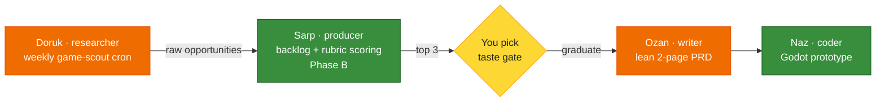

# Game Development Workstream

[← All docs](../README.md)

---



## 16. Game development workstream — discovery-first

This is the concrete answer to "I want to start PC and mobile game development but have no time for research, PRDs, market research." You are **exploring**, not committed to a specific game. So this workstream is built as a **discovery engine** — agents surface and score opportunities, you pick one, *then* prototype. It is not a "build-this-game" machine, because you don't yet know the game.

Engine direction: **Godot now, Unity later** (16.7). Provider reality: the main models run on **two providers — DeepSeek (direct API key) and OpenAI Codex** — plus a little **OpenRouter** for cheap aux (5.5). No Anthropic key needed.

### 16.0 Rollout order — research first, build later

Do not stand up the whole pipeline at once. It phases cleanly, and the early phase is nearly free.

**Phase A (now) — research scout only.** Add the cron job in 16.5 to the `researcher` agent you are *already* deploying in the core plan. It delivers a weekly ranked opportunity digest to Telegram; you read and curate by hand. At low volume, eyeballing beats automated scoring. **No new profile, no `producer` bot, no Sarp.** This is the entire game-dev footprint until friction says otherwise.

**Phase B (deferred — when the backlog earns it) — `producer`.** Stand up the `producer` profile (16.3) only once raw opportunities pile up faster than you can skim, *or* you want systematic rubric scoring and a persistent backlog. The trigger is friction, not the calendar. Everything below tagged *(Phase B)* is spec'd now so it's ready, but stays unbuilt until then.

**Phase C — `writer` PRD + `coder` Godot.** Only after you pick a candidate at the 16.9 gate.

So at first sight: one cron on an agent you're building anyway. Nothing more.

### 16.1 Shape and the one hard rule

The pipeline surfaces candidates → scores them → you choose → you prototype. Four agents, reusing three you already have plus the deferred `producer` profile (Sarp, Phase B).

**The trap, stated plainly:** market research and PRDs are the *cheapest, lowest-risk* part of game development. The real bottlenecks are (1) finding fun — only a playable prototype tells you, (2) the production grind, (3) launch and discovery. A pile of agents generating weekly trend reports and 50-page design docs *feels* like progress but is procrastination in a suit. Left unchecked, this workstream becomes automated busywork.

**The rule that prevents that:** **timebox discovery to 3–4 weeks**, then commit to exactly **one** prototype. Agents surface candidates; only you, prototyping, can feel whether the loop is fun. Discovery is a phase, not a permanent mode. See the decision gate in 16.9.

### 16.2 The pipeline

_(Pipeline diagram at the top of this page.)_

All four agents are profiles in the one native install on the Mini, so the **entire pipeline is single-host**. `researcher` runs its always-on scout cron and delivers to Telegram; `producer` scores when you sit down to review; `writer` and `coder` pick up graduated ideas. Honcho's shared workspace carries the candidate list and your evolving taste profile across all four, and — because they co-locate — the pipeline is **`kanban`-ready** (16.11): a single board could auto-promote `researcher → producer → writer → coder` if the cadence ever justifies it. It doesn't yet; a flat `backlog.md` is the right altitude (16.6).

### 16.3 The `producer` agent — Sarp *(Phase B — deferred)*

> **Deferred.** Do not build this at first sight. Stand it up only when Phase A's research digests outpace hand-curation or you want rubric scoring. Spec kept here so the day you flip it on, it's a copy-paste, not a redesign.

A new profile in the native install (Section 2).

| Field | Value |
|---|---|
| Role | Game-dev product lead: holds the idea backlog, scores opportunities, kills weak ones |
| Personality | Skeptical, honest, anti-hype. Scores against the rubric, refuses to inflate. Kills stale ideas without sentiment. |
| Machine | Mac Mini M4 (native profile) |
| Footprint | ~2 GB working set; on-demand (weekly scoring cron), not held resident |
| Telegram | **Sarp** — `producer_<you>_bot` (Section 4 flow) |

Stand it up like any other profile (Section 6, Phase 3):

```bash
hermes profile create producer
hermes -p producer setup          # Sarp bot token, DeepSeek model, keys
# write SOUL.md (16.8), prune toolsets (Section 6.6), then: hermes -p producer gateway install
```

No container, no port, no compose — just a profile under `~/.hermes/profiles/producer/`.

### 16.4 Model assignment (DeepSeek + Codex)

Current routing: `coder` + `writer` = **Codex gpt-5.4**; every other agent = **DeepSeek V4 Flash** (direct API, pay-per-token). Full reasoning + fallback chains in [docs/04](04-models.md).

Balanced so the only **automated cron** (`researcher`'s weekly scout) stays on **DeepSeek** — automated volume is the ToS flag trigger (docs/04 §5.0). The two **Codex** agents are the quality-critical creative pair (`coder` code, `writer` prose), both human-paced. **Phase A uses only the `researcher` row** — the rest activate as their agents come online in Phase B/C.

| Agent | Role | Model | Provider | Rationale |
|---|---|---|---|---|
| `researcher` | opportunity scout | `deepseek-v4-flash` | `deepseek` | Cheap pay-per-token web research; keeps the weekly **cron** off the gray-area sub (automated cadence is the flag trigger). |
| `producer` | backlog + scoring | `deepseek-v4-flash` | `deepseek` | Reasoning over candidates is cheap and frequent. |
| `writer` | PRD / store copy | `gpt-5.4` (Codex) | `openai-codex` | Voice and long-form drafting; occasional use = low quota draw. |
| `coder` | Godot prototyping | `gpt-5.4` (Codex) | `openai-codex` | gpt-5.4 for GDScript quality; interactive/human-paced (you drive it) so lower flag risk than a cron — but it's the **heaviest** agent, so watch the shared ChatGPT cap (§5.3). DeepSeek fallback; A/B vs V4 Pro (strongest clean coder — §5.12). |

- **Auxiliary tasks** (vision, summarization, context compression) for all four → **OpenRouter · Gemini Flash** (5.5) — V4 Flash has no vision, and keeping aux cross-provider means an aux outage and a chat outage can't share a cause.
- **Fallback chains:** Codex-primary agents fall back to DeepSeek (docs/04 §5.7).

  `coder` (`~/.hermes/profiles/coder/config.yaml`) — **Codex-primary, DeepSeek fallback**:
  ```yaml
  model:
    provider: openai-codex
    default: gpt-5.4
  fallback_providers:
    - provider: deepseek
      model: deepseek-v4-flash
  ```

  `producer` (`~/.hermes/profiles/producer/config.yaml`):
  ```yaml
  model:
    provider: deepseek
    default: deepseek-v4-flash
  ```

- **Wallet simplification:** the main models need only **two providers** — DeepSeek (pay-per-token) + Codex (ChatGPT sub) — so you can drop Anthropic entirely. **Keep OpenRouter** though: it's the cheap aux route and the cross-provider hedge (5.5–5.7). A few dollars a month — don't cut it.

### 16.5 `researcher` as opportunity scout (the cron)

Add a scheduled job to the existing `researcher` agent. It runs Monday mornings, scans, and delivers a ranked raw-opportunity list to the Telegram home channel (`/sethome` in the researcher bot first, Section 4.9).

```yaml
# ~/.hermes/profiles/researcher/cron/game-scout.yaml
schedule: "0 8 * * 1"        # Mondays 08:00 local
deliver_to: telegram_home
prompt: |
  Run the weekly game-opportunity scout. Use the TinyFish search+fetch tools.
  1. Steam — surface 5 genres/tags with rising wishlist demand AND weak or
     aging competition (the gap). For each: tag, demand signal, why it's a gap.
  2. Mobile — top-grossing plus fastest-climbing titles in 3 casual / casual-mid
     categories. Note what mechanic is driving the climb.
  3. Complaint mining (PRIORITY) — pull top critical reviews of 5 popular games
     in the genres I track; extract concrete "I wish it had X" desires. Player
     unmet-desire is the highest-signal seed, worth more than chart summaries.
  4. Reddit r/gamedev + r/IndieGaming — recurring pain points, asset/tool gaps,
     "why does no game do X" threads.
  Output a ranked list of 5–8 raw opportunities, each as
  {title, genre, signal, the-gap, solo-buildable?}. Write them to the Honcho
  workspace so the producer agent can score them. Keep the Telegram digest
  under 600 words.
```

Why complaint mining is flagged priority: chart-topper summaries tell you what everyone already knows sells (cozy, survival-craft, extraction). Unmet player desire in reviews of *existing* games is where a solo dev's edge actually hides.

### 16.6 `producer` backlog + scoring rubric *(Phase B — deferred)*

> **Until producer exists (Phase A):** the scout's weekly digest lands in Telegram and you curate by hand — star what interests you, ignore the rest. No backlog file, no automated scoring. The rubric below is still worth keeping in your head as you skim. When manual curation gets tedious, that's the signal to build producer and automate it.

`producer` keeps a persistent backlog at `~/.hermes/profiles/producer/backlog.md` (Honcho-shared). It scores each new candidate Mondays, right after the scout runs.

```yaml
# ~/.hermes/profiles/producer/cron/score-backlog.yaml
schedule: "0 9 * * 1"        # Mondays 09:00, after the 08:00 scout
deliver_to: telegram_home
prompt: |
  Read this week's raw opportunities from the Honcho workspace and the existing
  backlog at ~/.hermes/profiles/producer/backlog.md. Score each NEW candidate 1–5 on:
    - Buildable : solo prototype in under 3 months?
    - Loop      : core loop expressible in one sentence?
    - Discovery : niche, searchable, streamable — can players find it?
    - Money     : monetization obvious (premium / ads+IAP / DLC)?
  Do NOT score "fun" or taste — that gate belongs to the user alone.
  Append each scored candidate to backlog.md with today's date and the four
  scores. Strike through (kill) anything that has sat unpicked for >6 weeks.
  Deliver the top 3 total-scorers as one-line pitches to Telegram.
```

The rubric, for reference:

| Gate | Question | Scored by |
|---|---|---|
| Buildable | Solo prototype in <3 months? | producer |
| Loop | Core loop in one sentence? | producer |
| Discovery | Niche, searchable, streamable? | producer |
| Money | Monetization obvious? | producer |
| **Taste** | Do *you* want to build it for 6 months? | **you — never the agent** |

The taste gate is deliberately outside the agent's reach. A high-scoring candidate you have no desire to build for half a year is a trap; a mid-scoring one you're itching to make is the right call. The agents narrow the field; you make the call.

### 16.7 `coder`: Godot-first

**Engine verdict for the exploration phase: Godot.** Free, no royalties, lightweight, and — critically for testing many throwaway prototypes — *fast iteration*. Excellent 2D, solid mobile export, and GDScript is very LLM-friendly so the `coder` agent writes it well. Cheap to build a prototype and cheaper to throw it away.

**Unity is a commit trigger, not the default.** Switch a *chosen* game to Unity only when it needs mobile-monetization SDK depth (ads/IAP/analytics — LevelPlay, AppLovin, Firebase) or real 3D. Heavier, slower loop. Don't pay that tax while still exploring.

**`coder` runs native on the Mini — this is why the container draft was dropped.** Containers on macOS get **no GPU** (no Metal passthrough), so a containerized Godot has no GPU-accelerated editor or rendered play-test — headless use only. Native, `coder` runs on the Mini's **Metal GPU with the full Godot GUI** — it can open the editor, run and render a scene, export a real build, and export to macOS natively (all of which a Linux container either can't do or does buggily).

Point `coder` at your Godot projects in its `config.yaml` (no mounts — it already has your user's filesystem):

```yaml
# ~/.hermes/profiles/coder/config.yaml
project_roots:
  - ~/godot-projects
```

Division of labor: `coder` edits scripts/scenes, runs tests, and can drive Godot itself (headless for quick checks or the GUI for a real run); **you** still own the taste call — open the editor, play it, decide if it's fun (16.10). Because `coder` runs natively as your user, it can read your files and your other profiles' `.env` — that residual risk is fenced with `approvals: smart` + redaction + blocklist in [Section 13](09-security.md). Treat a permissive approval mode on `coder` as handing an LLM your shell.

### 16.8 SOUL.md seeds

**`producer` SOUL.md:**

```
You are a skeptical game-dev product lead for a solo developer who is still
exploring what to build. Your job is to keep an honest opportunity backlog,
score candidates against a fixed rubric (buildable, loop clarity, discovery,
monetization), and kill weak or stale ideas without sentiment. Never inflate a
score to be encouraging. Never score "fun" or taste — that is the developer's
call alone; surface the trade-offs and stop there. Bias toward small,
solo-buildable scope. When you flag a top candidate, give a one-sentence pitch
and the single biggest risk. Brevity over enthusiasm.
```

**`researcher` SOUL.md addendum** (append to the existing research personality):

```
For the weekly game-opportunity scout, weight concrete unmet player desire
(mined from reviews of existing games) above generic trend summaries. A gap a
solo dev can fill beats a hot genre a solo dev can't compete in.
```

**`writer` SOUL.md addendum:**

```
When drafting a game PRD or design doc, keep it lean — two pages, not fifty.
Lead with the one-sentence core loop, the target player, and the single thing
that makes it worth building. A short doc that ships beats a long doc that
becomes the project.
```

### 16.9 Decision gate

The discovery phase ends on a date, not on a feeling.

- **Timebox:** 3–4 weeks of scout + score cycles. Set the end date when you stand up `producer`.
- **Graduate to prototype** when a candidate clears the rubric *and* the taste gate — i.e. it scores well *and* you want to build it for six months. Then `writer` drafts the lean PRD and `coder` starts the Godot prototype.
- **Kill criteria:** `producer` strikes any candidate unpicked after 6 weeks. If the *whole backlog* goes stale with nothing you want to build, that's signal too — widen the scout's genres or accept that exploration via agents has hit its limit and you need to prototype something rough to find your own taste.
- **Hard stop:** at the end of the timebox, pick the best available candidate and prototype it even if it's imperfect. A flawed prototype teaches more than a fifth week of scoring.

### 16.10 What this doesn't solve

- **Fun is unprovable on paper.** No scout, no rubric, no PRD finds it. Only a playable prototype does. The entire pipeline exists to get you *to* a prototype faster, not to replace it.
- **Taste is yours.** The agents narrow the field honestly; the choice of what's worth six months of your life is not delegable.
- **Market data is shallow by default.** Agents surface the legible signal. Your edge is the illegible insight — the niche you understand that the charts don't show. Treat scout output as a starting point, not an answer.
- **Docs over-produce if unchecked.** Re-read 16.1's trap monthly. If you have more design docs than playable builds, the workstream has inverted and needs correcting.

### 16.11 `kanban` for the pipeline — available, off, flip-when-earned

All four pipeline agents are profiles in one native install on the Mini, so Hermes' single-host `kanban` board *could* orchestrate the whole chain — `researcher → producer → writer → coder`, auto-promoting each card as the prior stage completes. The single-machine move (Section 1) is what unlocked this: the board's dispatcher spawns sibling profiles as local processes, which only works when they share a host and install.

**Keep it off.** This pipeline is solo, weekly-cadence, and human-gated at the taste gate (16.9) — `backlog.md` + your curation is the right altitude, and a board here would manufacture process without removing real work. The value of co-location is that turning kanban on later is a **config flip, not a migration** (toolset `kanban` is already listed *opt* for these agents in Section 6.6). The trigger to flip it: you can name specific recurring handoffs you want claimed automatically without you sequencing them — not before. Full reasoning in [Section 17](12-agent-comms.md).

---
