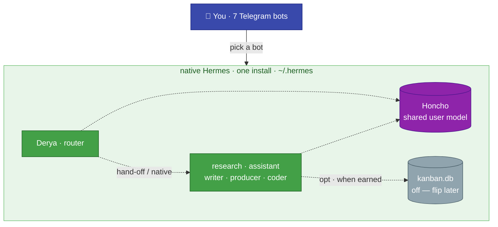

# Agent-to-Agent Communication & Coordination

[← All docs](../README.md)

---

## 17. Agent-to-agent communication

The single-machine, single-install decision (Section 1) **collapses this whole topic.** When the agents were containers split across two machines, agent-to-agent work needed a network fabric — a per-gateway HTTP API, Tailscale routing, API keys, a router with an HTTP tool. None of that survives. All seven agents are profiles in one install on one Mac, so coordination is **local**. This section is short because the hard version of the problem no longer exists.

### 17.1 You are the primary router

The default coordination mechanism is **you**. Each agent has its own Telegram bot; you pick the agent by picking the chat. Research belongs to Doruk? Open Doruk's chat. This covers ~100% of normal use at zero infrastructure, and it keeps the human taste-gate (the point of the game-dev pipeline, Section 16) exactly where it should be.

**Derya assists the routing socially, not over the wire.** Derya's SOUL (Section 6.7) knows the crew: *"Doruk digs up market data, Naz writes the code, Ozan the story… when a task is clearly someone's, say so and offer to pass it over."* So Derya's "hand-off" is a suggestion to you — "this is research, want me to ask Doruk?" — not a background RPC. For a solo operator that is usually enough and always the safest.

### 17.2 The three native coordination layers

When agents genuinely need to share state or work — beyond you relaying — there are three local mechanisms, in increasing weight. **No HTTP, no ports, no keys** — they all work because the agents share one install and one host.

| Layer | Mechanism | Use it for | Status |
|---|---|---|---|
| **Shared knowledge** | **Honcho** ([Section 9](07-memory.md)) — shared user peer | A durable model of *you* that every agent reasons over. Cross-agent *continuity*, async. | **on** (Phase B) |
| **Shared artifact** | **`backlog.md`** + Honcho workspace | The game-dev pipeline's durable state — candidates, scores, decisions. `producer` owns the file (`~/.hermes/producer/backlog.md`); the candidate list is shared to the other agents through the **Honcho workspace**, not by reaching into a sibling's directory. | **on** when `producer` lands ([Section 16](11-game-dev.md)) |
| **Task orchestration** | **`kanban`** — single-host board, dispatcher spawns sibling profiles | Auto-promoting multi-stage pipelines with dependency chains, claims, crash recovery. | **off** — native-ready, flip when earned (17.3) |

Honcho is *knowledge* sharing, not messaging — note Section 9's caveat that cross-agent reasoning isn't automatic: if `coder` learned something `assistant` should know, you may still need to say it once. `backlog.md` is the right *artifact* layer for a weekly pipeline. `kanban` is the heavy *orchestration* layer, held in reserve.

### 17.3 `kanban` — why it's available now, and why it stays off

The single-machine move is exactly what makes `kanban` viable. Per Hermes' kanban docs it is **deliberately single-host** — a dispatcher embedded in a gateway claims tasks from a shared `~/.hermes/kanban.db` and runs the assigned profile as a **local** worker process (the exact spawn/liveness mechanics are Hermes-internal; verify against its docs before relying on them). That model only works when all participating profiles share one host and one install. The container-per-agent / two-machine draft could *never* run it across the fleet; the native single install runs it natively, no shared-volume hack (the docs warn: never point two containers at one `~/.hermes` — it corrupts state).

So the full pipeline `research → producer → writer → coder` is now reachable by one board. **We still keep it off**, because availability isn't need:

- The pipeline is **solo, weekly-cadence, human-gated**. `kanban`'s value is removing a human dispatcher who is sequencing many concurrent tasks — you are not that. A board here manufactures process (cards, dispatchers, heartbeats) without removing real work.
- `backlog.md` + chat gives ~90% of the value (durable list, audit trail via git, your curation) at ~0 infrastructure, and is easier to inspect.
- Co-location makes the upgrade **a config flip, not a migration**: the `kanban` toolset is already listed *opt* for the pipeline agents (Section 6.6). The day you flip it on, the board is just there.

**Flip condition:** you can name specific recurring handoffs you want claimed and advanced **automatically, without you sequencing them** — e.g. "every scored candidate that clears the rubric should auto-spawn a PRD draft." Until you can name that, `backlog.md` is correct. (See [Section 16.11](11-game-dev.md).)

### 17.4 `delegate_task` — not agent-to-agent

For completeness: Hermes' `delegate_task` (the `delegation` toolset) spawns **in-process subagents** — anonymous workers inside the *calling* agent's own process, with restricted toolsets, for fan-out within one task. It does **not** reach another profile's agent (its SOUL, memory, identity). So it is not an A2A primitive; it's intra-agent parallelism. We keep it **disabled** by default (Section 6.6) because it's surprise token spend — enable it only on an agent you deliberately want to fan out (e.g. `coder` over many files), never as a way for one agent to "call" another.

### 17.5 If the MacBook ever comes back

The one scenario that would re-introduce real A2A networking: if `coder`'s Godot builds start starving the always-on agents and you move `coder` to a dedicated MacBook Pro host ([Section 15](10-operations.md)). Then `coder` is a *separate install on a separate machine* — outside the local layers above. Reaching it would mean the **HTTP API server** path: enable `api_server` on `coder`'s gateway (key-gated, bound to the Tailscale IP per [Section 8](06-networking.md)), and give a router agent a small tool to `POST /api/sessions/{id}/chat`. `kanban` could **not** dispatch to it (single-host). Document this only as the future fork; it is not the current design. The current design needs none of it — one machine, one install, local coordination.

---
