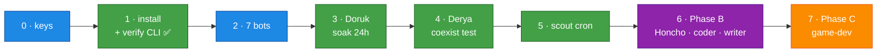

# Deployment Runbook

[← All docs](../README.md)

---

The concern docs (01–12) explain *why*; this is the *what, in order*. Follow top-to-bottom.

> ⚠️ = a **verify-gate**: the plan makes an assumption about native Hermes that hasn't been tested against a live install. Confirm it before trusting it, and adjust the runbook if reality differs.

## Step 0 — Accounts & keys (before anything)

- [ ] **MiniMax $20 Token Plan** — platform.minimax.io. ⚠️ Confirm **M3 is included at the $20 tier**. Endpoint/model verified in v0.16.0 source: provider `minimax` reads `MINIMAX_API_KEY`, defaults to `https://api.minimax.io/anthropic` (override `MINIMAX_BASE_URL`; China: `api.minimaxi.com/anthropic`), model id `MiniMax-M3`. A `minimax-oauth` provider (account login, no key) also exists — if the Token Plan turns out to be subscription-style, use that instead ([docs/04 §5.2](04-models.md)).
- [~] **OpenRouter key** — **DEFERRED by decision (2026-06-07): start MiniMax-only.** Aux rides the MiniMax quota (provider aux default = M3); no fallback chain — a MiniMax outage silences the fleet until it passes. Revisit when: the 5h quota pinches, an always-on cron lands, or the first outage hurts. To add later: ~$10 one-time at openrouter.ai (also unlocks the 1000/day `:free` tier), fill `OPENROUTER_API_KEY` in bot-tokens.env, rerun setup-bots.sh, wire §5.5 + §5.7.
- [ ] **Codex creds** — existing `~/.codex/auth.json` (ChatGPT Desktop / Codex CLI) or be ready for device-code login (coder + writer — §5.3). ⚠️ Accepted-risk — read §5.0 first.
- [ ] **TinyFish key** — web research ([docs/08](08-web-search.md)).
- [ ] **Mac Mini M4** — macOS current; **auto-login enabled** so launchd agents survive reboot ([docs/01 §11](01-architecture.md)); Docker/OrbStack installed (for Honcho + SearXNG **only**).

## Step 1 — Install Hermes + verify the CLI ✅ DONE (2026-06-06)

- [x] Installed `hermes-agent 2026.6.5` via Homebrew → **Hermes v0.16.0**.
- [x] **CLI verbs verified** (gate resolved — plan corrected):
  - `hermes profile create <slug>` ✓ as assumed; also drops a wrapper at `~/.local/bin/<slug>` (`researcher setup` ≡ `hermes -p researcher setup`).
  - Profile selection is a **global `-p/--profile` flag**, not per-subcommand: `hermes -p <slug> setup`, `hermes -p <slug> gateway run`. (`setup --profile` / `gateway run --profile` don't exist.)
  - `hermes tools list` (subcommand, not `--list`).
  - **Layout:** named profiles live at `~/.hermes/profiles/<slug>/`, not `~/.hermes/<slug>/`. Logs: `profiles/<slug>/logs/gateway.log`.
- [x] **Supervision resolved: built-in.** `hermes -p <slug> gateway install` writes + bootstraps a per-profile launchd service, label `ai.hermes.gateway-<slug>` (`RunAtLoad` + `KeepAlive`, `HERMES_HOME` pinned). No hand-rolled plists ([docs/05 §7](05-deployment.md)). Fleet view: `hermes gateway list`.
- [x] All 7 profiles created (`general researcher assistant marketing coder writer producer`) — idle until each gets keys + gateway install in its phase. *(Original 7th was `ops`/Nilay-DevOps; repurposed 2026-06-08 to `marketing`/Nilay since the watchdog covers host monitoring — see the role note below.)*
- [x] **Pip extras installed** — the Homebrew formula bundles neither `python-telegram-bot` (bots silent without it), `ddgs` (built-in web_search has no backend — agents report "no web tools"), nor `websockets`. Installed into its venv (`$(brew --prefix hermes-agent)/libexec/bin/python -m pip install python-telegram-bot ddgs websockets`). ⚠️ Re-run after every `brew upgrade hermes-agent` ([docs/10 §14](10-operations.md)).

## Step 2 — Telegram bots ×7 — ⏳ 5/7 DONE (2026-06-07)

- [x] @BotFather → `/newbot`: all created across two sittings (general, researcher, assistant, writer first; coder + producer next day after the ~24h rate limit). The old `ops` bot was abandoned when ops→marketing; a `marketing_<you>_bot` is the 7th.
- [x] bot-tokens.env filled: `ALLOWED_USERS` + tokens + `MINIMAX_API_KEY` + `TINYFISH_API_KEY` + `OPENROUTER_API_KEY`.
- [x] `./scripts/setup-bots.sh` ran clean — tokens passed `getMe`; keys fanned out to profile `.env`s.
- [x] Per bot in BotFather: `/setprivacy` Disable, `/setjoingroups` Disable — done 2026-06-07 for the 5 existing bots. (New BotFather UI: buttons are **Group Privacy** and **Allow Groups?**.) Repeat for coder + producer when created.

## Step 3 — Phase A: researcher (Doruk) end-to-end ✅ DONE except soak (2026-06-07)

- [x] Profile created (Step 1); slug renamed `research` → `researcher`.
- [x] `config.yaml`: `provider: minimax` / `default: MiniMax-M3` — **MiniMax key live-tested against both endpoints** (`/v1/text/chatcompletion_v2` and the Anthropic-compatible `/anthropic/v1/messages` Hermes uses); M3 confirmed on the $20 plan (Step 0 gate resolved). Default base URL correct, no `MINIMAX_BASE_URL` needed. Note: `config set` writes YAML lists as strings — write `disabled_toolsets` into config.yaml by hand.
- [~] ~~OpenRouter aux + fallback chain + fallback live test~~ — **deferred with the OpenRouter key (Step 0)**. When the key lands, do all three together; an untested fallback is no fallback.
- [x] Doruk SOUL.md written; toolsets pruned per docs/05 §6.6 matrix.
- [x] Foreground `gateway run` test: inbound Telegram message → M3 reply in 16.8s; session file created. Then `hermes -p researcher gateway install` → launchd service `ai.hermes.gateway-researcher` running.
- [x] **Watchdog installed + live-tested**: `bootout` researcher → DOWN alert arrived in Telegram (via the general bot) → `bootstrap` back → restart-detection alert → healthy run silent. Gotcha confirmed: you must have messaged the **general** bot once or sendMessage 400s (bots can't initiate chats).
- [x] **24 h soak** — started 2026-06-07 ~01:30; interim check at 12:12 (10.7h): zero restarts, 0 errors in logs, RAM ~200 MB/gateway (far under budget), system 75% free, watchdog silent. Memory continuity ✓ (cross-session recall verified). Formal 24h mark passes tonight; nothing blocking. Skill-creation acceptance (docs/05 Phase 1) left to verify organically in week-1 use.

## Step 4 — Phase A: general (Derya) + isolation tests — ✅ mostly DONE (2026-06-07)

- [x] Same pattern, profile `general` — Derya SOUL, MiniMax M3 (Codex fallback deferred to Phase B with Codex creds). Gateway under launchd, answered in 10.5s.
- [x] `general` in the watchdog's `EXPECTED` list from day one.
- [x] **Per-profile state test** (docs/05 Phase 2) — PASSED 2026-06-07: memory note given to Doruk; Derya asked → "Söylemedin bana — bilmiyorum" (doesn't know it). State isolation confirmed.
- [x] **Independent-lifecycle test**: passed implicitly during the watchdog test — Derya answered while researcher was booted out.

## Step 5 — Game-scout cron

- [x] **DONE 2026-06-07** — created via `hermes -p researcher cron create` (CLI, not a hand-written yaml; jobs live in `cron/jobs.json`), schedule `0 8 * * 1`, `--deliver telegram`; `/sethome` done in all 5 bots. **Live-tested end-to-end**: triggered with `cron run game-scout` → 5.3 min, ~18 TinyFish searches + 3 page fetches, 6.6 KB digest delivered to Telegram. Notes vs the docs/11 spec: prompt adapted (no Honcho yet — digest-only); web layer = **TinyFish MCP wired early** (OAuth 2.1 — the API key is for the REST API only, MCP auth is a browser login via `hermes mcp login tinyfish`; config key is top-level `mcp_servers:` in config.yaml) + `ddgs` as free search fallback. First run honestly reported "no web tools" instead of fabricating — SOUL working.

## Step 6 — Phase B — ⏳ mostly DONE 2026-06-07 (started early; Phase A tests were all green)

- [x] **OpenRouter un-deferred** (Honcho needs a cheap worker LLM): $10 credit, key live-tested (341 models). Fallback chains wired per §5.7 on general/researcher/assistant (`openrouter: minimax/minimax-m3` → `google/gemini-2.5-flash`) and writer (`minimax: MiniMax-M3` → `openrouter: openai/gpt-5`). **Fallback live test PASSED**: broke MiniMax key → one-shot CLI reply still arrived → OpenRouter usage counter moved; key restored, primary re-verified.
- [x] **Honcho** — `elkimek/honcho-self-hosted` quick-start + upstream clone at `~/honcho-stack/server`, compose up (api/database/redis/deriver), bound `127.0.0.1:8000` (had to patch compose: shipped `8000:8000` on all interfaces). All worker models → `deepseek/deepseek-v4-flash` via OpenRouter ("vllm" slot); Venice backup slot removed. Config: shared `~/.hermes/honcho.json`, host keys `hermes_<slug>` (auto-derived), aiPeers = slugs, user peer `mutlu`. **Activation gotcha ×2: per-profile `memory.provider: honcho` in config.yaml is required** (doctor must say "Honcho connected"), and the venv needs `pip install honcho-ai` (formula gap #5). Enabled fleet-wide (general/researcher/assistant/marketing/writer/coder/producer). Peers + message traffic verified against the API; deriver derives observations after ~5 min session-staleness (async).
- [x] **SearXNG** — Docker at `~/hermes-services/`, `127.0.0.1:8888`, JSON format enabled, live-tested. `SEARXNG_URL` in general/researcher/assistant `.env` → auto-selected as built-in web_search backend (beats ddgs in the autodetect order).
- [x] **TinyFish MCP** — done early (2026-06-07, with Step 5) on `researcher`. To add on assistant/coder/writer later: same `mcp_servers:` block + per-profile `hermes -p <slug> mcp login tinyfish`.
- [x] Profiles: **Tuna** (assistant, MiniMax) ✓ · **Ozan** (writer — Codex `gpt-5.4`) ✓ · **Naz** (coder — Codex `gpt-5.4`, MiniMax→OpenRouter fallback) ✓ **2026-06-08, FENCED** per docs/09 §13.7: `terminal`+`code_execution` ON (Metal/Godot), `web`+`browser` OFF, `approvals: mode=manual` (first week), website_blocklist on (100.*/169.254.*/RFC1918), `terminal.backend: local`, Honcho on. ⚠️ Naz+Ozan share the ChatGPT quota; Naz = the high-volume ToS watch-point (§5.3). · **Sarp** (producer — MiniMax) ✓ · **Nilay** (marketing — MiniMax, web+TinyFish+cron, no shell) ✓ **repurposed from ops 2026-06-08**.
- [x] **Role change — ops → marketing (2026-06-08).** The planned 7th agent was `ops`/Nilay (DevOps). With the watchdog owning the critical host-alert path deterministically, a shell-capable ops *agent* was redundant *and* doubled the arbitrary-code attack surface — so Nilay was repurposed to **marketing & community** (a real gap: nobody owned go-to-market; Ozan only writes craft prose). New slug `marketing`, MiniMax, web+TinyFish+cron, **no shell**. Net security win: now **only `coder` has a shell**. Host monitoring stays the watchdog's job; build a real ops agent later only if you need NL host *diagnosis* (docs/10 open-Q).
- [x] Watchdog `EXPECTED=(researcher general assistant writer coder producer marketing)` — all 7 (host monitoring is the watchdog's job; no ops agent).
- [x] **Cross-agent Honcho recall test — PASSED 2026-06-07**: fact seeded via Derya → deriver extracted observations → Doruk recalled it verbatim ("Plastron the tortoise"). Two real bugs fixed on the way: **(1) schema drift** — the elkimek quick-start config.toml uses the old `PROVIDER`/`MODEL` keys; upstream main expects `[module.model_config]` blocks (`transport`/`model` + `[…overrides] base_url`), so every worker silently fell back to `openai/gpt-5.4-mini` against api.openai.com → 401s; config.toml rewritten on the new schema (all modules → `deepseek/deepseek-v4-flash` via OpenRouter, embeddings via OpenRouter too — verified their `/embeddings` endpoint works). **(2)** `FLUSH_ENABLED = true` for a solo fleet — default batching waits for 1024 tokens per session before deriving, which on low-volume chat means "never". ⚠️ config.toml is **baked into the image** — `docker compose up -d --build` after every config edit, restart is not enough.

## ✅ FLEET COMPLETE — 7/7 live (2026-06-08)

All seven gateways under launchd, all smoke-tested from Telegram, all on Honcho:
Derya (general, dual-use) · Doruk (researcher) · Tuna (assistant, dual-use) · Nilay
(marketing) · Naz (coder, fenced) · Ozan (writer) · Sarp (producer). Watchdog watches
all 7; SearXNG + Honcho stack up; OpenRouter fallback chains live. Host monitoring is
the watchdog's job — no ops agent by design.

**Operational reminders:** maintenance mute = `touch /tmp/hermes-watchdog/mute` before
deliberate restarts. After `brew upgrade hermes-agent`, re-pip the venv extras
(python-telegram-bot ddgs websockets mcp honcho-ai) + `docker compose up -d --build`
Honcho if its config changed. `bot-tokens.env` is the rebuild source — keep it 600 and
don't edit it in a stale GUI buffer.

## Step 7 — Phase C: game-dev (when you start a real game)

- [ ] A picked idea (16.9 gate) → **Ozan** lean PRD → **Naz** Godot prototype, native on the Mini's **Metal GPU** ([docs/11](11-game-dev.md)).
- [ ] Wire Sarp's weekly backlog-scoring cron once the scout's digests accumulate candidates.
- [ ] Naz `approvals: manual` → `smart` after a week of watching what it flags.
- [ ] Nilay TinyFish OAuth (`hermes -p marketing mcp login tinyfish`) when you want her deep-fetch beyond SearXNG.

## Deferred — don't build at first

- **a real ops agent** — not needed; the watchdog owns host alerting. Build one only for NL host *diagnosis*, fenced like `coder`, never the Docker socket ([docs/10 open-Q](10-operations.md)).
- **producer scoring cron** — Sarp is live; wire its weekly backlog-scoring cron only when the scout's digests accumulate candidates worth scheduled scoring ([docs/11 §16.3](11-game-dev.md)).
- **kanban** — off until recurring auto-handoffs are real ([docs/12 §17.3](12-agent-comms.md)).

## Optional / later

- **Tailscale** — only if you enable the dashboard or HTTP API; Telegram needs none ([docs/06](06-networking.md)).
- **DeepSeek V4 Pro for coder** — the clean-API-key de-risk off Codex (§5.12).
- **Personal (non-studio) agents** — finance, fitness, etc., one profile per domain ([docs/02 §2.2](02-agents.md)).

---

**Critical path to a first running fleet:** Step 0 → 1 → 2 → 3. Everything after Step 5 is incremental. The riskiest unknowns are the ⚠️ gates in Steps 0–1 (native CLI, launchd, token-plan endpoint) — resolve those against the live install and the rest is mechanical.
