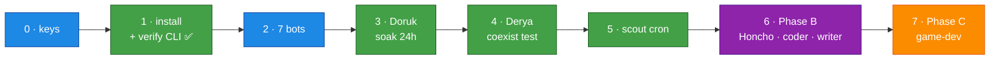

# Deployment Runbook

[← All docs](../README.md)

---

The concern docs (01–12) explain *why*; this is the *what, in order*. Follow top-to-bottom.

> ⚠️ = a **verify-gate**: the plan makes an assumption about native Hermes that hasn't been tested against a live install. Confirm it before trusting it, and adjust the runbook if reality differs.

## Step 0 — Accounts & keys (before anything)

- [ ] **MiniMax $20 Token Plan** — platform.minimax.io. ⚠️ Confirm **M3 is included at the $20 tier**. Endpoint/model verified in v0.16.0 source: provider `minimax` reads `MINIMAX_API_KEY`, defaults to `https://api.minimax.io/anthropic` (override `MINIMAX_BASE_URL`; China: `api.minimaxi.com/anthropic`), model id `MiniMax-M3`. A `minimax-oauth` provider (account login, no key) also exists — if the Token Plan turns out to be subscription-style, use that instead ([docs/04 §5.2](04-models.md)).
- [~] **OpenRouter key** — **DEFERRED by decision (2026-06-07): start MiniMax-only.** Aux rides the MiniMax quota (provider aux default = M3); no fallback chain — a MiniMax outage silences the fleet until it passes. Revisit when: the 5h quota pinches, an always-on cron lands, or the first outage hurts. To add later: ~$10 one-time at openrouter.ai (also unlocks the 1000/day `:free` tier), fill `OPENROUTER_API_KEY` in bot-tokens.env, rerun setup-bots.sh, wire §5.5 + §5.7.
- [ ] **Codex creds** — existing `~/.codex/auth.json` (ChatGPT Desktop / Codex CLI) or be ready for device-code login (coder + writer — §5.3). ⚠️ Accepted-risk — read §5.0 first.
- [ ] **TinyFish key** — web research ([docs/08](08-web-search.md)).
- [ ] **Mac Mini M4** — macOS current; **auto-login enabled** so launchd agents survive reboot ([docs/01 §11](01-architecture.md)); Docker/OrbStack installed (for Honcho + SearXNG **only**).

## Step 1 — Install Hermes + verify the CLI ✅ DONE (2026-06-06)

- [x] Installed `hermes-agent 2026.6.5` via Homebrew → **Hermes v0.16.0**.
- [x] **CLI verbs verified** (gate resolved — plan corrected):
  - `hermes profile create <slug>` ✓ as assumed; also drops a wrapper at `~/.local/bin/<slug>` (`researcher setup` ≡ `hermes -p researcher setup`).
  - Profile selection is a **global `-p/--profile` flag**, not per-subcommand: `hermes -p <slug> setup`, `hermes -p <slug> gateway run`. (`setup --profile` / `gateway run --profile` don't exist.)
  - `hermes tools list` (subcommand, not `--list`).
  - **Layout:** named profiles live at `~/.hermes/profiles/<slug>/`, not `~/.hermes/<slug>/`. Logs: `profiles/<slug>/logs/gateway.log`.
- [x] **Supervision resolved: built-in.** `hermes -p <slug> gateway install` writes + bootstraps a per-profile launchd service, label `ai.hermes.gateway-<slug>` (`RunAtLoad` + `KeepAlive`, `HERMES_HOME` pinned). No hand-rolled plists ([docs/05 §7](05-deployment.md)). Fleet view: `hermes gateway list`.
- [x] All 7 profiles created (`general researcher assistant ops coder writer producer`) — idle until each gets keys + gateway install in its phase.
- [x] **Telegram extra installed** — `python-telegram-bot` is not bundled by the Homebrew formula; installed into its venv (`$(brew --prefix hermes-agent)/libexec/bin/python -m pip install python-telegram-bot`). ⚠️ Re-run after every `brew upgrade hermes-agent` ([docs/10 §14](10-operations.md)).

## Step 2 — Telegram bots ×7 — ⏳ 5/7 DONE (2026-06-07)

- [~] @BotFather → `/newbot`: **5 of 7 created** (general, researcher, assistant, ops, writer). `coder` + `producer` blocked by BotFather's ~24h rate limit — both are Phase B+ anyway. Create after cooldown, paste tokens, rerun the script.
- [x] bot-tokens.env filled: `ALLOWED_USERS` + 5 tokens + `MINIMAX_API_KEY` + `TINYFISH_API_KEY` (OpenRouter deferred — Step 0).
- [x] `./scripts/setup-bots.sh` ran clean — all 5 tokens passed `getMe`; keys fanned out to profile `.env`s.
- [x] Per bot in BotFather: `/setprivacy` Disable, `/setjoingroups` Disable — done 2026-06-07 for the 5 existing bots. (New BotFather UI: buttons are **Group Privacy** and **Allow Groups?**.) Repeat for coder + producer when created.

## Step 3 — Phase A: researcher (Doruk) end-to-end ✅ DONE except soak (2026-06-07)

- [x] Profile created (Step 1); slug renamed `research` → `researcher`.
- [x] `config.yaml`: `provider: minimax` / `default: MiniMax-M3` — **MiniMax key live-tested against both endpoints** (`/v1/text/chatcompletion_v2` and the Anthropic-compatible `/anthropic/v1/messages` Hermes uses); M3 confirmed on the $20 plan (Step 0 gate resolved). Default base URL correct, no `MINIMAX_BASE_URL` needed. Note: `config set` writes YAML lists as strings — write `disabled_toolsets` into config.yaml by hand.
- [~] ~~OpenRouter aux + fallback chain + fallback live test~~ — **deferred with the OpenRouter key (Step 0)**. When the key lands, do all three together; an untested fallback is no fallback.
- [x] Doruk SOUL.md written; toolsets pruned per docs/05 §6.6 matrix.
- [x] Foreground `gateway run` test: inbound Telegram message → M3 reply in 16.8s; session file created. Then `hermes -p researcher gateway install` → launchd service `ai.hermes.gateway-researcher` running.
- [x] **Watchdog installed + live-tested**: `bootout` researcher → DOWN alert arrived in Telegram (via the general bot) → `bootstrap` back → restart-detection alert → healthy run silent. Gotcha confirmed: you must have messaged the **general** bot once or sendMessage 400s (bots can't initiate chats).
- [x] **24 h soak** — started 2026-06-07 ~01:30; interim check at 12:12 (10.7h): zero restarts, 0 errors in logs, RAM ~200 MB/gateway (far under budget), system 75% free, watchdog silent. Memory continuity ✓ (cross-session recall verified). Formal 24h mark passes tonight; nothing blocking. Skill-creation acceptance (docs/05 Phase 1) left to verify organically in week-1 use.

## Step 4 — Phase A: general (Derya) + isolation tests — ✅ mostly DONE (2026-06-07)

- [x] Same pattern, profile `general` — Derya SOUL, MiniMax M3 (Codex fallback deferred to Phase B with Codex creds). Gateway under launchd, answered in 10.5s.
- [x] `general` in the watchdog's `EXPECTED` list from day one.
- [x] **Per-profile state test** (docs/05 Phase 2) — PASSED 2026-06-07: memory note given to Doruk; Derya asked → "Söylemedin bana — bilmiyorum" (doesn't know it). State isolation confirmed.
- [x] **Independent-lifecycle test**: passed implicitly during the watchdog test — Derya answered while researcher was booted out.

## Step 5 — Game-scout cron

- [ ] Add `~/.hermes/profiles/researcher/cron/game-scout.yaml` ([docs/11 §16.5](11-game-dev.md)); `/sethome` in the researcher bot. Confirm the Monday digest lands in Telegram.

## Step 6 — Phase B (only once Phase A is proven)

- [ ] **Honcho** — 5-container stack via Docker, bound `127.0.0.1:8000` ([docs/07 §9.3](07-memory.md)). ⚠️ Validate `honcho.json` peer config (peers = **slugs**) + agents reach it over loopback.
- [ ] **SearXNG** — Docker, `127.0.0.1:8888` ([docs/08 §10.4](08-web-search.md)).
- [ ] **TinyFish MCP** — wire + key (docs/08).
- [ ] Add profiles: **Tuna** (assistant, MiniMax) · **Naz** (coder — **Codex**, `terminal`+`code_execution`, Godot projects, fenced per [docs/09 §13.7](09-security.md)) · **Ozan** (writer — Codex). ⚠️ **coder is the ToS + shared-ChatGPT-quota watch-point** (§5.3); A/B it vs M3 / DeepSeek V4 Pro (§5.12).
- [ ] Wire Honcho peers on the agents that use it (docs/07).

## Step 7 — Phase C: game-dev

- [ ] A picked idea (16.9 gate) → **Ozan** lean PRD → **Naz** Godot prototype, native on the Mini's **Metal GPU** ([docs/11](11-game-dev.md)).

## Deferred — don't build at first

- **ops (Nilay)** — only once there's a fleet to watch, **and** after deciding safe host-visibility (host-metrics mount, never the Docker socket — [docs/10 open-Q](10-operations.md)).
- **producer (Sarp)** — when the game-idea backlog outpaces hand-curation ([docs/11 §16.3](11-game-dev.md)).
- **kanban** — off until recurring auto-handoffs are real ([docs/12 §17.3](12-agent-comms.md)).

## Optional / later

- **Tailscale** — only if you enable the dashboard or HTTP API; Telegram needs none ([docs/06](06-networking.md)).
- **DeepSeek V4 Pro for coder** — the clean-API-key de-risk off Codex (§5.12).
- **Personal (non-studio) agents** — finance, fitness, etc., one profile per domain ([docs/02 §2.2](02-agents.md)).

---

**Critical path to a first running fleet:** Step 0 → 1 → 2 → 3. Everything after Step 5 is incremental. The riskiest unknowns are the ⚠️ gates in Steps 0–1 (native CLI, launchd, token-plan endpoint) — resolve those against the live install and the rest is mechanical.
