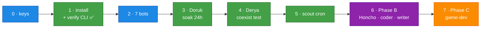

# Deployment Runbook

[← All docs](../README.md)

---

The concern docs (01–12) explain *why*; this is the *what, in order*. Follow top-to-bottom.

> ⚠️ = a **verify-gate**: the plan makes an assumption about native Hermes that hasn't been tested against a live install. Confirm it before trusting it, and adjust the runbook if reality differs.

## Step 0 — Accounts & keys (before anything)

- [ ] **MiniMax $20 Token Plan** — platform.minimax.io. ⚠️ Confirm **M3 is included at the $20 tier**. Endpoint/model verified in v0.16.0 source: provider `minimax` reads `MINIMAX_API_KEY`, defaults to `https://api.minimax.io/anthropic` (override `MINIMAX_BASE_URL`; China: `api.minimaxi.com/anthropic`), model id `MiniMax-M3`. A `minimax-oauth` provider (account login, no key) also exists — if the Token Plan turns out to be subscription-style, use that instead ([docs/04 §5.2](04-models.md)).
- [ ] **OpenRouter key** — openrouter.ai, ~$5–10 credit (aux + fallback + overflow — §5.5).
- [ ] **Codex creds** — existing `~/.codex/auth.json` (ChatGPT Desktop / Codex CLI) or be ready for device-code login (coder + writer — §5.3). ⚠️ Accepted-risk — read §5.0 first.
- [ ] **TinyFish key** — web research ([docs/08](08-web-search.md)).
- [ ] **Mac Mini M4** — macOS current; **auto-login enabled** so launchd agents survive reboot ([docs/01 §11](01-architecture.md)); Docker/OrbStack installed (for Honcho + SearXNG **only**).

## Step 1 — Install Hermes + verify the CLI ✅ DONE (2026-06-06)

- [x] Installed `hermes-agent 2026.6.5` via Homebrew → **Hermes v0.16.0**.
- [x] **CLI verbs verified** (gate resolved — plan corrected):
  - `hermes profile create <slug>` ✓ as assumed; also drops a wrapper at `~/.local/bin/<slug>` (`research setup` ≡ `hermes -p research setup`).
  - Profile selection is a **global `-p/--profile` flag**, not per-subcommand: `hermes -p <slug> setup`, `hermes -p <slug> gateway run`. (`setup --profile` / `gateway run --profile` don't exist.)
  - `hermes tools list` (subcommand, not `--list`).
  - **Layout:** named profiles live at `~/.hermes/profiles/<slug>/`, not `~/.hermes/<slug>/`. Logs: `profiles/<slug>/logs/gateway.log`.
- [x] **Supervision resolved: built-in.** `hermes -p <slug> gateway install` writes + bootstraps a per-profile launchd service, label `ai.hermes.gateway-<slug>` (`RunAtLoad` + `KeepAlive`, `HERMES_HOME` pinned). No hand-rolled plists ([docs/05 §7](05-deployment.md)). Fleet view: `hermes gateway list`.
- [x] All 7 profiles created (`general research assistant ops coder writer producer`) — idle until each gets keys + gateway install in its phase.
- [x] **Telegram extra installed** — `python-telegram-bot` is not bundled by the Homebrew formula; installed into its venv (`$(brew --prefix hermes-agent)/libexec/bin/python -m pip install python-telegram-bot`). ⚠️ Re-run after every `brew upgrade hermes-agent` ([docs/10 §14](10-operations.md)).

## Step 2 — Telegram bots ×7

- [ ] @BotFather → `/newbot` ×7. Slug-based usernames `general_<you>_bot … producer_<you>_bot` ([docs/03](03-telegram-bots.md)). Save tokens.
- [ ] `cp scripts/bot-tokens.env.example scripts/bot-tokens.env && chmod 600 scripts/bot-tokens.env` → fill `ALLOWED_USERS` (@userinfobot) + the 7 tokens.
- [ ] `./scripts/setup-bots.sh` → sets bot profiles + writes `~/.hermes/profiles/<slug>/.env`. Watch for `getMe` **WARNING** lines (bad/revoked tokens).
- [ ] Per bot in BotFather: `/setprivacy` Disable, `/setjoingroups` Disable.

## Step 3 — Phase A: research (Doruk) end-to-end

- [x] `hermes profile create research` (done in Step 1) → next: `hermes -p research setup`.
- [ ] `config.yaml`: `provider: minimax` / `default: MiniMax-M3` (§5.2) — strings verified against v0.16.0 source (Step 0); default base URL is already `api.minimax.io/anthropic`, so set `MINIMAX_BASE_URL` only if your plan's endpoint differs.
- [ ] Add OpenRouter aux (§5.5) + fallback chain (§5.7).
- [ ] **Fallback live test** — break the MiniMax key on purpose (one bad char), message the bot, confirm the reply arrives via OpenRouter (provider visible in logs); restore the key. An untested fallback is no fallback.
- [ ] Write **Doruk** SOUL.md ([docs/02 §6.7](02-agents.md)); prune toolsets ([docs/05 §6.6](05-deployment.md)).
- [ ] `hermes -p research gateway install` (built-in launchd service). Message the bot → it answers; a session file appears under `~/.hermes/profiles/research/sessions/`.
- [ ] **Watchdog** ([docs/10 §14.5](10-operations.md)) — install `watchdog.sh` + its launchd plist. Test: `bootout` the research gateway → Telegram alert within 15 min → `bootstrap` it back. It then watches the soak below.
- [ ] **24 h soak** — healthy next morning, RAM in budget (Activity Monitor). Acceptance = docs/05 Phase 1.

## Step 4 — Phase A: general (Derya) + isolation tests

- [ ] Same pattern, profile `general` — Derya SOUL, MiniMax M3, Codex fallback.
- [ ] Add `general` to the watchdog's `EXPECTED` list (docs/10 §14.5).
- [ ] **Per-profile state test** (docs/05 Phase 2): a memory note in Doruk is **not** visible to Derya.
- [ ] **Independent-lifecycle test**: `launchctl kickstart -k` research → Derya keeps running.

## Step 5 — Game-scout cron

- [ ] Add `~/.hermes/profiles/research/cron/game-scout.yaml` ([docs/11 §16.5](11-game-dev.md)); `/sethome` in the research bot. Confirm the Monday digest lands in Telegram.

## Step 6 — Phase B (only once Phase A is proven)

- [ ] **Honcho** — 5-container stack via Docker, bound `127.0.0.1:8000` ([docs/07 §9.3](07-memory.md)). ⚠️ Validate `honcho.json` peer config (peers = **slugs**) + agents reach it over loopback.
- [ ] **SearXNG** — Docker, `127.0.0.1:8888` ([docs/08 §10.4](08-web-search.md)).
- [ ] **TinyFish MCP** — wire + key (docs/08).
- [ ] Add profiles: **Tuna** (assistant, MiniMax) · **Naz** (coder — **Codex**, `terminal`+`code_execution`, Godot projects, fenced per [docs/09 §13.7](09-security.md)) · **Ozan** (writer — Codex). ⚠️ **coder is the ToS + shared-ChatGPT-quota watch-point** (§5.3); A/B it vs M3 / DeepSeek V4 Pro (§5.12).
- [ ] Wire Honcho peers on the agents that use it (docs/07).

## Step 7 — Phase C: game-dev

- [ ] A picked idea (16.9 gate) → **Ozan** lean PRD → **Naz** Godot prototype, native on the Mini's **Metal GPU** ([docs/11](11-game-dev.md)).

## Deferred — don't build at first

- **ops (Nilay)** — only once there's a fleet to watch, **and** after deciding safe host-visibility (host-metrics mount, never the Docker socket — [docs/10 open-Q](10-operations.md)).
- **producer (Sarp)** — when the game-idea backlog outpaces hand-curation ([docs/11 §16.3](11-game-dev.md)).
- **kanban** — off until recurring auto-handoffs are real ([docs/12 §17.3](12-agent-comms.md)).

## Optional / later

- **Tailscale** — only if you enable the dashboard or HTTP API; Telegram needs none ([docs/06](06-networking.md)).
- **DeepSeek V4 Pro for coder** — the clean-API-key de-risk off Codex (§5.12).
- **Personal (non-studio) agents** — finance, fitness, etc., one profile per domain ([docs/02 §2.2](02-agents.md)).

---

**Critical path to a first running fleet:** Step 0 → 1 → 2 → 3. Everything after Step 5 is incremental. The riskiest unknowns are the ⚠️ gates in Steps 0–1 (native CLI, launchd, token-plan endpoint) — resolve those against the live install and the rest is mechanical.
