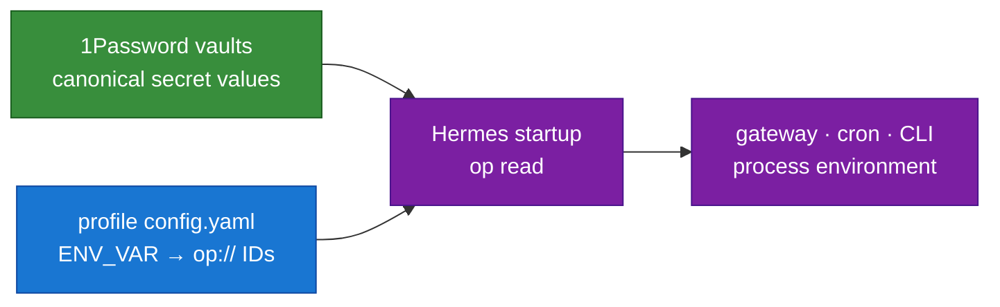

# Credential Management — 1Password Canonical Architecture

[← All docs](../README.md)

---

## Decision

**1Password is the canonical source of truth for every static service and integration credential used by the Hermes fleet.** Provider API keys, Telegram bot tokens, webhook signing secrets, static MCP credentials, and third-party service tokens live in 1Password items. They are not copied into chat, clipboard, Notion, Linear, the repository, `config.yaml`, `bot-tokens.env`, or profile `.env` files.

Hermes resolves secrets at process startup through its native `secrets.onepassword` integration. Profile configs contain only ID-based `op://` references; resolved values exist in process memory/environment only for the lifetime of the process.



## Vault and item convention

| Scope | Vault | Item |
|---|---|---|
| Profile-local | `Hermes Agent - <Persona>` | `<Persona> - Secrets` |
| Fleet-shared | `Hermes Agent - Shared` | `Shared - Secrets` |

Use immutable vault/item/field IDs in `op://` references rather than display names. Display names may change; IDs are the stable runtime contract. A shared credential exists once in the shared item and is referenced by every profile that needs it.

## Hermes configuration shape

Each profile owns its own mappings:

```yaml
secrets:
  onepassword:
    enabled: true
    env:
      TELEGRAM_BOT_TOKEN: "op://<vault-id>/<item-id>/<field-id>"
      DEEPSEEK_API_KEY: "op://<vault-id>/<item-id>/<field-id>"
    service_account_token_env: OP_SERVICE_ACCOUNT_TOKEN
    binary_path: /opt/homebrew/bin/op
    cache_ttl_seconds: 0
    override_existing: true
```

The production fleet uses `override_existing: true`, making 1Password authoritative over stale environment values. `cache_ttl_seconds: 0` prevents resolved values from being written to Hermes' on-disk cache. Never place a literal secret in `config.yaml`.

Use the native CLI to add or remove mappings; do not hand-edit secret values:

```bash
hermes -p <profile> secrets onepassword set <ENV_VAR> 'op://<vault-id>/<item-id>/<field-id>'
hermes -p <profile> secrets onepassword status
hermes -p <profile> secrets onepassword sync
```

A mapping/config change and any required gateway restart remain approval-gated fleet operations. For Derya/general, Mutlu's `/restart` is the preferred restart path.

## Necessary exceptions

1Password cannot be the runtime store for credentials that must exist before 1Password can be opened, or for OAuth stores that Hermes must refresh and write back.

### 1Password bootstrap identity

Use one of the native `op` authentication paths:

- 1Password desktop/interactive session on a supervised desktop, or
- `OP_SERVICE_ACCOUNT_TOKEN` in profile-local `.op.env`, mode `0600`, for unattended gateways and crons.

The bootstrap token is the unavoidable root-of-trust exception. It is never stored in `config.yaml`, chat, clipboard, Notion, Linear, or the repository. Service accounts receive access only to the vaults required by that profile.

### Writable OAuth stores

Codex `auth.json`, Hermes `mcp-tokens/*.json`, Linear's OAuth JSON, and the official Notion CLI state under `general/home/.notion/` remain native local `0600` files because OAuth refresh/workspace state requires writeback. The other profiles link to the canonical Notion CLI directory rather than copying it. These are not alternate stores for static API keys. Static companion values — client secrets, webhook signing secrets, PATs, and API keys — remain in 1Password. See [Notion — Knowledge & Reporting](16-notion-knowledge-and-reporting.md) for the data-plane boundary.

## New credential workflow

1. Check whether the credential already exists in the profile or shared 1Password item.
2. Create or rotate it in the correct 1Password item without exposing the value to chat or clipboard.
3. Obtain the vault, item, and field IDs with the trusted `op` CLI.
4. Show the exact `hermes secrets onepassword set …` command/config diff and obtain Mutlu's approval.
5. Apply the mapping to only the profiles that need it.
6. Run `status` and `sync`; verify that references resolve without printing values.
7. Restart only the affected gateway after explicit approval, then verify health and a real provider/integration call.
8. Remove the superseded plaintext copy or old vault field only after the new path has passed end-to-end verification.

## Rotation and incident response

- Rotate the value once in 1Password; affected Hermes processes pick it up on their next start.
- For long-running gateways, restart only the affected profiles after approval.
- If a credential leaks, revoke it at the vendor first, rotate it in 1Password, verify mappings, then restart and smoke-test.
- If a service-account token leaks, revoke the 1Password service account token and replace the profile-local bootstrap token before restarting that profile.
- Never paste a secret into a diagnostic command, issue, log, transcript, or screenshot. Verify by status, fingerprint, vendor identity endpoint, or success/failure only.

## Retired paths

The following are historical and must not be used for new work:

- `scripts/bot-tokens.env` as a fleet secret source;
- `scripts/setup-bots.sh` fanning keys into profile `.env` files;
- copying OAuth client IDs or secrets through the clipboard;
- keeping dormant provider keys in every profile "just in case";
- Bitwarden or a zero-knowledge credential proxy as the default Hermes architecture.

A credential proxy remains a research candidate only if a future threat model requires the agent process never to receive downstream credentials. It is not needed for the current single-tenant fleet.

## Authoritative references

- Hermes Agent: <https://hermes-agent.nousresearch.com/docs/user-guide/secrets/onepassword>
- Canonical Notion decision: [Hermes secret management with 1Password](https://app.notion.com/p/Karar-Hermes-secret-y-netimi-i-in-1Password-Derya-39f0f1f676a0815ab831de0c3b99e03e)
