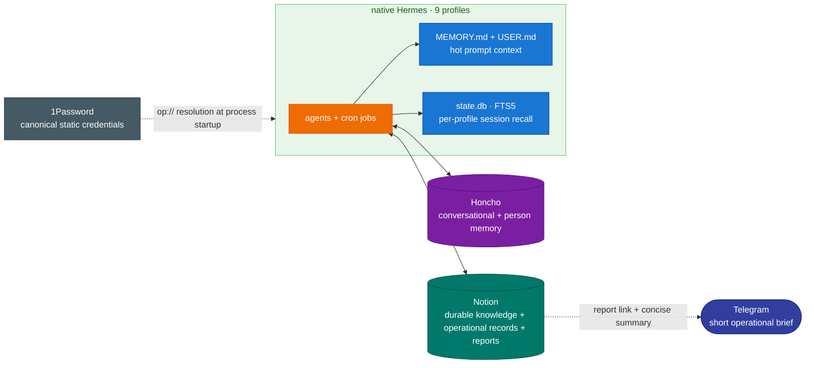

# Notion — Knowledge & Reporting Plane

[← All docs](../README.md)

---



## Decision

Notion is the fleet's **durable knowledge and reporting plane**. It is external to Hermes and additive to the three memory mechanisms described in [docs/07](07-memory.md):

- `MEMORY.md` / `USER.md` keep only compact facts that must be present in every turn.
- Per-profile SQLite session search recalls prior conversations on demand.
- Honcho derives conversational context and models the user/AI peers.
- **Notion stores structured, reusable, cross-profile knowledge and durable operational records.**

These systems are not interchangeable. Honcho is not the canonical store for project artifacts, research rows, decisions, tasks, or cron reports. Notion is not a credential store and must never contain tokens, API keys, signing secrets, or OAuth material.

## Live scope

All nine profiles can use the shared `notion-cli` and `notion-knowledge-ops` skills. The live OAuth surface is available to all profiles through the canonical Notion CLI state under the `general` profile and profile-local links to it.

The main canonical surfaces are:

| Surface | Canonical use |
|---|---|
| **Bilgi Kütüphanesi** | Stable, reusable knowledge; deduplicated before write and classified by source profile, domain, importance, confidence, visibility, and validity. |
| **Karar Günlüğü** | Material system and studio decisions with enough context to understand why the decision was made. |
| **Keşif Arşivi** | Stale or superseded knowledge moved out of the active library. |
| **Görevler** | Plans, issues, work, and completion state distinguished by Turkish `Tip` and `Durum` fields. |
| **Cron Raporları** | Detailed scheduled-job reports. Telegram receives only a concise rich-Markdown brief and the Notion link. |
| **Aday Yetenek Havuzu** | Skill, API, MCP, data-source, and method candidates; one canonical candidate record per item. |

Studio content remains under **Oyun Stüdyosu**. Hermes configuration, risks, incidents, and operating decisions remain under **Hermes Agent**. The same fact lives in one canonical record; other surfaces link to it rather than copying it.

## Read path

Use the cheapest trustworthy source in this order:

1. Honcho for semantic person/conversation context.
2. `session_search` for exact prior-session recall.
3. A direct `#ref:notion:<page_id>` when one is already known.
4. A structured Notion query for durable cross-profile knowledge.
5. The public web only when internal context is insufficient or freshness requires it.

Reading a Knowledge Library row updates its `Son Erişim` field. Pipeline consumers query by domain when cross-profile flow is intentional; they do not depend on another profile's local session database.

## Write path

Every durable write follows the same discipline:

1. Classify the information and choose its single canonical destination.
2. Check Honcho and the target Notion surface for an existing equivalent.
3. Read the live database/data-source schema before constructing properties.
4. Write Turkish property names and select values exactly as defined by the live schema.
5. Verify the created or updated page with a GET/read-back.
6. Store only a link elsewhere when another surface needs to reference the record.

Raw health and finance observations stay in their domain-specific stores. Secrets never enter Notion. Page and database titles do not contain emoji; icons use Notion's icon field.

## Authentication and security boundary

Notion uses OAuth user scope through the official `ntn` CLI. Its writable OAuth state is a documented local `0600` exception to the 1Password-only static-secret policy ([docs/15](15-credential-management.md)). Static service credentials remain canonical in 1Password and are resolved from ID-based `op://` references at process startup.

The canonical Notion CLI directory must contain the complete CLI state (`auth.json`, `config.json`, `workspaces.json`, and `cache/`), not only the token file. Never print or copy the contents of those files. Cron environments must use an absolute `NOTION_HOME` because Hermes redirects `HOME` per profile.

Non-secret health check:

```bash
export NOTION_KEYRING=0
export NOTION_HOME=/Users/YOU/.hermes/profiles/general/home/.notion
ntn whoami
ntn doctor
```

A successful identity check proves CLI access, not database schema correctness. Every write still begins with a live schema read and ends with a read-back verification.

## Operations and failure handling

- Weekly knowledge hygiene scans for expired rows, duplicate canonical keys, low-confidence unreferenced material, and domain leakage. Apply operations consume the scan report and verify every mutation.
- The Honcho → Notion bridge promotes durable conclusions; it does not mirror every conversation.
- If Notion is temporarily unavailable, retry transient failures with bounded backoff. Queue only a compact pending-sync record locally; remove it after a verified write.
- Notion is SaaS state. Local backups cover Hermes/Honcho state but do not replace Notion workspace retention/export controls.
- A Notion outage must not stop ordinary chat. It degrades durable reads/writes and reporting, while local memory and Honcho continue to operate.

## What belongs where

| Information | Canonical destination |
|---|---|
| User preference needed in every turn | `USER.md` / compact Hermes memory |
| Conversational pattern or inferred user model | Honcho |
| Exact previous discussion | Per-profile session search |
| Reusable researched fact or cross-profile knowledge | Notion Bilgi Kütüphanesi |
| Plan, issue, or completed operational work | Notion Görevler |
| Material Hermes decision, risk, or incident | Notion under Hermes Agent |
| Detailed scheduled-job output | Notion Cron Raporları |
| Secret or static credential | 1Password |
| OAuth refresh/writeback state | Profile-local `0600` OAuth store |

---
