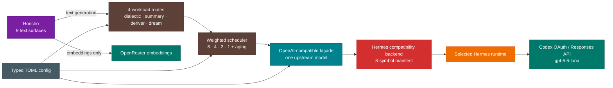

# Honcho Codex Adapter

Honcho-only OpenAI Chat Completions façade over Hermes-managed `openai-codex` OAuth. It does **not** start Hermes AIAgent, register tools, mutate Hermes config, or proxy embeddings.

## Runtime contract

- Bind: `127.0.0.1:18080`
- Upstream allowlist: `gpt-5.6-luna` only
- Concurrency: `1`
- Endpoints: `/healthz`, `/v1/models`, `/v1/chat/completions`
- Credentials: resolved per request by `hermes_cli.auth.resolve_codex_runtime_credentials()`
- Transport: Hermes `ResponsesApiTransport` plus its event-stream assembler
- Embeddings: remain on OpenRouter
- Runtime isolation: the adapter keeps its own venv while importing the selected Hermes contract through `PYTHONPATH`
- Python base: adapter and SDK venvs are built from the signed, notarized Python.org 3.13 runtime at `/Library/Frameworks/Python.framework/Versions/3.13/bin/python3.13`; production must not fall back to an ad-hoc Homebrew interpreter

Hermes private imports are isolated in `compat.py`; the HTTP, scheduler, validation,
and model contracts remain backend-independent. See [Architecture](docs/architecture.md)
for the runtime, configuration, and replacement boundaries.

## Architecture



## Configuration

`config/adapter.toml` is the canonical non-secret configuration. It controls the
loopback listener, upstream timeout/retry policy, admission capacity, queue weights,
workload route IDs/classes, and output tokenizer. Environment variables remain typed,
machine-specific overrides; the bearer key remains runtime-only.

```bash
PYTHONPATH=src .venv/bin/python -m honcho_codex_adapter.cli \
  --config config/adapter.toml --check-config
PYTHONPATH=src .venv/bin/python -m honcho_codex_adapter.cli \
  --config config/adapter.toml --print-effective-config
```

The effective output is secret-free. Invalid types, unknown top-level sections,
non-loopback hosts, incomplete queue weights, and invalid workload routes fail closed.

## Development

```bash
HERMES_PY=/absolute/path/to/selected/hermes/python
HERMES_ROOT="$($HERMES_PY -c 'import hermes_cli, pathlib; print(pathlib.Path(hermes_cli.__file__).resolve().parent.parent)')"
HERMES_SITE="$($HERMES_PY -c 'import site; print(site.getsitepackages()[0])')"
PYTHONPATH="src:$HERMES_ROOT:$HERMES_SITE" .venv/bin/python -m unittest discover -s tests -v
PYTHONPATH="src:$HERMES_ROOT:$HERMES_SITE" .venv/bin/python scripts/check_hermes_compat.py --json
PYTHONPATH="src:$HERMES_ROOT:$HERMES_SITE" .venv/bin/python scripts/live_probe.py
PYTHONPATH=src "$HERMES_PY" scripts/honcho_dream_tool_canary.py \
  --honcho-root /absolute/path/to/honcho-stack/server
docker compose -f /absolute/path/to/honcho-stack/server/docker-compose.yml \
  exec -T api python - < scripts/honcho_dream_effect_canary.py
```

The test suite reads Honcho's current `src/utils/agent_tools.py` through a
restricted AST extractor and checks every tool schema plus each active catalog
subset. Override its location with `HONCHO_AGENT_TOOLS_PATH` when needed.
The Dream canary loads the live Honcho deduction/induction catalogs and validates
all ten tool-call envelopes through the adapter. It never supplies tool results or
executes the returned calls, so observation and peer-card mutations are impossible.
The Dream effect canary is the separate mutation gate: it creates a uniquely prefixed
disposable workspace, invokes Honcho's real executor for deductive and inductive
observation writes, peer-card update, and observation delete, verifies a failed write
leaves zero mutations, retries that intent once, replays update/delete for idempotent
state, then cascade-deletes the fixture and requires zero workspace/document/peer
residue.

## Start locally

Provide the local bearer key via the process environment or the studio vault; never place it in this repository.

```bash
export HONCHO_CODEX_ADAPTER_API_KEY='[FROM VAULT]'
export HONCHO_CODEX_CONFIG="$PWD/config/adapter.toml"
PYTHONPATH="src:$HERMES_SITE" .venv/bin/python -m honcho_codex_adapter.cli \
  --config "$HONCHO_CODEX_CONFIG"
```

Admission overflow fails immediately with HTTP `503` / `queue_full`. Defaults remain
Dialectic 8 : Summary 4 : Deriver 2 : Dream 1, FIFO within each class, 30-second aging,
a 90-second upstream timeout, and zero SDK retries. Change them in TOML rather than
editing Python.

Active adapter base URL: `http://host.docker.internal:18080/v1`. All nine Honcho text-generation surfaces resolve through four workload route IDs: `honcho-deriver`, `honcho-summary`, `honcho-dialectic`, and `honcho-dream`. Route IDs select queue policy, not a model; all four map to the single upstream `gpt-5.6-luna`. Embeddings remain on OpenRouter and are intentionally outside this adapter.

## Operations

See [MAINTENANCE.md](MAINTENANCE.md) for routine operations and
[Hermes Upgrade Lifecycle](docs/upgrade-lifecycle.md) for side-by-side staging,
compatibility gates, promotion approval, and rollback.

## Current limitations

- Streaming is final-only SSE; the upstream request is still streamed and robustly assembled by Hermes.
- Client disconnect propagates through Hermes' `interrupt_check`; partial output is rejected and stream/client resources are closed.
- Non-empty `stop` fails closed. Codex OAuth rejects Responses `max_output_tokens`, so the adapter enforces caller limits on visible output with the `o200k_base` tokenizer: plain text is truncated with `finish_reason=length`, while over-limit structured JSON or tool calls fail closed with `output_limit_exceeded` instead of returning corrupted contracts. Upstream usage remains unmodified for honest quota telemetry.
- Tool calls are fail-closed: returned names and JSON arguments are validated against the caller's schema before Honcho can execute them.
- Hermes transport imports remain private but are isolated in one compatibility module and protected by a checked signature manifest on every Hermes upgrade.
- If the private contract fails, retain the HTTP façade and replace the driver with the official Codex App Server fallback.

## Official references

- [Codex authentication](https://developers.openai.com/codex/auth)
- [Responses API](https://developers.openai.com/api/reference/responses/overview/)
- [Create a response](https://developers.openai.com/api/reference/resources/responses/methods/create/)
- [Function calling](https://developers.openai.com/api/docs/guides/function-calling)
- [Structured outputs](https://developers.openai.com/api/docs/guides/structured-outputs)
