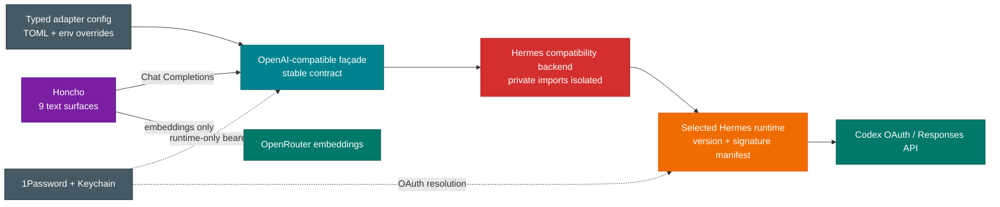
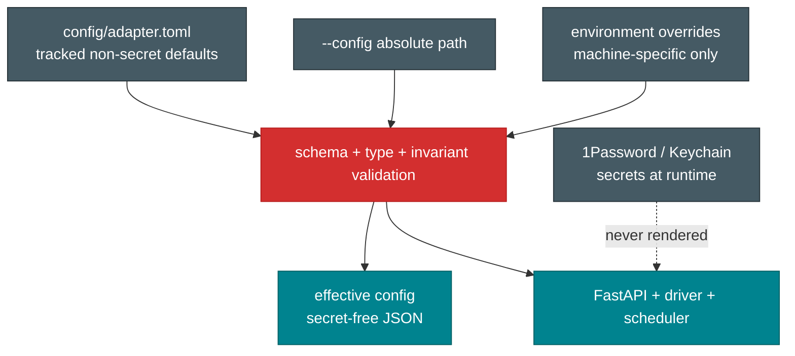

# Honcho Codex Adapter Architecture

## Scope

The adapter is a loopback-only OpenAI Chat Completions façade for Honcho's nine
text-generation surfaces. It does not proxy embeddings, expose Hermes tools, start a
Hermes agent, or mutate Hermes configuration. OpenRouter remains the embedding route.

## Runtime and control planes

## Dependency rule

Only `compat.py` may import Hermes modules. Only `backends/hermes.py` may construct the
Hermes-backed OpenAI transport. Request translation, scheduler policy, authentication,
output limits, model catalog, and HTTP contracts must not import Hermes internals.

The manifest at `compatibility/hermes-current.json` records the exact eight imported
symbols, their signatures, Python version, Hermes package version, and OpenAI SDK
version. A mismatch fails the candidate upgrade gate before a listener can be promoted.
The manifest is a compatibility declaration, not permission to overwrite production.

## Configuration flow

Precedence is built-in safe defaults, TOML file, then typed environment overrides. The
bearer key is never a TOML field and never appears in `--print-effective-config`.
Unknown top-level keys, non-loopback listeners, invalid model classes, incomplete queue
weights, and malformed values fail closed.

## Replaceable backend

The HTTP façade and `HermesCodexDriver` depend on the narrow `HermesBackend.invoke`
contract. If a Hermes release breaks the private API and adapting it is not justified,
replace that backend with the official Codex App Server backend. Do not weaken loopback,
authentication, schema, tool-call, cancellation, or output-limit controls to preserve a
private import.
