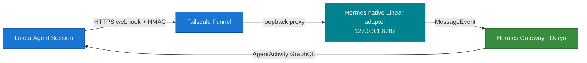

# Linear–Hermes Native Platform Adapter

A native Linear Agent Session platform plugin for Hermes Gateway. Linear is Derya's task and discussion surface; Hermes remains the conversation and execution layer. No separate bridge daemon or Hermes built-in webhook route is used.

## Architecture



- Plugin registration: Hermes `ctx.register_platform()` API.
- Public transport: Tailscale Funnel through an isolated userspace `tailscaled` sidecar.
- Listener: `127.0.0.1:8787` only.
- Endpoint: `POST /linear/webhook`.
- Health check: `GET /health`.
- Hermes core and Homebrew-managed files are never modified.

## Security and delivery guarantees

- `Linear-Signature`: HMAC-SHA256 over the exact raw request body.
- Replay protection: `webhookTimestamp`, ±60 seconds by default.
- Tenant pinning: the webhook organization ID must match the organization ID obtained from the OAuth identity.
- Signature rotation: `LINEAR_WEBHOOK_SECRET` plus optional `LINEAR_WEBHOOK_SECRET_PREVIOUS`.
- The pre-auth invalid-signature rate limiter is separate from the authenticated Hermes platform rate limiter.
- Default request-body limit: 256 KiB.
- SQLite claim/done ledger; stale processing claims can be reclaimed after a crash.
- Semantic event keys:
  - `created`: action + Agent Session ID
  - `prompted`: action + Agent Session ID + Agent Activity ID
  - fallback: raw-body hash
- Linear `webhookId` is subscription metadata and is not used as event identity.
- Linear issue, comment, and prompt content is labeled as untrusted user input, never as trusted instructions.

## Files

| Path | Purpose |
|---|---|
| `adapter.py` | Native platform lifecycle, webhook validation, and prompt/stop routing |
| `linear_client.py` | OAuth refresh and Linear GraphQL Agent Activity writes |
| `ledger.py` | Persistent semantic-dedup ledger |
| `plugin.yaml` | Hermes plugin manifest |
| `scripts/install_linear_oauth.py` | PKCE S256 app-user OAuth installer |
| `tests/test_native_platform.py` | Security, OAuth, prompt, stop, and dedup tests |

## Credential files

Real credentials stay outside the repository and must use mode `0600`:

```text
/Users/mutlupolatcan/.hermes/profiles/general/credentials/linear-bridge.env
/Users/mutlupolatcan/.hermes/profiles/general/credentials/linear-oauth.json
```

Signing-secret file:

```dotenv
LINEAR_WEBHOOK_SECRET=<current-secret>
LINEAR_WEBHOOK_SECRET_PREVIOUS=<previous-secret-during-rotation-only>
```

The installer writes the OAuth file atomically. Never log access or refresh tokens, and never copy them into the repository.

## OAuth setup

Configure this redirect URI in the Linear application:

```text
http://localhost:3000/oauth/callback
```

Copy the Client ID to the clipboard, then run:

```bash
/opt/homebrew/Cellar/hermes-agent/2026.7.1/libexec/bin/python \
  integrations/linear-hermes-platform/scripts/install_linear_oauth.py \
  --client-id-from-clipboard
```

The installer uses PKCE S256, opens browser consent, clears the clipboard, verifies the app-user identity, and writes the OAuth JSON file with mode `0600`.

## Hermes configuration

Platform section in `~/.hermes/profiles/general/config.yaml`:

```yaml
gateway:
  platforms:
    linear:
      enabled: true
      extra:
        host: 127.0.0.1
        port: 8787
        webhook_path: /linear/webhook
        credential_env_file: /Users/mutlupolatcan/.hermes/profiles/general/credentials/linear-bridge.env
        oauth_file: /Users/mutlupolatcan/.hermes/profiles/general/credentials/linear-oauth.json
        database_path: /Users/mutlupolatcan/.hermes/profiles/general/state/linear-bridge.sqlite3
        max_body_bytes: 262144
        replay_window_seconds: 60
        processing_timeout_seconds: 300
        dedup_retention_seconds: 604800
        preauth_rate_limit_per_minute: 120
```

The plugin source is deployed to the profile-local runtime directory:

```text
/Users/mutlupolatcan/.hermes/profiles/general/plugins/linear-hermes-platform/
```

A gateway restart is required after configuration or plugin changes. For Derya/general, the default safe operation is Mutlu issuing `/restart` from Telegram.

## Funnel

Funnel runs in a userspace sidecar isolated from the App Store Tailscale session, so Remote Desktop remains unaffected.

Public endpoint:

```text
https://hermes-funnel.tail7c4d1d.ts.net/linear/webhook
```

Health checks:

```bash
curl -fsS http://127.0.0.1:8787/health
curl -fsS https://hermes-funnel.tail7c4d1d.ts.net/health
```

## Tests

Use the Hermes-bundled Python; the system Python may not include gateway modules:

```bash
cd /Users/mutlupolatcan/Desktop/hermes-setup
/opt/homebrew/Cellar/hermes-agent/2026.7.1/libexec/bin/python \
  -m unittest discover \
  -s integrations/linear-hermes-platform/tests -v
```

Expected result: `15/15 OK`.

Coverage includes invalid signatures, replay attempts, organization mismatch, semantic dedup, legacy-ledger compatibility, OAuth token refresh and rotation, typed `agentActivity.content.body`, delegation, follow-up prompts, Stop hard-cancel, and session-lock release.

## Live acceptance criteria

1. A delegation `created` webhook returns `accepted`.
2. Thought and Hermes response activities appear in Linear.
3. A follow-up prompt reaches Derya and the response returns to Linear.
4. A Stop signal interrupts the active Hermes task through `/stop`.
5. The session becomes `complete`, with no extra error activity or residual process.
6. Retrying the same semantic event does not create duplicate execution.

## Rollback

1. Disable the Linear application webhook.
2. Disable the Funnel route.
3. Set `gateway.platforms.linear.enabled: false`.
4. Mutlu issues `/restart` from Telegram.
5. Restore the rollback copy from the profile-local runtime backup directory.

Rollback never touches the App Store Tailscale or Remote Desktop process. The former bridge daemon and the built-in webhook route on `127.0.0.1:8644` remain disabled unless a separate architectural decision explicitly restores them.
