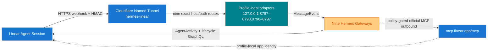

# Linear–Hermes Native Platform Adapter

A native Linear Agent Session platform plugin for Hermes Gateway. Linear is the human-facing task and discussion surface; Hermes remains the conversation and execution layer. The same tracked adapter code runs as nine isolated profile-local instances. No separate bridge daemon or Hermes built-in webhook route is used.

## Architecture



- Plugin registration: Hermes `ctx.register_platform()` API.
- Public transport: Cloudflare Named Tunnel `hermes-linear`, managed by `ai.hermes.cloudflared`.
- Listeners: nine dedicated loopback ports; see the fleet table below.
- Endpoint: `POST /linear/webhook`.
- Health check: `GET /health`.
- The retired Tailscale Funnel sidecar is not a fallback or rollback target. The normal Tailscale app remains private remote access only.

## Security and delivery guarantees

- `Linear-Signature`: HMAC-SHA256 over the exact raw request body.
- Replay protection: `webhookTimestamp`, ±60 seconds by default.
- Tenant pinning: the webhook organization ID must match the organization ID obtained from the OAuth identity.
- Signature rotation: `LINEAR_WEBHOOK_SECRET` plus optional `LINEAR_WEBHOOK_SECRET_PREVIOUS`.
- The pre-auth invalid-signature rate limiter is separate from the authenticated Hermes platform rate limiter.
- Default request-body limit: 256 KiB.
- SQLite claim/done ledger; stale processing claims can be reclaimed after a crash.
- Semantic event keys:
  - `created`: action + Agent Session ID
  - `prompted`: action + Agent Session ID + Agent Activity ID
  - fallback: raw-body hash
- Linear `webhookId` is subscription metadata and is not used as event identity.
- Human terminal reconciliation uses a second durable key over the authoritative issue revision (`updatedAt`), workflow state, human assignee, delegate, and team. Provider `completedAt` is audit-only. Duplicate webhook revisions therefore converge on one ordered pair: an ephemeral `thought` indicator followed by the final `response`.
- Linear issue, comment, and prompt content is labeled as untrusted user input, never as trusted instructions.

## Agent Session creation and execution policy

An Agent Session and a Hermes execution are different objects. Linear normally creates the native Agent Session when a human delegates or explicitly mentions an app-user. The sole adapter-initiated exception is the exact signed human terminal-to-started reopen contract documented below, which uses Linear's native `agentSessionCreateOnIssue` mutation after durable exactly-once and live authorization gates. The adapter may bind an accepted vendor session to an issue, but binding alone is not permission to run a model.

A completed manager activation is scoped to its exact Agent Session ID. Re-delivery of that same session remains a duplicate, but a later human mention that creates a distinct Agent Session ID proceeds through the normal fresh-session path. A stale `manager_activation=session_started` record therefore cannot poison future human mentions on the same still-open issue.

| Incoming signal | Session behavior | Hermes execution behavior |
|---|---|---|
| `AgentSessionEvent.created` from a human delegate/mention or an authorized different app-user handoff | Accept and durably bind the vendor-created session | Start only when lifecycle, dependency, dedup, and terminal-fence guards allow it. A blocked/parked issue waits; a fenced terminal issue reconciles closure and dispatches nothing. |
| `AgentSessionEvent.prompted` with a normal human follow-up | Reuse the existing vendor session; never create another one | Start one follow-up execution after dedup and closure guards. |
| `AgentSessionEvent.prompted` with `signal=stop` | Reuse the existing session | Cancel/stop the existing execution; never turn the stop text into a model prompt. |
| Human `Issue/update` from `started` to `completed` | Never create a session | With a durable binding, enqueue an ephemeral closure `thought` and then the final `response`. Without a binding, persist a healthy terminal fence; no model dispatch and no requirement for the human to mention the agent. |
| Other issue status, relation, dependency, notification, project, label, attachment, comment, or reaction event | Never create a session | Observe/context-only, or resume an already-bound durable dependency wait. Never dispatch a new session. |
| Event authored by this adapter's own installed app-user | No session change | Ignore for execution to prevent self-trigger loops. A different authorized app-user may still initiate an explicit cross-agent handoff. |

When human acceptance is required, the pre-completion elicitation asks only for the exact Linear UI state change. It must not ask the human to reply, report completion, or continue in the same Agent Session after `Done`; the signed transition drives closure automatically and the closed session is terminal-fenced.

The no-session terminal fence is intentionally durable: if a late vendor-created session arrives while the issue is still terminal, the adapter consumes the fence into closure reconciliation and suppresses the main execution. If the issue has been reopened, live read-back marks the old fence obsolete and the legitimate `created` flow may continue. An unbound fence is normal health (`terminal_fences`); only a bound session whose terminal verification cannot complete is an operational fault (`blocked_dispatch`) and degrades `/health`.

## Channel-independent canonical task routing

An authorized non-Linear gateway message is intercepted only when it begins with an explicit command in one of these forms: `OPS-159: <command>` or `https://linear.app/<workspace>/issue/OPS-159/<slug> — <command>`. Casual references such as `OPS-159 nasıl gidiyor?` remain ordinary chat. A stable source message ID and an available durable ledger are mandatory for canonical routing. If reservation is impossible, the hook still returns `skip`, sends an explanatory fail-closed notice, and never lets the explicit Linear task execute in the source-channel Hermes context.

Before the gateway skips normal source-channel execution, it synchronously reserves the stable source command in the profile-local SQLite ledger; no Linear network lookup happens first. The first source notice is explicitly provisional (durably reserved and validating, not dispatched). A separate confirmation is sent only after the native dispatch call and durable `dispatching → dispatched` transition both succeed; a failed final transition is fenced as `ambiguous` and never gets a success ACK. Source-notice delivery is informational and never changes the dispatch boundary.

The plugin then resolves the issue, delegate, workflow state and fully paginated Agent Sessions from Linear. Exactly one open (`pending`, `active`, or `awaitingInput`) session owned by the installed profile app-user must exist, and the issue must still be delegated to that app-user. Profile-aware resolution uses the primary registry only when `source.profile` is the active profile; stamped secondary profiles resolve exclusively through their own adapter registry and never fall back across profiles. Every recovery attempt reconstructs the stored source identity—including trusted Relay ingress, logical platform, scope/user discriminator and thread metadata—and re-runs the gateway's current authorization policy before any Linear lookup. Source notices use the standard adapter `metadata` contract, including platform-specific topic fields rather than non-contract send arguments. Authorization is checked again while holding the native session lock immediately before dispatch; revoked or unreconstructable authorization is blocked. The locked boundary also re-reads issue/session authorization, rejects issue or session drift, and checks the durable session-closure fence.

`channel_routes` uses a deterministic operation key namespaced by profile, native/Relay ingress, logical platform, scope, user, chat, thread and source message ID, then records the minimum profile-local replay envelope: source identity, scope/profile/Relay discriminator, explicit issue reference, and command text needed to reconstruct pre-dispatch work after restart. The command is retained only in profile-local SQLite state because the consumed source event otherwise cannot be replayed; it is not copied to shared knowledge surfaces. The ledger refuses directories not owned by the profile user or accessible to group/others, requires the profile-state directory to remain `0700`, pre-opens the main database with final-component `O_NOFOLLOW` where supported, retains that descriptor while SQLite connects, and verifies device/inode identity before proceeding. Pre-existing sidecar symlinks are rejected before and after WAL activation; the database plus real WAL/SHM files are forced to `0600`. The owner account is the filesystem trust boundary. Its states distinguish replayable `claimed`, `dispatching`, `dispatched`, `blocked`, terminal `failed`, and non-replayable `ambiguous` outcomes. The adapter-owned recovery worker processes at most 10 records per batch, applies bounded exponential backoff, and stops after five pre-dispatch attempts. Startup replays only `claimed` work; interrupted `dispatching` becomes `ambiguous`. Duplicate commands report recorded state rather than starting another execution. Shutdown cancels and drains the worker before closing the Linear client or ledger, and cancellation after the boundary is fenced as ambiguous. Terminal records follow the adapter retention policy. `failed` and `ambiguous` route counts are exposed by `/health` and degrade adapter health until reconciled or pruned. The v6 schema is created additively from production v5 databases.

If no single active native session is available for an explicit cross-channel command, the source channel receives the minimum fail-closed action: mention the display name returned for the installed Linear actor (for example, `@Doruk`) so Linear can create a fresh native AgentSession. The name is never profile-hard-coded. Closed sessions are never revived, and this cross-channel fallback never calls the reopen-only `agentSessionCreateOnIssue` path.

## AgentSession-first activity routing

When an actionable Agent Session is open, the session is the canonical execution stream. The current runtime uses `thought` for acknowledgements and transient progress (ephemeral when they represent only the current status), `elicitation` for questions and input requests, `error` for failures, and `response` for the deliverable. The final `response` is not duplicated with a manual completion comment.

Linear advertises `SUPPORTS_TRANSIENT_PROGRESS` separately from ordinary message editing. The plugin observes Hermes `pre_tool_call` events only inside an active Linear AgentSession, maps the trusted tool name to a fixed secret-safe status label, and schedules delivery on the adapter-owned event loop even though tool hooks execute in an executor thread. Raw arguments, results, paths, identifiers, and model reasoning are never rendered. Repeated tools in the same status category are deduplicated for the whole turn. Every accepted update carries the trusted per-turn delivery key plus typed `transient_progress` metadata and becomes a durable, idempotent, ephemeral `thought`; it never becomes a terminal `response`. Progress tasks belong to the adapter lifecycle, are rejected once shutdown begins, and are cancelled and awaited before the Linear client or ledger closes. Transient activities use a distinct outbox operation, so a permanently failed status cannot head-of-line block the later final response. The adapter deliberately does not expose ordinary `edit_message`. A final `response`, `elicitation`, or `error` replaces the latest ephemeral status in Linear; no periodic gateway heartbeat is required for tool progress.

The plugin also registers the provider-independent Hermes `on_interim_message` observer. A trusted main-turn `pre_tool_call` must present a non-empty hook `session_id` exactly equal to the bound `HERMES_SESSION_ID`; only then is that Hermes session deterministically routed to its profile, Linear AgentSession chat, and turn. Interim text that wins the hook-before-route race is held in an oldest-evicted 32-entry process buffer and is released only for the matching trusted session and turn. Observer text is whitespace-normalized, common credential assignments and bearer tokens are redacted, and the result is capped at 500 characters. The observer never reads tool arguments, tool results, or reasoning fields. Semantic updates are content-deduplicated and limited to three per turn, then use the existing deterministic transient outbox key. All observer state is lock-protected and bounded. Durable acceptance of a terminal response fences both not-yet-scheduled and already-queued progress; only a different trusted main-turn key reopens it. A background-review session mismatch therefore creates no AgentActivity, while a genuine follow-up turn can publish progress again. The narrow canonical heartbeat classifier and final-response body path are unchanged.

Residual: the currently accepted Hermes runtime's Codex-only `AIAgent._fire_streamed_codex_commentary` path calls `interim_assistant_callback` directly and does not invoke `on_interim_message`. The plugin does not monkeypatch or infer that path from text or the call stack. Consequently, Codex streamed commentary will begin reaching this observer only when Hermes core publishes the provider-independent hook; tool progress and existing heartbeats continue to work meanwhile. A focused compatibility test pins this residual so a future core release makes the assumption visibly stale instead of silently changing behavior.

Issue comments remain valid only for sessionless durable checkpoints, explicit mentions or handoffs, and human discussion that must outlive one execution. The outbound wrapper reads `Issue.agentSessions` authoritatively before every comment mutation. If the same app-user has a `pending`, `active`, or `awaitingInput` session, a normal `checkpoint` comment is rejected with `session_activity_required` before ledger reservation or vendor mutation and rechecked immediately before dispatch. The only model-facing exceptions are a declared `mention` or `handoff` whose body begins with the exact `User.url` of another live organization user; Linear's GraphQL API converts that plain profile URL into a native mention. The target URL is resolved authoritatively before ledger reservation, and comment updates cannot claim the exception. `comment_purpose` is local policy metadata and is never forwarded to Linear's official MCP. Issue workflow state remains the control-plane record; Notion remains the durable knowledge and rationale record. The adapter never creates an Agent Session merely to display progress.

For an authoritative human closure on a bound session, the durable outbox orders these deterministically keyed activities under one closure key:

1. ephemeral `thought`: `⏳ Done received — human acceptance and closure evidence are being verified…`
2. final `response`: the verified closure evidence

The final activity cannot overtake the indicator, retries reuse deterministic activity IDs, and delivering the indicator alone does not complete the closure reconciliation record. If the final response fails permanently after the indicator was delivered, the final item remains a redrivable dead letter and a separate deterministic `error` activity replaces the ephemeral status so it cannot remain stale.

## Files

| Path | Purpose |
|---|---|
| `adapter.py` | Native platform lifecycle, webhook validation, and prompt/stop routing |
| `oauth_store.py` | Shared profile-local OAuth read/refresh/rotation primitive with cross-process locking |
| `linear_client.py` | Linear GraphQL Agent Activity and inbound lifecycle operations using the shared OAuth store |
| `mcp_client.py` | Narrow Streamable HTTP transport for Linear's official MCP endpoint |
| `outbound_policy.py` | Fail-closed actor, organization, team, field, and sensitive-profile policy |
| `outbound_ledger.py` | Content-minimizing operation-key ledger for mutation replay and ambiguous outcomes |
| `linear_tools.py` | Approval-compatible Hermes model-tool registration and policy/transport orchestration |
| `ledger.py` | Persistent semantic-dedup ledger |
| `retention.py` | Standalone read-only Operations retention inventory, classifier, and manifest writer |
| `quota_watchdog.py` | Read-only, drift-checked workspace issue-quota counter and continuity policy |
| `plugin.yaml` | Hermes plugin manifest |
| `scripts/install_linear_oauth.py` | Attended localhost PKCE installer (legacy/interactive only) |
| `scripts/linear_mobile_pkce_once.py` | One-shot mobile PKCE installer using 1Password exact-field resolution |
| `scripts/linear_retention_dry_run.py` | Explicit-output retention dry-run CLI; it has no mutation path |
| `scripts/linear_quota_watchdog.py` | Standalone quota-watchdog CLI using the shared OAuth/client stack |
| `scripts/linear_quota_watchdog.sh` | `no_agent=true` Hermes cron wrapper |
| `tests/test_native_platform.py` | Security, OAuth, prompt, stop, and dedup tests |
| `tests/test_mobile_pkce.py` | Mobile callback, capability, path, no-clobber, and redaction tests |

## Workspace issue-quota watchdog

Weekly watchdog is secondary only; create-time gate is primary; no automatic deletion and blocked creates must reuse/dedup an existing issue/session/comment until approved retention frees capacity.

Every model-facing `linear_save_issue` create admitted by a profile-local mutation
allowlist takes the same fleet-global POSIX admission lock across all nine profiles,
then first resolves an existing exact operation-key replay through that profile's
outbound ledger and uses the watchdog's same complete, cursor-paginated, double-read
workspace inventory counter. Issues from every team, including OPS and GAME, count
toward the same Linear Free workspace limit. Every profile carries the same reviewed
workspace-team UUID manifest; both `organization.teams` and `administrableTeams`
must match that manifest exactly, with archived teams included. The organization
`createdIssueCount` field is deliberately not used because Linear documents it as
approximate. The lock remains held through ledger reservation,
vendor create, and the terminal ledger write. A projected total below 240 proceeds normally. A
projected total from 240 through 249 proceeds with structured `quota_admission`
counts and `immediate_retention_required=true` in the tool response. A projected
total of 250 or more fails closed before ledger reservation or vendor mutation with
`linear_policy_denied` / `quota_capacity_reserved_or_exhausted`. Inventory drift,
malformed issue/team identity, malformed pagination, and Linear API errors likewise fail
closed before reservation. Issue updates, lifecycle actions, and comments do not
take this lock or enter this create-time gate.

After ledger reservation, the complete workspace inventory is read again immediately
before vendor dispatch. Any count drift or inability to revalidate marks the reservation
failed and returns `quota_pre_dispatch_changed` without sending the create. This narrows
human/third-party writer races; Linear exposes no atomic quota-CAS mutation, so a residual
call-boundary race remains and the vendor's own capacity rejection is still authoritative.
Ambiguous vendor outcomes retain the durable fleet fence and never blind-retry.

The watchdog reads every workspace issue through root `issues` cursor pagination,
including archived issues from all teams, then repeats the inventory read and fails
closed unless the validated issue/team bytes and ordering are identical under the
same reviewed, fully administrable team manifest. A newly created or inaccessible
team is a governance/config drift and must be added to the reviewed manifest before
admission resumes. It has no
Linear mutation operation. Severity is
`warning` at 200, `high` at 225, and `critical` at 240 of the 250-issue capacity.
The buffer is `250 - total`.

Continuity uses the latest seven dated samples. Rolling net growth is the net
issue delta from the oldest to newest retained sample divided by elapsed days;
an exhaustion date exists only for positive growth. Alerts are emitted on the
first non-OK result, severity change, a cumulative five-issue movement since the
last alert, a change among unknown/growing/nonpositive trends, or an exhaustion
date movement of at least seven days. Repeated unchanged evaluations are silent.

Create a dedicated, already-existing directory owned by the runtime user at
exactly mode `0700`; pass it explicitly rather than placing continuity beside
OAuth credentials. The sole durable watchdog file is secret-free JSON at mode
`0600`. A corrupt file, unsafe permissions, malformed identity, incomplete page, or
inventory drift aborts without replacing state or emitting an alert.

```bash
install -d -m 0700 /absolute/profile/state/linear-quota-watchdog
/Users/mutlupolatcan/.hermes/runtime/hermes-agent/venv/bin/python \
  integrations/linear-hermes-platform/scripts/linear_quota_watchdog.py \
  --oauth-file /absolute/profile/credentials/linear-oauth.json \
  --state-dir /absolute/profile/state/linear-quota-watchdog \
  --expected-team-id 772a55a0-9914-4a36-a0c2-d026ef421324 \
  --expected-team-id 01f1c4eb-8bca-4d5b-aa70-ef2abfb099c4 \
  --dry-run
```

`--dry-run` emits one canonical JSON summary and does not write watchdog state.
Normal stdout is either the exact user-facing alert plus a newline or zero bytes.
For Hermes cron with `no_agent=true`, configure the wrapper's `LINEAR_OAUTH_FILE`,
`LINEAR_QUOTA_STATE_DIR`, `LINEAR_QUOTA_OPERATIONS_TEAM_ID`, and
`LINEAR_QUOTA_GAME_TEAM_ID` values and execute `scripts/linear_quota_watchdog.sh`.
The CLI still accepts deprecated `--team-id` and `--expected-team-key` flags for
external wrapper compatibility, but ignores them: they never scope or filter the
workspace-wide count. The wrapper forwards `--dry-run` when supplied. Do not place
tokens in the cron definition or wrapper.

## Semantic lifecycle actions

The model-facing issue tool never accepts a raw workflow `state`. It exposes four semantic actions: `start`, `complete_child`, `cancel_child`, and `enrich_plan`. The three state actions cannot be bundled with another issue mutation. `enrich_plan` accepts only the issue ID, exact `expected_updated_at` revision, and a structured description.

`start` resolves the team's lowest-position `started` state from live Linear data. It dispatches the exact state ID through the official MCP only when the issue is `backlog` or `unstarted`, the source state ID is present, the authoritative team is allowlisted, and the live delegate equals the profile app-user. Already-started is an idempotent no-op; terminal and custom states are never overwritten.

`complete_child` and `cancel_child` remain restricted to creator-owned technical children. The immutable creator must equal the profile app-user; the issue must have a non-terminal parent assigned to a distinct authoritative human (`assignee.app == false`); and the creator must have no open Agent Session on the child. For self-delegated work, the live delegate must also equal the profile app-user. A narrow `general` manager-completion path additionally permits `complete_child`—never `cancel_child`—when the creator is the manager profile, the child and parent share a non-empty project, exactly one Agent Session belongs to the live specialist delegate, that session is `complete`, its fully paginated activities contain a non-empty terminal `response`, and no Agent Session on the child is open. Completion additionally requires no open blocker. Cancellation may proceed with blockers only for self-delegated work because superseded or failed work can legitimately be canceled. The wrapper resolves the team's lowest-position state of the requested terminal type and never exposes raw state IDs to the model. Already-completed/already-canceled is an idempotent no-op, while an opposite terminal state is preserved.

`enrich_plan` is the sparse-intake planning gate. The live delegate must equal the acting profile app-user, the assignee must be an authoritative human, and the issue must be non-terminal. The caller first reads the live issue and supplies its exact `updatedAt`; the source description must be empty or at most 500 characters and must not already contain the plan headings. The wrapper requires a minimum detailed template with purpose, scope/out-of-scope, execution plan, child/dependency model, acceptance, verification/evidence, and rollback sections. Those headings must be anchored, unique, ordered, and substantive, and any original human brief must be preserved verbatim inside the expanded plan. It re-reads the revision immediately before dispatch and verifies the exact description plus unchanged ownership/state after dispatch. A concurrent human edit fails before mutation; ambiguous post-dispatch state becomes durable `outcome_unknown`. Exact replay or an already-identical plan is a no-mutation idempotent result. Standard existing-issue description updates are denied, while new issue creation may still include an initial brief. Planned-activation prompts require this write-back before substantive execution, so Linear remains an executable control-plane record rather than an empty Notion pointer.

Linear currently exposes no conditional issue mutation for these predicates. The wrapper re-reads all mutable authorization inputs after ledger reservation and immediately before dispatch, then verifies immutable creator ownership, team, delegate, parent ownership/state, Agent Sessions, blockers, and the exact terminal state after dispatch. A pre-dispatch change produces a durable failed operation with no vendor mutation. A post-dispatch mismatch produces `outcome_unknown` and is never automatically retried. The remaining narrow call boundary is accepted only for vendor-recommended `start` and immutable-creator-owned child terminal actions; it never authorizes human-parent terminal transitions or raw state writes.

## Credential architecture

1Password is canonical for static Linear credentials. Each persona's webhook signing secret lives in its profile-scoped 1Password item and is resolved into the gateway process environment through the unattended SDK bootstrap. Process environment values take precedence over the legacy `credential_env_file`; plaintext secret files are not required for new rollouts. Secrets are never copied through chat, clipboard, the repository, Notion, or Linear.

The OAuth file is a necessary native `0600` exception because refresh-token rotation requires atomic writeback:

```text
/Users/mutlupolatcan/.hermes/profiles/<profile>/credentials/linear-oauth.json
```

Runtime variable names mapped to 1Password:

```dotenv
LINEAR_WEBHOOK_SECRET=<current-secret>
LINEAR_WEBHOOK_SECRET_PREVIOUS=<previous-secret-during-rotation-only>
```

`LinearOAuthStore` is the only OAuth owner abstraction. The inbound GraphQL client and the outbound official MCP client use that same profile-local file, lock domain, expiry check, refresh-token rotation, and atomic persistence path. The lock file is profile-local and mode `0600`; credentials are re-read after lock acquisition so concurrent consumers do not refresh a stale token twice. Hermes native MCP OAuth is intentionally not configured for these app authorizations because its separate token store would create a second refresh owner.

The installer and shared store write the OAuth file atomically with mode `0600`. Never log access or refresh tokens, and never copy them into the repository, chat, clipboard, Notion, or Linear.

## OAuth setup

The attended localhost installer is legacy/interactive only and uses:

```text
http://localhost:3000/oauth/callback
```

New profile rollouts use `linear_mobile_pkce_once.py` so consent can be completed from a phone without clipboard or Remote Desktop. Before running it, register the exact temporary HTTPS callback in the Linear application and route only that hostname/path through Cloudflare to the selected localhost port:

```text
https://<profile-oauth-host>/oauth/callback
```

The helper accepts only an exact `op://.../.../LINEAR_CLIENT_ID` reference; there is no raw `--client-id` or clipboard option. `OP_SERVICE_ACCOUNT_TOKEN` must be injected into the process by the profile-scoped Keychain/service-account bootstrap, never typed into chat, shell arguments, or logs.

```bash
/Users/mutlupolatcan/.hermes/runtime/hermes-gateway-sdk-bootstrap/venv/bin/python \
  integrations/linear-hermes-platform/scripts/linear_mobile_pkce_once.py \
  --client-id-reference 'op://<profile-vault>/<profile-item>/LINEAR_CLIENT_ID' \
  --public-base-url 'https://<profile-oauth-host>/oauth' \
  --expected-organization-id '<organization-id>' \
  --destination '/Users/mutlupolatcan/.hermes/profiles/<profile>/credentials/linear-oauth.json' \
  --bind-port <temporary-local-port>
```

Run that command only after the exact Linear redirect and temporary Cloudflare route have been reviewed and approved. The listener binds to `127.0.0.1`, prints a JSON-encoded one-shot `START_URL`, and shuts down after completion, denial, or timeout. Its timeout defaults to and cannot be set below `3600` seconds; the bounded maximum is `86400` seconds. The start URL contains a random capability. Its initial `GET` serves an inert confirmation form without creating PKCE state or consuming the capability, so messaging-app preview crawlers cannot burn the flow. Only the exact form `POST` consumes the capability and returns the Linear authorization redirect; every replay fails closed. The unguessable path capability is the CSRF defense for this one-shot form, and responses use `Referrer-Policy: no-referrer` to prevent path disclosure. Do not log or publish the URL. The helper enforces PKCE S256, exact host/path gates, organization verification, profile-root and symlink confinement, atomic no-clobber installation, and mode `0600`. Remove the temporary public route after the flow. OAuth tokens, the PKCE verifier, and service-account credentials must never enter the repository, chat, clipboard, Notion, or Linear.

## Hermes configuration

Platform section in `~/.hermes/profiles/<profile>/config.yaml` (example: Derya/general; use the profile-specific port and paths for every instance):

```yaml
gateway:
  platforms:
    linear:
      enabled: true
      extra:
        host: 127.0.0.1
        port: 8787
        webhook_path: /linear/webhook
        oauth_file: /Users/mutlupolatcan/.hermes/profiles/general/credentials/linear-oauth.json
        database_path: /Users/mutlupolatcan/.hermes/profiles/general/state/linear-bridge.sqlite3
        max_body_bytes: 262144
        replay_window_seconds: 60
        processing_timeout_seconds: 300
        dedup_retention_seconds: 604800
        preauth_rate_limit_per_minute: 120
        outbox_poll_seconds: 1
        outbox_base_delay_seconds: 2
        outbox_max_delay_seconds: 300
        data_change_events_enabled: true      # live since 0.5.0; selected data events are context/control only
        dependency_wait_enabled: true         # live; CAS suppresses duplicate live resumes after blocker closure
        dependency_poll_seconds: 60           # recovery only; no LLM polling
        planned_activation_enabled: false     # general-only canary: parked Backlog session resumes on verified human Todo
        activation_allowed_team_ids: []       # authoritative team UUIDs; empty fails closed
        planned_owner_ids: []                 # authoritative human assignee UUIDs; general uses Mutlu only
        closure_reconciliation_enabled: false # separate general-only canary/config gate
        closure_allowed_team_ids: []           # authoritative team UUIDs; empty fails closed
        issue_status_writeback_enabled: false # fleet policy: human owns workflow state
        outbound_mcp:
          enabled: false                    # Gate B: register no outbound tools by default
          mutations_enabled: false          # Gate C/D: read-only before any writes
          ledger_path: /Users/mutlupolatcan/.hermes/profiles/general/state/linear-outbound-mcp.sqlite3
          quota_admission_lock_path: /Users/mutlupolatcan/.hermes/state/locks/linear-quota-admission.lock
          quota_team_ids:
            - 772a55a0-9914-4a36-a0c2-d026ef421324  # OPS
            - 01f1c4eb-8bca-4d5b-aa70-ef2abfb099c4  # GAME
          quota_retention_team_id: 772a55a0-9914-4a36-a0c2-d026ef421324
          quota_retention_team_key: OPS
          quota_retention_minimum_age_days: 180
          endpoint: https://mcp.linear.app/mcp
          expected_actor_id: <profile-app-user-uuid>
          expected_organization_id: <installed-organization-uuid>
          allowed_team_ids:
            - <authoritative-team-uuid>
          sensitive_mode: standard          # health/finance use metadata_only
          metadata_templates: []            # exact approved strings only; no patterns
      home_channel:
        platform: linear
        chat_id: <dedicated-agent-session-id>
        name: Linear operational inbox
      gateway_restart_notification: false
```

The plugin source is deployed to each profile-local runtime directory:

```text
/Users/mutlupolatcan/.hermes/profiles/<profile>/plugins/linear/
```

The tracked deployment allowlist is exactly `__init__.py`, `adapter.py`, `ledger.py`, `linear_client.py`, `oauth_store.py`, `mcp_client.py`, `outbound_policy.py`, `outbound_ledger.py`, `linear_tools.py`, `retention.py`, and `plugin.yaml`. Copy only those eleven files from `integrations/linear-hermes-platform/`; never copy tests, caches, credentials, OAuth stores, or SQLite state. The `0.8.18` release candidate requires all nine profiles to establish source/runtime hash parity, fresh process activation, healthy queues, SQLite integrity, typed OPS+GAME quota configuration, and profile-scoped real AgentSession read canaries. General additionally requires a real human reopen canary before `0.8.18` may be called the accepted fleet baseline. Earlier versioned acceptances are historical evidence, not proof of what is serving now. Exact entry sets, symlink status, directory/file modes, source/runtime hashes, process restart, and `/health` version must be established by a fresh live audit for each target.

Deployment is an approval-gated operation, not a blind fleet copy. There is intentionally no partial shell recipe here: source review, promotion, rollback and runtime restart must remain one fail-closed procedure. For one named profile:

1. **Pin the reviewed source.** Record the approved commit, require a clean worktree, export the eleven allowlisted files from that commit (not mutable working-tree paths), and verify the reviewed SHA-256 manifest.
2. **Confine and serialize.** Validate every source, profile, plugin and backup ancestor as a real non-symlink directory under the expected roots; acquire a profile-specific exclusive lock before creating any stage or rollback path.
3. **Stage completely.** Create a unique same-filesystem stage directory at mode `0700`; install exactly the eleven allowlisted files at `0600`; reject symlinks, missing files, extra entries or hash mismatch.
4. **Preserve rollback.** Create a unique non-existing rollback slot at mode `0700`, print its immutable coordinates before mutation, and preserve the complete previous target there.
5. **Promote atomically.** Rename the complete staged directory into `/Users/mutlupolatcan/.hermes/profiles/<profile>/plugins/linear`. A state-aware `EXIT`/`HUP`/`INT`/`TERM` handler must restore the checked rollback whenever promotion does not reach verified state, while preserving a failed candidate for audit.
6. **Read back.** Verify target path confinement, exact eleven-file set, directory/file modes and source-manifest hashes after promotion. Release the lock only after this succeeds.
7. **Restart and accept.** Mutlu sends `/restart` in only that profile's Telegram chat; then run its local `/health`, local/public `405/401/404`, signed lifecycle and ledger checks. Keep rollback until acceptance is complete.
8. **Roll back symmetrically.** Stop or gate the named gateway, acquire the same profile lock, validate the exact printed rollback coordinates, preserve the failed current target, atomically restore the prior directory, read back its manifest/modes, release the lock, send `/restart`, and rerun acceptance. Never select “latest backup” heuristically.

The reviewed one-command helper is [`scripts/deploy_plugin.py`](scripts/deploy_plugin.py). It implements the source-manifest, descriptor confinement, profile lock, private staging, durable pre-mutation coordinates, state-aware signal recovery, atomic promotion, exact read-back and symmetric rollback invariants above. It deliberately does **not** edit Hermes config or restart a gateway.

Deployment is main-gated: any commit merged into `origin/main` is deployable,
and the SHA-256 manifest is computed from the pinned commit at deploy time
(git commits are immutable, so deploy-time hashing equals a pre-registered
review). The exact single-profile promotion command for the current main HEAD is:

```bash
/Users/mutlupolatcan/.hermes/runtime/hermes-agent/venv/bin/python \
  integrations/linear-hermes-platform/scripts/deploy_plugin.py deploy \
  --repo-root /Users/mutlupolatcan/.hermes/source/hermes-setup \
  --profiles-root /Users/mutlupolatcan/.hermes/profiles \
  --profile general
```

An explicit `--commit <full-sha>` may pin an older merged commit; the helper
rejects any commit that is not an ancestor of `origin/main`, so unreviewed
branch-only code can never reach a profile runtime. Each deploy records
`main_gated: true` alongside the immutable rollback coordinates.

The helper writes and prints the immutable rollback path and tree digest before the first rename. Rollback must use those exact values; never discover a backup by recency:

```bash
/Users/mutlupolatcan/.hermes/runtime/hermes-agent/venv/bin/python \
  integrations/linear-hermes-platform/scripts/deploy_plugin.py rollback \
  --profiles-root /Users/mutlupolatcan/.hermes/profiles \
  --profile general \
  --rollback-path '<exact rollback_path>' \
  --rollback-digest '<exact rollback_digest>'
```

Runtime promotion, config mutation and `/restart` remain separate approval gates. Runtime extras are preserved inside the exact rollback tree rather than copied into the new eleven-file target.

The read-only fleet audit must report five dimensions separately: allowlisted source/runtime hashes, exact entry sets, symlink status, directory/file modes, and the version served by the restarted process. A deployment must produce a new reviewed manifest for the named target rather than inheriting an older acceptance count.

| Persona | Profile | Loopback | Public hostname |
|---|---|---:|---|
| Derya | `general` | `127.0.0.1:8787` | `derya-linear.mutlupolatcan.com` |
| Doruk | `researcher` | `127.0.0.1:8788` | `doruk-linear.mutlupolatcan.com` |
| Tuna | `assistant` | `127.0.0.1:8789` | `tuna-linear.mutlupolatcan.com` |
| Naz | `coder` | `127.0.0.1:8790` | `naz-linear.mutlupolatcan.com` |
| Ozan | `writer` | `127.0.0.1:8791` | `ozan-linear.mutlupolatcan.com` |
| Sarp | `producer` | `127.0.0.1:8792` | `sarp-linear.mutlupolatcan.com` |
| Nilay | `marketing` | `127.0.0.1:8793` | `nilay-linear.mutlupolatcan.com` |
| Defne | `health` | `127.0.0.1:8796` | `defne-linear.mutlupolatcan.com` |
| Murat | `finance` | `127.0.0.1:8797` | `murat-linear.mutlupolatcan.com` |

`data_change_events_enabled` and `dependency_wait_enabled` are live on all nine profiles; data events remain control/context signals rather than free-form execution triggers. Planned activation and human-Done closure reconciliation are explicit on `general`; other profiles use their normal Direct/session lifecycle. Issue status writeback is disabled fleet-wide, so successful execution preserves issue state for Mutlu's final acceptance. Sensitive-profile content policy remains independently fail-closed.

## Official Linear MCP outbound tools

Outbound tools are independently gated from the inbound webhook adapter. With `outbound_mcp.enabled: false`, plugin 0.6.0 registers no Linear model tools and preserves the 0.5.0 runtime behavior. With `enabled: true` and `mutations_enabled: false`, only `linear_get_issue` and `linear_list_issues` are exposed. Mutation tools require both literal `mutations_enabled: true` and an explicit profile-local `allowed_mutation_tools` list. Derya/general may receive `linear_save_issue` plus `linear_save_comment` for coordination; specialist profiles may receive only `linear_save_comment`. A missing, empty, malformed, or unknown allowlist leaves the profile read-only. This gate is independent of the profile-global Hermes approval mode so ordinary terminal, cron, recovery, and coordination workflows are not forced into manual approval.

This source patch alone authorizes no live profile. Profile config rollout, plugin promotion, and gateway restart are separate operator-approval gates. The reviewed target shapes are:

```yaml
# Derya / general
outbound_mcp:
  mutations_enabled: true
  allowed_mutation_tools: [linear_save_issue, linear_save_comment]

# Specialist profile
outbound_mcp:
  mutations_enabled: true
  allowed_mutation_tools: [linear_save_comment]
```

Every call performs fail-closed profile checks:

1. GraphQL and official MCP identities must resolve to the same app user.
2. The actor and organization must match pinned profile IDs.
3. Every issue read and mutation is checked against an authoritative GraphQL team lookup; list reads require an exact allowlisted team UUID. `get_issue(includeRelations: true)` is denied until cross-team relation filtering exists.
4. Wrapper-only `operation_key` and `target_team_id` fields are stripped before the vendor call.
5. Unknown tools and fields are denied locally.
6. Parent and relation issue references are independently resolved and must belong to the exact authoritative target team, even when the profile is allowed to use multiple teams.
7. `metadata_only` profiles accept content-bearing fields only when their complete value exactly matches an approved template; actor, label, project, milestone, cycle, and state selectors must be UUIDs. Issue, comment, parent, and relation identifiers use canonical UUID/issue-reference formats; list limits are bounded integers. `priority`, `estimate`, and `dueDate` are not exposed in metadata-only mutations, and free-form list queries are denied. Pattern matching and silent redaction are intentionally not used.

Mutation authorization is capability-based rather than prompt-based. Registration preflights the complete tool-name set so a collision exposes no partial outbound surface, then applies the profile-local mutation allowlist. Derya may create issues, add same-team relations, delegate work, and write coordination comments without per-operation approval. Specialists report follow-up needs in their issue activity; Derya owns cross-agent task routing. The model-facing `linear_save_issue` schema does not expose `state`, and local policy rejects every attempted state transition even if a caller bypasses schema validation. It does preserve an explicit JSON `null` for `project`, matching the official `save_issue` contract and allowing a caller to clear project membership without conflating null with omission. No project lifecycle mutation is model-exposed: `linear_complete_project` is unknown to the registration allowlist and therefore fails closed. No agent tool can move an issue or project to `Done` or `Completed`; Mutlu performs final review and terminal transitions in Linear. Team, actor, organization, sensitive-data, authoritative relation, and idempotency gates remain fail-closed.

The mutation ledger is a dedicated `outbound_mcp.ledger_path`; both it and the inbound adapter's WAL-backed `database_path` must be present and absolute, and their canonical paths must be distinct. Before `mutations_enabled: true`, the ledger parent must already exist as an owner-controlled `0700` directory; it is never created or permission-widened by the plugin. A missing/non-`0700` parent, final-component symlink, existing non-`0600` file, or zero-byte placeholder leaves mutation tools unregistered while preserving read-only tools. Operators must quarantine an accidental empty placeholder rather than treating it as SQLite. If startup preflight already omitted the mutation tools, correct the filesystem and restart only that profile so registration reruns; the first approved mutation then creates the canonical `0600` database atomically. Registration is only an early availability gate: `OutboundLedger` repeats descriptor-based owner, mode, symlink, identity and schema checks on every call, so a post-registration filesystem change fails before vendor dispatch. Invalid or missing separation leaves mutation tools unregistered, while read tools do not instantiate a ledger. It stores no issue title, description, comment body, or raw operation key. It persists only SHA-256 of the operation key, canonical payload SHA-256, profile/actor/team IDs, status, result ID/error code, and timestamps. Reusing a key with a different payload or identity is denied. A completed, proven terminal failure, or `outcome_unknown` operation is never automatically dispatched again. Mutation success requires one JSON text result containing a non-empty authoritative `id`; timeouts, lost sessions, malformed/id-less success responses, MCP/JSON-RPC errors, and HTTP `429`/`5xx` responses are outcome-unknown because the vendor may have committed before the response was lost. Business/transport mutation retries are prohibited. HTTP `401` may refresh the shared credential store for future operations, but the current mutation is not redispatched and is recorded as `outcome_unknown`. The ledger never calls `sqlite3.connect()` with a pathname: a pinned private parent-directory descriptor and cross-process flock protect secure `openat(O_NOFOLLOW)` reads, SQLite is deserialized in memory, and complete bytes are persisted with private temp creation, `fsync`, and same-directory `renameat`. Exact canonical SQL, `table_xinfo`, PK index/xinfo, foreign keys, triggers, status semantics, integrity, owner, and modes fail closed.

Create admission additionally requires an explicit absolute
`outbound_mcp.quota_admission_lock_path` directly under the canonical
`~/.hermes/state/locks` root. Operators pre-provision that root as a runtime-user-owned
directory with exact mode `0700` and the regular lock file with exact mode `0600`;
the plugin never creates, replaces, chmods, or removes either. Every acquisition uses
a pinned directory descriptor, `O_NOFOLLOW`, `fstat`, and before/after inode identity
checks. A missing, moved, symlinked, wrongly owned, wrongly permissioned, or otherwise
unsafe lock fails a create closed before quota counting, ledger mutation, or vendor
mutation. It does not affect issue updates, lifecycle actions, or comments.

The official endpoint and vendor schemas remain vendor-owned. Hermes exposes only the reviewed four-tool subset, accepts only the reviewed `2025-03-26` and `2025-06-18` protocol revisions, exhausts bounded `tools/list` cursor pagination, pins the exact current 52-name vendor tool set, and pins exact property sets, required-key omission semantics, primitive/array schemas, requiredness, and accepted forwarded-field constraints for the five required vendor contracts. The exposed `priority` schema is numeric, while local policy narrows it to Linear's integer `0..4` semantics and rejects strings, booleans, fractions, and out-of-range values. JSON-RPC IDs require exact integer type/value. Responses are streamed under explicit byte, nesting, node, SSE-event, content-item, and text-length bounds; exactly one matching SSE envelope is required. Mutation ambiguity remains `outcome_unknown`. Schema or protocol drift fails closed before any business operation. OAuth, GraphQL, MCP POST, and MCP session DELETE requests do not follow redirects while carrying bearer credentials.

The dated live inventory, source map, decisions and runtime snapshot are recorded in [`docs/linear-mcp-contract-matrix-2026-08-06.md`](docs/linear-mcp-contract-matrix-2026-08-06.md).

## Localization boundary

Persona names are resolved from each installed Linear app actor at runtime and are never hard-coded in adapter logic. Protocol-facing activity and error text stays in English for consistent vendor/runtime behavior. Turkish copy is limited to the explicitly approved mobile OAuth confirmation UI and is covered by UI tests; credentials, capabilities, IDs, and machine-readable completion markers are not localized.

A gateway restart is required after configuration or plugin changes. Restart only the changed profile. For Derya/general, the default safe operation is Mutlu issuing `/restart` from Telegram.

The normal acknowledgment uses the installed Linear app actor name (`Derya`, `Doruk`, etc.); persona text is never hard-coded. To suppress Hermes' one-time “No home channel is set” notice, configure a dedicated long-lived operational-inbox Agent Session as `gateway.platforms.linear.home_channel.chat_id`. Do not use a disposable task session or an issue ID. Terminal operational-inbox sessions remain valid transport anchors: issue workflow state does not determine whether the Agent Session can receive an activity. Before any normal direct or cron delivery is queued, and again before every outbox transport attempt, the adapter reads that exact Agent Session authoritatively and verifies it belongs to the installed app-user. Closure reconciliation uses its separately verified ordered outbox path.

## Persistent activity outbox

All outbound `agentActivityCreate` operations are inserted into SQLite before network delivery. The outbox row contains a stable ID, Agent Session aggregate key, per-session sequence, operation, JSON payload, state (`pending`, `in_flight`, `delivered`, or `dead`), attempt count, next-attempt time, and delivery/error timestamps.

Delivery is ordered per Agent Session. The response activity containing completion evidence is persisted before the human review gate. Stale `in_flight` rows are reclaimed after restart. Retryable failures use exponential backoff capped by `outbox_max_delay_seconds`; Linear `retry_after` wins when supplied. Non-retryable failures become dead letters and appear in `/health` as `status: degraded` without turning the liveness endpoint into a restart loop.

Activity creates use the client-generated `AgentActivityCreateInput.id`, so replay after an ambiguous timeout reuses the same Linear entity ID. Producer retries use stable outbox IDs for thought, error, transient progress and response operations; normal responses receive one persisted UUID when accepted.

`issue_status_writeback_enabled` remains fail-closed `false` in production. `ProcessingOutcome.SUCCESS`, `FAILURE`, and `CANCELLED` all preserve the current issue workflow state. Queued, running, blocked and completed visibility lives in AgentSession activities and durable wait/closure state; Mutlu owns the issue's workflow transitions. The dormant `issueUpdate` implementation is not a production fallback and cannot be enabled merely by documenting a state mapping.


## Data-change events and dependency waiting

`AgentSessionEvent` remains the only source of a user directive. When `data_change_events_enabled` is true, signed `Issue`, `IssueRelation`, `Comment`, `IssueLabel`, `Project`, `ProjectUpdate`, `AppUserNotification`, `PermissionChange`, and OAuth revoke events pass organization validation and semantic dedup, but ordinary comments and project updates are context-only and do not start an LLM run. Two optional Issue/update controls may act without inventing a new directive: Planned activation can resume a durably parked Agent Session, while human terminal reconciliation emits closure activity without rerunning the deliverable or mutating terminal state. Inbox notification timestamps may use the documented ISO `createdAt` field. Explicit agent mentions must produce Linear's native Agent Session event; this is a live canary requirement, not a comment parser assumption. Events authored by the current Linear app actor are ignored to prevent self-trigger loops. An `issueUnassignedFromYou` notification cancels a durable wait, while OAuth revocation degrades `/health`.

When `planned_activation_enabled` is true, an allowlisted Mutlu-owned issue supports both intake shapes. If an Agent Session already exists while the issue is in Backlog, it is bound and parked in `activation_waits`; Hermes emits only a `thought`, not an `elicitation`. If no session exists, the verified `Backlog → Todo` event is first claimed in `manager_activations`, then the adapter assigns the installed Linear app through the official `IssueUpdateInput.delegateId` field; Linear's native delegation creates the manager Agent Session. An ambiguous delegate mutation is authoritatively read back: a confirmed target delegate reconciles to `delegated`, while an unresolved outcome remains `delegation_unknown` and is never blindly mutated again. A later same-key delivery may reconcile an already-present target delegate without another mutation.

`linear_save_issue(lifecycle_action="start")` is not a substitute for human Planned activation: it moves an unstarted issue directly to a started state and does not manufacture the signed owner event. Since `0.8.10`, one narrow recovery path covers an already parked session that was accidentally started before the owner returned it to Todo. Recovery requires an existing durable `activation_wait` in `waiting`, exact live owner/team/delegate/revision read-back, a signed event from the human assignee, previous state type `started`, and destination type `unstarted`. A wait-less `started → Todo`, a waiting `started → started`, wrong actor/team/owner/delegate, stale revision, Stop, or terminal issue remains rejected. This recovery widens neither manager activation nor raw state authority.

Immediately before either manager-session or parked-session dispatch, the adapter holds the issue lock shared with closure handling and re-reads the issue. Dispatch requires live Todo/`unstarted`, an allowlisted team, the configured human owner as assignee, and the installed app as delegate. Stop, terminal `completed`/`canceled`, owner drift, team drift, and delegate drift therefore win before dispatch. SQLite CAS provides one-shot dispatch during normal operation; it does not claim crash-level exactly-once delivery because core `handle_message` has no durable message-ID deduplication. The adapter persists `dispatch_unknown` before calling core and moves to `session_started` or `resumed` only after the call returns acceptance. A crash or lost acceptance leaves the row ambiguous, degrades `/health`, and is never auto-replayed. Official agent delegation behavior: <https://linear.app/developers/agents>.

When `closure_reconciliation_enabled` is true, the adapter accepts only a signed Issue/update whose `updatedFrom.stateId` resolves authoritatively to a `started` workflow state and whose live state is `completed`. Live GraphQL read-back must also prove the exact allowlisted team, signed webhook actor equals the current human assignee, installed app actor equals the current delegate, the webhook state ID equals the live terminal state ID, and live issue `updatedAt` exactly equals the signed webhook revision. Linear `issue.history` and `completedAt` are deliberately supplementary audit fields rather than mandatory policy inputs because reopened issues can expose an earlier terminal transition and retain the earlier completion timestamp even when current state and `updatedAt` are fresh. A locally recorded issue-to-Agent-Session binding is required only for writing a Linear Agent Activity, not for accepting the human terminal transition. If that local row is absent, the adapter first prefers exactly one authoritative open (`pending`, `active`, or `awaitingInput`) session owned by the installed app-user; when no open session exists, it may recover exactly one authoritative `complete` session owned by that app-user. Zero, ambiguous, stale, error, or unreadable candidates preserve the terminal fence and dispatch nothing. Without a recoverable binding, the adapter stores a terminal fence and returns `terminal_fenced`; this is a healthy settled control-plane state, not a request to create a session. Missing or mismatched authoritative evidence still fails closed. With a binding, the adapter atomically inserts canonical evidence plus an ordered deterministic ephemeral `thought` and final `response` into SQLite, wakes the background outbox worker, and returns without draining the global outbox in the webhook; restart recovery reclaims the same activity IDs, and later session bindings do not change the closure key. `/health` reports pending/completed/failed closure counts, healthy `terminal_fences`, and degraded `blocked_dispatch` or failed closure dead letters. The deprecated `pending_session_binding` field remains a compatibility alias for `blocked_dispatch`; it no longer counts healthy unbound fences. No Notion write occurs in the webhook path; only accepted live canary evidence is promoted later through the normal knowledge gate.

Agent output remains an immutable Agent Activity. Linear renders `response` and `elicitation` activities into the issue comment thread for human visibility; later execution context is reconstructed from frozen Agent Activities rather than editable comments.

When `dependency_wait_enabled` is true, a newly delegated issue is queried for incomplete inverse `blocks` relations before Hermes execution starts. If blockers exist, the adapter:

1. Writes the original prompt, Agent Session, issue, and blocker snapshot to `waiting_executions` in SQLite.
2. Persists an `elicitation` activity naming the blockers; Linear derives `awaitingInput`.
3. Does not enqueue the Hermes run.
4. Reconciles the issue after commit to close the blocker-completed-before-wait race.
5. Reconciles again on signed Issue/IssueRelation updates, with a low-frequency GraphQL recovery poll for missed webhooks.
6. Atomically claims `waiting -> resuming`, reuses the original stable delivery key, and suppresses concurrent live resume attempts when no blockers remain. Core dispatch does not provide crash-level exactly-once guarantees.

On resume, the adapter prepends its verified current dependency state before Linear's frozen creation `promptContext`. The snapshot may still contain historical `blocked-by` content; the trusted resume directive prevents that stale state from sending the execution back into wait.

Stop and delegate-removal events cancel a pending wait. Interrupted `resuming` rows return to `waiting` on adapter restart. `/health` reports waiting counts, oldest wait age, and the latest wait error; failed waits degrade health without causing a restart loop. The additive SQLite schema is versioned with `PRAGMA user_version=7`; version 3 adds issue/session linkage and durable closure evidence, version 4 adds a payload-minimized terminal-event fence, version 5 adds durable Planned activation waits and semantic activation claims, version 6 adds durable channel routing, and version 7 adds durable progress-turn fencing across eviction and restart. Back up `linear-bridge.sqlite3*` before first migration and retain the backup until live acceptance completes.

## Public ingress

Cloudflare routes only the exact webhook path; unmatched paths return `404`. The active public endpoints follow the fleet table above. Representative checks are:

```text
https://derya-linear.mutlupolatcan.com/linear/webhook
https://doruk-linear.mutlupolatcan.com/linear/webhook
```

Health and security checks:

```bash
personas=(derya doruk tuna naz ozan sarp nilay defne murat)
ports=(8787 8788 8789 8790 8791 8792 8793 8796 8797)
for index in {0..8}; do
  persona=${personas[$index]}
  port=${ports[$index]}
  local_base="http://127.0.0.1:$port"
  public_base="https://$persona-linear.mutlupolatcan.com"
  curl -fsS "$local_base/health" >/dev/null
  test "$(curl -sS -o /dev/null -w '%{http_code}' "$local_base/linear/webhook")" = 405
  test "$(curl -sS -o /dev/null -w '%{http_code}' -X POST "$local_base/linear/webhook")" = 401
  test "$(curl -sS -o /dev/null -w '%{http_code}' "$local_base/not-found")" = 404
  test "$(curl -sS -o /dev/null -w '%{http_code}' "$public_base/linear/webhook")" = 405
  test "$(curl -sS -o /dev/null -w '%{http_code}' -X POST "$public_base/linear/webhook")" = 401
  test "$(curl -sS -o /dev/null -w '%{http_code}' "$public_base/not-found")" = 404
done
```

Unsigned webhook requests must return `401`; webhook `GET` must return `405`; hostname root paths must return `404`. Cloudflare Access is not placed in front of Linear webhooks because vendor delivery cannot complete an interactive Access challenge.

## Operations retention dry run

The standalone retention command reuses the selected profile's `LinearOAuthStore` and `LinearClient` and issues GraphQL queries only. `retention.py` is part of the exact eleven-file gateway allowlist because create admission imports the same classifier; its standalone CLI still cannot archive, delete, update, or otherwise mutate Linear. It fails closed on incomplete or drifting inventory evidence and produces only aggregate JSON on stdout; issue candidates are written to the explicit output file at mode `0600`.

The same classifier is also wired into `linear_save_issue` create admission. Configure `outbound_mcp.quota_retention_team_id` to the Operations team UUID, `quota_retention_team_key: OPS`, and `quota_retention_minimum_age_days: 180` on every profile. After the authoritative workspace count projects 240 or more issues, admission runs the complete read-only Operations classifier in the same fleet-global lock before reservation or vendor dispatch and returns its aggregate result as `retention_dry_run`. With no exact verified successor attestations the in-memory run deliberately yields zero deletion candidates rather than inventing cleanup. A classifier/readback failure denies creation as `immediate_retention_dry_run_unavailable`; projected count 250 or higher returns both quota and retention evidence and never calls `save_issue`. The weekly watchdog remains a secondary trend safety net.

## Human reopen activation

For a still-delegated human-owned issue, a signed `completed/canceled → started` Issue update is a first-class activation edge. The adapter requires live assignee=event actor, allowed team, delegate=current app user, exact state/revision readback, a terminal previous state resolved from the authoritative team state set, and no open actor AgentSession. It durably claims the exact transition before calling Linear's native `agentSessionCreateOnIssue(issueId)` mutation. The resulting `created` webhook follows the existing manager-session ACK/progress/response path. Delivery replay produces no second session. A lost mutation response remains fenced against mutation retry, but the signed `created` webhook may reconcile it only when authoritative readback shows exactly one open current-app session whose ID equals the webhook session ID; otherwise ambiguity stays blocked. No Telegram execution or synthetic comment is created.

Prepare an operator-reviewed successor attestation file. Each source must name a distinct issue in the same complete Operations inventory and must carry an explicit boolean verification:

```json
{
  "OPS-123": {"successor": "OPS-456", "verified": true}
}
```

Run with an immutable cutoff so repeated runs over the same validated evidence envelope are byte-identical. The cutoff may equal, but must never be later than, the command's actual UTC run clock; there is no future-time tolerance:

```bash
/Users/mutlupolatcan/.hermes/runtime/hermes-agent/venv/bin/python \
  integrations/linear-hermes-platform/scripts/linear_retention_dry_run.py \
  --oauth-file /Users/mutlupolatcan/.hermes/profiles/general/credentials/linear-oauth.json \
  --team-id '<operations-team-uuid>' \
  --team-key OPS \
  --successors /private/path/verified-successors.json \
  --minimum-age-days 180 \
  --as-of 2026-08-18T12:00:00Z \
  --output /private/path/operations-retention-manifest.json
```

The two complete issue-and-comment evidence passes and the final ordered team-membership pass must match exactly; any identity, revision, comment, relation, attachment, ordering, membership, or other evidence drift aborts before classification and manifest writing. Each comment must have an ID, body, app-authorship classification, creation timestamp, and update timestamp. Missing, malformed, future, or pre-issue comment timestamps fail closed. Linear may report a comment `updatedAt` a fraction of a second before its `createdAt`, so those two vendor timestamps are validated independently and activity uses their maximum. Issue activity is the latest issue creation, update, completion/cancellation, comment creation, or comment update timestamp. Validation freezes all issue, comment, successor, cutoff, age, and team evidence into one immutable envelope; classification owns that envelope, and manifest construction accepts only the immutable classification result, never the mutable API inventory. The manifest sorts candidates by identifier and ID, and its `sha256` is computed from canonical JSON for every other manifest field. Terminal state, a coherent matching terminal timestamp no later than the immutable cutoff, minimum age, the verified successor, and an empty relationship graph are all required. Every issue referenced as a valid verified successor is retained, including in successor chains and cycles. Active/nonterminal issues, Operations inbox markers, human or ambiguous comment authorship, decision/security/incident terms, any parent/child/relation, attachment, document, HTTP or non-HTTP canonical pointers, young records, and malformed evidence are protected. Review the manifest; it is evidence only and is never input to an automatic deletion or archive workflow.

## Tests

Use the Hermes-bundled Python; the system Python may not include gateway modules:

```bash
cd /Users/mutlupolatcan/.hermes/source/hermes-setup
/Users/mutlupolatcan/.hermes/runtime/hermes-agent/venv/bin/python \
  -m unittest discover \
  -s integrations/linear-hermes-platform/tests -v
```

The suite count changes as regression cases are added; a successful run ends in `OK`. Planned-activation coverage must include normal `Backlog → Todo`, parked `started → Todo` recovery, waiting `started → started` rejection, wait-less `started → Todo` rejection, wrong actor/team/owner/delegate, stale revision, semantic duplicate, dispatch ambiguity, restart recovery, Stop/Done races, and terminal fencing. Source tests are necessary but not sufficient: rollout acceptance also requires a real AgentSession binding/activity canary and exact outbox/ledger read-back. `/health` exposes the active inbound `data_event_types` allowlist, activation ambiguity counts, and closure counts so a rollout can verify the accepted event contract and drain state without inspecting source files.

Long-running gateway heartbeats use the exact canonical grammar `⏳ Working — N min` with optional ASCII iteration and either a tool identifier or the exact core liveness description `receiving stream response`. Linear cannot edit progress messages, so release candidate `0.8.18` preserves the narrow grammar as an idempotent ephemeral `thought` and additionally suppresses every late heartbeat after a durable terminal activity until a trusted fresh turn opens. Arbitrary prose, leading whitespace, case drift, Unicode digits, multiline text and near matches remain terminal `response` candidates. This narrow adapter seam prevents control-plane progress from prematurely materializing as task delivery while preserving real final responses and terminal fences.

Coverage includes invalid signatures, replay attempts, organization mismatch, semantic dedup, legacy-ledger compatibility, populated v5→v7 migration, OAuth token refresh and rotation, two-consumer refresh locking, atomic shared-store persistence, GraphQL/MCP 401 rotation, MCP contract drift, ambiguous mutation non-retry and authoritative readback, actor/team/content-policy denial, operation-key replay, payload-content minimization, profile mutation capability registration, model-facing state-transition denial, typed `agentActivity.content.body`, delegation, concurrent manager-session CAS, dispatch ambiguity fencing, owner/delegate drift, activation-versus-Stop/Done barriers, follow-up prompts, Stop hard-cancel, persistent outbox restart recovery, ordered retries, client-generated activity IDs, success-state preservation for Mutlu's final acceptance, durable waiting recovery, one-shot live claims, blocker filtering, context-only data events, self-event suppression, human closure actor/team/delegate denial, closure duplicate suppression, closure restart recovery, delegate-removal cancellation, dead-letter re-drive, schema versioning, and human-owned status preservation.

## Live acceptance criteria

1. A delegation `created` webhook returns `accepted`.
2. Thought and Hermes response activities appear in Linear.
3. A follow-up prompt reaches the delegated persona/profile and the response returns to Linear.
4. A Stop signal interrupts the active Hermes task through `/stop`.
5. The session becomes `complete`, with no extra error activity or residual process.
6. Retrying the same semantic event does not create duplicate execution.
7. A blocked delegation returns `awaiting_input`, writes one `elicitation`, and starts no Hermes run.
8. Completing the final blocker resumes the same session; replaying the settled Issue webhook creates no concurrent second run.
9. Selected comments, projects, project updates, issue/project labels, issue attachments, and comment reactions are observed without an LLM run; self-authored events are ignored.
10. Delegate removal and Stop cancel durable waits; restart recovers an interrupted resume.
11. A live cross-agent mention canary proves that Linear emits the target agent's native Agent Session before cross-agent automation is enabled.
12. In the general-only canary, a human assignee's `started -> completed` transition produces an ephemeral closure `thought` followed by one final `response`, with no Telegram prompt, no second Hermes run, no state mutation, and closure/outbox pending/in-flight/dead counts of zero; replay and restart produce no duplicate activities.
13. A human-owned delegated issue moved from `Done/Completed` to `In Progress` creates exactly one fresh native AgentSession without another mention; the new session shows thought/progress/response on Linear, while replay, self, stale, drift, and open-session cases create zero additional sessions.
14. Projected `239 → 240` returns an immediate retention dry-run summary before create dispatch; `249 → 250` and `250 → 251` return quota plus retention evidence and dispatch no mutation.

## Rollback

1. For an outbound-only rollback, clear `outbound_mcp.allowed_mutation_tools`, then set `outbound_mcp.mutations_enabled: false`, then `outbound_mcp.enabled: false`; this removes model tools without disabling inbound Agent Sessions. Do not delete `linear_mcp_operations` rows, especially `outcome_unknown` evidence.
2. Set `closure_reconciliation_enabled: false`, then set `dependency_wait_enabled: false`, `data_change_events_enabled: false`, and `issue_status_writeback_enabled: false`; queued closure evidence remains in SQLite.
3. Disable the added Issue/Comment/Label/Project/ProjectUpdate data-change categories in the Linear application, retaining Agent Session events if the base canary remains healthy.
4. If one adapter instance must roll back, disable only that persona's Linear application webhook and Cloudflare hostname route; do not stop the shared connector while another persona remains live.
5. Set `gateway.platforms.linear.enabled: false` only when both outbound and the inbound platform must stop.
6. Mutlu issues `/restart` from Telegram.
7. Restore the pre-migration `linear-bridge.sqlite3*` backup only while the gateway is stopped. Do not delete the migrated database until pending/dead outbox rows, waiting executions, and MCP operation rows have been audited.

Rollback never touches the normal Tailscale app or Remote Desktop process. The retired Funnel sidecar, former bridge daemon, and built-in webhook route on `127.0.0.1:8644` remain disabled unless a separate architectural decision explicitly restores them.
