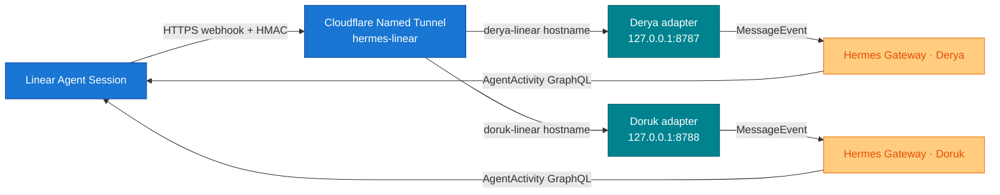

# Linear–Hermes Native Platform Adapter

A native Linear Agent Session platform plugin for Hermes Gateway. Linear is the human-facing task and discussion surface; Hermes remains the conversation and execution layer. The same adapter code runs as profile-local instances for Derya and Doruk. No separate bridge daemon or Hermes built-in webhook route is used.

## Architecture



- Plugin registration: Hermes `ctx.register_platform()` API.
- Public transport: Cloudflare Named Tunnel `hermes-linear`, managed by `ai.hermes.cloudflared`.
- Listeners: Derya `127.0.0.1:8787`; Doruk `127.0.0.1:8788`.
- Endpoint: `POST /linear/webhook`.
- Health check: `GET /health`.
- The retired Tailscale Funnel sidecar is not a fallback or rollback target. The normal Tailscale app remains private remote access only.

## Security and delivery guarantees

- `Linear-Signature`: HMAC-SHA256 over the exact raw request body.
- Replay protection: `webhookTimestamp`, ±60 seconds by default.
- Tenant pinning: the webhook organization ID must match the organization ID obtained from the OAuth identity.
- Signature rotation: `LINEAR_WEBHOOK_SECRET` plus optional `LINEAR_WEBHOOK_SECRET_PREVIOUS`.
- The pre-auth invalid-signature rate limiter is separate from the authenticated Hermes platform rate limiter.
- Default request-body limit: 256 KiB.
- SQLite claim/done ledger; stale processing claims can be reclaimed after a crash.
- Semantic event keys:
  - `created`: action + Agent Session ID
  - `prompted`: action + Agent Session ID + Agent Activity ID
  - fallback: raw-body hash
- Linear `webhookId` is subscription metadata and is not used as event identity.
- Linear issue, comment, and prompt content is labeled as untrusted user input, never as trusted instructions.

## Files

| Path | Purpose |
|---|---|
| `adapter.py` | Native platform lifecycle, webhook validation, and prompt/stop routing |
| `linear_client.py` | OAuth refresh and Linear GraphQL Agent Activity writes |
| `ledger.py` | Persistent semantic-dedup ledger |
| `plugin.yaml` | Hermes plugin manifest |
| `scripts/install_linear_oauth.py` | PKCE S256 app-user OAuth installer |
| `tests/test_native_platform.py` | Security, OAuth, prompt, stop, and dedup tests |

## Credential architecture

1Password is canonical for static Linear credentials. Each persona's webhook signing secret lives in its profile-scoped 1Password item and is resolved into the gateway process environment through the unattended SDK bootstrap. Process environment values take precedence over the legacy `credential_env_file`; plaintext secret files are not required for new rollouts. Secrets are never copied through chat, clipboard, the repository, Notion, or Linear.

The OAuth file is a necessary native `0600` exception because refresh-token rotation requires atomic writeback:

```text
/Users/mutlupolatcan/.hermes/profiles/<profile>/credentials/linear-oauth.json
```

Runtime variable names mapped to 1Password:

```dotenv
LINEAR_WEBHOOK_SECRET=<current-secret>
LINEAR_WEBHOOK_SECRET_PREVIOUS=<previous-secret-during-rotation-only>
```

The installer writes the OAuth file atomically with mode `0600`. Never log access or refresh tokens, and never copy them into the repository, chat, clipboard, Notion, or Linear.

## OAuth setup

Configure this redirect URI in the Linear application:

```text
http://localhost:3000/oauth/callback
```

Read the public Client ID from its approved source or 1Password reference without placing it on the clipboard, then run the installer through its non-clipboard input path. The client secret and webhook signing secret remain 1Password-backed.

```bash
/Users/mutlupolatcan/.hermes/runtime/hermes-agent/venv/bin/python \
  integrations/linear-hermes-platform/scripts/install_linear_oauth.py \
  --client-id "$LINEAR_CLIENT_ID"
```

The installer uses PKCE S256, opens browser consent, verifies the app-user identity, and writes the OAuth JSON file with mode `0600`. Do not pass a secret through command-line arguments; the Client ID is public metadata.

## Hermes configuration

Platform section in `~/.hermes/profiles/<profile>/config.yaml` (example: Derya/general; use the profile-specific port and paths for every instance):

```yaml
gateway:
  platforms:
    linear:
      enabled: true
      extra:
        host: 127.0.0.1
        port: 8787
        webhook_path: /linear/webhook
        credential_env_file: /Users/mutlupolatcan/.hermes/profiles/general/credentials/linear-bridge.env # optional legacy fallback
        oauth_file: /Users/mutlupolatcan/.hermes/profiles/general/credentials/linear-oauth.json
        database_path: /Users/mutlupolatcan/.hermes/profiles/general/state/linear-bridge.sqlite3
        max_body_bytes: 262144
        replay_window_seconds: 60
        processing_timeout_seconds: 300
        dedup_retention_seconds: 604800
        preauth_rate_limit_per_minute: 120
        outbox_poll_seconds: 1
        outbox_base_delay_seconds: 2
        outbox_max_delay_seconds: 300
        data_change_events_enabled: true      # live since 0.5.0; selected data events are context/control only
        dependency_wait_enabled: true         # live; blocked sessions resume exactly once after blocker closure
        dependency_poll_seconds: 60           # recovery only; no LLM polling
        issue_status_writeback_enabled: false # enable only after OPS-21 approval
        issue_status_mapping:
          queued: Todo
          running: In Progress
          blocked: Blocked
          done: Done
      home_channel:
        platform: linear
        chat_id: <dedicated-agent-session-id>
        name: Linear operational inbox
      gateway_restart_notification: false
```

The plugin source is deployed to each profile-local runtime directory:

```text
/Users/mutlupolatcan/.hermes/profiles/<profile>/plugins/linear-hermes-platform/
```

A gateway restart is required after configuration or plugin changes. Restart only the changed profile. For Derya/general, the default safe operation is Mutlu issuing `/restart` from Telegram.

The normal acknowledgment uses the installed Linear app actor name (`Derya`, `Doruk`, etc.); persona text is never hard-coded. To suppress Hermes' one-time “No home channel is set” notice, configure a dedicated long-lived operational-inbox Agent Session as `gateway.platforms.linear.home_channel.chat_id`. Do not use a disposable task session or an issue ID.

## Persistent outbox and issue status writeback

All outbound `agentActivityCreate` and `issueUpdate` operations are inserted into the same SQLite database before network delivery. The outbox row contains a stable ID, Agent Session aggregate key, per-session sequence, operation, JSON payload, state (`pending`, `in_flight`, `delivered`, or `dead`), attempt count, next-attempt time, and delivery/error timestamps.

Delivery is ordered per Agent Session. A later `Done` write cannot overtake the response activity that proves completion. Stale `in_flight` rows are reclaimed after restart. Retryable failures use exponential backoff capped by `outbox_max_delay_seconds`; Linear `retry_after` wins when supplied. Non-retryable failures become dead letters and appear in `/health` as `status: degraded` without turning the liveness endpoint into a restart loop.

Activity creates use the client-generated `AgentActivityCreateInput.id`, so replay after an ambiguous timeout reuses the same Linear entity ID. Issue state assignment is naturally idempotent. Producer retries use stable outbox IDs for thought, error, and status operations; normal responses receive one persisted UUID when accepted.

Execution-to-issue mapping:

| Execution state | Default Linear state | Trigger |
|---|---|---|
| `queued` | `Todo` | Accepted `created` Agent Session event |
| `running` | `In Progress` | Thought acknowledgement persisted |
| `blocked` | `Blocked` | An unresolved Linear `blocks` relation is durably recorded |
| `done` | `Done` | Successful response durably accepted |

`ProcessingOutcome.FAILURE` and `ProcessingOutcome.CANCELLED` intentionally preserve the current issue state: a transport, model, or cancellation signal does not prove a dependency blocker or completion. Terminal human states (`completed` or `canceled`) and custom human workflow states are never overwritten. Bridge-owned transitions use `Todo(10) -> Blocked(15) -> In Progress(20) -> Done(40)`, allowing automatic `Blocked -> In Progress` resume. State names are resolved against the issue team at delivery time; IDs are not hard-coded.

`issue_status_writeback_enabled` defaults to `false`. Enabling it is the separate OPS-21 approval and rollout action; the outbox code can be deployed and tested without changing issue states.


## Data-change events and dependency waiting

`AgentSessionEvent` remains the only direct execution trigger. When `data_change_events_enabled` is true, signed `Issue`, `IssueRelation`, `Comment`, `IssueLabel`, `Project`, `ProjectUpdate`, `AppUserNotification`, `PermissionChange`, and OAuth revoke events pass organization validation and semantic dedup, but ordinary comments and project updates are context-only and do not start an LLM run. Inbox notification timestamps may use the documented ISO `createdAt` field. Explicit agent mentions must produce Linear's native Agent Session event; this is a live canary requirement, not a comment parser assumption. Events authored by the current Linear app actor are ignored to prevent self-trigger loops. An `issueUnassignedFromYou` notification cancels a durable wait, while OAuth revocation degrades `/health`.

Agent output remains an immutable Agent Activity. Linear renders `response` and `elicitation` activities into the issue comment thread for human visibility; later execution context is reconstructed from frozen Agent Activities rather than editable comments.

When `dependency_wait_enabled` is true, a newly delegated issue is queried for incomplete inverse `blocks` relations before Hermes execution starts. If blockers exist, the adapter:

1. Writes the original prompt, Agent Session, issue, and blocker snapshot to `waiting_executions` in SQLite.
2. Persists an `elicitation` activity naming the blockers; Linear derives `awaitingInput`.
3. Does not enqueue the Hermes run.
4. Reconciles the issue after commit to close the blocker-completed-before-wait race.
5. Reconciles again on signed Issue/IssueRelation updates, with a low-frequency GraphQL recovery poll for missed webhooks.
6. Atomically claims `waiting -> resuming`, reuses the original stable delivery key, and starts the same Agent Session exactly once when no blockers remain.

On resume, the adapter prepends its verified current dependency state before Linear's frozen creation `promptContext`. The snapshot may still contain historical `blocked-by` content; the trusted resume directive prevents that stale state from sending the execution back into wait.

Stop and delegate-removal events cancel a pending wait. Interrupted `resuming` rows return to `waiting` on adapter restart. `/health` reports waiting counts, oldest wait age, and the latest wait error; failed waits degrade health without causing a restart loop. The additive SQLite schema is versioned with `PRAGMA user_version=2`. Back up `linear-bridge.sqlite3*` before first migration and retain the backup until live acceptance completes.

## Public ingress

Cloudflare routes only the exact webhook path; unmatched paths return `404`. The active public endpoints are:

```text
https://derya-linear.mutlupolatcan.com/linear/webhook
https://doruk-linear.mutlupolatcan.com/linear/webhook
```

Health and security checks:

```bash
curl -fsS http://127.0.0.1:8787/health
curl -fsS http://127.0.0.1:8788/health
curl -sS -o /dev/null -w '%{http_code}\n' https://derya-linear.mutlupolatcan.com/linear/webhook
curl -sS -o /dev/null -w '%{http_code}\n' https://doruk-linear.mutlupolatcan.com/linear/webhook
```

Unsigned webhook requests must return `401`; webhook `GET` must return `405`; hostname root paths must return `404`. Cloudflare Access is not placed in front of Linear webhooks because vendor delivery cannot complete an interactive Access challenge.

## Tests

Use the Hermes-bundled Python; the system Python may not include gateway modules:

```bash
cd /Users/mutlupolatcan/.hermes/source/hermes-setup
/Users/mutlupolatcan/.hermes/runtime/hermes-agent/venv/bin/python \
  -m unittest discover \
  -s integrations/linear-hermes-platform/tests -v
```

Expected result: `33/33 OK`. `/health` exposes the active `data_event_types` allowlist so a rollout can verify the accepted event contract without inspecting source files.

Coverage includes invalid signatures, replay attempts, organization mismatch, semantic dedup, legacy-ledger compatibility, OAuth token refresh and rotation, typed `agentActivity.content.body`, delegation, follow-up prompts, Stop hard-cancel, persistent outbox restart recovery, ordered retries, client-generated activity IDs, response-before-Done ordering, durable waiting recovery, resume-once claims, blocker filtering, context-only data events, self-event suppression, delegate-removal cancellation, dead-letter re-drive, schema versioning, and human-owned status preservation.

## Live acceptance criteria

1. A delegation `created` webhook returns `accepted`.
2. Thought and Hermes response activities appear in Linear.
3. A follow-up prompt reaches the delegated persona/profile and the response returns to Linear.
4. A Stop signal interrupts the active Hermes task through `/stop`.
5. The session becomes `complete`, with no extra error activity or residual process.
6. Retrying the same semantic event does not create duplicate execution.
7. A blocked delegation returns `awaiting_input`, writes one `elicitation`, and starts no Hermes run.
8. Completing the final blocker resumes the same session once; replaying the Issue webhook creates no second run.
9. Selected comments, projects, project updates, issue/project labels, issue attachments, and comment reactions are observed without an LLM run; self-authored events are ignored.
10. Delegate removal and Stop cancel durable waits; restart recovers an interrupted resume.
11. A live cross-agent mention canary proves that Linear emits the target agent's native Agent Session before cross-agent automation is enabled.

## Rollback

1. Set `dependency_wait_enabled: false`, `data_change_events_enabled: false`, and `issue_status_writeback_enabled: false`; queued evidence remains in SQLite.
2. Disable the added Issue/Comment/Label/Project/ProjectUpdate data-change categories in the Linear application, retaining Agent Session events if the base canary remains healthy.
3. If one adapter instance must roll back, disable only that persona's Linear application webhook and Cloudflare hostname route; do not stop the shared connector while another persona remains live.
4. Set `gateway.platforms.linear.enabled: false`.
5. Mutlu issues `/restart` from Telegram.
6. Restore the pre-migration `linear-bridge.sqlite3*` backup only while the gateway is stopped. Do not delete the migrated database until pending/dead outbox rows and waiting executions have been audited.

Rollback never touches the normal Tailscale app or Remote Desktop process. The retired Funnel sidecar, former bridge daemon, and built-in webhook route on `127.0.0.1:8644` remain disabled unless a separate architectural decision explicitly restores them.
