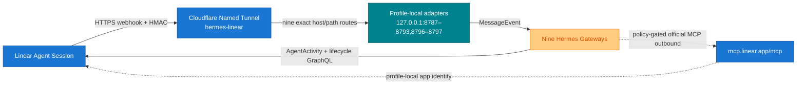

# Linear–Hermes Native Platform Adapter

A native Linear Agent Session platform plugin for Hermes Gateway. Linear is the human-facing task and discussion surface; Hermes remains the conversation and execution layer. The same tracked adapter code runs as nine isolated profile-local instances. No separate bridge daemon or Hermes built-in webhook route is used.

## Architecture



- Plugin registration: Hermes `ctx.register_platform()` API.
- Public transport: Cloudflare Named Tunnel `hermes-linear`, managed by `ai.hermes.cloudflared`.
- Listeners: nine dedicated loopback ports; see the fleet table below.
- Endpoint: `POST /linear/webhook`.
- Health check: `GET /health`.
- The retired Tailscale Funnel sidecar is not a fallback or rollback target. The normal Tailscale app remains private remote access only.

## Security and delivery guarantees

- `Linear-Signature`: HMAC-SHA256 over the exact raw request body.
- Replay protection: `webhookTimestamp`, ±60 seconds by default.
- Tenant pinning: the webhook organization ID must match the organization ID obtained from the OAuth identity.
- Signature rotation: `LINEAR_WEBHOOK_SECRET` plus optional `LINEAR_WEBHOOK_SECRET_PREVIOUS`.
- The pre-auth invalid-signature rate limiter is separate from the authenticated Hermes platform rate limiter.
- Default request-body limit: 256 KiB.
- SQLite claim/done ledger; stale processing claims can be reclaimed after a crash.
- Semantic event keys:
  - `created`: action + Agent Session ID
  - `prompted`: action + Agent Session ID + Agent Activity ID
  - fallback: raw-body hash
- Linear `webhookId` is subscription metadata and is not used as event identity.
- Human terminal reconciliation uses a second durable key over the authoritative issue revision (`updatedAt`), workflow state, human assignee, delegate, and team. Provider `completedAt` is audit-only. Duplicate webhook revisions therefore converge on one ordered pair: an ephemeral `thought` indicator followed by the final `response`.
- Linear issue, comment, and prompt content is labeled as untrusted user input, never as trusted instructions.

## Agent Session creation and execution policy

An Agent Session and a Hermes execution are different objects. Linear creates the native Agent Session when a human delegates or explicitly mentions an app-user; this adapter never calls an `agentSessionCreate` mutation. The adapter may bind an accepted vendor session to an issue, but binding alone is not permission to run a model.

| Incoming signal | Session behavior | Hermes execution behavior |
|---|---|---|
| `AgentSessionEvent.created` from a human delegate/mention or an authorized different app-user handoff | Accept and durably bind the vendor-created session | Start only when lifecycle, dependency, dedup, and terminal-fence guards allow it. A blocked/parked issue waits; a fenced terminal issue reconciles closure and dispatches nothing. |
| `AgentSessionEvent.prompted` with a normal human follow-up | Reuse the existing vendor session; never create another one | Start one follow-up execution after dedup and closure guards. |
| `AgentSessionEvent.prompted` with `signal=stop` | Reuse the existing session | Cancel/stop the existing execution; never turn the stop text into a model prompt. |
| Human `Issue/update` from `started` to `completed` | Never create a session | With a durable binding, enqueue an ephemeral closure `thought` and then the final `response`. Without a binding, persist a healthy terminal fence; no model dispatch and no requirement for the human to mention the agent. |
| Other issue status, relation, dependency, notification, project, label, attachment, comment, or reaction event | Never create a session | Observe/context-only, or resume an already-bound durable dependency wait. Never dispatch a new session. |
| Event authored by this adapter's own installed app-user | No session change | Ignore for execution to prevent self-trigger loops. A different authorized app-user may still initiate an explicit cross-agent handoff. |

The no-session terminal fence is intentionally durable: if a late vendor-created session arrives while the issue is still terminal, the adapter consumes the fence into closure reconciliation and suppresses the main execution. If the issue has been reopened, live read-back marks the old fence obsolete and the legitimate `created` flow may continue. An unbound fence is normal health (`terminal_fences`); only a bound session whose terminal verification cannot complete is an operational fault (`blocked_dispatch`) and degrades `/health`.

## AgentSession-first activity routing

When an actionable Agent Session is open, the session is the canonical execution stream. The current runtime uses `thought` for acknowledgements and transient progress (ephemeral when they represent only the current status), `elicitation` for questions and input requests, `error` for failures, and `response` for the deliverable. The final `response` is not duplicated with a manual completion comment.

Issue comments remain valid only for sessionless durable checkpoints, explicit mentions or handoffs, and human discussion that must outlive one execution. Issue workflow state remains the control-plane record; Notion remains the durable knowledge and rationale record. The adapter never creates an Agent Session merely to display progress.

For an authoritative human closure on a bound session, the durable outbox orders these exactly-once activities under one closure key:

1. ephemeral `thought`: `⏳ Done received — human acceptance and closure evidence are being verified…`
2. final `response`: the verified closure evidence

The final activity cannot overtake the indicator, retries reuse deterministic activity IDs, and delivering the indicator alone does not complete the closure reconciliation record. If the final response fails permanently after the indicator was delivered, the final item remains a redrivable dead letter and a separate deterministic `error` activity replaces the ephemeral status so it cannot remain stale.

## Files

| Path | Purpose |
|---|---|
| `adapter.py` | Native platform lifecycle, webhook validation, and prompt/stop routing |
| `oauth_store.py` | Shared profile-local OAuth read/refresh/rotation primitive with cross-process locking |
| `linear_client.py` | Linear GraphQL Agent Activity and inbound lifecycle operations using the shared OAuth store |
| `mcp_client.py` | Narrow Streamable HTTP transport for Linear's official MCP endpoint |
| `outbound_policy.py` | Fail-closed actor, organization, team, field, and sensitive-profile policy |
| `outbound_ledger.py` | Content-minimizing operation-key ledger for mutation replay and ambiguous outcomes |
| `linear_tools.py` | Approval-compatible Hermes model-tool registration and policy/transport orchestration |
| `ledger.py` | Persistent semantic-dedup ledger |
| `plugin.yaml` | Hermes plugin manifest |
| `scripts/install_linear_oauth.py` | Attended localhost PKCE installer (legacy/interactive only) |
| `scripts/linear_mobile_pkce_once.py` | One-shot mobile PKCE installer using 1Password exact-field resolution |
| `tests/test_native_platform.py` | Security, OAuth, prompt, stop, and dedup tests |
| `tests/test_mobile_pkce.py` | Mobile callback, capability, path, no-clobber, and redaction tests |

## Semantic lifecycle start

The model-facing issue tool never accepts a raw workflow `state`. It exposes only `lifecycle_action=start`, and that action cannot be bundled with any other issue mutation. The wrapper resolves the team's lowest-position `started` state from live Linear data. It dispatches the exact state ID through the official MCP only when the issue is `backlog` or `unstarted`, the source state ID is present, the authoritative team is allowlisted, and the live delegate equals the profile app-user. Already-started is an idempotent no-op; terminal and custom states are never overwritten.

Linear currently exposes no conditional issue mutation for these predicates. The wrapper re-reads team, delegate, source state, and target state after ledger reservation and immediately before dispatch, then verifies team, delegate, exact target state ID, and `started` type after dispatch. A pre-dispatch change produces a durable failed operation with no vendor mutation. A post-dispatch mismatch produces `outcome_unknown` and is never automatically retried. The narrow non-atomic call boundary is accepted only for this vendor-recommended non-terminal start; it does not authorize `complete` or raw state writes.

## Credential architecture

1Password is canonical for static Linear credentials. Each persona's webhook signing secret lives in its profile-scoped 1Password item and is resolved into the gateway process environment through the unattended SDK bootstrap. Process environment values take precedence over the legacy `credential_env_file`; plaintext secret files are not required for new rollouts. Secrets are never copied through chat, clipboard, the repository, Notion, or Linear.

The OAuth file is a necessary native `0600` exception because refresh-token rotation requires atomic writeback:

```text
/Users/mutlupolatcan/.hermes/profiles/<profile>/credentials/linear-oauth.json
```

Runtime variable names mapped to 1Password:

```dotenv
LINEAR_WEBHOOK_SECRET=<current-secret>
LINEAR_WEBHOOK_SECRET_PREVIOUS=<previous-secret-during-rotation-only>
```

`LinearOAuthStore` is the only OAuth owner abstraction. The inbound GraphQL client and the outbound official MCP client use that same profile-local file, lock domain, expiry check, refresh-token rotation, and atomic persistence path. The lock file is profile-local and mode `0600`; credentials are re-read after lock acquisition so concurrent consumers do not refresh a stale token twice. Hermes native MCP OAuth is intentionally not configured for these app authorizations because its separate token store would create a second refresh owner.

The installer and shared store write the OAuth file atomically with mode `0600`. Never log access or refresh tokens, and never copy them into the repository, chat, clipboard, Notion, or Linear.

## OAuth setup

The attended localhost installer is legacy/interactive only and uses:

```text
http://localhost:3000/oauth/callback
```

New profile rollouts use `linear_mobile_pkce_once.py` so consent can be completed from a phone without clipboard or Remote Desktop. Before running it, register the exact temporary HTTPS callback in the Linear application and route only that hostname/path through Cloudflare to the selected localhost port:

```text
https://<profile-oauth-host>/oauth/callback
```

The helper accepts only an exact `op://.../.../LINEAR_CLIENT_ID` reference; there is no raw `--client-id` or clipboard option. `OP_SERVICE_ACCOUNT_TOKEN` must be injected into the process by the profile-scoped Keychain/service-account bootstrap, never typed into chat, shell arguments, or logs.

```bash
/Users/mutlupolatcan/.hermes/runtime/hermes-gateway-sdk-bootstrap/venv/bin/python \
  integrations/linear-hermes-platform/scripts/linear_mobile_pkce_once.py \
  --client-id-reference 'op://<profile-vault>/<profile-item>/LINEAR_CLIENT_ID' \
  --public-base-url 'https://<profile-oauth-host>/oauth' \
  --expected-organization-id '<organization-id>' \
  --destination '/Users/mutlupolatcan/.hermes/profiles/<profile>/credentials/linear-oauth.json' \
  --bind-port <temporary-local-port>
```

Run that command only after the exact Linear redirect and temporary Cloudflare route have been reviewed and approved. The listener binds to `127.0.0.1`, prints a JSON-encoded one-shot `START_URL`, and shuts down after completion, denial, or timeout. Its timeout defaults to and cannot be set below `3600` seconds; the bounded maximum is `86400` seconds. The start URL contains a random capability. Its initial `GET` serves an inert confirmation form without creating PKCE state or consuming the capability, so messaging-app preview crawlers cannot burn the flow. Only the exact form `POST` consumes the capability and returns the Linear authorization redirect; every replay fails closed. The unguessable path capability is the CSRF defense for this one-shot form, and responses use `Referrer-Policy: no-referrer` to prevent path disclosure. Do not log or publish the URL. The helper enforces PKCE S256, exact host/path gates, organization verification, profile-root and symlink confinement, atomic no-clobber installation, and mode `0600`. Remove the temporary public route after the flow. OAuth tokens, the PKCE verifier, and service-account credentials must never enter the repository, chat, clipboard, Notion, or Linear.

## Hermes configuration

Platform section in `~/.hermes/profiles/<profile>/config.yaml` (example: Derya/general; use the profile-specific port and paths for every instance):

```yaml
gateway:
  platforms:
    linear:
      enabled: true
      extra:
        host: 127.0.0.1
        port: 8787
        webhook_path: /linear/webhook
        oauth_file: /Users/mutlupolatcan/.hermes/profiles/general/credentials/linear-oauth.json
        database_path: /Users/mutlupolatcan/.hermes/profiles/general/state/linear-bridge.sqlite3
        max_body_bytes: 262144
        replay_window_seconds: 60
        processing_timeout_seconds: 300
        dedup_retention_seconds: 604800
        preauth_rate_limit_per_minute: 120
        outbox_poll_seconds: 1
        outbox_base_delay_seconds: 2
        outbox_max_delay_seconds: 300
        data_change_events_enabled: true      # live since 0.5.0; selected data events are context/control only
        dependency_wait_enabled: true         # live; blocked sessions resume exactly once after blocker closure
        dependency_poll_seconds: 60           # recovery only; no LLM polling
        closure_reconciliation_enabled: false # separate general-only canary/config gate
        closure_allowed_team_ids: []           # authoritative team UUIDs; empty fails closed
        issue_status_writeback_enabled: true
        issue_status_mapping:
          queued: Todo
          running: In Progress
          blocked: Blocked
          done: Done
        outbound_mcp:
          enabled: false                    # Gate B: register no outbound tools by default
          mutations_enabled: false          # Gate C/D: read-only before any writes
          ledger_path: /Users/mutlupolatcan/.hermes/profiles/general/state/linear-outbound-mcp.sqlite3
          endpoint: https://mcp.linear.app/mcp
          expected_actor_id: <profile-app-user-uuid>
          expected_organization_id: <installed-organization-uuid>
          allowed_team_ids:
            - <authoritative-team-uuid>
          sensitive_mode: standard          # health/finance use metadata_only
          metadata_templates: []            # exact approved strings only; no patterns
      home_channel:
        platform: linear
        chat_id: <dedicated-agent-session-id>
        name: Linear operational inbox
      gateway_restart_notification: false
```

The plugin source is deployed to each profile-local runtime directory:

```text
/Users/mutlupolatcan/.hermes/profiles/<profile>/plugins/linear/
```

The 0.8.1 tracked deployment allowlist is exactly `__init__.py`, `adapter.py`, `ledger.py`, `linear_client.py`, `oauth_store.py`, `mcp_client.py`, `outbound_policy.py`, `outbound_ledger.py`, `linear_tools.py`, and `plugin.yaml`. Copy only those ten files from `integrations/linear-hermes-platform/`; never copy tests, caches, credentials, OAuth stores, or SQLite state. Earlier runtime acceptances are historical evidence, not proof that 0.8.1 is deployed. Exact entry sets, symlink status, directory/file modes, and source/runtime hashes must be established by a fresh live audit for each target.

Deployment is an approval-gated operation, not a blind fleet copy. There is intentionally no partial shell recipe here: source review, promotion, rollback and runtime restart must remain one fail-closed procedure. For one named profile:

1. **Pin the reviewed source.** Record the approved commit, require a clean worktree, export the ten allowlisted files from that commit (not mutable working-tree paths), and verify the reviewed SHA-256 manifest.
2. **Confine and serialize.** Validate every source, profile, plugin and backup ancestor as a real non-symlink directory under the expected roots; acquire a profile-specific exclusive lock before creating any stage or rollback path.
3. **Stage completely.** Create a unique same-filesystem stage directory at mode `0700`; install exactly the ten allowlisted files at `0600`; reject symlinks, missing files, extra entries or hash mismatch.
4. **Preserve rollback.** Create a unique non-existing rollback slot at mode `0700`, print its immutable coordinates before mutation, and preserve the complete previous target there.
5. **Promote atomically.** Rename the complete staged directory into `/Users/mutlupolatcan/.hermes/profiles/<profile>/plugins/linear`. A state-aware `EXIT`/`HUP`/`INT`/`TERM` handler must restore the checked rollback whenever promotion does not reach verified state, while preserving a failed candidate for audit.
6. **Read back.** Verify target path confinement, exact ten-file set, directory/file modes and source-manifest hashes after promotion. Release the lock only after this succeeds.
7. **Restart and accept.** Mutlu sends `/restart` in only that profile's Telegram chat; then run its local `/health`, local/public `405/401/404`, signed lifecycle and ledger checks. Keep rollback until acceptance is complete.
8. **Roll back symmetrically.** Stop or gate the named gateway, acquire the same profile lock, validate the exact printed rollback coordinates, preserve the failed current target, atomically restore the prior directory, read back its manifest/modes, release the lock, send `/restart`, and rerun acceptance. Never select “latest backup” heuristically.

The reviewed one-command helper is [`scripts/deploy_plugin.py`](scripts/deploy_plugin.py). It implements the source-manifest, descriptor confinement, profile lock, private staging, durable pre-mutation coordinates, state-aware signal recovery, atomic promotion, exact read-back and symmetric rollback invariants above. It deliberately does **not** edit Hermes config or restart a gateway.

For the reviewed 0.8.1 source commit, the exact single-profile promotion command uses the new reviewed commit SHA:

```bash
/Users/mutlupolatcan/.hermes/runtime/hermes-agent/venv/bin/python \
  integrations/linear-hermes-platform/scripts/deploy_plugin.py deploy \
  --repo-root /Users/mutlupolatcan/.hermes/source/hermes-setup \
  --profiles-root /Users/mutlupolatcan/.hermes/profiles \
  --profile general \
  --commit '<reviewed-0.8.1-commit-sha>'
```

The helper writes and prints the immutable rollback path and tree digest before the first rename. Rollback must use those exact values; never discover a backup by recency:

```bash
/Users/mutlupolatcan/.hermes/runtime/hermes-agent/venv/bin/python \
  integrations/linear-hermes-platform/scripts/deploy_plugin.py rollback \
  --profiles-root /Users/mutlupolatcan/.hermes/profiles \
  --profile general \
  --rollback-path '<exact rollback_path>' \
  --rollback-digest '<exact rollback_digest>'
```

Runtime promotion, config mutation and `/restart` remain separate approval gates. Runtime extras are preserved inside the exact rollback tree rather than copied into the new ten-file target.

The read-only fleet audit must report four dimensions separately: allowlisted source/runtime hashes, exact entry sets, symlink status, and directory/file modes. A 0.8.1 deployment must produce a new reviewed manifest for the named target rather than inheriting an older acceptance count.

| Persona | Profile | Loopback | Public hostname |
|---|---|---:|---|
| Derya | `general` | `127.0.0.1:8787` | `derya-linear.mutlupolatcan.com` |
| Doruk | `researcher` | `127.0.0.1:8788` | `doruk-linear.mutlupolatcan.com` |
| Tuna | `assistant` | `127.0.0.1:8789` | `tuna-linear.mutlupolatcan.com` |
| Naz | `coder` | `127.0.0.1:8790` | `naz-linear.mutlupolatcan.com` |
| Ozan | `writer` | `127.0.0.1:8791` | `ozan-linear.mutlupolatcan.com` |
| Sarp | `producer` | `127.0.0.1:8792` | `sarp-linear.mutlupolatcan.com` |
| Nilay | `marketing` | `127.0.0.1:8793` | `nilay-linear.mutlupolatcan.com` |
| Defne | `health` | `127.0.0.1:8796` | `defne-linear.mutlupolatcan.com` |
| Murat | `finance` | `127.0.0.1:8797` | `murat-linear.mutlupolatcan.com` |

`data_change_events_enabled` and `dependency_wait_enabled` are live for standard profiles. Defne and Murat keep both flags `false` to preserve the sensitive-profile execution boundary; their explicit Agent Session lifecycle may write only non-terminal `Todo`, `Blocked`, and `In Progress` states. Successful completion preserves the issue state for Mutlu's final acceptance.

## Official Linear MCP outbound tools

Outbound tools are independently gated from the inbound webhook adapter. With `outbound_mcp.enabled: false`, plugin 0.6.0 registers no Linear model tools and preserves the 0.5.0 runtime behavior. With `enabled: true` and `mutations_enabled: false`, only `linear_get_issue` and `linear_list_issues` are exposed. Mutation tools require both literal `mutations_enabled: true` and an explicit profile-local `allowed_mutation_tools` list. Derya/general may receive `linear_save_issue` plus `linear_save_comment` for coordination; specialist profiles may receive only `linear_save_comment`. A missing, empty, malformed, or unknown allowlist leaves the profile read-only. This gate is independent of the profile-global Hermes approval mode so ordinary terminal, cron, recovery, and coordination workflows are not forced into manual approval.

This source patch alone authorizes no live profile. Profile config rollout, plugin promotion, and gateway restart are separate operator-approval gates. The reviewed target shapes are:

```yaml
# Derya / general
outbound_mcp:
  mutations_enabled: true
  allowed_mutation_tools: [linear_save_issue, linear_save_comment]

# Specialist profile
outbound_mcp:
  mutations_enabled: true
  allowed_mutation_tools: [linear_save_comment]
```

Every call performs fail-closed profile checks:

1. GraphQL and official MCP identities must resolve to the same app user.
2. The actor and organization must match pinned profile IDs.
3. Every issue read and mutation is checked against an authoritative GraphQL team lookup; list reads require an exact allowlisted team UUID. `get_issue(includeRelations: true)` is denied until cross-team relation filtering exists.
4. Wrapper-only `operation_key` and `target_team_id` fields are stripped before the vendor call.
5. Unknown tools and fields are denied locally.
6. Parent and relation issue references are independently resolved and must belong to the exact authoritative target team, even when the profile is allowed to use multiple teams.
7. `metadata_only` profiles accept content-bearing fields only when their complete value exactly matches an approved template; actor, label, project, milestone, cycle, and state selectors must be UUIDs. Issue, comment, parent, and relation identifiers use canonical UUID/issue-reference formats; list limits are bounded integers. `priority`, `estimate`, and `dueDate` are not exposed in metadata-only mutations, and free-form list queries are denied. Pattern matching and silent redaction are intentionally not used.

Mutation authorization is capability-based rather than prompt-based. Registration preflights the complete tool-name set so a collision exposes no partial outbound surface, then applies the profile-local mutation allowlist. Derya may create issues, add same-team relations, delegate work, and write coordination comments without per-operation approval. Specialists report follow-up needs in their issue activity; Derya owns cross-agent task routing. The model-facing `linear_save_issue` schema does not expose `state`, and local policy rejects every attempted state transition even if a caller bypasses schema validation. No agent tool can therefore move an issue to `Done` or `Completed`; Mutlu performs the final review and terminal transition in Linear. Team, actor, organization, sensitive-data, authoritative relation, and idempotency gates remain fail-closed.

The mutation ledger is a dedicated `outbound_mcp.ledger_path`; both it and the inbound adapter's WAL-backed `database_path` must be present and absolute, and their canonical paths must be distinct. Before `mutations_enabled: true`, the ledger parent must already exist as an owner-controlled `0700` directory; it is never created or permission-widened by the plugin. A missing/non-`0700` parent, final-component symlink, existing non-`0600` file, or zero-byte placeholder leaves mutation tools unregistered while preserving read-only tools. Operators must quarantine an accidental empty placeholder rather than treating it as SQLite. If startup preflight already omitted the mutation tools, correct the filesystem and restart only that profile so registration reruns; the first approved mutation then creates the canonical `0600` database atomically. Registration is only an early availability gate: `OutboundLedger` repeats descriptor-based owner, mode, symlink, identity and schema checks on every call, so a post-registration filesystem change fails before vendor dispatch. Invalid or missing separation leaves mutation tools unregistered, while read tools do not instantiate a ledger. It stores no issue title, description, comment body, or raw operation key. It persists only SHA-256 of the operation key, canonical payload SHA-256, profile/actor/team IDs, status, result ID/error code, and timestamps. Reusing a key with a different payload or identity is denied. A completed, proven terminal failure, or `outcome_unknown` operation is never automatically dispatched again. Mutation success requires one JSON text result containing a non-empty authoritative `id`; timeouts, lost sessions, malformed/id-less success responses, MCP/JSON-RPC errors, and HTTP `429`/`5xx` responses are outcome-unknown because the vendor may have committed before the response was lost. Business/transport mutation retries are prohibited; the sole exception is one same-request retry after shared-store token refresh on HTTP `401`. The ledger never calls `sqlite3.connect()` with a pathname: a pinned private parent-directory descriptor and cross-process flock protect secure `openat(O_NOFOLLOW)` reads, SQLite is deserialized in memory, and complete bytes are persisted with private temp creation, `fsync`, and same-directory `renameat`. Exact canonical SQL, `table_xinfo`, PK index/xinfo, foreign keys, triggers, status semantics, integrity, owner, and modes fail closed.

The official endpoint and vendor schemas remain vendor-owned. Hermes exposes only the reviewed four-tool subset, accepts only the reviewed `2025-03-26` and `2025-06-18` protocol revisions, exhausts bounded `tools/list` cursor pagination, pins the exact current 52-name vendor tool set, and pins exact property sets, required-key omission semantics, primitive/array schemas, requiredness, and accepted forwarded-field constraints for the five required vendor contracts. The exposed `priority` schema is numeric, while local policy narrows it to Linear's integer `0..4` semantics and rejects strings, booleans, fractions, and out-of-range values. JSON-RPC IDs require exact integer type/value. Responses are streamed under explicit byte, nesting, node, SSE-event, content-item, and text-length bounds; exactly one matching SSE envelope is required. Mutation ambiguity remains `outcome_unknown`. Schema or protocol drift fails closed before any business operation. OAuth, GraphQL, MCP POST, and MCP session DELETE requests do not follow redirects while carrying bearer credentials.

## Localization boundary

Persona names are resolved from each installed Linear app actor at runtime and are never hard-coded in adapter logic. Protocol-facing activity and error text stays in English for consistent vendor/runtime behavior. Turkish copy is limited to the explicitly approved mobile OAuth confirmation UI and is covered by UI tests; credentials, capabilities, IDs, and machine-readable completion markers are not localized.

A gateway restart is required after configuration or plugin changes. Restart only the changed profile. For Derya/general, the default safe operation is Mutlu issuing `/restart` from Telegram.

The normal acknowledgment uses the installed Linear app actor name (`Derya`, `Doruk`, etc.); persona text is never hard-coded. To suppress Hermes' one-time “No home channel is set” notice, configure a dedicated long-lived operational-inbox Agent Session as `gateway.platforms.linear.home_channel.chat_id`. Do not use a disposable task session or an issue ID.

## Persistent outbox and issue status writeback

All outbound `agentActivityCreate` and `issueUpdate` operations are inserted into the same SQLite database before network delivery. The outbox row contains a stable ID, Agent Session aggregate key, per-session sequence, operation, JSON payload, state (`pending`, `in_flight`, `delivered`, or `dead`), attempt count, next-attempt time, and delivery/error timestamps.

Delivery is ordered per Agent Session. The response activity containing completion evidence is persisted before the human review gate. Stale `in_flight` rows are reclaimed after restart. Retryable failures use exponential backoff capped by `outbox_max_delay_seconds`; Linear `retry_after` wins when supplied. Non-retryable failures become dead letters and appear in `/health` as `status: degraded` without turning the liveness endpoint into a restart loop.

Activity creates use the client-generated `AgentActivityCreateInput.id`, so replay after an ambiguous timeout reuses the same Linear entity ID. Issue state assignment is naturally idempotent. Producer retries use stable outbox IDs for thought, error, and status operations; normal responses receive one persisted UUID when accepted.

Execution-to-issue mapping:

| Execution state | Default Linear state | Trigger |
|---|---|---|
| `queued` | `Todo` | Accepted `created` Agent Session event |
| `running` | `In Progress` | Thought acknowledgement persisted |
| `blocked` | `Blocked` | An unresolved Linear `blocks` relation is durably recorded |

`ProcessingOutcome.SUCCESS`, `ProcessingOutcome.FAILURE`, and `ProcessingOutcome.CANCELLED` preserve the current issue state. A successful run produces durable response evidence for Mutlu's review but is not itself authority to close the issue. Terminal human states (`completed` or `canceled`) and custom human workflow states are never overwritten. Bridge-owned transitions are limited to `Todo(10) -> Blocked(15) -> In Progress(20)`, allowing automatic `Blocked -> In Progress` resume. State names are resolved against the issue team at delivery time; IDs are not hard-coded. The resolved target's authoritative Linear type must be `backlog`, `unstarted`, or `started`; `completed`, `canceled`, missing, and unknown types fail closed before `issueUpdate`.

The code default for `issue_status_writeback_enabled` remains fail-closed `false`; production explicitly enables it after the completed OPS-21 approval and fleet rollout. The outbox code can still be deployed and tested with writeback disabled in a canary configuration.


## Data-change events and dependency waiting

`AgentSessionEvent` remains the only direct execution trigger. When `data_change_events_enabled` is true, signed `Issue`, `IssueRelation`, `Comment`, `IssueLabel`, `Project`, `ProjectUpdate`, `AppUserNotification`, `PermissionChange`, and OAuth revoke events pass organization validation and semantic dedup, but ordinary comments and project updates are context-only and do not start an LLM run. The sole Issue/update control exception is optional human terminal reconciliation: it writes no `MessageEvent`, does not rerun the deliverable, does not reopen the issue, and does not mutate terminal state. Inbox notification timestamps may use the documented ISO `createdAt` field. Explicit agent mentions must produce Linear's native Agent Session event; this is a live canary requirement, not a comment parser assumption. Events authored by the current Linear app actor are ignored to prevent self-trigger loops. An `issueUnassignedFromYou` notification cancels a durable wait, while OAuth revocation degrades `/health`.

When `closure_reconciliation_enabled` is true, the adapter accepts only a signed Issue/update whose `updatedFrom.stateId` resolves authoritatively to a `started` workflow state and whose live state is `completed`. Live GraphQL read-back must also prove the exact allowlisted team, signed webhook actor equals the current human assignee, installed app actor equals the current delegate, the webhook state ID equals the live terminal state ID, and live issue `updatedAt` exactly equals the signed webhook revision. Linear `issue.history` and `completedAt` are deliberately supplementary audit fields rather than mandatory policy inputs because reopened issues can expose an earlier terminal transition and retain the earlier completion timestamp even when current state and `updatedAt` are fresh. A locally recorded issue-to-Agent-Session binding is required only for writing a Linear Agent Activity, not for accepting the human terminal transition. Without a binding, the adapter stores a terminal fence and returns `terminal_fenced`; this is a healthy settled control-plane state, not a request to create a session. Missing or mismatched authoritative evidence still fails closed. With a binding, the adapter atomically inserts canonical evidence plus an ordered deterministic ephemeral `thought` and final `response` into SQLite, wakes the background outbox worker, and returns without draining the global outbox in the webhook; restart recovery reclaims the same activity IDs, and later session bindings do not change the closure key. `/health` reports pending/completed/failed closure counts, healthy `terminal_fences`, and degraded `blocked_dispatch` or failed closure dead letters. The deprecated `pending_session_binding` field remains a compatibility alias for `blocked_dispatch`; it no longer counts healthy unbound fences. No Notion write occurs in the webhook path; only accepted live canary evidence is promoted later through the normal knowledge gate.

Agent output remains an immutable Agent Activity. Linear renders `response` and `elicitation` activities into the issue comment thread for human visibility; later execution context is reconstructed from frozen Agent Activities rather than editable comments.

When `dependency_wait_enabled` is true, a newly delegated issue is queried for incomplete inverse `blocks` relations before Hermes execution starts. If blockers exist, the adapter:

1. Writes the original prompt, Agent Session, issue, and blocker snapshot to `waiting_executions` in SQLite.
2. Persists an `elicitation` activity naming the blockers; Linear derives `awaitingInput`.
3. Does not enqueue the Hermes run.
4. Reconciles the issue after commit to close the blocker-completed-before-wait race.
5. Reconciles again on signed Issue/IssueRelation updates, with a low-frequency GraphQL recovery poll for missed webhooks.
6. Atomically claims `waiting -> resuming`, reuses the original stable delivery key, and starts the same Agent Session exactly once when no blockers remain.

On resume, the adapter prepends its verified current dependency state before Linear's frozen creation `promptContext`. The snapshot may still contain historical `blocked-by` content; the trusted resume directive prevents that stale state from sending the execution back into wait.

Stop and delegate-removal events cancel a pending wait. Interrupted `resuming` rows return to `waiting` on adapter restart. `/health` reports waiting counts, oldest wait age, and the latest wait error; failed waits degrade health without causing a restart loop. The additive SQLite schema is versioned with `PRAGMA user_version=4`; version 3 adds issue/session linkage and durable closure evidence, while version 4 adds a payload-minimized terminal-event fence so a verified human `Done` arriving before `AgentSessionEvent.created` survives restart and prevents the later session from rerunning the main deliverable. The same table is classified by binding state: no binding is a healthy `terminal_fences` tombstone; an existing binding plus unresolved terminal verification is a degraded `blocked_dispatch`. Back up `linear-bridge.sqlite3*` before first migration and retain the backup until live acceptance completes.

## Public ingress

Cloudflare routes only the exact webhook path; unmatched paths return `404`. The active public endpoints follow the fleet table above. Representative checks are:

```text
https://derya-linear.mutlupolatcan.com/linear/webhook
https://doruk-linear.mutlupolatcan.com/linear/webhook
```

Health and security checks:

```bash
personas=(derya doruk tuna naz ozan sarp nilay defne murat)
ports=(8787 8788 8789 8790 8791 8792 8793 8796 8797)
for index in {0..8}; do
  persona=${personas[$index]}
  port=${ports[$index]}
  local_base="http://127.0.0.1:$port"
  public_base="https://$persona-linear.mutlupolatcan.com"
  curl -fsS "$local_base/health" >/dev/null
  test "$(curl -sS -o /dev/null -w '%{http_code}' "$local_base/linear/webhook")" = 405
  test "$(curl -sS -o /dev/null -w '%{http_code}' -X POST "$local_base/linear/webhook")" = 401
  test "$(curl -sS -o /dev/null -w '%{http_code}' "$local_base/not-found")" = 404
  test "$(curl -sS -o /dev/null -w '%{http_code}' "$public_base/linear/webhook")" = 405
  test "$(curl -sS -o /dev/null -w '%{http_code}' -X POST "$public_base/linear/webhook")" = 401
  test "$(curl -sS -o /dev/null -w '%{http_code}' "$public_base/not-found")" = 404
done
```

Unsigned webhook requests must return `401`; webhook `GET` must return `405`; hostname root paths must return `404`. Cloudflare Access is not placed in front of Linear webhooks because vendor delivery cannot complete an interactive Access challenge.

## Tests

Use the Hermes-bundled Python; the system Python may not include gateway modules:

```bash
cd /Users/mutlupolatcan/.hermes/source/hermes-setup
/Users/mutlupolatcan/.hermes/runtime/hermes-agent/venv/bin/python \
  -m unittest discover \
  -s integrations/linear-hermes-platform/tests -v
```

Expected source result for this revision: `244/244 OK`. `/health` exposes the active inbound `data_event_types` allowlist plus closure counts so a rollout can verify the accepted event contract and closure drain state without inspecting source files.

Coverage includes invalid signatures, replay attempts, organization mismatch, semantic dedup, legacy-ledger compatibility, OAuth token refresh and rotation, two-consumer refresh locking, atomic shared-store persistence, GraphQL/MCP 401 rotation, MCP contract drift, ambiguous mutation non-retry, actor/team/content-policy denial, operation-key replay, payload-content minimization, profile mutation capability registration, model-facing state-transition denial, typed `agentActivity.content.body`, delegation, follow-up prompts, Stop hard-cancel, persistent outbox restart recovery, ordered retries, client-generated activity IDs, success-state preservation for Mutlu's final acceptance, durable waiting recovery, resume-once claims, blocker filtering, context-only data events, self-event suppression, human closure actor/team/delegate denial, closure duplicate suppression, closure restart recovery, delegate-removal cancellation, dead-letter re-drive, schema versioning, and human-owned status preservation.

## Live acceptance criteria

1. A delegation `created` webhook returns `accepted`.
2. Thought and Hermes response activities appear in Linear.
3. A follow-up prompt reaches the delegated persona/profile and the response returns to Linear.
4. A Stop signal interrupts the active Hermes task through `/stop`.
5. The session becomes `complete`, with no extra error activity or residual process.
6. Retrying the same semantic event does not create duplicate execution.
7. A blocked delegation returns `awaiting_input`, writes one `elicitation`, and starts no Hermes run.
8. Completing the final blocker resumes the same session once; replaying the Issue webhook creates no second run.
9. Selected comments, projects, project updates, issue/project labels, issue attachments, and comment reactions are observed without an LLM run; self-authored events are ignored.
10. Delegate removal and Stop cancel durable waits; restart recovers an interrupted resume.
11. A live cross-agent mention canary proves that Linear emits the target agent's native Agent Session before cross-agent automation is enabled.
12. In the general-only canary, a human assignee's `started -> completed` transition produces an ephemeral closure `thought` followed by one final `response`, with no Telegram prompt, no second Hermes run, no state mutation, and closure/outbox pending/in-flight/dead counts of zero; replay and restart produce no duplicate activities.

## Rollback

1. For an outbound-only rollback, clear `outbound_mcp.allowed_mutation_tools`, then set `outbound_mcp.mutations_enabled: false`, then `outbound_mcp.enabled: false`; this removes model tools without disabling inbound Agent Sessions. Do not delete `linear_mcp_operations` rows, especially `outcome_unknown` evidence.
2. Set `closure_reconciliation_enabled: false`, then set `dependency_wait_enabled: false`, `data_change_events_enabled: false`, and `issue_status_writeback_enabled: false`; queued closure evidence remains in SQLite.
3. Disable the added Issue/Comment/Label/Project/ProjectUpdate data-change categories in the Linear application, retaining Agent Session events if the base canary remains healthy.
4. If one adapter instance must roll back, disable only that persona's Linear application webhook and Cloudflare hostname route; do not stop the shared connector while another persona remains live.
5. Set `gateway.platforms.linear.enabled: false` only when both outbound and the inbound platform must stop.
6. Mutlu issues `/restart` from Telegram.
7. Restore the pre-migration `linear-bridge.sqlite3*` backup only while the gateway is stopped. Do not delete the migrated database until pending/dead outbox rows, waiting executions, and MCP operation rows have been audited.

Rollback never touches the normal Tailscale app or Remote Desktop process. The retired Funnel sidecar, former bridge daemon, and built-in webhook route on `127.0.0.1:8644` remain disabled unless a separate architectural decision explicitly restores them.
