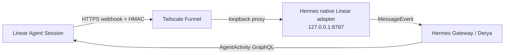

# Linear–Hermes Native Platform Adapter

Hermes Gateway için native Linear Agent Session platform plugin’i. Linear, Derya’nın görev/tartışma yüzeyi; Hermes ise konuşma ve execution katmanıdır. Ayrı bridge daemon veya Hermes built-in webhook route’u kullanılmaz.

## Mimari



- Plugin kaydı: Hermes `ctx.register_platform()` API’si.
- Public transport: izole userspace `tailscaled` üzerinden Tailscale Funnel.
- Listener: yalnız `127.0.0.1:8787`.
- Endpoint: `POST /linear/webhook`.
- Health: `GET /health`.
- Hermes core/Homebrew dosyaları değiştirilmez.

## Güvenlik ve teslimat garantileri

- `Linear-Signature`: exact raw body üzerinde HMAC-SHA256.
- Replay koruması: `webhookTimestamp`, varsayılan ±60 saniye.
- Tenant pinning: OAuth kimliğinden alınan organization ID ile webhook organization ID eşleşir.
- İmza rotasyonu: `LINEAR_WEBHOOK_SECRET` ve isteğe bağlı `LINEAR_WEBHOOK_SECRET_PREVIOUS`.
- Pre-auth invalid-signature rate limit ve Hermes platform rate limit birbirinden ayrıdır.
- Body boyut sınırı varsayılan 256 KiB.
- SQLite claim/done ledger; crash sonrası stale processing claim yeniden alınabilir.
- Semantic event anahtarı:
  - `created`: action + Agent Session ID
  - `prompted`: action + Agent Session ID + Agent Activity ID
  - fallback: raw body hash
- Linear `webhookId` subscription metadata’sıdır; event kimliği olarak kullanılmaz.
- Linear issue/comment/prompt içeriği güvenilir talimat değil, kullanıcı girdisi olarak etiketlenir.

## Dosyalar

| Yol | Görev |
|---|---|
| `adapter.py` | Native platform lifecycle, webhook doğrulama, prompt/stop routing |
| `linear_client.py` | OAuth refresh ve Linear GraphQL Agent Activity yazımı |
| `ledger.py` | Kalıcı semantic dedup ledger |
| `plugin.yaml` | Hermes plugin manifesti |
| `scripts/install_linear_oauth.py` | PKCE S256 app-user OAuth kurulumu |
| `tests/test_native_platform.py` | Güvenlik, OAuth, prompt, stop ve dedup testleri |

## Credential dosyaları

Gerçek credential’lar repo dışında tutulur ve `0600` olmalıdır:

```text
/Users/mutlupolatcan/.hermes/profiles/general/credentials/linear-bridge.env
/Users/mutlupolatcan/.hermes/profiles/general/credentials/linear-oauth.json
```

Signing-secret dosyası:

```dotenv
LINEAR_WEBHOOK_SECRET=<current-secret>
LINEAR_WEBHOOK_SECRET_PREVIOUS=<previous-secret-during-rotation-only>
```

OAuth dosyası installer tarafından atomik olarak yazılır. Access/refresh token’ları loglama veya repoya kopyalama.

## OAuth kurulumu

Linear app ayarlarında redirect URI:

```text
http://localhost:3000/oauth/callback
```

Client ID’yi clipboard’a kopyaladıktan sonra:

```bash
/opt/homebrew/Cellar/hermes-agent/2026.7.1/libexec/bin/python \
  integrations/linear-hermes-platform/scripts/install_linear_oauth.py \
  --client-id-from-clipboard
```

Installer PKCE S256 kullanır, browser consent açar, clipboard’ı temizler, app-user kimliğini doğrular ve OAuth JSON’unu `0600` yazar.

## Hermes config

`~/.hermes/profiles/general/config.yaml` içindeki platform bölümü:

```yaml
gateway:
  platforms:
    linear:
      enabled: true
      extra:
        host: 127.0.0.1
        port: 8787
        webhook_path: /linear/webhook
        credential_env_file: /Users/mutlupolatcan/.hermes/profiles/general/credentials/linear-bridge.env
        oauth_file: /Users/mutlupolatcan/.hermes/profiles/general/credentials/linear-oauth.json
        database_path: /Users/mutlupolatcan/.hermes/profiles/general/state/linear-bridge.sqlite3
        max_body_bytes: 262144
        replay_window_seconds: 60
        processing_timeout_seconds: 300
        dedup_retention_seconds: 604800
        preauth_rate_limit_per_minute: 120
```

Plugin source runtime’da profile-local plugin dizinine deploy edilir:

```text
/Users/mutlupolatcan/.hermes/profiles/general/plugins/linear-hermes-platform/
```

Config/plugin değişikliğinden sonra gateway restart gerekir. Derya/General için varsayılan güvenli operasyon Mutlu’nun Telegram’dan `/restart` komutudur.

## Funnel

Funnel, App Store Tailscale oturumundan izole userspace sidecar’da çalışır; Remote Desktop bağlantısı etkilenmez.

Public endpoint:

```text
https://hermes-funnel.tail7c4d1d.ts.net/linear/webhook
```

Health:

```bash
curl -fsS http://127.0.0.1:8787/health
curl -fsS https://hermes-funnel.tail7c4d1d.ts.net/health
```

## Test

Hermes bundled Python kullanılır; sistem Python’unda gateway modülleri bulunmayabilir:

```bash
cd /Users/mutlupolatcan/Desktop/hermes-setup
/opt/homebrew/Cellar/hermes-agent/2026.7.1/libexec/bin/python \
  -m unittest discover \
  -s integrations/linear-hermes-platform/tests -v
```

Beklenen: `15/15 OK`.

Test kapsamı: invalid signature, replay, organization mismatch, semantic dedup, legacy ledger compatibility, OAuth token refresh/rotation, typed `agentActivity.content.body`, delegation, follow-up prompt, Stop hard-cancel ve session lock release.

## Canlı kabul kriterleri

1. Delegation `created` webhook’u `accepted` döner.
2. Linear’da thought ve Hermes response activity görünür.
3. Follow-up prompt Derya’ya ulaşır ve response Linear’a döner.
4. Stop sinyali aktif Hermes task’ını `/stop` ile keser.
5. Session `complete` olur; ek error activity ve process kalıntısı oluşmaz.
6. Aynı semantic event retry edildiğinde duplicate execution oluşmaz.

## Rollback

1. Linear app webhook’unu devre dışı bırak.
2. Funnel route’unu kapat.
3. `gateway.platforms.linear.enabled: false` yap.
4. Mutlu Telegram’dan `/restart` çalıştırır.
5. Rollback kopyasını profile-local runtime backup dizininden geri yükle.

Rollbackte App Store Tailscale/Remote Desktop sürecine dokunulmaz. Eski ayrı bridge daemon ve `127.0.0.1:8644` built-in webhook route’u geri açılmaz; yalnız açık bir mimari kararla geri getirilebilir.
